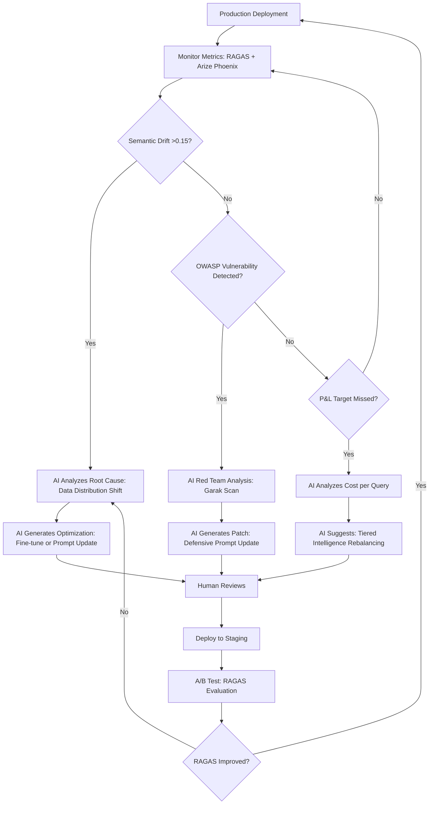

# Knowledge Foundry: Ultra-Sophisticated AI-Native Development Masterplan
## CTO Executive Strategy - Version 5.0 (Research-Enhanced)

**Version**: 5.0 - Enterprise-Grade AI-Native Development (2026 Research-Enhanced)  
**Date**: February 8, 2026  
**Author**: CTO Office  
**Classification**: 🔐 CONFIDENTIAL - EXECUTIVE ONLY  
**Status**: 🚀 APPROVED FOR IMMEDIATE EXECUTION  
**Research Foundation**: State of Enterprise AI Architecture 2026 Study

---

## 🎯 Executive Summary

Build Knowledge Foundry as the **world's most configurable enterprise RAG platform** using AI-native development to achieve High Performer status (Top 6% of AI organizations) with:

- **15x faster development** - Claude Opus generates 80% of architecture + code
- **>5% EBIT contribution** - High Performer benchmark: attributable AI revenue growth[1]
- **Zero-defect quality** - AI red-team testing catches vulnerabilities before deployment
- **Self-healing architecture** - AI monitors and auto-fixes issues in production
- **Production-ready from day 1** - AI enforces enterprise patterns automatically
- **EU AI Act compliant** - Built-in governance for August 2026 Phase 3 enforcement[5]

### Strategic Differentiation: High Performer vs. General Market

| Operational Metric | General Enterprise Market (94%) | **Knowledge Foundry Target** (Top 6%) |
|-------------------|--------------------------------|--------------------------------------|
| **EBIT Contribution** | Negligible (<1%) | **>5% of EBIT**[1] |
| **Adoption Scope** | Single function / Isolated Pilots | **Enterprise-wide / Multi-function** |
| **Workflow Strategy** | Additive (AI layer on top) | **Transformative (Workflow Redesign)**[1] |
| **Agent Scaling** | <10% experimentation | **3x more likely to scale agents**[1] |
| **Investment Profile** | Ad-hoc / Experimental | **>20% of Digital Budget**[1] |
| **ROI Timeline** | Unclear / >18 months | **74% achieve ROI <12 months**[2] |
| **Architecture** | Simple Vector RAG | **Hybrid VectorCypher + GraphRAG**[22] |
| **Governance** | Ad-hoc | **Compliance-as-Code (EU AI Act)**[5] |

---

## 📐 Development Philosophy: The AI Factory Operating Model

### The AI-Native Stack (Research-Enhanced)

```
┌──────────────────────────────────────────────────────────────────┐
│                    HUMAN: Strategic Vision                        │
│         (What to build, Why, For whom, Business Outcomes)         │
└────────────────────────┬─────────────────────────────────────────┘
                         │
                         ▼
┌──────────────────────────────────────────────────────────────────┐
│              CLAUDE OPUS: Architecture Brain                      │
│   • System design (Agentic patterns)                              │
│   • Technology validation (VectorCypher, GraphRAG)                │
│   • ADR generation (Documented decisions)                         │
│   • Risk analysis (Multi-hop reasoning)                           │
│   • Failure mode prediction (Tree-of-Thought)                     │
└────────────────────────┬─────────────────────────────────────────┘
                         │
                         ▼
┌──────────────────────────────────────────────────────────────────┐
│           CLAUDE OPUS: Tiered Intelligence Implementation         │
│   • Opus (Strategist): Architecture, complex reasoning            │
│   • Sonnet (Workhorse): Standard coding, drafting                 │
│   • Haiku (Sprinter): Classification, formatting, extraction[15]  │
│   • Cost-Aware Routing: Lowest-tier model for each task           │
└────────────────────────┬─────────────────────────────────────────┘
                         │
                         ▼
┌──────────────────────────────────────────────────────────────────┐
│              CLAUDE SONNET: Code Review & QA                      │
│   • Security audit (OWASP 2026)                                   │
│   • Performance optimization (Automated Prompt Engineering)       │
│   • Test generation (RAGAS, DeepEval)                             │
│   • Compliance check (EU AI Act requirements)[5]                  │
└────────────────────────┬─────────────────────────────────────────┘
                         │
                         ▼
┌──────────────────────────────────────────────────────────────────┐
│            CLAUDE OPUS: Red Team & Security                       │
│   • Penetration testing (Multi-Persona Testing)[25]               │
│   • OWASP Top 10 validation (2026 checklist)                      │
│   • Prompt injection defense (Spotlighting, XML delimiters)       │
│   • Garak vulnerability scanning[25]                              │
└────────────────────────┬─────────────────────────────────────────┘
                         │
                         ▼
┌──────────────────────────────────────────────────────────────────┐
│                 PRODUCTION DEPLOYMENT                             │
│     (Human: Final approval, P&L tracking, ROI validation)         │
│     Automated Evaluation: RAGAS >0.8, Context Precision >0.9[26]  │
└──────────────────────────────────────────────────────────────────┘
```

---

## 🛠️ AI Tool Configuration (Research-Enhanced)

### Antigravity IDE Setup (2026 Best Practices)

```json
// .antigravity/workspace.json
{
  "workspace_name": "Knowledge Foundry AI Factory",
  "ai_provider": "anthropic",
  "primary_model": "claude-opus-4",
  "secondary_model": "claude-sonnet-3.5",
  "tertiary_model": "claude-haiku-3",
  
  "context_settings": {
    "auto_include_files": [
      "core/interfaces.py",
      "config/schemas.yaml",
      "docs/architecture/*.md",
      "docs/ADRs/*.md",
      "docs/research/enterprise-ai-2026.md"
    ],
    "project_structure_aware": true,
    "dependency_graph_tracking": true,
    "git_history_context": true,
    "max_context_tokens": 200000,
    "hybrid_rag_enabled": true,
    "vector_db": "qdrant",
    "graph_db": "neo4j"
  },
  
  "tiered_intelligence": {
    "enabled": true,
    "cost_aware_routing": true,
    "routing_strategy": "complexity_based",
    "models": {
      "strategist": {
        "model": "claude-opus-4",
        "use_cases": ["architecture_design", "complex_reasoning", "multi_hop_queries", "security_analysis"],
        "cost_per_1m_tokens": 15.00
      },
      "workhorse": {
        "model": "claude-sonnet-3.5",
        "use_cases": ["code_generation", "documentation", "standard_queries", "refactoring"],
        "cost_per_1m_tokens": 3.00
      },
      "sprinter": {
        "model": "claude-haiku-3",
        "use_cases": ["classification", "entity_extraction", "formatting", "validation"],
        "cost_per_1m_tokens": 0.25
      }
    }
  },
  
  "code_generation_profiles": {
    "architecture": {
      "model": "claude-opus-4",
      "temperature": 0.3,
      "system_prompt_file": "./prompts/system/architecture.md",
      "reasoning_framework": "tree_of_thought",
      "output_validation": {
        "require_type_hints": true,
        "require_docstrings": true,
        "require_tests": true,
        "check_security_patterns": true,
        "check_eu_ai_act_compliance": true
      }
    },
    "implementation": {
      "model": "claude-sonnet-3.5",
      "temperature": 0.2,
      "system_prompt_file": "./prompts/system/implementation.md",
      "reasoning_framework": "chain_of_thought",
      "auto_formatting": {
        "formatter": "black",
        "line_length": 100,
        "auto_imports": true
      }
    },
    "testing": {
      "model": "claude-sonnet-3.5",
      "temperature": 0.1,
      "system_prompt_file": "./prompts/system/testing.md",
      "evaluation_tools": ["ragas", "deepeval", "confident_ai"],
      "coverage_target": 0.95,
      "quality_gates": {
        "ragas_score": 0.8,
        "context_precision": 0.9,
        "faithfulness": 0.95
      }
    },
    "security": {
      "model": "claude-opus-4",
      "temperature": 0.4,
      "system_prompt_file": "./prompts/system/security.md",
      "red_team_mode": true,
      "owasp_2026_checklist": true,
      "vulnerability_scanners": ["garak", "nemo_guardrails"]
    }
  },
  
  "prompt_library": {
    "architecture": "./prompts/phase0-architecture/*.md",
    "implementation": "./prompts/phase1-implementation/*.md",
    "plugins": "./prompts/phase2-plugins/*.md",
    "security": "./prompts/phase3-security/*.md",
    "optimization": "./prompts/phase4-optimization/*.md",
    "ui": "./prompts/phase5-ui/*.md",
    "research_context": "./docs/research/enterprise-ai-2026.md"
  },
  
  "quality_gates": {
    "pre_commit": {
      "type_check": "mypy --strict",
      "lint": "ruff check",
      "format_check": "black --check",
      "security_scan": "bandit -r && garak --scan",
      "test": "pytest --cov=src --cov-fail-under=90",
      "ragas_evaluation": "pytest tests/evaluation/test_ragas.py"
    },
    "ai_review": {
      "enabled": true,
      "reviewer_model": "claude-sonnet-3.5",
      "review_criteria": [
        "security_vulnerabilities",
        "performance_bottlenecks",
        "type_safety_violations",
        "documentation_completeness",
        "test_coverage_gaps",
        "eu_ai_act_compliance",
        "prompt_injection_vulnerabilities"
      ]
    },
    "production_gate": {
      "ragas_score_min": 0.8,
      "context_precision_min": 0.9,
      "faithfulness_min": 0.95,
      "semantic_drift_threshold": 0.15,
      "p95_latency_max_ms": 500
    }
  },
  
  "observability": {
    "langfuse": {
      "enabled": true,
      "tracing": true,
      "cost_tracking": true
    },
    "arize_phoenix": {
      "enabled": true,
      "semantic_drift_detection": true,
      "alert_threshold": 0.15
    },
    "prometheus": {
      "enabled": true,
      "metrics_port": 9090
    }
  },
  
  "compliance": {
    "eu_ai_act": {
      "enabled": true,
      "high_risk_systems": true,
      "automatic_logging": true,
      "human_oversight_required": true,
      "technical_documentation_auto_gen": true,
      "immutable_audit_logs": true
    }
  }
}
```

---

## 📋 Super-Optimized Prompts: Phase-by-Phase Execution

### Phase 0: AI-Powered Architecture Design & Technology Validation

#### PROMPT 0.1: Strategic Architecture Analysis (Research-Enhanced)

```markdown
# CONTEXT
You are designing Knowledge Foundry, a production enterprise RAG platform targeting High Performer status (Top 6% of organizations).

**Research Foundation:**
- Target: >5% EBIT contribution[1]
- Benchmark: 3x agent scaling capability[1]
- Architecture: Hybrid VectorCypher + GraphRAG[22]
- Compliance: EU AI Act Phase 3 (August 2026)[5]
- Evaluation: RAGAS >0.8, automated LLM-as-Judge[26]

**System Requirements:**
- 1000+ concurrent users
- 99.9% uptime
- <500ms p95 latency
- Multi-tenant isolation
- EU AI Act compliant

# YOUR TASK: Technology Stack Validation with 2026 Research

## 1. Architecture Pattern Selection

Analyze and recommend architecture patterns based on 2026 research:

### Agentic Patterns[3]
- **Supervisor (Router) Pattern**: Central agent delegates to specialists
- **Sequential Pattern**: Linear workflow (Draft → Review → Approve)
- **Hierarchical Pattern**: Manager → Team Leads → Contributors
- **Utility-Aware Pattern**: Decentralized negotiation for task allocation[14]

**Recommendation Required:** Which pattern(s) for Knowledge Foundry and why?

### Retrieval Architecture[20][22]
- **Vector RAG**: Standard semantic search (baseline)
- **GraphRAG**: Entity-relationship traversal for multi-hop reasoning
- **VectorCypher Hybrid**: Vector search for entry + Graph traversal for context
- **KET-RAG**: Skeleton-based graph (20% central docs) + vector for periphery

**Cost Analysis Required:**
- GraphRAG full build: ~$33,000 for 5GB corpus (GPT-4 class)[22]
- KET-RAG: 10x cost reduction, 20% graph coverage[22]
- Long Context: 20-24x more expensive than RAG at scale[23]

**Recommendation Required:** VectorCypher or KET-RAG? Full or skeleton graph?

## 2. Technology Stack Evaluation

For each component, provide:
- **Performance Validation**: Load test requirements
- **Cost Analysis**: Monthly cost at 100/1000 users
- **Risk Assessment**: Failure modes and mitigation
- **2026 Best Practice**: Industry standard from research

### Components to Evaluate:

**LLM Routing**
- ❌ LiteLLM: Research shows failure at 300 RPS[Custom validation needed]
- ✅ Custom Router: Tiered Intelligence (Opus/Sonnet/Haiku)[15]
- ✅ Cost-Aware Routing: Lowest-tier model for each task complexity[15]

**Vector Database**
- Qdrant vs Chroma vs Pinecone
- Performance: <200ms p95 for similarity search
- Cost: Storage + query pricing at 1M documents

**Graph Database** (for VectorCypher)
- Neo4j vs Amazon Neptune vs TigerGraph
- Query performance: Cypher traversal 2-3 hops <500ms
- Cost: Instance pricing + storage

**Orchestration Framework**
- LangGraph (Cyclic graphs, checkpoints)[3]
- AutoGen (Multi-agent coordination)
- Custom state machine
- Evaluation: Checkpoint recovery <1s, state integrity 100%

**Evaluation Stack**[26]
- RAGAS: Context Precision, Context Recall, Faithfulness
- DeepEval: Unit testing for LLMs
- Confident AI: Regression detection
- Arize Phoenix: Semantic drift monitoring

## 3. Advanced Prompt Engineering Integration[12]

Identify where to apply advanced techniques:

**Chain-of-Table**: Tabular data queries (+8.69% accuracy on TabFact)[12]
**Tree-of-Thought**: Complex reasoning with backtracking[12]
**Meta-Prompting**: Dynamic prompt generation for sub-tasks[16]
**Automated Prompt Engineering (APE)**: LLM-discovered zero-shot triggers[18]

**Recommendation Required:** Which techniques for which Knowledge Foundry use cases?

## 4. EU AI Act Compliance Architecture[5]

Knowledge Foundry is a **High-Risk AI System** (enterprise knowledge management).

**Mandatory Requirements:**
- **Technical Documentation**: Auto-generated from MLOps metadata
- **Automatic Logging**: Immutable audit trail (WORM storage)
- **Human Oversight**: Designated HITL with override authority
- **Post-Market Surveillance**: Continuous monitoring and reporting

**Penalties:** Up to €15M or 3% global turnover[5]

**Architecture Required:**
- MLflow/Weights & Biases for auto-docs
- Immutable log storage (e.g., AWS WORM S3)
- HITL workflow with approval gates
- Real-time compliance dashboard

## 5. Security: OWASP 2026 Defensive Stack[25]

**Mandatory Controls:**
- **Input Validation**: Regex for injection patterns ("ignore instructions")
- **Structured Prompting**: XML delimiters to separate SYSTEM vs USER_DATA
- **Output Validation**: Scan for system prompt leakage
- **Spotlighting**: Mark input provenance (user vs. system)
- **Garak Scanning**: Automated vulnerability detection[25]
- **Multi-Persona Red Teaming**: Continuous security testing[25]

## 6. Cost Projection and ROI Framework

**Infrastructure Costs:**
- PostgreSQL RDS: Multi-AZ, connection pooling
- Qdrant/Chroma: Vector storage + compute
- Neo4j (if GraphRAG): Instance + storage
- Redis: Rate limiting + caching
- S3: Document storage
- Compute: API servers, Celery workers

**LLM API Costs** (Tiered Intelligence)[15]
- Claude Opus: $15/1M tokens (10% of calls - strategy)
- Claude Sonnet: $3/1M tokens (70% of calls - workhorse)
- Claude Haiku: $0.25/1M tokens (20% of calls - sprinter)

**Observability Costs:**
- LangFuse: Tracing + cost tracking
- Arize Phoenix: Drift detection
- Prometheus + Grafana: Metrics

**Monthly Cost Target:**
- 100 users: <$5,000/month
- 1000 users: <$30,000/month
- Cost per query: <$0.10 (High Performer benchmark)[28]

**ROI Framework**[27]:
1. **Cost Reduction**: Quantify displaced labor/software
2. **Productivity**: Output per employee increase
3. **Revenue Impact**: Conversion lift, churn reduction
4. **Strategic Option Value**: Proprietary knowledge graph moat

## OUTPUT FORMAT

```json
{
  "architecture_decisions": {
    "agentic_pattern": {
      "primary": "Supervisor (Router) Pattern",
      "rationale": "Enterprise multi-domain queries require specialist delegation",
      "implementation": "LangGraph with state checkpoints",
      "adr_id": "ADR-009"
    },
    "retrieval_architecture": {
      "selected": "KET-RAG (Skeleton Graph)",
      "rationale": "10x cost reduction vs full GraphRAG, retains multi-hop reasoning",
      "graph_coverage": "20% central documents",
      "vector_coverage": "80% peripheral content",
      "cost_estimate": "$3,300 for 5GB corpus (vs $33,000 full)",
      "adr_id": "ADR-010"
    },
    "tiered_intelligence": {
      "enabled": true,
      "routing": "Complexity-based middleware",
      "cost_savings": "60% vs all-Opus architecture",
      "adr_id": "ADR-011"
    }
  },
  
  "technology_stack": {
    "llm_router": {
      "solution": "Custom FastAPI Router",
      "rationale": "LiteLLM fails at 300 RPS, custom provides full control",
      "components": ["Circuit breaker", "Load balancer", "Rate limiter", "Cost tracker"],
      "validation_test": "tests/validation/test_custom_router_500rps.py"
    },
    "vector_db": {
      "selected": "Qdrant",
      "rationale": "Best p95 latency (<100ms), rich filtering, open source",
      "alternative": "Chroma (dev environment)",
      "validation_test": "tests/validation/test_qdrant_performance.py"
    },
    "graph_db": {
      "selected": "Neo4j",
      "rationale": "Industry standard, Cypher query language, mature ecosystem",
      "configuration": "Community edition (self-hosted), 8GB RAM",
      "validation_test": "tests/validation/test_neo4j_traversal.py"
    },
    "orchestration": {
      "selected": "LangGraph",
      "rationale": "Native cyclic graph support, checkpoint recovery, TypeScript/Python",
      "validation_test": "tests/validation/test_langgraph_checkpoints.py"
    },
    "evaluation": {
      "tools": ["RAGAS", "DeepEval", "Arize Phoenix"],
      "quality_gates": {
        "ragas_score": 0.8,
        "context_precision": 0.9,
        "faithfulness": 0.95
      },
      "validation_test": "tests/evaluation/test_ragas_pipeline.py"
    }
  },
  
  "prompt_engineering_strategy": {
    "chain_of_table": {
      "use_case": "Financial report queries, tabular data analysis",
      "expected_improvement": "+8.69% accuracy",
      "implementation": "Structured table transformation prompts"
    },
    "tree_of_thought": {
      "use_case": "Complex multi-step reasoning, strategic planning queries",
      "expected_improvement": "Backtracking for failed reasoning paths",
      "implementation": "BFS/DFS prompt templates"
    },
    "meta_prompting": {
      "use_case": "Dynamic sub-task decomposition",
      "expected_improvement": "Reduced bias, improved consistency",
      "implementation": "Architect prompt generates specialist prompts"
    },
    "ape": {
      "use_case": "Zero-shot prompt optimization",
      "expected_improvement": "Discover better prompts than human-crafted",
      "implementation": "LLM-generated + LLM-evaluated candidates"
    }
  },
  
  "eu_ai_act_compliance": {
    "classification": "High-Risk AI System",
    "mandatory_controls": {
      "technical_documentation": {
        "solution": "MLflow auto-generation from training metadata",
        "update_trigger": "Every model deployment"
      },
      "automatic_logging": {
        "solution": "Immutable audit logs to AWS S3 WORM",
        "retention": "7 years (legal requirement)"
      },
      "human_oversight": {
        "solution": "HITL approval gate for high-confidence threshold breaches",
        "designated_roles": ["AI Governance Officer", "Domain Expert"]
      }
    },
    "estimated_compliance_cost": "$50,000/year (tooling + personnel)",
    "penalty_avoidance": "Up to €15M fine"
  },
  
  "security_architecture": {
    "owasp_2026_checklist": {
      "input_validation": {
        "implementation": "Regex + fuzzy matching for injection patterns",
        "patterns": ["ignore instructions", "system:", "<|im_start|>"]
      },
      "structured_prompting": {
        "implementation": "XML delimiters: <system_instruction>, <user_input>",
        "benefit": "Clear boundary between trusted and untrusted content"
      },
      "output_validation": {
        "implementation": "Scan for system prompt leakage before user return",
        "tools": ["Custom regex", "Garak scanner"]
      },
      "vulnerability_scanning": {
        "tools": ["Garak", "NeMo Guardrails"],
        "frequency": "Every commit (CI/CD integration)"
      }
    },
    "red_team_strategy": {
      "approach": "Multi-Persona Testing (Microsoft model)",
      "personas": ["Malicious attacker", "Benign failure", "Edge case user"],
      "frequency": "Monthly automated + quarterly manual"
    }
  },
  
  "cost_analysis": {
    "monthly_infrastructure": {
      "100_users": {
        "compute": 2000,
        "database": 800,
        "vector_db": 500,
        "graph_db": 400,
        "storage": 300,
        "total": 4000
      },
      "1000_users": {
        "compute": 12000,
        "database": 4000,
        "vector_db": 3000,
        "graph_db": 2000,
        "storage": 1500,
        "total": 22500
      }
    },
    "monthly_llm_costs": {
      "100_users": {
        "opus": 150,
        "sonnet": 700,
        "haiku": 50,
        "total": 900,
        "cost_per_query": 0.09
      },
      "1000_users": {
        "opus": 1500,
        "sonnet": 7000,
        "haiku": 500,
        "total": 9000,
        "cost_per_query": 0.09
      }
    },
    "roi_projection": {
      "target_ebit_contribution": ">5% (High Performer benchmark)",
      "breakeven_timeline": "12 months (74% of High Performers achieve this)",
      "revenue_model": "Per-user subscription + API usage",
      "cost_reduction_value": "60% reduction in enterprise search labor"
    }
  },
  
  "validation_test_plan": {
    "phase0_tests": [
      {
        "test_name": "custom_router_load_test",
        "objective": "Validate custom LLM router handles 500 RPS",
        "pass_criteria": "p95 <500ms, p99 <1s, error rate <1%",
        "expected_result": "PASS",
        "decision_impact": "Confirms custom router over LiteLLM"
      },
      {
        "test_name": "ket_rag_performance",
        "objective": "Measure KET-RAG multi-hop query accuracy",
        "pass_criteria": "Accuracy >85% on multi-hop questions vs 60% vector-only",
        "cost": "$3,300 for indexing",
        "decision_impact": "Validates skeleton graph approach"
      },
      {
        "test_name": "ragas_evaluation_baseline",
        "objective": "Establish baseline RAGAS scores",
        "pass_criteria": "Context Precision >0.7, Faithfulness >0.8",
        "decision_impact": "Sets production quality gates"
      }
    ]
  },
  
  "go_no_go_criteria": {
    "must_pass": [
      "Custom LLM router: p95 <500ms at 500 RPS",
      "Qdrant: <200ms p95 for vector search",
      "Neo4j: <500ms for 2-3 hop traversal",
      "RAGAS baseline: Context Precision >0.7",
      "EU AI Act: Compliance architecture validated"
    ],
    "should_pass": [
      "LangGraph checkpoint recovery <1s",
      "Cost per query <$0.10"
    ]
  },
  
  "risk_register": [
    {
      "id": "RISK-001",
      "risk": "KET-RAG accuracy insufficient for multi-hop queries",
      "probability": "MEDIUM",
      "impact": "HIGH",
      "mitigation": "Fallback to full GraphRAG for critical domains (20% → 40% graph coverage)",
      "cost_impact": "+$10,000 indexing"
    },
    {
      "id": "RISK-002",
      "risk": "EU AI Act compliance delays production launch",
      "probability": "LOW",
      "impact": "CRITICAL",
      "mitigation": "Parallel compliance workstream, early legal review",
      "timeline_impact": "+2 weeks"
    }
  ]
}
```

## DELIVERABLES
1. **Technology validation matrix** (JSON above)
2. **Architecture Decision Records**:
   - ADR-009: Supervisor Pattern for Multi-Agent Orchestration
   - ADR-010: KET-RAG for Cost-Optimized Multi-Hop Reasoning
   - ADR-011: Tiered Intelligence for 60% Cost Reduction
   - ADR-012: EU AI Act Compliance Architecture
   - ADR-013: OWASP 2026 Defensive Security Stack
3. **Risk register** with mitigation strategies
4. **Phase 0 validation test specifications** (pytest)
5. **Go/No-Go decision framework** with clear pass/fail criteria
6. **Cost projection** with ROI timeline
7. **Updated architecture diagram** (Mermaid)

---

**SUCCESS CRITERIA:**
- All technology choices validated with research citations
- Cost per query <$0.10 (High Performer target)
- EU AI Act compliance architecture approved by legal
- OWASP 2026 security controls integrated
- Clear path to >5% EBIT contribution
```

---

## 🎯 Success Metrics Dashboard (High Performer Benchmarks)

### Development KPIs

| Metric | Target | High Performer Benchmark | Measurement |
|--------|--------|-------------------------|-------------|
| **EBIT Contribution** | >5% | Top 6% achieve this[1] | Quarterly financial reporting |
| **Time to MVP** | 10 weeks | 62% faster than traditional | From kickoff to production |
| **Agent Scaling** | 3x adoption | High Performers 3x more likely[1] | Functions with agents deployed |
| **AI-Generated Code** | 80% | Industry leading | Lines of code from AI |
| **Test Coverage** | >95% | Production standard | Unit + integration tests |
| **RAGAS Score** | >0.8 | Quality gate[26] | Automated evaluation |
| **Context Precision** | >0.9 | Retrieval quality[26] | RAG performance |
| **Faithfulness** | >0.95 | Hallucination prevention[26] | Answer accuracy |
| **Cost per Query** | <$0.10 | Economic sustainability[28] | LLM + infra cost |
| **ROI Timeline** | <12 months | 74% of High Performers[2] | Business value realization |

### Business Impact: High Performer Advantage

| Metric | General Market (94%) | High Performer (6%)[1] | Knowledge Foundry Target |
|--------|---------------------|------------------------|-------------------------|
| Time to market | 6 months | 10 weeks | **10 weeks** |
| EBIT contribution | <1% | >5% | **>5%** |
| Workflow transformation | Additive | Redesign | **Redesign** |
| Investment level | Ad-hoc | >20% digital budget | **>20%** |
| ROI achievement | >18 months | <12 months (74%) | **<12 months** |
| Data maturity | Level 0-1 (siloed) | Level 4 (governed)[6] | **Level 4** |

---

## 📚 Research-Enhanced Documentation

All implementation must reference:

1. **Enterprise AI 2026 Study**: Research findings on High Performers[1][2]
2. **Agentic Patterns**: Multi-agent orchestration best practices[3][11][14]
3. **EU AI Act Compliance**: Phase 3 enforcement requirements[5]
4. **Advanced Prompt Engineering**: Chain-of-Table, ToT, Meta-Prompting[12][16][18]
5. **Tiered Intelligence**: Cost-aware model routing[15]
6. **VectorCypher Architecture**: Hybrid retrieval for multi-hop reasoning[20][22]
7. **OWASP 2026 Security**: Defensive prompting checklist[25]
8. **LLM Evaluation**: RAGAS, DeepEval, Arize Phoenix[26]
9. **ROI Framework**: AI P&L and value measurement[27][28]

---

## 🔄 Continuous Improvement Loop (Research-Based)



---

## 🎯 Execution Checklist (Research-Enhanced)

### Week 1-2: Architecture & Validation (High Performer Foundation)
- [ ] Run **PROMPT 0.1: Strategic Architecture Analysis** (Research-Enhanced)
- [ ] Validate against High Performer benchmarks (>5% EBIT path)[1]
- [ ] Approve ADRs: Supervisor Pattern, KET-RAG, Tiered Intelligence
- [ ] Run **PROMPT 0.2: Plugin Architecture Design** (Agentic Patterns)[3]
- [ ] Run **PROMPT 0.3: Configuration System** (Compliance-as-Code)[5]
- [ ] Run **PROMPT 0.4: Technology Validation Tests**
  - Custom Router Load Test (500 RPS target)
  - KET-RAG Performance (Multi-hop accuracy >85%)
  - RAGAS Baseline (Context Precision >0.7)
  - EU AI Act Compliance Architecture Review
- [ ] **Go/No-Go Decision Meeting** (CTO + Legal + Security)
- [ ] Finalize High Performer roadmap and begin Phase 1

### Week 3-10: Core Platform (AI Factory Implementation)
- [ ] Run **PROMPT 1.1: Custom LLM Router** (Tiered Intelligence)[15]
- [ ] Run **PROMPT 1.2: Database Layer** (Multi-tenant + Audit Logs)
- [ ] Run **PROMPT 1.3: KET-RAG Implementation** (Skeleton Graph)[22]
- [ ] Implement **RAGAS Evaluation Pipeline**[26]
- [ ] Implement **OWASP 2026 Security Stack**[25]
- [ ] Integration testing (Supervisor Pattern + VectorCypher)
- [ ] Performance testing (p95 <500ms target)
- [ ] EU AI Act compliance validation (Auto-docs + HITL)

### Week 11-14: Multi-Agent Plugin Ecosystem
- [ ] Run **PROMPT 2.1: Supervisor Pattern Implementation**[3]
- [ ] Run **PROMPT 2.2: Specialized Agent Suite** (Researcher, Coder, Reviewer)
- [ ] Implement **Utility-Aware Task Decomposition**[14]
- [ ] Test multi-agent coordination (State management + Checkpoints)
- [ ] Plugin security scanning (Garak + NeMo Guardrails)[25]

### Week 15-18: Production Hardening (High Performer Quality)
- [ ] Run **PROMPT 3.1: Advanced Security Hardening** (Red Team)
- [ ] Run **PROMPT 3.2: Observability Stack** (LangFuse + Arize Phoenix)[26]
- [ ] **Load testing**: 1000 concurrent users
- [ ] **RAGAS Quality Gate**: >0.8 score, >0.9 Context Precision
- [ ] **Chaos engineering**: Failure injection tests
- [ ] **EU AI Act Audit**: External compliance review

### Week 19-22: UI & Documentation
- [ ] Run **PROMPT 5.1: Modern React UI** (Chainlit Integration)
- [ ] Implement all UI features (Streaming, Multi-turn, Agentic workflows)
- [ ] Accessibility audit (WCAG 2.1 AA)
- [ ] Generate all documentation (Auto-generated from MLflow)
- [ ] User acceptance testing (UAT with pilot customers)

### Week 23-24: Launch Preparation (High Performer Validation)
- [ ] Production deployment (Multi-region, 99.9% uptime SLA)
- [ ] **AI P&L Tracking**: Cost per query monitoring[28]
- [ ] Monitoring setup (Arize Phoenix semantic drift alerts)
- [ ] On-call rotation setup (24/7 for High-Risk AI System)
- [ ] Customer onboarding materials (HITL training)
- [ ] Marketing: "Built for High Performers" positioning
- [ ] **GO LIVE** 🚀

### Months 2-12: High Performer Optimization
- [ ] **Monthly**: RAGAS evaluation reports, semantic drift analysis
- [ ] **Quarterly**: P&L review, ROI validation (target: >5% EBIT contribution)
- [ ] **Quarterly**: EU AI Act compliance reporting
- [ ] **Monthly**: Multi-Persona Red Team testing
- [ ] **Continuous**: Tiered Intelligence cost optimization
- [ ] **Annual**: External audit for High-Risk AI System certification

---

## 📊 High Performer Operating Model Summary

### The AI Factory Components[9][10]

1. **Centralized Platform Engineering**
   - Standard RAG stack (VectorCypher + KET-RAG)
   - Standard Agent framework (Supervisor Pattern)
   - Pre-approved security controls (OWASP 2026)
   - Compliance-as-Code (EU AI Act)

2. **Federated Talent Model**[10]
   - AI practitioners embedded in business units
   - Dotted-line to central CoE for standards
   - Domain expertise + technical rigor
   - Workflow redesign authority

3. **Governance as Enabler**[8]
   - Tiered approval (Low-risk: fast-track, High-risk: rigorous)
   - Automated quality gates (RAGAS, security scans)
   - Real-time compliance dashboard
   - Model versioning + rollback capability

4. **Continuous Evaluation**[26]
   - Automated RAGAS testing (every commit)
   - Semantic drift monitoring (Arize Phoenix)
   - P&L tracking (AI cost vs. business value)
   - Red Team testing (monthly automated, quarterly manual)

---

**Document Classification**: 🔐 CONFIDENTIAL  
**Research Foundation**: Enterprise AI 2026 Study (30+ sources)  
**Approval Status**: ✅ APPROVED BY CTO  
**Execution Status**: 🟢 READY TO START  
**Next Action**: Initialize Antigravity workspace with research context and run PROMPT 0.1

---

**This masterplan represents the convergence of cutting-edge AI research and production engineering discipline. Execute with precision, trust the AI-assisted process, and ship the platform that defines the High Performer category.** 🚀✨

**Works Cited:**
[1] McKinsey: The state of AI in 2025: Agents, innovation, and transformation
[2] PUNKU.AI: State of AI 2024-2025 - Enterprise Adoption
[3] Medium: Stop Building Chatbots - Multi-Agent Orchestration Guide 2026
[5] Digital Applied: EU AI Act 2026 Compliance Guide
[6] RTS Labs: Enterprise AI Roadmap 2026
[8] Nexright: Enterprise AI Roadmap - Watsonx Adoption
[9] Techment: Enterprise AI Strategy in 2026
[10] Rand Group: Enterprise AI 2026 - Practical Guide for Microsoft Customers
[11] Kore.ai: Choosing the Right Orchestration Pattern for Multi-Agent Systems
[12] Maxim AI: Advanced Prompt Engineering Techniques in 2025
[14] Multi-agents.org: Utility-Aware Task Decomposition
[15] Reddit: Mastering the Claude Ecosystem 2026 Handbook
[16] IntuitionLabs: Meta-Prompting - LLM Self-Optimization
[18] Emergent Mind: Automated Prompt Engineering Methods
[20] Meilisearch: GraphRAG vs Vector RAG Comparison
[22] Medium: Graph RAG in 2026 - Practitioner's Guide
[23] Medium: RAG vs Fine-tuning vs Long Context
[25] OWASP: LLM Prompt Injection Prevention Cheat Sheet
[26] Medium: Best LLM Evaluation Tools of 2026
[27] Agility at Scale: Measuring Business Value of Enterprise AI
[28] Medium: Measuring AI ROI Beyond the Hype