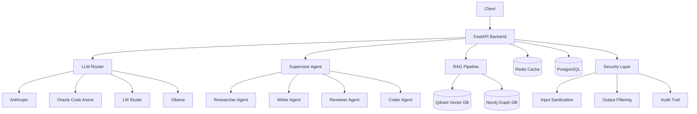

# Knowledge Foundry

**Enterprise AI Knowledge Management Platform** with RAG, multi-agent orchestration, and EU AI Act compliance.

[]() []() []()

## 🚀 Quick Start

```bash
# 1. Clone and setup
git clone https://github.com/your-org/knowledge-foundry.git
cd knowledge-foundry
python3 -m venv .venv
source .venv/bin/activate
pip install -e ".[dev]"

# 2. Configure
cp .env.example .env
# Edit .env with your API keys

# 3. Start the stack
./kf.sh start

# 4. Access services
# Frontend:    http://localhost:3000
# API Docs:    http://localhost:8000/docs
# Grafana:     http://localhost:3001 (admin/kf_admin)
```

See [QUICKSTART.md](docs/QUICKSTART.md) for detailed setup.

## 📋 What is Knowledge Foundry?

Knowledge Foundry is a production-ready AI platform that combines:

- **🧠 Advanced RAG**: Vector (Qdrant) + Knowledge Graph (Neo4j) + semantic chunking
- **🤖 Multi-Agent System**: Supervisor pattern with specialized agents (Researcher, Writer, Reviewer, Coder)
- **⚡ Tiered Intelligence**: Auto-routes to Claude Opus/Sonnet/Haiku based on complexity
- **🔌 Plugin System**: Extensible tools (Web Search, Code Sandbox, Database, Communication)
- **🔒 Enterprise Security**: Input sanitization, output filtering, audit trails, OWASP 2026 compliance
- **📊 Observability**: Langfuse, Arize Phoenix, Prometheus, Grafana
- **⚖️ EU AI Act Ready**: Automated compliance, risk assessment, technical documentation
- **🧪 Quality Gates**: RAGAS evaluation, semantic drift detection

## 🏗️ Architecture



See [ARCHITECTURE_OVERVIEW.md](docs/ARCHITECTURE_OVERVIEW.md) for details.

## 📚 Documentation

| Document | Description |
|----------|-------------|
| [Quick Start](docs/QUICKSTART.md) | Get up and running in 5 minutes |
| [User Guide](docs/USER_GUIDE.md) | Using the platform |
| [API Docs](docs/API.md) | REST API reference |
| [Developer Guide](docs/DEVELOPER_GUIDE.md) | Contributing and extending |
| [Configuration](docs/CONFIGURATION.md) | All config options |
| [Deployment](docs/DEPLOYMENT.md) | Production deployment guide |
| [Troubleshooting](docs/TROUBLESHOOTING.md) | Common issues and solutions |
| [Security](docs/SECURITY.md) | Security architecture and best practices |
| [Testing](docs/TESTING.md) | Testing strategy and running tests |

## 🛠️ Technology Stack

**Backend**
- **Framework**: FastAPI, Pydantic, SQLAlchemy
- **LLMs**: Anthropic Claude, Oracle Code Assist, LM Studio, Ollama
- **Vector DB**: Qdrant
- **Graph DB**: Neo4j
- **Cache**: Redis
- **Database**: PostgreSQL
- **Observability**: Langfuse, Arize Phoenix, Prometheus, Grafana

**Frontend**
- **Framework**: Next.js 15, React 19, TypeScript
- **Styling**: Tailwind CSS
- **Testing**: Playwright

**Infrastructure**
- **Containerization**: Docker, Docker Compose
- **Orchestration**: Kubernetes (Helm charts included)
- **CI/CD**: GitHub Actions
- **Monitoring**: Prometheus + Grafana

## 🎯 Key Features

### Intelligent Routing
Automatically routes requests to optimal LLM tier based on complexity analysis:
- **Opus**: Architecture, security analysis, complex reasoning
- **Sonnet**: Code generation, documentation, standard queries
- **Haiku**: Classification, entity extraction, formatting

### Multi-Agent Orchestration
Supervisor coordinates specialized agents:
- **Researcher**: Deep research with web search and graph traversal
- **Writer**: Long-form content generation
- **Reviewer**: Quality assurance and compliance checking
- **Coder**: Code generation with sandbox execution

### Advanced RAG
- **Semantic Chunking**: Context-aware document segmentation
- **Hybrid Search**: Dense + sparse retrieval
- **Graph-Enhanced**: Knowledge Entity Tagging (KET) for relationship discovery
- **Re-ranking**: Cross-encoder for precision

### Security & Compliance
- **Input Sanitization**: SQL injection, XSS, prompt injection protection
- **Output Filtering**: PII redaction, sensitive data detection
- **Audit Trails**: Immutable compliance logs
- **EU AI Act**: Automated risk assessment, transparency requirements

## 📊 Performance

- **Latency**: P95 < 500ms (Haiku), < 2s (Sonnet), < 5s (Opus)
- **Throughput**: 100+ req/s (tested with k6)
- **Test Coverage**: 95%+ (576 tests passing)
- **Quality Score**: RAGAS > 0.8 (faithfulness > 0.95)

## 🔧 Development

```bash
# Run tests
pytest tests/ -v

# Run with coverage
pytest tests/ --cov=src --cov-report=html

# Lint and format
ruff check src/
black src/

# Type check
mypy src/

# Run load tests
k6 run tests/load/api_load_test.js
```

See [DEVELOPER_GUIDE.md](docs/DEVELOPER_GUIDE.md) for contribution guidelines.

## 📦 Project Structure

```
knowledge-foundry/
├── src/                    # Source code
│   ├── api/               # FastAPI endpoints
│   ├── agents/            # Multi-agent system
│   ├── llm/               # LLM providers and routing
│   ├── retrieval/         # RAG pipeline
│   ├── security/          # Security layer
│   ├── plugins/           # Plugin system
│   └── core/              # Core utilities
├── tests/                 # Test suite
│   ├── unit/             # Unit tests
│   ├── integration/      # Integration tests
│   ├── evaluation/       # RAGAS evaluation
│   └── load/             # k6 load tests
├── frontend/             # Next.js frontend
├── docs/                 # Documentation
│   ├── architecture/     # Architecture specs
│   └── ADRs/             # Architecture Decision Records
├── k8s/                  # Kubernetes manifests
├── infra/                # Infrastructure configs
└── docker-compose.yml    # Local development stack
```

## 🚀 Deployment

### Docker Compose (Development)
```bash
./kf.sh start
```

### Kubernetes (Production)
```bash
# Configure secrets
kubectl create secret generic kf-secrets \
  --from-literal=anthropic-api-key=$ANTHROPIC_API_KEY

# Deploy
helm install knowledge-foundry ./k8s/helm -f values.prod.yaml

# Check status
kubectl get pods -l app=knowledge-foundry
```

See [DEPLOYMENT.md](docs/DEPLOYMENT.md) for full production deployment guide.

## 🤝 Contributing

We welcome contributions! Please see [CONTRIBUTING.md](CONTRIBUTING.md) for guidelines.

## 📜 License

MIT License - see [LICENSE](LICENSE) for details.

## 🔗 Links

- **Documentation**: [docs/](docs/)
- **API Docs**: http://localhost:8000/docs (when running)
- **Architecture Decision Records**: [docs/ADRs/](docs/ADRs/)
- **Changelog**: [CHANGELOG.md](CHANGELOG.md)

## 🙏 Acknowledgments

Built with:
- [Anthropic Claude](https://www.anthropic.com/)
- [Qdrant](https://qdrant.tech/)
- [Neo4j](https://neo4j.com/)
- [FastAPI](https://fastapi.tiangolo.com/)
- [Next.js](https://nextjs.org/)

## 📧 Support

- **Issues**: [GitHub Issues](https://github.com/your-org/knowledge-foundry/issues)
- **Discussions**: [GitHub Discussions](https://github.com/your-org/knowledge-foundry/discussions)
- **Email**: support@knowledge-foundry.io

---

Made with ❤️ by the Knowledge Foundry team
