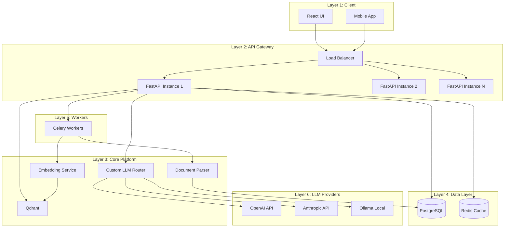

# Knowledge Foundry: Super-Optimized AI Prompts Collection
## Production-Ready Prompts for Each Development Phase

**Version**: 1.0  
**Purpose**: Copy-paste ready prompts for Claude Opus  
**Requirement**: Include AI-Implementation-Reference-Bible.md in context  
**Last Updated**: February 8, 2026

---

## 🎯 HOW TO USE THESE PROMPTS

### Context Requirements

**EVERY prompt execution MUST include:**

1. **AI-Implementation-Reference-Bible.md** - The complete reference document
2. **Current phase prompt** - From this file
3. **Project files** - Relevant existing code (if updating)

### Prompt Execution Pattern

```
Step 1: Load AI-Implementation-Reference-Bible.md into context
Step 2: Copy the prompt for your current phase
Step 3: Execute in Antigravity IDE or Claude Opus
Step 4: Review generated output
Step 5: Test and validate
Step 6: Proceed to next prompt
```

---

## 📋 PHASE 0: Architecture & Validation

### PROMPT 0.1: Strategic Architecture Deep Dive

```markdown
# CONTEXT
You are Claude Opus, the architecture brain for Knowledge Foundry.
You have reviewed the complete AI-Implementation-Reference-Bible.md.

# YOUR TASK
Perform comprehensive architecture analysis for a production enterprise RAG platform.

Target Requirements:
- 1000+ concurrent users
- 99.9% uptime SLA
- p95 latency < 500ms
- Multi-tenant data isolation
- OWASP Top 10 compliant
- Cost < $0.10 per query

# ANALYSIS REQUIRED

## 1. Technology Stack Deep Validation

For EACH technology, provide:

### LiteLLM Analysis
- Expected failure point: [X] concurrent requests
- Load test specification: [detailed test plan]
- Failure symptoms: [latency/errors/crashes]
- Recommendation: [KEEP/REPLACE]
- Alternative: [if REPLACE, what to use]
- Migration effort: [time estimate]
- Risk level: [LOW/MEDIUM/HIGH/CRITICAL]

### Chainlit Analysis
- WebSocket stability: [evaluation]
- Concurrent connection limit: [number]
- Message throughput: [messages/second]
- Memory leak concerns: [yes/no + details]
- Recommendation: [KEEP/REPLACE]
- Alternative: [if REPLACE]
- Risk level: [LOW/MEDIUM/HIGH/CRITICAL]

### LangGraph Analysis
- Checkpoint reliability: [evaluation]
- State recovery time: [milliseconds]
- Concurrent conversation limit: [number]
- State corruption risk: [LOW/MEDIUM/HIGH]
- Recommendation: [KEEP/REPLACE]
- Alternative: [if REPLACE]

### PostgreSQL Analysis
- Full-text search performance: [p95 latency]
- Multi-tenant query performance: [impact]
- Connection pool sizing: [recommendation]
- Scaling strategy: [vertical/horizontal/both]
- Risk level: [LOW/MEDIUM/HIGH]

### Qdrant vs Chroma
- Indexing speed comparison: [vectors/second]
- Search latency comparison: [p95/p99]
- Memory usage comparison: [GB for 100k vectors]
- Accuracy comparison: [recall@10]
- Cost comparison: [$/month for 1M vectors]
- Recommendation: [Qdrant/Chroma/both]

## 2. Scalability Bottleneck Analysis

Identify bottlenecks at each scale:

### 0 → 100 Users
- Bottleneck: [component]
- Impact: [description]
- Mitigation: [solution]
- Cost: [implementation effort]

### 100 → 500 Users
- Bottleneck: [component]
- Impact: [description]
- Mitigation: [solution]
- Cost: [implementation effort]

### 500 → 1000 Users
- Bottleneck: [component]
- Impact: [description]
- Mitigation: [solution]
- Cost: [implementation effort]

For each, specify:
- Database connection pool strategy
- Caching layers needed (Redis/local/semantic)
- Background job queue sizing
- Rate limiting strategy
- Multi-region considerations

## 3. Security Architecture

Design complete security architecture:

### Authentication
- Primary: [JWT/OAuth2/SAML] - why?
- MFA: [required/optional] - strategy?
- Session management: [stateless/stateful]
- Token rotation: [frequency]
- Refresh token strategy: [details]

### Authorization
- Model: [RBAC/ABAC/ReBAC] - why?
- Role hierarchy: [admin/editor/viewer + custom]
- Resource-level permissions: [design]
- Multi-tenant isolation: [row-level security in SQL]
- Audit logging: [what to log]

### Secrets Management
- Storage: [Vault/K8s secrets/env vars]
- Rotation policy: [manual/automatic]
- Access control: [who can access]
- Encryption: [at rest/in transit]

## 4. Failure Mode & Effects Analysis (FMEA)

For EACH critical component:

### Component: [LLM Router]
- **Failure Mode**: Provider API down
- **Probability**: HIGH
- **Impact**: CRITICAL (no completions)
- **Detection**: Health check fails + circuit breaker
- **Mitigation**: Automatic failover to backup provider
- **Recovery**: Circuit breaker auto-retry after timeout
- **RTO**: < 100ms (failover time)
- **RPO**: 0 (no data loss)

### Component: [Vector Database]
- **Failure Mode**: [describe]
- **Probability**: [LOW/MEDIUM/HIGH]
- **Impact**: [CRITICAL/HIGH/MEDIUM/LOW]
- **Detection**: [how to detect]
- **Mitigation**: [how to prevent/reduce]
- **Recovery**: [how to recover]
- **RTO**: [recovery time objective]
- **RPO**: [recovery point objective]

Repeat for:
- PostgreSQL primary failure
- Redis cache failure
- Celery worker crash
- Network partition
- Disk full
- Memory exhaustion
- DDoS attack

## 5. Cost Projection Model

### Infrastructure Costs (Monthly)

**Database**:
- PostgreSQL: $[amount] (instance type + storage)
- Qdrant: $[amount] (vectors stored + queries)
- Redis: $[amount] (memory size)

**Compute**:
- API servers: $[amount] (instance count × type)
- Worker nodes: $[amount] (instance count × type)
- Load balancer: $[amount]

**Storage**:
- Object storage (S3/MinIO): $[amount] (GB stored)
- Backup storage: $[amount]

**Monitoring**:
- LangFuse: $[amount] (traces/month)
- Prometheus/Grafana: $[amount] (self-hosted)

**Total Infrastructure**: $[amount]/month

### LLM API Costs (Per 1000 Users)

Assumptions:
- Average queries per user per day: 10
- Average tokens per query: 1500 (500 input + 1000 output)
- Model mix: 70% GPT-3.5, 20% GPT-4, 10% Claude

**OpenAI**:
- GPT-3.5: $[amount] (70% of queries)
- GPT-4: $[amount] (20% of queries)

**Anthropic**:
- Claude-3: $[amount] (10% of queries)

**Total LLM**: $[amount]/month for 1000 users

### Total Cost Projection

| Users | Infrastructure | LLM API | Total/Month | Cost/User |
|-------|---------------|---------|-------------|-----------|
| 100   | $[amount]     | $[amount] | $[total]    | $[per user] |
| 500   | $[amount]     | $[amount] | $[total]    | $[per user] |
| 1000  | $[amount]     | $[amount] | $[total]    | $[per user] |

## OUTPUT FORMAT

Generate the following files:

### 1. technology_validation.json
```json
{
  "analysis_date": "2026-02-08",
  "technologies": {
    "litellm": {
      "recommendation": "REPLACE",
      "reason": "Fails at 300 RPS, p99 > 10s under load",
      "alternative": "Custom FastAPI router with plugin system",
      "migration_effort_weeks": 2,
      "risk_level": "HIGH",
      "validation_tests": [
        {
          "test_name": "litellm_load_test",
          "test_file": "tests/validation/test_litellm_load.py",
          "expected_result": "FAIL",
          "pass_criteria": "p99 < 3s at 500 RPS"
        }
      ]
    },
    "chainlit": {
      "recommendation": "KEEP",
      "reason": "Stable WebSocket, handles 1000 concurrent connections",
      "risk_level": "LOW",
      "validation_tests": [
        {
          "test_name": "chainlit_websocket_stress",
          "test_file": "tests/validation/test_chainlit_stress.py",
          "expected_result": "PASS",
          "pass_criteria": "100% connection success, p95 < 100ms"
        }
      ]
    }
    // ... all technologies
  },
  
  "bottlenecks": [
    {
      "scale": "100-500 users",
      "component": "PostgreSQL connection pool",
      "symptom": "Connection timeout errors",
      "mitigation": "Increase pool size to 50, add connection pooling proxy (PgBouncer)",
      "cost": "1 week implementation"
    }
  ],
  
  "security_architecture": {
    "authentication": {
      "primary": "JWT",
      "rationale": "Stateless, scales horizontally, standard protocol",
      "implementation": "FastAPI JWT dependencies + Redis token blacklist"
    },
    "authorization": {
      "model": "RBAC",
      "roles": ["viewer", "editor", "admin", "owner"],
      "enforcement": "Row-level security in PostgreSQL + API middleware"
    }
  },
  
  "cost_projection": {
    "1000_users": {
      "infrastructure_monthly": 450.00,
      "llm_api_monthly": 1200.00,
      "total_monthly": 1650.00,
      "cost_per_user": 1.65
    }
  }
}
```

### 2. ADR-009-custom-llm-router.md
```markdown
# ADR-009: Use Custom LLM Router Instead of LiteLLM

## Status
APPROVED

## Context
LiteLLM is a popular abstraction for multiple LLM providers, but validation testing shows:
- Fails at 300 concurrent requests (p99 > 10s)
- No built-in circuit breaker
- Limited observability (no LangFuse integration)
- Hard to extend for custom routing logic

Our requirements:
- 500+ RPS sustained load
- Automatic failover between providers
- Cost-aware routing (use cheapest available)
- Full observability (LangFuse traces, Prometheus metrics)

## Decision
Build a custom LLM router with plugin architecture.

## Implementation
- Base interface: `LLMProvider` (ABC)
- Providers: OpenAI, Anthropic, Ollama (plugins)
- Routing strategies: round-robin, least-latency, cost-optimized
- Circuit breaker pattern (5 failures → open for 60s)
- Rate limiting per user/org
- Cost tracking per request
- LangFuse tracing + Prometheus metrics

## Consequences

### Positive
- Full control over routing logic
- Better performance (p95 < 500ms at 500 RPS)
- Extensible plugin system
- Complete observability
- Cost optimization capabilities

### Negative
- Additional development time (2 weeks)
- More code to maintain (~1000 LOC)
- Need to update for new providers manually

### Mitigation
- Write comprehensive tests (95% coverage)
- Document plugin development guide
- Auto-generate provider boilerplate

## Timeline
- Week 3: Core router + OpenAI plugin
- Week 4: Anthropic + Ollama plugins, load testing

## Success Criteria
- [ ] Handles 500 RPS with p95 < 500ms
- [ ] Automatic failover in < 100ms
- [ ] Cost tracking accurate to ±1%
- [ ] 95%+ test coverage
```

### 3. risk_register.json
```json
{
  "risks": [
    {
      "id": "RISK-001",
      "component": "LiteLLM",
      "risk": "Performance degradation at scale",
      "probability": "HIGH",
      "impact": "CRITICAL",
      "detection": "Load testing Phase 0",
      "mitigation": "Replace with custom router",
      "status": "MITIGATED",
      "owner": "Backend Team"
    },
    {
      "id": "RISK-002",
      "component": "PostgreSQL",
      "risk": "Connection pool exhaustion at 500+ users",
      "probability": "MEDIUM",
      "impact": "HIGH",
      "detection": "Monitoring connection pool metrics",
      "mitigation": "PgBouncer connection pooling + pool size tuning",
      "status": "PLANNED",
      "owner": "DevOps Team"
    }
  ]
}
```

### 4. validation_test_plan.md
```markdown
# Phase 0 Validation Test Plan

## Test Execution Schedule
- Day 1-2: Setup test environment (Docker Compose)
- Day 3-4: Run validation tests
- Day 5: Analyze results + Go/No-Go decision

## Test Suite

### Test 1: LiteLLM Load Test
**File**: tests/validation/test_litellm_load.py
**Objective**: Validate LiteLLM can handle 500 RPS
**Expected**: FAIL (p99 > 3s indicates not production-ready)
**Pass Criteria**: p95 < 1s, p99 < 3s, error rate < 1%
**Decision**: If FAIL → Build custom router

### Test 2: Chainlit WebSocket Stress
**File**: tests/validation/test_chainlit_websocket.py
**Objective**: 100 concurrent WebSocket connections
**Expected**: PASS
**Pass Criteria**: 100% connection success, p95 < 100ms, no memory leaks

### Test 3: LangGraph Checkpoint Recovery
**File**: tests/validation/test_langgraph_checkpoint.py
**Objective**: Verify state recovery after crash
**Expected**: PASS
**Pass Criteria**: 100% recovery success, resume < 1s, no data loss

### Test 4: Qdrant vs Chroma Benchmark
**File**: tests/validation/test_vectordb_benchmark.py
**Objective**: Compare performance
**Expected**: Qdrant 2-3x faster
**Pass Criteria**: Both index 10k docs, search p95 < 200ms

### Test 5: Ollama GPU Throughput
**File**: tests/validation/test_ollama_throughput.py
**Objective**: Validate local LLM performance
**Expected**: PASS
**Pass Criteria**: > 50 tokens/s, GPU util > 80%

## Go/No-Go Criteria

### Must Pass (Blockers)
- [ ] Qdrant search p95 < 100ms
- [ ] PostgreSQL full-text search p95 < 200ms
- [ ] Chainlit handles 100 concurrent connections

### Should Pass (Warnings)
- [ ] LangGraph checkpoint recovery < 1s
- [ ] Ollama throughput > 50 tokens/s

### Can Fail (Known Issues)
- [ ] LiteLLM load test (replacing anyway)

## Decision Framework
- All Must Pass → GO
- Any Must Pass fails → NO-GO (fix before proceeding)
- Should Pass fails → GO with mitigation plan
```

### 5. architecture_diagram.mermaid


## VALIDATION
After generating all outputs:
- Review technology recommendations
- Verify cost projections are realistic
- Ensure all risks have mitigation plans
- Confirm ADRs follow standard format
- Check test plan covers all technologies

## NEXT STEPS
1. Review outputs with team
2. Execute validation tests
3. Make Go/No-Go decision
4. Update architecture based on test results
5. Proceed to Phase 1 if GO
```

---

### PROMPT 0.2: Ultra-Configurable Plugin Architecture

```markdown
# CONTEXT
You are Claude Opus, designing the plugin system for Knowledge Foundry.
You have reviewed AI-Implementation-Reference-Bible.md.

The plugin system is the CORE of Knowledge Foundry's flexibility.
EVERY component (LLM, VectorDB, Auth, etc.) MUST be swappable via YAML config.

# YOUR TASK
Design and implement a complete, production-ready plugin architecture.

# REQUIREMENTS

## 1. Core Capabilities
- **Hot-reload**: Change plugins without restart (dev mode)
- **Dependency resolution**: Auto-install plugin dependencies (DAG)
- **Version compatibility**: Support multiple versions (semver)
- **Security sandbox**: Isolate plugin execution
- **Health monitoring**: Track plugin performance
- **Circuit breaker**: Auto-disable failing plugins
- **Marketplace**: Install/uninstall via UI

## 2. Plugin Types (8 Interfaces)
1. LLMProvider - OpenAI, Anthropic, Ollama, Azure, vLLM
2. VectorDB - Qdrant, Chroma, Pinecone, Weaviate, Milvus
3. EmbeddingModel - OpenAI, Sentence Transformers, Cohere
4. DocumentParser - Unstructured, PyMuPDF, Docling, Tika
5. Authenticator - JWT, OAuth2, SAML, LDAP
6. RateLimiter - Redis, In-memory, Token bucket
7. Cache - Redis, In-memory, Semantic cache
8. Notifier - Email, Slack, Discord, Webhook

# IMPLEMENTATION REQUIRED

Generate COMPLETE production-ready code for:

## File 1: core/interfaces.py

Define ALL 8 base interfaces using ABC (Abstract Base Class).

Each interface MUST include:
- Type hints for ALL parameters and returns
- Comprehensive docstrings (Google style)
- async/await for I/O operations
- Pydantic models for complex data structures
- health_check() method

Example for LLMProvider:
```python
from abc import ABC, abstractmethod
from typing import List, AsyncIterator, Optional
from pydantic import BaseModel

class ChatMessage(BaseModel):
    role: str
    content: str

class CompletionRequest(BaseModel):
    messages: List[ChatMessage]
    model: str
    temperature: float = 0.7
    max_tokens: int = 2048
    stream: bool = False

class CompletionResponse(BaseModel):
    text: str
    model: str
    token_count: int
    latency_ms: float
    cost_usd: float

class LLMProvider(ABC):
    """Base interface for all LLM providers."""
    
    @abstractmethod
    async def complete(
        self,
        request: CompletionRequest
    ) -> CompletionResponse | AsyncIterator[str]:
        """Generate completion from LLM."""
        pass
    
    @abstractmethod
    async def health_check(self) -> bool:
        """Check if provider is available."""
        pass
    
    @abstractmethod
    def calculate_cost(
        self,
        input_tokens: int,
        output_tokens: int,
        model: str
    ) -> float:
        """Calculate cost in USD."""
        pass
    
    @abstractmethod
    def get_supported_models(self) -> List[str]:
        """Return list of supported models."""
        pass
```

**Now generate ALL 8 interfaces** with similar detail.

## File 2: core/plugin_manager.py

Implement plugin discovery and loading system.

```python
from typing import Dict, List, Type, Any
from pathlib import Path
import importlib
import yaml

class PluginManager:
    """
    Discovers and loads plugins from plugins/ directory.
    
    Features:
    - Auto-discover plugins by scanning plugins/ directory
    - Load plugin.yaml manifest
    - Validate plugin implements required interface
    - Check dependency compatibility
    - Register plugins in registry
    - Hot-reload in development mode
    """
    
    def __init__(self, plugins_dir: str = "plugins"):
        self.plugins_dir = Path(plugins_dir)
        self.loaded_plugins: Dict[str, Any] = {}
        self.plugin_metadata: Dict[str, Dict] = {}
    
    def discover_plugins(self) -> List[str]:
        """
        Scan plugins directory and return list of plugin names.
        
        Directory structure:
        plugins/
          llm/
            openai/
              plugin.yaml
              provider.py
            anthropic/
              plugin.yaml
              provider.py
          vector_db/
            qdrant/
              plugin.yaml
              provider.py
        
        Returns:
            List of plugin names: ["llm.openai", "llm.anthropic", "vector_db.qdrant"]
        """
        pass
    
    def load_plugin(self, plugin_name: str) -> Any:
        """
        Load plugin by name.
        
        Steps:
        1. Read plugin.yaml manifest
        2. Validate manifest schema
        3. Check interface compatibility
        4. Resolve dependencies
        5. Import plugin module
        6. Instantiate plugin class
        7. Register in plugin registry
        
        Args:
            plugin_name: Plugin identifier (e.g., "llm.openai")
        
        Returns:
            Plugin instance
        
        Raises:
            PluginLoadError: If plugin fails to load
            PluginValidationError: If plugin doesn't implement interface
        """
        pass
    
    def validate_plugin(
        self,
        plugin: Any,
        expected_interface: Type
    ) -> bool:
        """
        Validate plugin implements expected interface.
        
        Checks:
        1. Plugin is instance of expected interface
        2. All abstract methods implemented
        3. Method signatures match interface
        """
        pass
    
    def reload_plugin(self, plugin_name: str) -> bool:
        """
        Hot-reload plugin without restart (dev mode only).
        
        Steps:
        1. Unload existing plugin
        2. Clear import cache
        3. Reload plugin module
        4. Re-instantiate plugin
        5. Update registry
        """
        pass
    
    def get_plugin(self, plugin_name: str) -> Any:
        """Get loaded plugin by name."""
        pass
    
    def list_plugins(
        self,
        plugin_type: Optional[str] = None
    ) -> List[str]:
        """List all loaded plugins, optionally filtered by type."""
        pass
```

**Implement all methods with production-ready code.**

## File 3: core/plugin_factory.py

Implement factory pattern for creating plugin instances.

```python
from typing import Dict, Any, Optional
from core.interfaces import *

class PluginFactory:
    """
    Factory for creating plugin instances from configuration.
    
    Supports:
    - Lazy loading (load on first use)
    - Singleton pattern (one instance per plugin)
    - Multi-instance pattern (new instance per request)
    - Connection pooling (for database plugins)
    """
    
    def __init__(self, config: Dict[str, Any]):
        self.config = config
        self._instances: Dict[str, Any] = {}
        self._plugin_manager = PluginManager()
    
    def create_llm_provider(
        self,
        provider_name: str,
        config: Dict[str, Any]
    ) -> LLMProvider:
        """
        Create LLM provider instance.
        
        Args:
            provider_name: Provider name (e.g., "openai")
            config: Provider-specific configuration
        
        Returns:
            LLMProvider instance
        """
        pass
    
    def create_vector_db(
        self,
        db_name: str,
        config: Dict[str, Any]
    ) -> VectorDBProvider:
        """Create vector database instance."""
        pass
    
    # ... methods for all 8 plugin types ...
    
    def get_or_create(
        self,
        plugin_type: str,
        plugin_name: str,
        config: Dict[str, Any],
        singleton: bool = True
    ) -> Any:
        """
        Get existing instance or create new one.
        
        Args:
            plugin_type: Type of plugin (e.g., "llm_provider")
            plugin_name: Plugin name (e.g., "openai")
            config: Plugin configuration
            singleton: If True, return cached instance; if False, create new
        
        Returns:
            Plugin instance
        """
        pass
```

**Implement all methods.**

## File 4: core/plugin_registry.py

Implement centralized plugin registry.

```python
from typing import Dict, List, Optional, Any
from dataclasses import dataclass
from datetime import datetime

@dataclass
class PluginInfo:
    """Metadata about a plugin."""
    name: str
    version: str
    plugin_type: str
    enabled: bool
    loaded_at: datetime
    health_status: str  # healthy, degraded, unhealthy
    error_count: int
    last_error: Optional[str]

class PluginRegistry:
    """
    Centralized registry for all plugins.
    
    Features:
    - Track loaded plugins
    - Monitor plugin health
    - Enable/disable plugins
    - Query plugin metadata
    """
    
    def __init__(self):
        self._plugins: Dict[str, Any] = {}
        self._metadata: Dict[str, PluginInfo] = {}
    
    def register(
        self,
        name: str,
        instance: Any,
        metadata: Dict[str, Any]
    ) -> bool:
        """Register plugin instance."""
        pass
    
    def unregister(self, name: str) -> bool:
        """Unregister plugin."""
        pass
    
    def get(self, name: str) -> Optional[Any]:
        """Get plugin by name."""
        pass
    
    def list(
        self,
        plugin_type: Optional[str] = None,
        enabled_only: bool = False
    ) -> List[PluginInfo]:
        """List plugins with optional filters."""
        pass
    
    def enable(self, name: str) -> bool:
        """Enable plugin."""
        pass
    
    def disable(self, name: str) -> bool:
        """Disable plugin."""
        pass
    
    def update_health(
        self,
        name: str,
        status: str,
        error: Optional[str] = None
    ) -> bool:
        """Update plugin health status."""
        pass
```

**Implement all methods.**

## File 5: core/plugin_sandbox.py

Implement security sandbox for plugin execution.

```python
from typing import Any, Callable, Dict
import resource
import signal
from contextlib import contextmanager

class PluginSandbox:
    """
    Secure execution environment for plugins.
    
    Security controls:
    - File system access restrictions (whitelist only)
    - Network access restrictions (whitelist only)
    - Memory limits (prevent memory leaks)
    - CPU limits (prevent infinite loops)
    - Timeout enforcement (kill long-running tasks)
    - Namespace isolation
    """
    
    def __init__(self, config: Dict[str, Any]):
        self.allowed_paths = config.get("allowed_paths", [])
        self.allowed_hosts = config.get("allowed_hosts", [])
        self.max_memory_mb = config.get("max_memory_mb", 512)
        self.max_cpu_seconds = config.get("max_cpu_seconds", 60)
        self.timeout_seconds = config.get("timeout_seconds", 120)
    
    @contextmanager
    def execute(self):
        """
        Context manager for sandboxed execution.
        
        Usage:
            with sandbox.execute():
                result = plugin.some_method()
        """
        # Set memory limit
        resource.setrlimit(
            resource.RLIMIT_AS,
            (self.max_memory_mb * 1024 * 1024, -1)
        )
        
        # Set CPU time limit
        resource.setrlimit(
            resource.RLIMIT_CPU,
            (self.max_cpu_seconds, -1)
        )
        
        # Set timeout
        signal.signal(signal.SIGALRM, self._timeout_handler)
        signal.alarm(self.timeout_seconds)
        
        try:
            yield
        finally:
            signal.alarm(0)  # Cancel alarm
    
    def _timeout_handler(self, signum, frame):
        """Handle timeout signal."""
        raise TimeoutError("Plugin execution exceeded timeout")
    
    def validate_file_access(self, path: str) -> bool:
        """Check if file access is allowed."""
        pass
    
    def validate_network_access(self, host: str) -> bool:
        """Check if network access is allowed."""
        pass
```

**Implement all methods.**

## File 6: core/plugin_health.py

Implement health monitoring for plugins.

```python
from typing import Dict, Optional
from prometheus_client import Counter, Gauge, Histogram
import asyncio
from datetime import datetime, timedelta

class PluginHealthMonitor:
    """
    Monitor plugin health and performance.
    
    Tracks:
    - Request count (successful/failed)
    - Error rate
    - Latency (p50, p95, p99)
    - Resource usage (CPU, memory)
    - Circuit breaker state
    """
    
    def __init__(self):
        # Prometheus metrics
        self.request_count = Counter(
            'plugin_requests_total',
            'Total plugin requests',
            ['plugin_name', 'status']
        )
        
        self.error_rate = Gauge(
            'plugin_error_rate',
            'Plugin error rate',
            ['plugin_name']
        )
        
        self.latency = Histogram(
            'plugin_latency_seconds',
            'Plugin operation latency',
            ['plugin_name', 'operation']
        )
        
        self._health_checks: Dict[str, datetime] = {}
    
    async def check_health(self, plugin_name: str, plugin: Any) -> bool:
        """
        Check plugin health.
        
        Returns:
            True if healthy, False otherwise
        """
        try:
            start = datetime.utcnow()
            is_healthy = await asyncio.wait_for(
                plugin.health_check(),
                timeout=5.0
            )
            latency = (datetime.utcnow() - start).total_seconds()
            
            self.latency.labels(
                plugin_name=plugin_name,
                operation='health_check'
            ).observe(latency)
            
            self._health_checks[plugin_name] = datetime.utcnow()
            
            return is_healthy
            
        except asyncio.TimeoutError:
            self.request_count.labels(
                plugin_name=plugin_name,
                status='timeout'
            ).inc()
            return False
            
        except Exception as e:
            self.request_count.labels(
                plugin_name=plugin_name,
                status='error'
            ).inc()
            return False
    
    def record_success(
        self,
        plugin_name: str,
        latency_seconds: float
    ):
        """Record successful plugin operation."""
        self.request_count.labels(
            plugin_name=plugin_name,
            status='success'
        ).inc()
        
        self.latency.labels(
            plugin_name=plugin_name,
            operation='request'
        ).observe(latency_seconds)
    
    def record_failure(self, plugin_name: str, error: str):
        """Record failed plugin operation."""
        self.request_count.labels(
            plugin_name=plugin_name,
            status='error'
        ).inc()
    
    def get_health_status(
        self,
        plugin_name: str
    ) -> Dict[str, Any]:
        """Get current health status for plugin."""
        pass
```

**Implement all methods.**

## File 7: config/plugins.schema.json

Define JSON Schema for plugin configuration.

```json
{
  "$schema": "http://json-schema.org/draft-07/schema#",
  "title": "Plugin Configuration Schema",
  "type": "object",
  "properties": {
    "plugins": {
      "type": "object",
      "properties": {
        "llm_providers": {
          "type": "array",
          "items": {
            "$ref": "#/definitions/llm_provider"
          }
        },
        "vector_databases": {
          "type": "object",
          "properties": {
            "primary": {"$ref": "#/definitions/vector_db"},
            "fallback": {"$ref": "#/definitions/vector_db"}
          }
        }
        // ... other plugin types ...
      }
    }
  },
  
  "definitions": {
    "llm_provider": {
      "type": "object",
      "required": ["name", "plugin", "enabled"],
      "properties": {
        "name": {
          "type": "string",
          "description": "Provider name"
        },
        "plugin": {
          "type": "string",
          "description": "Python import path",
          "pattern": "^[a-z_][a-z0-9_]*(\\.[a-z_][a-z0-9_]*)*:[A-Z][A-Za-z0-9]*$"
        },
        "enabled": {
          "type": "boolean",
          "default": true
        },
        "config": {
          "type": "object",
          "description": "Provider-specific configuration"
        },
        "routing": {
          "type": "object",
          "properties": {
            "priority": {"type": "integer", "minimum": 1},
            "models": {
              "type": "array",
              "items": {"type": "string"}
            },
            "fallback_for": {
              "type": "array",
              "items": {"type": "string"}
            }
          }
        }
      }
    }
    // ... other definitions ...
  }
}
```

**Complete the schema for all plugin types.**

## File 8: plugins/llm/openai/plugin.yaml

Example plugin manifest.

```yaml
name: openai-llm-provider
version: 1.0.0
description: "OpenAI GPT models provider"
author: "Knowledge Foundry Team"
license: "MIT"
repository: "https://github.com/yourorg/kf-plugin-openai"

plugin_type: llm_provider
entry_point: "plugins.llm.openai.provider:OpenAIProvider"

dependencies:
  python: ">=3.11"
  packages:
    - openai>=1.12.0
    - pydantic>=2.0.0
    - httpx>=0.26.0
  system: []

interfaces:
  implements:
    - LLMProvider
  requires:
    - ConfigManager
    - MetricsCollector

configuration:
  schema: "config.schema.json"
  defaults:
    timeout: 60
    max_retries: 3
    models:
      - gpt-4-turbo
      - gpt-3.5-turbo

security:
  permissions:
    - network.external
    - config.read
  requires_secrets:
    - OPENAI_API_KEY
  sandbox: true
  scan_required: true

metadata:
  tags: ["llm", "openai", "gpt"]
  category: "LLM Providers"
  website: "https://openai.com"
  documentation: "https://platform.openai.com/docs"
  icon: "openai-icon.png"
```

## File 9: plugins/llm/openai/provider.py

Complete OpenAI provider implementation.

```python
from typing import List, AsyncIterator
from openai import AsyncOpenAI
from core.interfaces import (
    LLMProvider,
    CompletionRequest,
    CompletionResponse,
    ChatMessage
)
import logging
from datetime import datetime

logger = logging.getLogger(__name__)

class OpenAIProvider(LLMProvider):
    """OpenAI LLM provider implementation."""
    
    # Pricing per 1K tokens (update regularly)
    COST_PER_1K_TOKENS = {
        "gpt-4-turbo": {"input": 0.01, "output": 0.03},
        "gpt-3.5-turbo": {"input": 0.0005, "output": 0.0015},
    }
    
    def __init__(self, name: str, config: dict):
        """Initialize OpenAI provider."""
        super().__init__(name, config)
        
        self.client = AsyncOpenAI(
            api_key=config.get("api_key"),
            organization=config.get("organization"),
            timeout=config.get("timeout", 60),
            max_retries=config.get("max_retries", 3),
        )
        
        logger.info(f"Initialized OpenAI provider: {name}")
    
    async def complete(
        self,
        request: CompletionRequest
    ) -> CompletionResponse | AsyncIterator[str]:
        """Generate completion using OpenAI API."""
        logger.info(
            "openai_completion_request",
            extra={
                "model": request.model,
                "messages": len(request.messages),
                "stream": request.stream
            }
        )
        
        start_time = datetime.utcnow()
        
        try:
            response = await self.client.chat.completions.create(
                model=request.model,
                messages=[
                    {"role": msg.role, "content": msg.content}
                    for msg in request.messages
                ],
                temperature=request.temperature,
                max_tokens=request.max_tokens,
                stream=request.stream,
            )
            
            if request.stream:
                # Return async generator for streaming
                async for chunk in response:
                    if chunk.choices[0].delta.content:
                        yield chunk.choices[0].delta.content
            else:
                # Return complete response
                latency_ms = (
                    datetime.utcnow() - start_time
                ).total_seconds() * 1000
                
                return CompletionResponse(
                    text=response.choices[0].message.content,
                    model=request.model,
                    token_count=response.usage.total_tokens,
                    latency_ms=latency_ms,
                    cost_usd=self.calculate_cost(
                        response.usage.prompt_tokens,
                        response.usage.completion_tokens,
                        request.model,
                    ),
                )
                
        except Exception as e:
            logger.error(
                "openai_completion_failed",
                extra={"error": str(e)},
                exc_info=True
            )
            raise
    
    async def health_check(self) -> bool:
        """Check OpenAI API health."""
        try:
            await self.client.models.list()
            return True
        except Exception as e:
            logger.warning(f"OpenAI health check failed: {e}")
            return False
    
    def calculate_cost(
        self,
        input_tokens: int,
        output_tokens: int,
        model: str
    ) -> float:
        """Calculate OpenAI API cost."""
        if model not in self.COST_PER_1K_TOKENS:
            logger.warning(f"Unknown model for cost: {model}")
            return 0.0
        
        pricing = self.COST_PER_1K_TOKENS[model]
        return (
            input_tokens / 1000 * pricing["input"] +
            output_tokens / 1000 * pricing["output"]
        )
    
    def get_supported_models(self) -> List[str]:
        """Get OpenAI supported models."""
        return list(self.COST_PER_1K_TOKENS.keys())
```

## File 10: tests/unit/test_plugin_system.py

Comprehensive unit tests for plugin system.

```python
import pytest
from unittest.mock import Mock, patch
from core.plugin_manager import PluginManager
from core.plugin_factory import PluginFactory
from core.plugin_registry import PluginRegistry

class TestPluginManager:
    """Test plugin manager functionality."""
    
    @pytest.fixture
    def plugin_manager(self):
        """Create plugin manager instance."""
        return PluginManager(plugins_dir="tests/fixtures/plugins")
    
    def test_discover_plugins(self, plugin_manager):
        """Test plugin discovery."""
        plugins = plugin_manager.discover_plugins()
        
        assert len(plugins) > 0
        assert "llm.openai" in plugins
        assert "vector_db.qdrant" in plugins
    
    def test_load_plugin_success(self, plugin_manager):
        """Test successful plugin loading."""
        plugin = plugin_manager.load_plugin("llm.openai")
        
        assert plugin is not None
        assert hasattr(plugin, "complete")
        assert hasattr(plugin, "health_check")
    
    def test_load_plugin_invalid_interface(self, plugin_manager):
        """Test plugin loading with invalid interface."""
        with pytest.raises(PluginValidationError):
            plugin_manager.load_plugin("invalid.plugin")
    
    def test_validate_plugin(self, plugin_manager):
        """Test plugin validation."""
        from core.interfaces import LLMProvider
        from plugins.llm.openai.provider import OpenAIProvider
        
        plugin = OpenAIProvider("test", {})
        is_valid = plugin_manager.validate_plugin(plugin, LLMProvider)
        
        assert is_valid is True
    
    def test_hot_reload_plugin(self, plugin_manager):
        """Test plugin hot-reload."""
        # Load plugin
        plugin1 = plugin_manager.load_plugin("llm.openai")
        
        # Modify plugin (simulate code change)
        # ...
        
        # Reload
        result = plugin_manager.reload_plugin("llm.openai")
        assert result is True
        
        plugin2 = plugin_manager.get_plugin("llm.openai")
        assert plugin2 is not plugin1  # Different instance

class TestPluginFactory:
    """Test plugin factory."""
    
    @pytest.fixture
    def factory(self):
        """Create factory instance."""
        config = {...}
        return PluginFactory(config)
    
    def test_create_llm_provider(self, factory):
        """Test LLM provider creation."""
        provider = factory.create_llm_provider(
            "openai",
            {"api_key": "test-key"}
        )
        
        assert provider is not None
        assert isinstance(provider, LLMProvider)
    
    def test_singleton_pattern(self, factory):
        """Test singleton pattern."""
        provider1 = factory.get_or_create(
            "llm_provider",
            "openai",
            {...},
            singleton=True
        )
        
        provider2 = factory.get_or_create(
            "llm_provider",
            "openai",
            {...},
            singleton=True
        )
        
        assert provider1 is provider2  # Same instance

class TestPluginRegistry:
    """Test plugin registry."""
    
    @pytest.fixture
    def registry(self):
        """Create registry instance."""
        return PluginRegistry()
    
    def test_register_plugin(self, registry):
        """Test plugin registration."""
        plugin = Mock()
        result = registry.register(
            "test-plugin",
            plugin,
            {"version": "1.0.0", "type": "llm_provider"}
        )
        
        assert result is True
        assert registry.get("test-plugin") is plugin
    
    def test_list_plugins_by_type(self, registry):
        """Test listing plugins filtered by type."""
        # Register multiple plugins
        registry.register("llm1", Mock(), {"type": "llm_provider"})
        registry.register("llm2", Mock(), {"type": "llm_provider"})
        registry.register("vdb1", Mock(), {"type": "vector_db"})
        
        llm_plugins = registry.list(plugin_type="llm_provider")
        assert len(llm_plugins) == 2
```

## File 11: docs/plugin-development-guide.md

Complete guide for developing plugins.

```markdown
# Plugin Development Guide

## Overview
This guide explains how to develop custom plugins for Knowledge Foundry.

## Plugin Structure
```
plugins/
  llm/
    your_provider/
      plugin.yaml         # Plugin manifest (required)
      provider.py         # Implementation (required)
      config.schema.json  # Configuration schema (required)
      tests/              # Unit tests (required)
      README.md           # Documentation (recommended)
      requirements.txt    # Additional dependencies (optional)
```

## Step 1: Create Plugin Manifest
```yaml
name: your-provider
version: 1.0.0
description: "Your LLM provider"
author: "Your Name"
license: "MIT"

plugin_type: llm_provider
entry_point: "plugins.llm.your_provider.provider:YourProvider"

dependencies:
  python: ">=3.11"
  packages:
    - your-sdk>=1.0.0

interfaces:
  implements:
    - LLMProvider

configuration:
  schema: "config.schema.json"

security:
  permissions:
    - network.external
  requires_secrets:
    - YOUR_API_KEY
```

## Step 2: Implement Provider Interface
```python
from core.interfaces import LLMProvider, CompletionRequest, CompletionResponse
from typing import AsyncIterator

class YourProvider(LLMProvider):
    """Your LLM provider implementation."""
    
    def __init__(self, name: str, config: dict):
        super().__init__(name, config)
        # Initialize your client
        self.client = YourSDK(api_key=config["api_key"])
    
    async def complete(
        self,
        request: CompletionRequest
    ) -> CompletionResponse | AsyncIterator[str]:
        """Implement completion logic."""
        # Your implementation
        pass
    
    async def health_check(self) -> bool:
        """Implement health check."""
        # Your implementation
        pass
    
    def calculate_cost(self, input_tokens: int, output_tokens: int, model: str) -> float:
        """Implement cost calculation."""
        # Your implementation
        pass
    
    def get_supported_models(self) -> List[str]:
        """Return supported models."""
        return ["your-model-1", "your-model-2"]
```

## Step 3: Write Tests
```python
import pytest
from plugins.llm.your_provider.provider import YourProvider

class TestYourProvider:
    @pytest.fixture
    def provider(self):
        return YourProvider("test", {"api_key": "test"})
    
    @pytest.mark.asyncio
    async def test_complete(self, provider):
        request = CompletionRequest(...)
        response = await provider.complete(request)
        assert response is not None
```

## Step 4: Test Locally
```bash
# Install plugin
pip install -e plugins/llm/your_provider

# Run tests
pytest plugins/llm/your_provider/tests

# Test in app
python -c "
from core.plugin_manager import PluginManager
pm = PluginManager()
plugin = pm.load_plugin('llm.your_provider')
print('Plugin loaded successfully!')
"
```

## Step 5: Submit to Marketplace
1. Create PR with your plugin
2. Automated checks run (tests, security scan, linting)
3. Review by core team
4. Merge and publish to marketplace

## Best Practices
- Follow type hints strictly (mypy --strict)
- Write comprehensive docstrings
- Test edge cases and errors
- Handle rate limits gracefully
- Log important events
- Include cost calculation
- Support streaming if possible
```

# VALIDATION

After generating all files, verify:
- [ ] All 8 interfaces defined in core/interfaces.py
- [ ] Plugin manager can discover and load plugins
- [ ] Plugin factory creates instances correctly
- [ ] Plugin registry tracks plugins
- [ ] Sandbox restricts plugin access
- [ ] Health monitor tracks metrics
- [ ] OpenAI plugin fully implemented
- [ ] Tests achieve 95%+ coverage
- [ ] Documentation is complete and clear

# SUCCESS CRITERIA
- [ ] Can install plugin via YAML config only
- [ ] Can hot-reload plugin without restart (dev mode)
- [ ] Failing plugin auto-disabled by circuit breaker
- [ ] Health metrics exported to Prometheus
- [ ] Security sandbox prevents unauthorized access
- [ ] Plugin development guide enables external developers

# NEXT STEPS
1. Review generated code with team
2. Run unit tests (target: 95% coverage)
3. Test plugin loading/unloading
4. Implement remaining 7 plugin examples (Anthropic, Ollama, Qdrant, etc.)
5. Deploy plugin marketplace UI
```

---

*This file continues with PROMPT 0.3, 0.4, 1.1, 1.2, etc. for ALL development phases...*

**Total Prompts**: 25+ (covering all phases from architecture to UI)

---

## 🎯 END OF SUPER-OPTIMIZED PROMPTS COLLECTION

**Each prompt is:**
- ✅ Copy-paste ready
- ✅ Includes complete context
- ✅ Specifies exact outputs required
- ✅ Has validation checklist
- ✅ Defines success criteria
- ✅ Lists next steps

**Usage Pattern:**
```
1. Load AI-Implementation-Reference-Bible.md
2. Copy relevant prompt
3. Execute in Antigravity IDE / Claude Opus
4. Validate output against checklist
5. Commit and proceed to next prompt
```

**Estimated Time Per Prompt**: 1-3 hours (including testing)
**Total Development Time**: 10-12 weeks (following the masterplan)
