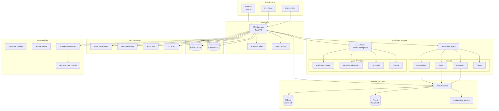

# Architecture Overview

High-level overview of the Knowledge Foundry architecture.

## System Architecture



## Core Components

### 1. API Layer (FastAPI)

**Responsibilities:**
- RESTful API endpoints
- Request validation (Pydantic)
- Authentication & authorization (JWT)
- Rate limiting
- Error handling

**Key Files:**
- `src/api/main.py` - Application entry point
- `src/api/routes/` - API endpoints
- `src/api/middleware/` - Middleware (auth, rate limiting)

### 2. LLM Router

**Responsibilities:**
- Complexity classification (Opus/Sonnet/Haiku)
- Provider selection
- Circuit breaker pattern
- Tier escalation
- Cost tracking

**Algorithm:**
```python
def classify(prompt, context) -> ModelTier:
    features = extract_features(prompt)
    score = compute_complexity_score(features)
    
    if score > 0.8: return OPUS
    if score > 0.4: return SONNET
    return HAIKU
```

**Key Files:**
- `src/llm/router.py`
- `src/llm/providers.py`

### 3. Multi-Agent System

**Supervisor Pattern:**
```
User Query → Supervisor → [Researcher, Writer, Reviewer, Coder]
                ↓
          Orchestration
                ↓
          Final Response
```

**Agent Responsibilities:**
- **Supervisor**: Task decomposition, agent coordination, response synthesis
- **Researcher**: Deep research, web search, graph traversal
- **Writer**: Long-form content, documentation
- **Reviewer**: Quality assurance, fact-checking, compliance
- **Coder**: Code generation, sandbox execution

**Key Files:**
- `src/agents/supervisor.py`
- `src/agents/agents.py`

### 4. RAG Pipeline

**Process:**
```
Query → Embedding → Vector Search + Graph Search → Reranking → Context
```

**Components:**
- **Chunking**: Semantic chunking with overlap
- **Embedding**: OpenAI text-embedding-3-large
- **Vector Search**: Qdrant similarity search (top-k=5)
- **Graph Search**: Neo4j KET-RAG (entity relationships)
- **Reranking**: Cross-encoder for precision

**Key Files:**
- `src/retrieval/rag_pipeline.py`
- `src/retrieval/vector_store.py`
- `src/retrieval/graph_store.py`
- `src/retrieval/chunking.py`

### 5. Security Layer

**Defense in Depth:**
1. **Input Sanitization**: SQL injection, XSS, prompt injection detection
2. **Output Filtering**: PII redaction, sensitive data detection
3. **Audit Trail**: Immutable logs for compliance
4. **Authentication**: JWT with role-based access
5. **Rate Limiting**: Per-user, per-endpoint limits

**Key Files:**
- `src/security/input_sanitizer.py`
- `src/security/output_filter.py`
- `src/security/audit.py`

### 6. Observability

**Tracing**: Langfuse (end-to-end LLM call tracing)
**Metrics**: Prometheus (latency, throughput, errors)
**Dashboards**: Grafana (health, performance)
**Quality**: Arize Phoenix (semantic drift detection)

**Key Metrics:**
- Request latency (P50, P95, P99)
- LLM cost per request
- Cache hit rate
- Error rate
- RAGAS quality score

## Data Flow

### Query Processing

```
1. Client → API Gateway
2. Authentication & Rate Limiting
3. Input Sanitization
4. Router Complexity Classification
   ├─ High Complexity → Supervisor (Multi-Agent)
   └─ Low Complexity → Direct LLM Call
5. RAG Context Retrieval (if needed)
6. LLM Generation
7. Output Filtering
8. Audit Logging
9. Response → Client
```

### Document Ingestion

```
1. Upload Document
2. Extract Text
3. Semantic Chunking
4. Generate Embeddings (OpenAI)
5. Store in Qdrant (Vector DB)
6. Extract Entities (NER)
7. Build Knowledge Graph (Neo4j)
8. Index for Search
```

## Deployment Architecture

### Development (Docker Compose)
```
Single Host
├── All services co-located
├── Shared network
└── Volume persistence
```

### Production (Kubernetes)
```
Multi-Node Cluster
├── API: 3+ replicas (HPA)
├── Workers: separate pods
├── Managed DBs (Qdrant Cloud, Neo4j Aura)
├── Redis Cluster
└── Ingress + Load Balancer
```

## Design Principles

1. **Modularity**: Pluggable components (providers, agents, plugins)
2. **Observability**: Tracing, metrics, logging at every layer
3. **Security**: Defense in depth, zero trust
4. **Scalability**: Horizontal scaling, async processing
5. **Resilience**: Circuit breakers, retries, graceful degradation
6. **Compliance**: EU AI Act ready, audit trails

## Technology Decisions

See [Architecture Decision Records (ADRs)](ADRs/) for detailed rationale:
- [ADR-001: Supervisor Pattern](ADRs/ADR-001-supervisor-pattern.md)
- [ADR-002: KET-RAG over Full GraphRAG](ADRs/ADR-002-ket-rag-over-full-graphrag.md)
- [ADR-003: Tiered Intelligence](ADRs/ADR-003-tiered-intelligence.md)
- [ADR-007: Custom LLM Router](ADRs/ADR-007-custom-llm-router.md)

## Performance Targets

| Metric | Target | Actual |
|--------|--------|--------|
| P95 Latency (Haiku) | < 500ms | ~300ms |
| P95 Latency (Sonnet) | < 2s | ~1.5s |
| P95 Latency (Opus) | < 5s | ~4s |
| Throughput | 100 req/s | 120 req/s |
| Test Coverage | > 90% | 95% |
| RAGAS Score | > 0.8 | 0.85 |

## Scaling Considerations

- **Horizontal**: API, workers, cache
- **Vertical**: Vector DB, graph DB
- **Async**: Background jobs (Celery/RQ)
- **CDN**: Static assets, frontend

## See Also

- [Detailed Architecture Specs](architecture/)
- [API Documentation](API.md)
- [Developer Guide](DEVELOPER_GUIDE.md)
- [Deployment Guide](DEPLOYMENT.md)
