# Red-Green-Refactor Testing Workflow

## Overview

Test-Driven Development (TDD) workflow for Knowledge Foundry. Write failing tests first (RED), make them pass (GREEN), then improve code (REFACTOR).

## The Cycle

```mermaid
graph LR
    A[🔴 RED: Write failing test] --> B[🟢 GREEN: Make it pass]
    B --> C[🔵 REFACTOR: Improve code]
    C --> D[🟢 Tests still pass?]
    D -->|Yes| E[✅ Done]
    D -->|No| B
    E --> A
```



## 1. RED: Write Failing Test First

### Example: New Feature Request

**Requirement:** "Add confidence threshold filter to query API"

**Step 1: Write the test BEFORE implementing**

```python
# tests/unit/test_api_new_feature.py
import pytest
from src.api.main import app
from fastapi.testclient import client

client = TestClient(app)

def test_query_with_confidence_threshold():
    """RED TEST: This will fail because feature doesn't exist yet"""
    response = client.post(
        "/api/v1/query",
        json={
            "query": "test",
            "min_confidence": 0.8  # NEW PARAMETER
        }
    )
    assert response.status_code == 200
    data = response.json()
    
    # Should only return if confidence >= 0.8
    assert data["confidence"] >= 0.8


def test_query_below_threshold_returns_error():
    """RED TEST: Should gracefully handle low confidence"""
    # Mock LLM to return low confidence
    response = client.post(
        "/api/v1/query",
        json={
            "query": "ambiguous question",
            "min_confidence": 0.9
        }
    )
    assert response.status_code == 200
    assert "warning" in response.json()
```

**Step 2: Run the test - it should FAIL**

```bash
pytest tests/unit/test_api_new_feature.py -v
# ❌ FAIL: KeyError: 'min_confidence' not recognized
```

✅ **RED achieved!** Test is failing as expected.

## 2. GREEN: Make Test Pass (Minimum Code)

**Step 3: Implement JUST enough to pass**

```python
# src/api/schemas.py
class QueryRequest(BaseModel):
    query: str
    min_confidence: float | None = None  # ADD NEW FIELD


# src/api/routes.py
@router.post("/query")
async def query(request: QueryRequest):
    result = await llm_router.route(request.query)
    
    # ADD CONFIDENCE CHECK
    if request.min_confidence is not None:
        if result.confidence < request.min_confidence:
            return {
                "text": result.text,
                "confidence": result.confidence,
                "warning": f"Confidence {result.confidence} below threshold {request.min_confidence}"
            }
    
    return {
        "text": result.text,
        "confidence": result.confidence,
        ...
    }
```

**Step 4: Run test again - it should PASS**

```bash
pytest tests/unit/test_api_new_feature.py -v
# ✅ PASS: All 2 tests passing
```

✅ **GREEN achieved!** Tests pass with minimal implementation.

## 3. REFACTOR: Improve Code Quality

**Step 5: Clean up without changing behavior**

```python
# src/api/routes.py (REFACTORED)
@router.post("/query")
async def query(request: QueryRequest):
    result = await llm_router.route(request.query)
    
    response = {
        "text": result.text,
        "confidence": result.confidence,
        "model": result.model,
        ...
    }
    
    # Extract to helper function
    if not _meets_confidence_threshold(result.confidence, request.min_confidence):
        response["warning"] = _create_confidence_warning(
            result.confidence,
            request.min_confidence
        )
    
    return response


def _meets_confidence_threshold(
    actual: float,
    minimum: float | None
) -> bool:
    """Check if confidence meets threshold. None = always pass."""
    return minimum is None or actual >= minimum


def _create_confidence_warning(actual: float, minimum: float) -> str:
    """Generate user-friendly warning message."""
    return (
        f"Answer confidence ({actual:.0%}) is below your "
        f"threshold ({minimum:.0%}). Consider reviewing carefully."
    )
```

**Step 6: Run tests again - still PASS**

```bash
pytest tests/unit/test_api_new_feature.py -v
# ✅ PASS: All 2 tests passing (refactor successful)
```

## UI Testing with Red-Green-Refactor

### RED: Write Playwright Test

```typescript
// frontend/e2e/confidence-filter.spec.ts
import { test, expect } from "@playwright/test";

test("user can set confidence threshold", async ({ page }) => {
    // RED: This will fail because UI doesn't have the feature yet
    await page.goto("/");
    
    // Open advanced options
    await page.locator(".advanced-toggle").click();
    
    // NEW CONTROL (doesn't exist yet)
    const slider = page.locator("#confidence-slider");
    await expect(slider).toBeVisible();
    
    // Set threshold to 80%
    await slider.fill("0.8");
    
    // Send query
    await page.locator("#query-input").fill("test query");
    await page.locator("#send-btn").click();
    
    // Verify warning shows if below threshold
    await expect(page.locator(".confidence-warning")).toBeVisible();
});
```

**Run test:**
```bash
npx playwright test e2e/confidence-filter.spec.ts
# ❌ FAIL: Locator '#confidence-slider' not found
```

### GREEN: Add UI Control

```tsx
// frontend/src/components/QueryInput.tsx
export default function QueryInput({ onSend }: Props) {
    const [minConfidence, setMinConfidence] = useState(0.5);
    
    return (
        <div className="advanced-panel">
            {/* ADD NEW CONTROL */}
            <div className="option-group">
                <label htmlFor="confidence-slider">
                    Min Confidence: {(minConfidence * 100).toFixed(0)}%
                </label>
                <input
                    id="confidence-slider"
                    type="range"
                    min="0"
                    max="1"
                    step="0.1"
                    value={minConfidence}
                    onChange={(e) => setMinConfidence(parseFloat(e.target.value))}
                />
            </div>
        </div>
    );
    
    // Pass to API
    const handleSend = () => {
        onSend(query, { ...options, min_confidence: minConfidence });
    };
}
```

**Run test:**
```bash
npx playwright test e2e/confidence-filter.spec.ts
# ✅ PASS: Control exists and works
```

### REFACTOR: Extract Component

```tsx
// frontend/src/components/ConfidenceSlider.tsx
export function ConfidenceSlider({ value, onChange }: Props) {
    return (
        <div className="confidence-slider">
            <label htmlFor="confidence-slider">
                Min Confidence: {(value * 100).toFixed(0)}%
            </label>
            <input
                id="confidence-slider"
                type="range"
                min="0"
                max="1"
                step="0.1"
                value={value}
                onChange={(e) => onChange(parseFloat(e.target.value))}
                aria-label="Minimum confidence threshold"
            />
            <div className="slider-labels">
                <span>0%</span>
                <span>50%</span>
                <span>100%</span>
            </div>
        </div>
    );
}
```

**Run test again:**
```bash
npx playwright test e2e/confidence-filter.spec.ts
# ✅ PASS: Still works after refactor
```

## Automated Red-Green-Refactor Script

### `scripts/tdd_workflow.sh`

```bash
#!/usr/bin/env bash
# TDD helper script

set -e

MODE=${1:-red}

case $MODE in
    red)
        echo "🔴 RED: Running tests (expect failures)..."
        pytest tests/unit/ -v --tb=short -x || echo "✓ Test failed as expected"
        ;;
    
    green)
        echo "🟢 GREEN: Running tests (expect passes)..."
        pytest tests/unit/ -v --tb=short
        ;;
    
    refactor)
        echo "🔵 REFACTOR: Running full test suite..."
        pytest tests/ -v --cov=src --cov-report=term
        echo "✓ All tests still pass"
        ;;
    
    watch)
        echo "👀 WATCH: Auto-running tests on file changes..."
        pytest-watch tests/unit/ -- -v
        ;;
    
    *)
        echo "Usage: $0 {red|green|refactor|watch}"
        exit 1
        ;;
esac
```

**Usage:**

```bash
# Step 1: Write test, expect failure
./scripts/tdd_workflow.sh red

# Step 2: Implement, expect pass
./scripts/tdd_workflow.sh green

# Step 3: Refactor, all tests pass + coverage
./scripts/tdd_workflow.sh refactor

# Or: Auto-run on changes
./scripts/tdd_workflow.sh watch
```

## Pre-commit Hook

Enforce RED-GREEN before committing:

```bash
# .git/hooks/pre-commit
#!/usr/bin/env bash

echo "🧪 Running tests before commit..."

if ! pytest tests/unit/ -q; then
    echo "❌ Tests failing! Fix before committing."
    exit 1
fi

if ! pytest tests/unit/ --cov=src --cov-fail-under=90 -q; then
    echo "❌ Coverage below 90%! Add more tests."
    exit 1
fi

echo "✅ All tests pass with good coverage"
```

## Red-Green-Refactor Checklist

Before starting a new feature:

- [ ] **RED**: Write failing test(s)
- [ ] Run test suite - verify failure
- [ ] **GREEN**: Write minimal code to pass
- [ ] Run test suite - verify pass
- [ ] **REFACTOR**: Improve code quality
  - [ ] Extract functions
  - [ ] Remove duplication
  - [ ] Add type hints
  - [ ] Improve naming
- [ ] Run test suite - still passing?
- [ ] Run full suite including E2E
- [ ] Commit with message: `test: add X feature (TDD)`

## Benefits

1. **Confidence**: Tests prove feature works
2. **Regression protection**: Future changes won't break this
3. **Documentation**: Tests show how to use the feature
4. **Design**: Writing tests first improves API design
5. **Coverage**: TDD naturally achieves high coverage

## Anti-Patterns to Avoid

❌ **Writing test after implementation**
- Defeats the purpose of TDD
- Test may just confirm what code does, not what it should do

❌ **Making tests too complex**
- Keep tests simple and focused
- One concept per test

❌ **Skipping refactor step**
- Code accumulates technical debt
- Always clean up after making tests pass

❌ **Testing implementation details**
- Test behavior, not internals
- Tests should survive refactoring

## Example: Full Bug Fix Cycle

**Bug Report:** "Query with empty string returns 500 error"

### 1. RED: Reproduce with test

```python
def test_empty_query_returns_400():
    """Bug fix: empty queries should return 400, not 500"""
    response = client.post("/api/v1/query", json={"query": ""})
    assert response.status_code == 400
    assert "query cannot be empty" in response.json()["detail"]
```

Run: ❌ FAIL (returns 500)

### 2. GREEN: Fix the bug

```python
@router.post("/query")
async def query(request: QueryRequest):
    if not request.query.strip():
        raise HTTPException(
            status_code=400,
            detail="Query cannot be empty"
        )
    ...
```

Run: ✅ PASS

### 3. REFACTOR: Add validation layer

```python
# src/api/validators.py
def validate_query_request(request: QueryRequest) -> None:
    if not request.query.strip():
        raise InvalidQueryError("Query cannot be empty")
    
    if len(request.query) > 10000:
        raise InvalidQueryError("Query too long (max 10000 chars)")


# src/api/routes.py
@router.post("/query")
async def query(request: QueryRequest):
    validate_query_request(request)  # Centralized validation
    ...
```

Run: ✅ PASS (cleaner code, same behavior)

## See Also

- [Testing Guide](TESTING.md)
- [E2E Testing](E2E_TESTING.md)
- [UI Automation Testing](UI_AUTOMATION_TESTING.md)
