# Phase 0.1 – Enterprise Architecture & Technology Decisions
## Knowledge Foundry: High Performer AI Factory

**Version**: 1.0 | **Date**: February 14, 2026 | **Status**: 📋 PROPOSED  
**Author**: Principal AI Architect | **Classification**: 🔐 CONFIDENTIAL

---

## 1. BUSINESS STRATEGY & OPERATING MODEL

### 1.1 Business Outcomes Definition

| Outcome | Target | Benchmark | Measurement |
|---------|--------|-----------|-------------|
| **EBIT Impact** | >5% EBIT contribution | Top 6% of AI orgs (McKinsey) | Quarterly financial report |
| **Adoption Scope** | Enterprise-wide, 5+ functions | High Performers deploy multi-function | Functions onboarded, active users |
| **MVP Timeline** | 10 weeks to production | 62% faster than traditional | Sprint velocity tracking |
| **First Revenue** | 4 months from kickoff | Subscription + API model | MRR dashboard |
| **ROI Achievement** | <12 months | 74% of High Performers achieve this | Cumulative value vs. cost |
| **Pilot Purgatory Exit** | Week 10 production deploy | >3 use cases in production | Deployment count |

**Exit Criteria for Pilot Purgatory:**
1. ≥3 production use cases actively serving users
2. Positive unit economics (revenue per query > cost per query)
3. >100 weekly active users across ≥2 business functions
4. RAGAS scores above quality gates for 4 consecutive weeks

### 1.2 AI Factory Operating Model

```
┌─────────────────────────────────────────────────────────────┐
│                  AI STEERING COMMITTEE                        │
│          (CTO, CDO, Legal, BU Heads) – Monthly               │
└──────────────────────┬──────────────────────────────────────┘
                       │
        ┌──────────────┼──────────────┐
        ▼              ▼              ▼
┌──────────────┐ ┌──────────┐ ┌─────────────────┐
│ CENTRAL      │ │ RISK     │ │ ETHICS & BIAS   │
│ PLATFORM     │ │ REVIEW   │ │ PANEL           │
│ TEAM (8-10)  │ │ BOARD    │ │ (Quarterly)     │
│              │ │ (Bi-wkly)│ │                 │
│ • Tech Lead  │ │          │ │ • Fairness      │
│ • 3 Backend  │ │ • Go/NoGo│ │ • Impact assess │
│ • 2 ML Eng   │ │ • Risk   │ │ • Societal      │
│ • 1 Security │ │   tiers  │ │   review        │
│ • 1 DevOps   │ │          │ │                 │
│ • 1 QA       │ │          │ │                 │
└──────┬───────┘ └──────────┘ └─────────────────┘
       │
       ▼ "Paved Road" Components
┌─────────────────────────────────────────────────┐
│  Shared: LLM Router, Vector DB, Graph DB,       │
│  Auth, Audit Logs, RAGAS Pipeline, Plugins SDK  │
└──────────────────┬──────────────────────────────┘
                   │
    ┌──────────────┼──────────────┐
    ▼              ▼              ▼
┌─────────┐  ┌─────────┐  ┌─────────┐
│ BU Team │  │ BU Team │  │ BU Team │
│ Alpha   │  │ Beta    │  │ Gamma   │
│ (Legal) │  │ (Sales) │  │ (Ops)   │
└─────────┘  └─────────┘  └─────────┘
```

**Governance – Human Approvals vs. Automated Gates:**

| Decision Type | Approval Path | SLA |
|--------------|---------------|-----|
| New LLM model deployment | Risk Review Board (High-risk) | 5 business days |
| Prompt template changes | Automated RAGAS regression test | <1 hour CI/CD |
| New plugin activation | Security scan + Tech Lead review | 2 business days |
| Configuration change (low-risk) | Automated validation + deploy | Minutes |
| Configuration change (high-risk) | Risk Review Board | 3 business days |
| Production incident response | On-call engineer (automated alert) | 15 min initial |
| EU AI Act documentation update | Auto-generated, legal quarterly review | Continuous |

---

## 2. AGENTIC ARCHITECTURE DESIGN

### 2.1 Orchestration Pattern Selection

#### Primary: Supervisor (Router) Pattern

**When to use:** Default for all multi-domain enterprise queries.


- **Delegation Logic:** Supervisor classifies intent via Haiku (cost: $0.25/1M tokens, <100ms), then routes to specialist agents. Multi-intent queries invoke multiple specialists in parallel.
- **Aggregation Strategy:** Supervisor collects specialist outputs, deduplicates citations, resolves contradictions via confidence scoring, and synthesizes final response using Sonnet.
- **Failure Handling:** If specialist fails (timeout/error), Supervisor retries once with extended context, then escalates to Opus for fallback reasoning. If Opus fails, returns partial answer with "incomplete" marker and logs for review.

#### Secondary: Hierarchical Pattern (Manager → Leads → Workers)

**When to use:** Large-context, multi-document analysis (>50 documents).

- **Span of control:** 1 Manager → 3-5 Leads → 2-4 Workers each
- **Information flow:** Manager decomposes into sub-tasks, each Lead gets only relevant context partition, Workers process individual chunks
- **Use case:** Annual report analysis, multi-regulation compliance review, large codebase audits

#### Tertiary: Utility-Aware Negotiation (Phase 3)

**When to use:** Conflicting objectives (e.g., Risk Agent ↔ Growth Agent).

- **Negotiation protocol:** Agents submit bids with utility scores; Pareto-optimal allocation selected
- **Example:** Risk Agent flags "high-risk content" vs. Growth Agent says "critical insight" → utility maximization decides

### 2.2 Agent Persona Specifications

#### Supervisor Agent

| Attribute | Specification |
|-----------|--------------|
| **Mission** | Route queries to optimal specialists and synthesize coherent, cited responses |
| **Input Schema** | `{query: str, conversation_id: UUID, user_context: UserContext, metadata: QueryMetadata}` |
| **Output Schema** | `{response: str, citations: Citation[], confidence: float, agents_invoked: str[], cost: float, latency_ms: int}` |
| **Core Capabilities** | Intent classification, task decomposition, output synthesis, conflict resolution |
| **Permissions** | Read all agent outputs; Cannot modify data; Cannot invoke tools directly |
| **Escalation Triggers** | Confidence <0.6, contradictory specialist outputs, flagged by Safety Agent |
| **Failure Modes** | Misrouting (wrong specialist), over-decomposition (excessive latency), under-synthesis (incoherent output) |
| **Success Metrics** | Routing accuracy >95%, synthesis coherence >0.9 (DeepEval), p95 latency <500ms |

#### Researcher Agent

| Attribute | Specification |
|-----------|--------------|
| **Mission** | Retrieve and rank relevant knowledge from vector and graph stores |
| **Input Schema** | `{query: str, search_scope: SearchScope, max_results: int, filters: FilterSet}` |
| **Output Schema** | `{chunks: RankedChunk[], graph_paths: GraphPath[], confidence: float, retrieval_strategy: str}` |
| **Core Capabilities** | Vector search, graph traversal, re-ranking, multi-hop reasoning |
| **Permissions** | Read-only access to vector DB + graph DB; No external API calls |
| **Escalation Triggers** | Context recall <0.7, no relevant results, ambiguous query |
| **Failure Modes** | Low recall (missed documents), low precision (irrelevant results), graph traversal loops |
| **Success Metrics** | Context precision >0.9, context recall >0.85, retrieval latency <200ms |

#### Coder Agent

| Attribute | Specification |
|-----------|--------------|
| **Mission** | Generate, review, and explain code artifacts with full type safety |
| **Input Schema** | `{task: CodeTask, language: str, constraints: CodeConstraints, context: CodeContext}` |
| **Output Schema** | `{code: str, tests: str, documentation: str, security_review: SecurityFinding[], confidence: float}` |
| **Core Capabilities** | Code generation, test generation, code review, refactoring, documentation |
| **Permissions** | Read codebase; Generate files; Cannot deploy or execute code |
| **Escalation Triggers** | Security vulnerability detected, complex architecture decision, >500 LoC change |
| **Failure Modes** | Type errors, missing tests, security vulnerabilities, non-idiomatic patterns |
| **Success Metrics** | Test pass rate >98%, type-check pass (mypy --strict), security scan clean (bandit) |

#### Safety Agent

| Attribute | Specification |
|-----------|--------------|
| **Mission** | Validate all outputs for security, compliance, and content safety before user delivery |
| **Input Schema** | `{content: str, content_type: ContentType, source_agents: str[], user_context: UserContext}` |
| **Output Schema** | `{approved: bool, findings: SafetyFinding[], risk_level: RiskLevel, modifications: Modification[]}` |
| **Core Capabilities** | Prompt injection detection, PII scanning, system prompt leak detection, EU AI Act compliance check |
| **Permissions** | Read all agent outputs; Can BLOCK delivery; Cannot modify content (only flag) |
| **Escalation Triggers** | PII detected, prompt injection pattern found, compliance violation |
| **Failure Modes** | False positives (blocking legitimate content), false negatives (missing threats) |
| **Success Metrics** | Detection rate >99%, false positive rate <2%, latency overhead <50ms |

#### Compliance Agent

| Attribute | Specification |
|-----------|--------------|
| **Mission** | Ensure all system operations comply with EU AI Act and internal governance policies |
| **Input Schema** | `{operation: OperationLog, agent_chain: AgentChain[], output: AgentOutput}` |
| **Output Schema** | `{compliant: bool, violations: Violation[], required_documentation: DocRequirement[], audit_entry: AuditEntry}` |
| **Core Capabilities** | Compliance rule evaluation, audit log generation, documentation requirement detection |
| **Permissions** | Read all logs; Write audit entries; Cannot modify agent behavior |
| **Escalation Triggers** | High-risk decision detected, missing documentation, HITL required |
| **Failure Modes** | Regulatory interpretation errors, incomplete audit trails |
| **Success Metrics** | Compliance accuracy >99.5%, audit trail completeness 100%, zero regulatory findings |

### 2.3 Agent Interaction Protocols

**Communication Format:**
```json
{
  "message_id": "uuid-v4",
  "from_agent": "supervisor",
  "to_agent": "researcher",
  "timestamp": "2026-02-14T00:00:00Z",
  "message_type": "task_request | task_response | error | escalation",
  "payload": {
    "task": "...",
    "context": "...",
    "constraints": "..."
  },
  "trace_id": "langfuse-trace-id",
  "parent_span_id": "langfuse-span-id"
}
```

**State Management:**
- Conversation state persisted in Redis (TTL: 24h for active sessions)
- Long-term memory in PostgreSQL (conversation summaries, user preferences)
- Agent scratchpad in LangGraph state (per-invocation, checkpointed)

**Checkpointing:**
- LangGraph checkpoints after every agent invocation
- Recovery: on agent failure, replay from last checkpoint (target: <1s recovery)
- State integrity verified via hash comparison pre/post recovery

**Conflict Resolution:**
1. Confidence-weighted voting (highest confidence agent wins)
2. If tied: Supervisor invokes Opus for adjudication
3. If unresolvable: return both perspectives with confidence scores to user

---

## 3. RETRIEVAL ARCHITECTURE (VECTOR + GRAPH)

### 3.1 Architecture Comparison Matrix

| Dimension | Plain Vector RAG | Full GraphRAG | Hybrid VectorCypher | KET-RAG (Skeleton) |
|-----------|-----------------|---------------|--------------------|--------------------|
| **Indexing Cost (5GB)** | ~$500 | ~$33,000 | ~$5,000 | ~$3,300 |
| **Query Cost** | Low | High | Medium | Medium-Low |
| **Multi-hop Accuracy** | 40-60% | 85-95% | 80-90% | 75-85% |
| **Complexity** | Low | Very High | High | Medium-High |
| **Latency (p95)** | <100ms | <800ms | <400ms | <300ms |
| **Scalability** | Excellent | Poor | Good | Good |
| **Maintenance** | Minimal | Heavy | Moderate | Moderate |

> [!IMPORTANT]
> **Recommendation: KET-RAG (Skeleton Graph) as primary, with VectorCypher fallback for critical domains.** KET-RAG provides 10x cost reduction over full GraphRAG while retaining 75-85% multi-hop accuracy. For domains requiring >90% accuracy (regulated content, financial data), selectively upgrade to VectorCypher with full graph coverage. See [ADR-002](file:///Users/mukundajmera/pocs/Knowledge%20Foundry/docs/ADRs/ADR-002-ket-rag-over-full-graphrag.md).

### 3.2 Data Model & Indexing Strategy

**Document Types:**

| Type | Preprocessing | Chunking Strategy | Chunk Size | Metadata |
|------|--------------|-------------------|------------|----------|
| PDFs | PyPDF2 + OCR fallback | Semantic (heading-aware) | 500-1000 tokens | title, page, section, author |
| Knowledge Articles | HTML→Markdown | Recursive character | 800 tokens | category, tags, last_updated |
| Support Tickets | Structured extraction | Per-ticket (title + body) | Full ticket | priority, resolution, product |
| Code Files | Language-aware parsing | AST-based (function/class) | Per function | language, repo, path |
| Policies/Specs | Section extraction | Heading-based hierarchy | 600 tokens | regulation, version, effective_date |

**Knowledge Graph Schema:**


**Entity Types:** Customer, Product, Feature, Team, Person, Document, Technology, Process, Regulation, Requirement

**Relationship Types:** USES, DEPENDS_ON, COMPLIES_WITH, OWNS, AUTHORED_BY, REFERENCES, CONTAINS, REPORTED, EXECUTED_BY, MUST_COMPLY_WITH

**Skeleton Construction Strategy:**
- **Central document identification:** PageRank on citation graph + manual curation for regulatory docs
- **Target coverage:** 20% central documents → full graph entities + relationships; 80% peripheral → vector-only with metadata tags
- **Re-indexing triggers:** New regulation published, >10% new documents added, monthly scheduled refresh
- **Quality check:** Automated validation that skeleton covers >90% of entity types in the schema

### 3.3 Multi-Hop Query Flow

**Example Query:** *"How do EU interest rate changes impact our flagship product supply chain?"*

```mermaid
sequenceDiagram
    participant U as User
    participant S as Supervisor
    participant R as Researcher
    participant V as Qdrant (Vector)
    participant G as Neo4j (Graph)
    participant L as LLM (Sonnet)
    participant SA as Safety Agent

    U->>S: Query
    S->>S: Intent classification (Haiku, <100ms)
    S->>R: task_request(multi-hop analysis)
    
    R->>V: Semantic search: "EU interest rate supply chain"
    V-->>R: Top-10 chunks (confidence-ranked)
    
    R->>G: Map chunks → Graph entities
    Note over G: Entry nodes: EU_REGULATION, INTEREST_RATE
    
    R->>G: Cypher: MATCH path 2-3 hops
    Note over G: EU_REGULATION→COMPLIES_WITH→PRODUCT<br/>PRODUCT→DEPENDS_ON→SUPPLIER<br/>SUPPLIER→USES→RAW_MATERIAL
    G-->>R: Traversal paths + relationship context
    
    R->>R: Assemble context (chunks + graph structure)
    R-->>S: RankedChunks + GraphPaths (confidence: 0.87)
    
    S->>L: Synthesize answer (structured prompt)
    L-->>S: Response with inline citations
    
    S->>SA: Validate output
    SA-->>S: approved: true
    
    S-->>U: Final answer with citations + confidence
    
    Note over S: Log: trace_id, agent_chain,<br/>latency, cost, RAGAS scores
```



**Step Details:**

1. **Query Understanding:** Haiku classifies intent as `multi-hop-analysis`, extracts entities: `[EU, interest rate, flagship product, supply chain]`
2. **Vector Entry Search:** Qdrant semantic search returns top-10 chunks about EU regulations and supply chain impacts
3. **Graph Entry Nodes:** Chunk metadata maps to Neo4j entities: `EU_Regulation`, `Interest_Rate_Policy`, `Flagship_Product`
4. **Graph Traversal:** Cypher query with 2-3 hops, filtered by relationship types: `COMPLIES_WITH`, `DEPENDS_ON`, `USES`
5. **Context Assembly:** Chunks ordered by relevance + graph paths serialized as structured context with provenance markers
6. **LLM Synthesis:** Sonnet generates response with `<citation source="doc_id:chunk_id">` inline markers
7. **Faithfulness Check:** Every claim cross-referenced against source chunks; claims without citations flagged for removal
8. **Logging:** Full trace captured: `{trace_id, query, chunks_retrieved, graph_paths, response, ragas_scores, latency_ms, cost_usd}`

### 3.4 Retrieval Quality Metrics

| Metric | Target | Measurement Method | Frequency |
|--------|--------|-------------------|-----------|
| **Context Precision** | >0.9 | RAGAS: proportion of relevant chunks in top-k | Every query (sampled 10%) |
| **Context Recall** | >0.85 | RAGAS: proportion of relevant info retrieved | Golden dataset (weekly) |
| **Answer Faithfulness** | >0.95 | RAGAS: claims supported by retrieved context | Every query (sampled 10%) |
| **Multi-Hop Accuracy** | >80% | Custom: correct traversal path vs. ground truth | Golden dataset (weekly) |
| **Answer Relevancy** | >0.9 | RAGAS: response addresses the question | Every query (sampled 10%) |

**Golden Dataset Construction:**
- 200 queries across 5 complexity tiers (simple lookup → 3-hop multi-domain)
- 40 queries per tier, each with annotated ground truth (correct answer + source documents)
- Maintained by domain experts, refreshed quarterly
- Version-controlled in `tests/evaluation/golden_dataset/`

---

## 4. TIERED INTELLIGENCE & MODEL ROUTING

### 4.1 Task Classification & Routing Policy

| Task Category | Examples | Model Tier | Rationale | Fallback |
|--------------|----------|------------|-----------|----------|
| Architecture design | System design, ADRs, threat modeling | **Strategist (Opus)** | Deep reasoning, Tree-of-Thought | Human escalation |
| Complex reasoning | Multi-step analysis, legal interpretation | **Strategist (Opus)** | Multi-hop, nuanced judgment | Human escalation |
| Multi-hop graph queries | Cross-domain regulatory impact | **Strategist (Opus)** | Requires graph path reasoning | Sonnet + validation |
| Standard coding | CRUD endpoints, tests, migrations | **Workhorse (Sonnet)** | Proven capability, cost-effective | Opus for complex |
| Documentation | Docstrings, READMEs, changelogs | **Workhorse (Sonnet)** | High quality output at scale | Haiku for formatting |
| Standard RAG queries | Single-domain knowledge retrieval | **Workhorse (Sonnet)** | Good quality, low cost | Opus if uncertain |
| Query classification | Intent detection, routing | **Sprinter (Haiku)** | <100ms latency, deterministic | Sonnet if uncertain |
| Entity extraction | Structured data parsing, NER | **Sprinter (Haiku)** | Pattern matching at scale | Sonnet if complex |
| Content formatting | Markdown rendering, code formatting | **Sprinter (Haiku)** | Deterministic transformation | N/A |
| PII detection | Input/output scanning | **Sprinter (Haiku)** | High throughput, pattern-based | Sonnet + regex |

### 4.2 Complexity Estimation Strategy

```mermaid
graph LR
    Q[Query] --> H[Haiku Classifier]
    H -->|"complexity_score"| R{Router}
    R -->|"score < 0.3"| HAIKU[Haiku<br/>$0.25/1M]
    R -->|"0.3 ≤ score < 0.7"| SONNET[Sonnet<br/>$3/1M]
    R -->|"score ≥ 0.7"| OPUS[Opus<br/>$15/1M]
    
    HAIKU -->|"confidence < 0.7"| SONNET
    SONNET -->|"confidence < 0.6"| OPUS
```



**Heuristic Features:**
- Token count (queries >500 tokens → escalate)
- Keyword density (regulatory terms, multi-hop indicators → escalate)
- Structural complexity (nested conditions, temporal reasoning → escalate)

**Semantic Classification:**
- Haiku-based classifier trained on 10K labeled task→tier pairs
- Classification latency: <50ms (added to query overhead)
- Retrained monthly on accumulated routing decision outcomes

**Confidence Thresholds:**
- Haiku output confidence <0.7 → re-route to Sonnet
- Sonnet output confidence <0.6 → re-route to Opus
- Opus output confidence <0.5 → flag for human review

### 4.3 Cost & Performance Targets

| Tier | Cost/1M Tokens | p50 Latency | p95 Latency | p99 Latency | Min Quality | Distribution Target |
|------|---------------|-------------|-------------|-------------|-------------|-------------------|
| **Opus (Strategist)** | $15.00 | 2s | 5s | 8s | 0.95 (RAGAS) | 10% of queries |
| **Sonnet (Workhorse)** | $3.00 | 800ms | 2s | 4s | 0.85 (RAGAS) | 70% of queries |
| **Haiku (Sprinter)** | $0.25 | 100ms | 300ms | 500ms | 0.75 (classification accuracy) | 20% of queries |

**Blended Cost Target:** <$0.10 per query

**Blended Cost Calculation:**
```
Blended = (10% × $15 × avg_tokens) + (70% × $3 × avg_tokens) + (20% × $0.25 × avg_tokens)
        = weighted average ≈ $0.08-0.09 per query at 2K avg tokens
```

**Savings vs. All-Opus:** ~60% cost reduction (from ~$0.24/query to ~$0.09/query)

### 4.4 Observability & Optimization

**Per-model tracking (Langfuse):**
- Latency (p50, p95, p99), cost per query, error rate, user satisfaction (thumbs up/down)
- Routing decision log: `{query_hash, complexity_score, selected_tier, actual_quality, cost_usd}`

**Escalation tracking:**
- Haiku → Sonnet escalation rate (target: <15%)
- Sonnet → Opus escalation rate (target: <5%)
- Alert if escalation rates exceed thresholds (indicates classifier drift)

**Cost anomaly detection:**
- Daily cost rolling average, alert if >150% of 7-day average
- Per-tenant cost tracking for enterprise billing

**Optimization feedback loop:**
- Monthly: retrain complexity classifier on new routing decision outcomes
- Quarterly: analyze escalation patterns, adjust confidence thresholds
- Continuous: A/B test routing policy changes on 5% of traffic

---

## 5. COMPLIANCE, SECURITY & GOVERNANCE

### 5.1 EU AI Act Classification & Requirements

**System Classification: HIGH-RISK AI SYSTEM**

Knowledge Foundry qualifies as high-risk under EU AI Act Article 6 when deployed for:
- **Employment decisions** (knowledge retrieval for HR processes)
- **Access to essential services** (customer support, financial advisory)
- **Law enforcement support** (regulatory compliance analysis)

**Mandatory Compliance Controls:**

#### Technical Documentation (Article 11)

| Requirement | Implementation | Update Trigger |
|-------------|---------------|----------------|
| Model purpose & capabilities | Auto-generated from model card templates | Every model deployment |
| Training data description | MLflow experiment metadata export | Every fine-tuning run |
| Decision logic explanation | Agent chain logging with reasoning traces | Every architecture change |
| Bias testing results | Automated fairness evaluation pipeline | Monthly + every data refresh |
| Performance metrics | RAGAS scores + latency + cost tracked in Langfuse | Continuous |

**Storage:** Versioned in Git (documentation) + Langfuse (metrics) + S3 WORM (immutable archive)

#### Automatic Logging (Article 12)

**Log Schema:**
```json
{
  "log_id": "uuid-v4",
  "timestamp": "ISO-8601",
  "trace_id": "langfuse-trace-id",
  "user_id": "hashed-uuid",
  "query": "sanitized-input",
  "response": "full-output",
  "model_version": "claude-sonnet-3.5-20260201",
  "agent_chain": ["supervisor", "researcher", "safety"],
  "config_snapshot": {"router_version": "1.2", "prompt_version": "3.1"},
  "ragas_scores": {"precision": 0.92, "faithfulness": 0.97},
  "cost_usd": 0.08,
  "latency_ms": 450
}
```

- **Format:** JSON Lines → S3 WORM (Write-Once-Read-Many)
- **Retention:** 7 years (legal requirement)
- **Immutability:** AWS S3 Object Lock in Compliance mode
- **Access:** Read-only for auditors via dedicated IAM role

#### Human-in-the-Loop (Article 14)

| Workflow | HITL Requirement | Designated Role | Override Mechanism |
|----------|-----------------|------------------|-------------------|
| High-confidence threshold breach (<0.5) | Mandatory review before delivery | AI Governance Officer | Approve, reject, or modify |
| PII detected in output | Mandatory redaction review | Domain Expert | Strip PII + approve |
| New model deployment | Pre-deployment validation | CTO + Tech Lead | Sign-off checklist |
| Prompt template change | Regression test review | Tech Lead | RAGAS score comparison |
| Compliance violation flagged | Incident review | AI Governance Officer | Remediation plan |

**HITL Effectiveness Measurement:**
- Override rate (target: <5% of flagged items overridden)
- Review latency (target: <2 hours for high-priority flags)
- Post-override quality (track RAGAS on human-edited outputs)

#### Post-Market Monitoring

- **Monthly:** RAGAS score trends, cost trends, user complaint analysis
- **Quarterly:** Comprehensive bias audit, model performance review, compliance report
- **Incident-based:** Within 24h of any compliance violation or security incident
- **Regulator reporting:** Annual report + immediate notification for serious incidents

**Penalty Avoidance:** €15M or 3% global turnover → compliance architecture estimated cost: $50K/year (tooling + personnel)

### 5.2 Governance Architecture

**Configuration Governance – Risk Tiers:**

| Change Type | Risk Tier | Approval | Example |
|-------------|-----------|----------|---------|
| Prompt formatting tweak | **Low** | Automated CI/CD (RAGAS regression) | Adjust citation format |
| LLM model version update | **High** | Risk Review Board + RAGAS A/B test | Sonnet 3.5 → 3.6 |
| New agent activation | **High** | Security scan + TL review + staging | Deploy new Analyst agent |
| Routing threshold change | **Medium** | Tech Lead review + canary deploy | Adjust Haiku→Sonnet threshold |
| New data source integration | **Medium** | Data governance + security review | Connect Salesforce CRM |
| Graph schema modification | **High** | Architecture review + migration plan | Add new entity type |

**Change Logging:** All configuration changes tracked in immutable audit log with: `{change_id, timestamp, author, change_type, risk_tier, approval_chain, before_state, after_state}`

### 5.3 Security Posture (OWASP 2026)

**Threat Model:**

| Adversary | High-Value Targets | Attack Vectors | Severity |
|-----------|-------------------|----------------|----------|
| External attacker | Regulated data, credentials | Prompt injection, API abuse | Critical |
| Malicious insider | System prompts, audit logs | Data exfiltration, log tampering | Critical |
| Accidental misuse | PII in outputs | Poorly formed queries | High |
| Supply chain | LLM provider compromise | Model poisoning, API hijack | Critical |

**Defensive Controls by Layer:**

```
┌─────────────────────────────────────────┐
│ INPUT LAYER                              │
│ • Pydantic validation (type + length)    │
│ • Regex: injection patterns              │
│ • Fuzzy match: obfuscated attacks        │
│ • Rate limiting (Redis token bucket)     │
│ • Per-user/tenant/endpoint quotas        │
├─────────────────────────────────────────┤
│ ORCHESTRATION LAYER                      │
│ • XML delimiters: <system>, <user>,      │
│   <context>, <tool_output>               │
│ • Spotlighting: provenance markers       │
│ • Least privilege per agent              │
│ • Agent output validation                │
├─────────────────────────────────────────┤
│ TOOL / PLUGIN LAYER                      │
│ • Explicit permission model              │
│ • Safety Agent validates tool calls      │
│ • Dry-run mode (simulate before exec)    │
│ • Sandboxed execution environment        │
├─────────────────────────────────────────┤
│ OUTPUT LAYER                             │
│ • System prompt leak detection           │
│ • PII scanning (regex + NER)             │
│ • Citation/source attribution required   │
│ • Confidence threshold enforcement       │
│ • Content safety classification          │
└─────────────────────────────────────────┘
```

**Continuous Security:**
- **CI/CD:** Garak vulnerability scan + NeMo Guardrails validation on every commit
- **Monthly:** Automated multi-persona red teaming (adversarial, benign failure, edge cases)
- **Quarterly:** Manual penetration testing by security team
- **Incident Response:** Detection (<5 min) → Containment (<15 min) → Remediation (<4h) → Postmortem (<48h)

---

## 6. EVALUATION & ROI FRAMEWORK

### 6.1 LLM Evaluation Stack


**Golden Dataset Management:**
- 200 queries, 5 tiers, version-controlled
- Refresh quarterly with domain expert review
- Regression detection: alert if any RAGAS metric drops >5% from baseline

### 6.2 Quality Gates & Deployment Criteria

| Gate | Checks | Blocking? | Automation |
|------|--------|-----------|------------|
| **Pre-Commit** | mypy --strict, ruff, black, bandit, garak, pytest --cov>90% | Yes | CI/CD |
| **Pre-Deploy** | RAGAS all metrics above thresholds | Yes | Automated evaluation |
| **Pre-Deploy** | Load test: 1000 users, p95 <500ms | Yes | k6 load test |
| **Pre-Deploy** | OWASP 2026 checklist | Yes | Garak + manual |
| **Pre-Deploy** | EU AI Act compliance validation | Yes | Automated + legal sign-off |
| **Production** | Real-time RAGAS (sampled), drift alerts | Alerting | Arize Phoenix |
| **Production** | Cost anomaly detection | Alerting | Langfuse + custom |
| **Production** | User satisfaction (thumbs up/down) | Dashboard | Custom analytics |

### 6.3 AI P&L & ROI Measurement

**Cost Accounting:**

| Cost Category | 100 Users/month | 1000 Users/month |
|--------------|-----------------|-------------------|
| **Compute** (API servers, workers) | $2,000 | $12,000 |
| **PostgreSQL** (Multi-AZ, RDS) | $400 | $2,000 |
| **Qdrant** (Vector DB) | $500 | $3,000 |
| **Neo4j** (Graph DB) | $400 | $2,000 |
| **S3 + Redis** (Storage + Cache) | $300 | $1,500 |
| **LLM API** (Tiered) | $900 | $9,000 |
| **Observability** (Langfuse, Phoenix) | $200 | $500 |
| **TOTAL** | **$4,700** | **$30,000** |
| **Cost per query** | **~$0.09** | **~$0.09** |

**Value Attribution Framework:**

| Value Type | Metric | Measurement | Expected Impact |
|-----------|--------|-------------|-----------------|
| **Cost Reduction** | Research hours saved | Time tracking before/after | 60% reduction in enterprise search labor |
| **Cost Reduction** | License elimination | Legacy tool spend displaced | $200K/yr savings at 1000 users |
| **Productivity** | Output per employee | Tasks completed/week | +25% uplift |
| **Productivity** | Time-to-insight | Query → answer latency | Hours → seconds |
| **Revenue** | Conversion uplift | A/B test (with/without AI) | +5-10% conversion |
| **Revenue** | Churn reduction | Support resolution quality | -15% churn |
| **Strategic** | Knowledge graph moat | Proprietary data flywheel | Competitive advantage |
| **Strategic** | Reusable platform | New products enabled | Option value |

**ROI Target:**
```
ROI = (Value Generated - Total Cost) / Total Cost × 100%
Year 1 Target: >100% ROI (breakeven + positive return within 12 months)
```

**P&L Tracking:**
- Monthly: per-use-case P&L review
- Quarterly: business review with finance team
- "Zombie project" rule: negative unit economics for >2 quarters → sunset or pivot

---

## 7. DELIVERABLES

### 7.1 Architecture Diagram


**Failure Domains & Redundancy:**

| Component | Failure Domain | Redundancy | Recovery Time |
|-----------|---------------|------------|---------------|
| API Gateway | Single AZ | Multi-AZ deployment, auto-scaling | <30s failover |
| PostgreSQL | Database | Multi-AZ RDS, read replicas | <60s failover |
| Qdrant | Vector search | Clustered, shard replication | <30s failover |
| Neo4j | Graph queries | Primary + read replica | <120s failover |
| Redis | Cache/sessions | Redis Cluster, AOF persistence | <15s failover |
| LLM API | Provider outage | Multi-provider fallback (Anthropic → backup) | <5s failover |

### 7.2 Architecture Decision Records

See dedicated ADR files:
- [ADR-001: Supervisor Pattern for Multi-Agent Orchestration](file:///Users/mukundajmera/pocs/Knowledge%20Foundry/docs/ADRs/ADR-001-supervisor-pattern.md)
- [ADR-002: KET-RAG over Full GraphRAG](file:///Users/mukundajmera/pocs/Knowledge%20Foundry/docs/ADRs/ADR-002-ket-rag-over-full-graphrag.md)
- [ADR-003: Tiered Intelligence (Opus/Sonnet/Haiku)](file:///Users/mukundajmera/pocs/Knowledge%20Foundry/docs/ADRs/ADR-003-tiered-intelligence.md)
- [ADR-004: EU AI Act Compliance Architecture](file:///Users/mukundajmera/pocs/Knowledge%20Foundry/docs/ADRs/ADR-004-eu-ai-act-compliance.md)
- [ADR-005: OWASP 2026 Security Stack](file:///Users/mukundajmera/pocs/Knowledge%20Foundry/docs/ADRs/ADR-005-owasp-2026-security.md)
- [ADR-006: RAGAS as Quality Gate](file:///Users/mukundajmera/pocs/Knowledge%20Foundry/docs/ADRs/ADR-006-ragas-quality-gate.md)
- [ADR-007: Custom LLM Router over LiteLLM](file:///Users/mukundajmera/pocs/Knowledge%20Foundry/docs/ADRs/ADR-007-custom-llm-router.md)

### 7.3 Platform Capabilities Matrix

| Capability | MVP (Phase 1) | Phase 2 | Phase 3 | Priority | Rationale |
|------------|:---:|:---:|:---:|:---:|-----------|
| Vector Search (Qdrant) | ✅ | — | — | P0 | Core retrieval |
| Graph Traversal (Neo4j) | ✅ | — | — | P0 | Multi-hop reasoning |
| Supervisor Agent (LangGraph) | ✅ | — | — | P0 | Core orchestration |
| Tiered Intelligence Routing | ✅ | — | — | P0 | Cost efficiency |
| RAGAS Quality Gates | ✅ | — | — | P0 | Quality assurance |
| EU AI Act Logging | ✅ | — | — | P0 | Compliance (Aug 2026) |
| Safety Agent | ✅ | — | — | P0 | Security baseline |
| Custom LLM Router | ✅ | — | — | P0 | Performance at scale |
| Multi-tenant isolation | ✅ | — | — | P0 | Enterprise requirement |
| Plugin System (SDK) | — | ✅ | — | P1 | Extensibility |
| Hierarchical Agents | — | ✅ | — | P1 | Large-context analysis |
| Advanced Red Teaming | — | ✅ | — | P1 | Security hardening |
| A/B Testing Framework | — | ✅ | — | P1 | Continuous improvement |
| Utility-Aware Negotiation | — | — | ✅ | P2 | Advanced orchestration |
| Self-Healing (Auto-fix) | — | — | ✅ | P2 | Autonomous operations |
| Custom Model Fine-tuning | — | — | ✅ | P3 | Domain specialization |

### 7.4 Risk Register

| Risk ID | Risk Description | Prob. | Impact | Mitigation Strategy | Owner | Status |
|---------|------------------|:-----:|:------:|---------------------|-------|--------|
| RISK-001 | KET-RAG accuracy insufficient for multi-hop queries | Med | High | Fallback to full VectorCypher for critical domains; increase skeleton coverage from 20%→40% if needed (+$10K) | Tech Lead | Open |
| RISK-002 | EU AI Act compliance delays production launch | Low | Critical | Parallel compliance workstream from week 1; early legal review; phased compliance (logging first, full audit later) | CTO | Open |
| RISK-003 | LLM API costs exceed budget at scale | Med | High | Aggressive tiered routing; semantic caching (Redis); response caching for repeated queries; monthly cost review | Eng Manager | Open |
| RISK-004 | Security vulnerability exploited (prompt injection) | Med | Critical | Multi-layer defense (OWASP stack); automated scanning (Garak in CI/CD); monthly red teaming; bug bounty program | Security Lead | Open |
| RISK-005 | Anthropic API availability/latency degrades | Low | High | Multi-provider fallback capability; local model option for classification; circuit breaker pattern | Tech Lead | Open |
| RISK-006 | Graph DB (Neo4j) performance degrades at scale | Low | Med | Query optimization, caching frequent traversals, partitioning strategy; fallback to vector-only for non-critical | DBA | Open |
| RISK-007 | Talent shortage for ML/AI engineering | Med | Med | AI-native development (80% AI-generated code reduces human dependency); clear documentation; platform simplicity | Engineering Manager | Open |
| RISK-008 | Data quality issues degrade RAG accuracy | Med | High | Automated data quality checks in ingestion pipeline; RAGAS monitoring for drift; re-indexing triggers | Data Lead | Open |

### 7.5 Executive Summary

> **TO: CTO Office**  
> **RE: Knowledge Foundry — Go/No-Go Recommendation**  
> **DATE: February 14, 2026**

**Strategic Vision:** Knowledge Foundry positions us in the **top 6% of AI organizations** (McKinsey "High Performer" benchmark) by building a production-grade, agentic RAG platform that transforms enterprise knowledge management from additive AI (chatbot layer) to **workflow redesign** with measurable EBIT impact.

**Key Architectural Decisions:**
1. **Supervisor Pattern** for multi-agent orchestration (flexible, debuggable, production-proven)
2. **KET-RAG** skeleton graph (10x cheaper than full GraphRAG, retains multi-hop capability)
3. **Tiered Intelligence** routing (Opus/Sonnet/Haiku → 60% cost reduction at <$0.10/query)
4. **Compliance-as-Code** for EU AI Act (immutable logs, HITL gates, auto-documentation)

**Cost/Benefit Projection:**
- **Year 1 Cost:** ~$350K (infra: $200K, personnel: $100K, compliance: $50K)
- **Year 1 Value:** ~$800K (labor displacement: $400K, productivity: $250K, license savings: $150K)
- **ROI:** ~130% in Year 1 (74% of High Performers achieve ROI <12 months)

**Risk Assessment:** 8 identified risks, all with defined mitigation strategies. No showstoppers. Highest concerns: KET-RAG accuracy (mitigated by VectorCypher fallback) and EU AI Act timeline (mitigated by parallel compliance workstream).

> [!IMPORTANT]
> **RECOMMENDATION: GO** — Proceed to Phase 1 implementation with 10-week MVP timeline. All architectural decisions are research-backed, cost-efficient, and compliance-ready. The platform architecture supports scaling from 100 to 10,000+ users without architectural rework.

**Go/No-Go Criteria (Phase 0 Validation):**
- ✅ Custom LLM router: p95 <500ms at 500 RPS
- ✅ Qdrant: <200ms p95 for vector search
- ✅ Neo4j: <500ms for 2-3 hop traversal
- ✅ RAGAS baseline: Context Precision >0.7
- ✅ EU AI Act: Compliance architecture validated by legal
- ✅ Cost per query: <$0.10 (validated in cost model)
