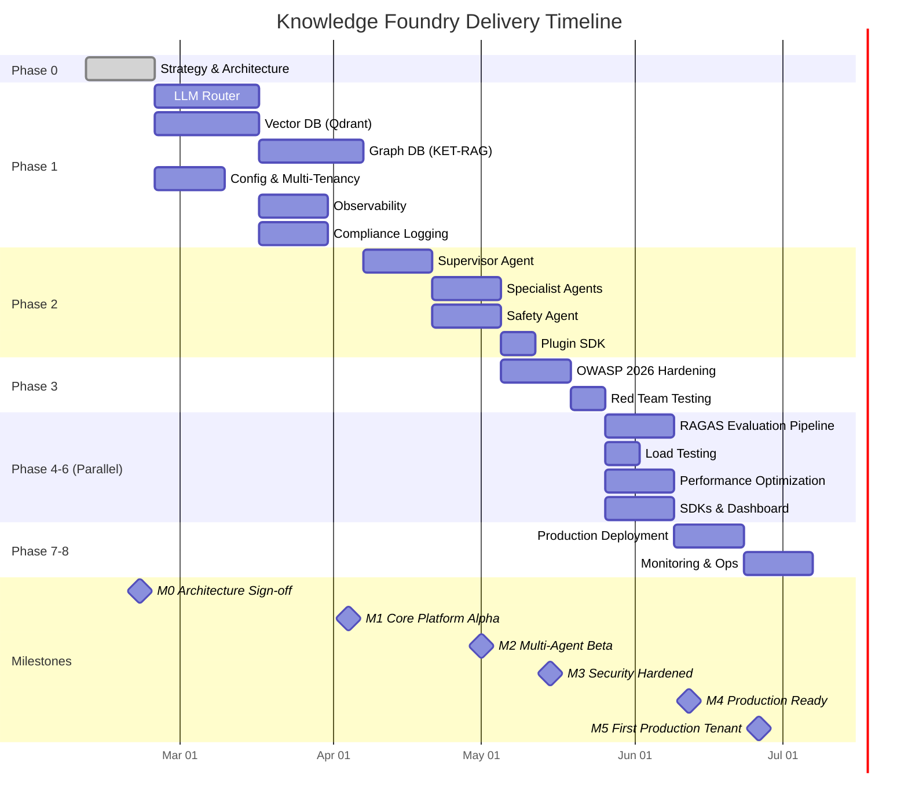
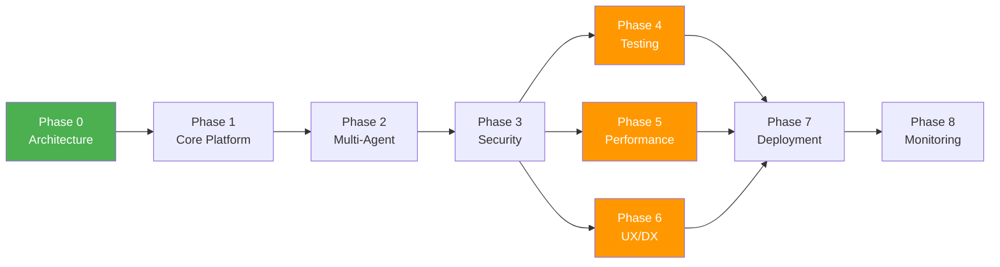

# Phase 0.2 – Delivery Plan & Work Breakdown Structure
## Knowledge Foundry: Inception → Production → Continuous Improvement

**Version**: 1.0 | **Date**: February 14, 2026 | **Status**: 📋 PROPOSED  
**Depends On**: [Phase 0.1 Architecture](file:///Users/mukundajmera/pocs/Knowledge%20Foundry/docs/architecture/phase-0.1-enterprise-architecture.md)

---

## 1. PHASE DECOMPOSITION

### Phase 0: Strategy & Architecture

| Attribute | Detail |
|-----------|--------|
| **Objectives** | Validate architecture, select technologies, establish compliance strategy, produce ADRs |
| **Key Deliverables** | Architecture doc, 7 ADRs, risk register, executive Go/No-Go, delivery plan (this doc) |
| **Exit Criteria** | CTO signs off on ADRs; legal approves compliance architecture; Go/No-Go = GO |
| **Duration** | 2 weeks |
| **Team Size** | 3 (Architect, Tech Lead, Security Lead) |
| **Dependencies** | None (inception phase) |
| **Risks** | Stakeholder alignment delays → mitigate with structured decision meetings |

---

### Phase 1: Core Platform Foundation

| Attribute | Detail |
|-----------|--------|
| **Objectives** | Build LLM router, vector + graph retrieval, multi-tenant config, compliance logging, observability foundation |
| **Key Deliverables** | Custom LLM Router (500 RPS), Qdrant integration, Neo4j KET-RAG skeleton, multi-tenant config system, EU AI Act logging pipeline, Langfuse tracing |
| **Exit Criteria** | Alpha tests pass; vector search p95 <200ms; graph traversal p95 <500ms; router p95 <500ms at 500 RPS; RAGAS baseline >0.7; compliance logs writing to WORM storage |
| **Duration** | 6 weeks (Week 3–8) |
| **Team Size** | 5 (Tech Lead, 2 Backend Engineers, 1 ML Engineer, 1 DevOps) |
| **Dependencies** | Phase 0 complete (ADRs signed off) |
| **Risks** | KET-RAG accuracy insufficient (RISK-001); router throughput misses target → fallback to simpler routing |

---

### Phase 2: Multi-Agent & Plugin Ecosystem

| Attribute | Detail |
|-----------|--------|
| **Objectives** | Implement Supervisor agent, specialist agents (Researcher, Coder, Analyst), Safety Agent, Plugin SDK |
| **Key Deliverables** | LangGraph Supervisor orchestration, 4 specialist agents with I/O schemas, Safety Agent validation pipeline, Plugin SDK + 2 reference plugins |
| **Exit Criteria** | Supervisor routes to ≥3 agents successfully; RAGAS >0.7 on multi-agent queries; Safety Agent catches 99% of test injection patterns; Plugin SDK documented with examples |
| **Duration** | 4 weeks (Week 9–12) |
| **Team Size** | 6 (Tech Lead, 3 Backend Engineers, 1 ML Engineer, 1 QA) |
| **Dependencies** | Phase 1 LLM Router + Retrieval layer operational |
| **Risks** | Agent coordination instability; LangGraph checkpoint bugs → fallback to simpler state management |

---

### Phase 3: Security, Compliance & Governance

| Attribute | Detail |
|-----------|--------|
| **Objectives** | Harden OWASP 2026 stack, implement full EU AI Act controls, red team testing, governance workflows |
| **Key Deliverables** | 4-layer security defense, Garak CI/CD integration, NeMo Guardrails, red team report, HITL approval gates, auto-generated compliance documentation, audit trail validation |
| **Exit Criteria** | OWASP 2026 checklist 100% passed; Garak scan clean; red team penetration test passed; HITL workflows functional; compliance docs auto-generated for all model deployments |
| **Duration** | 3 weeks (Week 13–15) |
| **Team Size** | 5 (Security Lead, 2 Engineers, Compliance Officer, QA Lead) |
| **Dependencies** | Phase 2 agents operational (Security validates agent outputs) |
| **Risks** | Regulatory interpretation changes; pen test discovers critical vulnerability → remediation sprint |

---

### Phase 4: Testing, Validation & Quality Assurance

| Attribute | Detail |
|-----------|--------|
| **Objectives** | Comprehensive RAGAS evaluation pipeline, golden dataset, DeepEval unit tests, regression detection, load testing |
| **Key Deliverables** | 200-query golden dataset, automated RAGAS pipeline in CI/CD, DeepEval test suite (correctness, reasoning, safety, robustness), load test harness (k6), quality gate enforcement |
| **Exit Criteria** | RAGAS scores: Context Precision >0.9, Faithfulness >0.95, Answer Relevancy >0.9; load test: 1000 concurrent users, p95 <500ms; zero regressions on golden dataset |
| **Duration** | 2 weeks (Week 16–17) |
| **Team Size** | 4 (QA Lead, 2 Engineers, ML Engineer) |
| **Dependencies** | Phase 2–3 complete (full system to test) |
| **Risks** | Golden dataset quality insufficient; RAGAS thresholds too aggressive → relax thresholds with documented rationale |

---

### Phase 5: Performance & Cost Optimization

| Attribute | Detail |
|-----------|--------|
| **Objectives** | Optimize tiered routing, implement semantic caching, response caching, query optimization, cost monitoring |
| **Key Deliverables** | Redis semantic cache, frequent-query response cache, Neo4j query optimizer, routing classifier retraining pipeline, cost anomaly alerting |
| **Exit Criteria** | Cost per query <$0.10; cache hit rate >30% for repeat queries; routing classifier accuracy >90%; no cost anomalies for 2 consecutive weeks |
| **Duration** | 2 weeks (Week 16–17, parallel with Phase 4) |
| **Team Size** | 3 (Tech Lead, Backend Engineer, ML Engineer) |
| **Dependencies** | Phase 1 router + observability data available |
| **Risks** | Cache invalidation bugs; over-aggressive caching reduces freshness → configurable TTLs |

---

### Phase 6: UX & Developer Experience

| Attribute | Detail |
|-----------|--------|
| **Objectives** | Build developer portal, REST API documentation, Python/JS SDKs, admin dashboard, user feedback system |
| **Key Deliverables** | OpenAPI documentation (auto-generated), Python SDK, JS SDK, admin dashboard (compliance + cost + quality metrics), user feedback widget (thumbs up/down + comments) |
| **Exit Criteria** | SDKs published to PyPI/npm; API docs 100% coverage; admin dashboard shows real-time RAGAS, cost, latency; feedback collection functional |
| **Duration** | 2 weeks (Week 16–17, parallel with Phases 4–5) |
| **Team Size** | 3 (Frontend Engineer, Backend Engineer, Tech Writer) |
| **Dependencies** | Phase 1–2 API contracts stable |
| **Risks** | API breaking changes during Phases 4–5 → API versioning strategy (v1 frozen) |

---

### Phase 7: Deployment & Operations

| Attribute | Detail |
|-----------|--------|
| **Objectives** | Production infrastructure, CI/CD pipeline, blue-green deployment, monitoring alerts, runbooks, disaster recovery |
| **Key Deliverables** | Terraform/CDK infrastructure, GitHub Actions CI/CD (build + test + deploy <10 min), blue-green deployment config, PagerDuty alerting, operational runbooks, DR playbook |
| **Exit Criteria** | Deployment pipeline end-to-end functional; rollback tested; DR drill completed; alert thresholds tuned; on-call rotation established |
| **Duration** | 2 weeks (Week 18–19) |
| **Team Size** | 3 (DevOps Engineer, Backend Engineer, Security Lead) |
| **Dependencies** | All previous phases feature-complete |
| **Risks** | Infrastructure cost overruns; deployment pipeline fragility → canary deployments for risk reduction |

---

### Phase 8: Monitoring & Continuous Improvement

| Attribute | Detail |
|-----------|--------|
| **Objectives** | Production monitoring, semantic drift detection, continuous RAGAS evaluation, P&L tracking, self-healing foundations |
| **Key Deliverables** | Arize Phoenix drift monitoring, real-time RAGAS sampling (10%), cost P&L dashboard, monthly business review template, self-healing alerting (detect → diagnose → suggest fix) |
| **Exit Criteria** | Drift detection operational (alert on >0.15 drift); RAGAS sampling pipeline running; P&L dashboard accurate; first monthly business review completed |
| **Duration** | Ongoing (starts Week 20, continuous) |
| **Team Size** | 2 (ML Engineer, DevOps) + rotating on-call |
| **Dependencies** | Phase 7 deployment complete |
| **Risks** | Alert fatigue; metric decay unnoticed → quarterly threshold calibration |

---

## 2. WORK BREAKDOWN STRUCTURE (WBS)

### Phase 1: Core Platform Foundation

#### Epic 1.1: LLM Router with Tiered Intelligence

**User Story 1.1.1:** Cost-Aware Model Routing  
*As a platform engineer, I want complexity-based model routing, so that we minimize LLM costs while maintaining quality.*

| Task ID | Description | Category | AI Assist | Effort | Assignee | Depends On | Acceptance Criteria |
|---------|------------|----------|-----------|--------|----------|------------|-------------------|
| TASK-1.1.1.1 | Design router API contract (OpenAPI spec) | Architecture | Mandatory | 3h | Architect | — | OpenAPI schema reviewed + approved |
| TASK-1.1.1.2 | Design complexity estimation logic | Architecture | Mandatory | 4h | Architect | — | Algorithm documented with examples |
| TASK-1.1.1.3 | Implement FastAPI router service | Implementation | Recommended | 8h | Engineer | 1.1.1.1 | Routes requests to correct tier |
| TASK-1.1.1.4 | Implement tiered model clients (Opus/Sonnet/Haiku) | Implementation | Recommended | 6h | Engineer | 1.1.1.3 | All 3 tiers callable |
| TASK-1.1.1.5 | Implement Haiku complexity classifier | Implementation | Recommended | 8h | ML Eng | 1.1.1.2 | Accuracy >85% on test set |
| TASK-1.1.1.6 | Implement Langfuse telemetry integration | Implementation | Recommended | 4h | Engineer | 1.1.1.3 | Traces visible in Langfuse |
| TASK-1.1.1.7 | Write unit tests (>90% coverage) | Testing | Recommended | 6h | Engineer | 1.1.1.3-6 | pytest passes, coverage >90% |
| TASK-1.1.1.8 | Write integration tests | Testing | Recommended | 4h | QA | 1.1.1.3-6 | End-to-end routing verified |
| TASK-1.1.1.9 | Load test at 500 RPS | Testing | Optional | 4h | DevOps | 1.1.1.7 | p95 <500ms, error <1% |
| TASK-1.1.1.10 | Document API + routing logic | Documentation | Mandatory | 2h | Engineer | 1.1.1.3 | README + OpenAPI complete |

**User Story 1.1.2:** Circuit Breaker & Fallbacks  
*As an SRE, I want automatic fallback when an LLM provider fails, so that users experience zero downtime.*

| Task ID | Description | Category | AI Assist | Effort | Assignee | Depends On | Acceptance Criteria |
|---------|------------|----------|-----------|--------|----------|------------|-------------------|
| TASK-1.1.2.1 | Design circuit breaker state machine | Architecture | Mandatory | 3h | Architect | — | State diagram documented |
| TASK-1.1.2.2 | Implement circuit breaker | Implementation | Recommended | 6h | Engineer | 1.1.2.1, 1.1.1.3 | Opens after 5 failures, resets after 60s |
| TASK-1.1.2.3 | Implement fallback chain | Implementation | Recommended | 4h | Engineer | 1.1.2.2 | Auto-failover verified |
| TASK-1.1.2.4 | Implement rate limiter (Redis) | Implementation | Recommended | 4h | Engineer | 1.1.1.3 | Token bucket, per-user/tenant |
| TASK-1.1.2.5 | Write chaos tests | Testing | Optional | 4h | QA | 1.1.2.2-3 | Recovers from simulated failures |

---

#### Epic 1.2: Vector Database Integration (Qdrant)

**User Story 1.2.1:** Document Ingestion Pipeline  
*As a content admin, I want to upload documents and have them automatically chunked and indexed, so they become searchable.*

| Task ID | Description | Category | AI Assist | Effort | Assignee | Depends On | Acceptance Criteria |
|---------|------------|----------|-----------|--------|----------|------------|-------------------|
| TASK-1.2.1.1 | Design ingestion pipeline architecture | Architecture | Mandatory | 4h | Architect | — | Pipeline diagram + data flow documented |
| TASK-1.2.1.2 | Implement document parser (PDF, MD, DOCX, TXT) | Implementation | Recommended | 8h | Engineer | 1.2.1.1 | All 4 file types parsed correctly |
| TASK-1.2.1.3 | Implement chunking engine (recursive, semantic, heading-aware) | Implementation | Recommended | 8h | ML Eng | 1.2.1.1 | 3 strategies, configurable chunk size |
| TASK-1.2.1.4 | Implement embedding service (async, batched) | Implementation | Recommended | 6h | ML Eng | 1.2.1.3 | Batch embeddings, <2s for 100 chunks |
| TASK-1.2.1.5 | Implement Qdrant collection management | Implementation | Recommended | 4h | Engineer | — | Create/delete/list collections |
| TASK-1.2.1.6 | Implement vector upsert + metadata storage | Implementation | Recommended | 4h | Engineer | 1.2.1.4-5 | Chunks stored with full metadata |
| TASK-1.2.1.7 | Write ingestion integration tests | Testing | Recommended | 4h | QA | 1.2.1.2-6 | Upload → chunk → embed → search works |

**User Story 1.2.2:** Semantic Search  
*As an end user, I want to search documents by meaning, so I can find relevant information even with different wording.*

| Task ID | Description | Category | AI Assist | Effort | Assignee | Depends On | Acceptance Criteria |
|---------|------------|----------|-----------|--------|----------|------------|-------------------|
| TASK-1.2.2.1 | Implement semantic search endpoint | Implementation | Recommended | 4h | Engineer | 1.2.1.6 | Returns ranked results with scores |
| TASK-1.2.2.2 | Implement metadata filtering | Implementation | Recommended | 3h | Engineer | 1.2.2.1 | Filter by type, date, org, tags |
| TASK-1.2.2.3 | Implement re-ranking layer | Implementation | Recommended | 6h | ML Eng | 1.2.2.1 | Cross-encoder re-ranking improves precision |
| TASK-1.2.2.4 | Performance test: p95 <200ms | Testing | Optional | 3h | DevOps | 1.2.2.1-3 | 200ms p95 at 100 concurrent queries |

---

#### Epic 1.3: Graph Database Integration (KET-RAG)

**User Story 1.3.1:** Knowledge Graph Construction  
*As a data engineer, I want to extract entities and relationships from documents, so the graph enables multi-hop reasoning.*

| Task ID | Description | Category | AI Assist | Effort | Assignee | Depends On | Acceptance Criteria |
|---------|------------|----------|-----------|--------|----------|------------|-------------------|
| TASK-1.3.1.1 | Design knowledge graph schema (Neo4j) | Architecture | Mandatory | 4h | Architect | — | Entity/relationship types defined |
| TASK-1.3.1.2 | Implement entity extraction pipeline (LLM-based) | Implementation | Recommended | 10h | ML Eng | 1.3.1.1 | Extracts entities from all doc types |
| TASK-1.3.1.3 | Implement relationship extraction | Implementation | Recommended | 8h | ML Eng | 1.3.1.2 | Relationship types correctly assigned |
| TASK-1.3.1.4 | Implement skeleton selection (PageRank) | Implementation | Recommended | 6h | ML Eng | 1.3.1.1 | Top 20% central docs identified |
| TASK-1.3.1.5 | Implement Neo4j ingestion | Implementation | Recommended | 4h | Engineer | 1.3.1.2-3 | Entities + relationships stored in Neo4j |
| TASK-1.3.1.6 | Write graph construction tests | Testing | Recommended | 4h | QA | 1.3.1.2-5 | Schema validated, data integrity checked |

**User Story 1.3.2:** Multi-Hop Graph Traversal  
*As an analyst, I want to query across multiple entity relationships, so I can find indirect connections and impacts.*

| Task ID | Description | Category | AI Assist | Effort | Assignee | Depends On | Acceptance Criteria |
|---------|------------|----------|-----------|--------|----------|------------|-------------------|
| TASK-1.3.2.1 | Implement Cypher query generator | Implementation | Recommended | 8h | Engineer | 1.3.1.5 | Generates traversal for 2-3 hops |
| TASK-1.3.2.2 | Implement vector→graph bridge | Implementation | Recommended | 6h | Engineer | 1.2.2.1, 1.3.1.5 | Vector results map to graph entities |
| TASK-1.3.2.3 | Implement context assembler (chunks + graph paths) | Implementation | Recommended | 6h | ML Eng | 1.3.2.1-2 | Unified context with provenance |
| TASK-1.3.2.4 | Performance test: p95 <500ms for 2-3 hops | Testing | Optional | 3h | DevOps | 1.3.2.1 | Traversal within latency budget |

---

#### Epic 1.4: Configuration & Multi-Tenancy

**User Story 1.4.1:** Multi-Tenant Isolation  
*As an enterprise admin, I want tenant-level data isolation, so that each organization's data is completely separate.*

| Task ID | Description | Category | AI Assist | Effort | Assignee | Depends On | Acceptance Criteria |
|---------|------------|----------|-----------|--------|----------|------------|-------------------|
| TASK-1.4.1.1 | Design multi-tenant data model (PostgreSQL) | Architecture | Mandatory | 4h | Architect | — | Schema with org_id isolation |
| TASK-1.4.1.2 | Implement tenant-scoped repositories | Implementation | Recommended | 6h | Engineer | 1.4.1.1 | All queries filter by org_id |
| TASK-1.4.1.3 | Implement Qdrant collection per tenant | Implementation | Recommended | 3h | Engineer | 1.2.1.5, 1.4.1.1 | Separate vector spaces |
| TASK-1.4.1.4 | Implement RBAC (roles + permissions) | Implementation | Recommended | 8h | Engineer | 1.4.1.1 | Admin/editor/viewer roles enforced |
| TASK-1.4.1.5 | Write tenant isolation tests | Testing | Recommended | 4h | QA | 1.4.1.2-4 | Cross-tenant data access blocked |

**User Story 1.4.2:** Configuration Management  
*As a platform admin, I want tiered configuration (global → tenant → user), so behavior is customizable at each level.*

| Task ID | Description | Category | AI Assist | Effort | Assignee | Depends On | Acceptance Criteria |
|---------|------------|----------|-----------|--------|----------|------------|-------------------|
| TASK-1.4.2.1 | Design config schema (YAML + Pydantic) | Architecture | Mandatory | 3h | Architect | — | Schema with validation rules |
| TASK-1.4.2.2 | Implement config loader with cascading override | Implementation | Recommended | 4h | Engineer | 1.4.2.1 | Global → tenant → user cascade |
| TASK-1.4.2.3 | Implement config change audit logging | Implementation | Recommended | 3h | Engineer | 1.4.2.2 | All changes tracked immutably |

---

#### Epic 1.5: Observability Foundation

**User Story 1.5.1:** Distributed Tracing  
*As an SRE, I want end-to-end request traces, so I can diagnose latency and errors across the agent pipeline.*

| Task ID | Description | Category | AI Assist | Effort | Assignee | Depends On | Acceptance Criteria |
|---------|------------|----------|-----------|--------|----------|------------|-------------------|
| TASK-1.5.1.1 | Integrate Langfuse SDK for LLM tracing | Implementation | Recommended | 4h | Engineer | 1.1.1.3 | All LLM calls traced |
| TASK-1.5.1.2 | Implement structured logging (structlog) | Implementation | Recommended | 3h | Engineer | — | JSON logs with context |
| TASK-1.5.1.3 | Implement Prometheus metrics | Implementation | Recommended | 4h | DevOps | — | request_count, latency, error_rate |
| TASK-1.5.1.4 | Set up Grafana dashboards | DevOps | Optional | 4h | DevOps | 1.5.1.3 | Latency, throughput, error dashboards |

---

#### Epic 1.6: EU AI Act Compliance Logging

**User Story 1.6.1:** Immutable Audit Trail  
*As a compliance officer, I want every AI decision logged immutably, so we can demonstrate EU AI Act compliance.*

| Task ID | Description | Category | AI Assist | Effort | Assignee | Depends On | Acceptance Criteria |
|---------|------------|----------|-----------|--------|----------|------------|-------------------|
| TASK-1.6.1.1 | Design audit log schema (JSON Lines) | Architecture | Mandatory | 3h | Architect | — | Schema captures all required fields |
| TASK-1.6.1.2 | Implement log writer to S3 WORM | Implementation | Recommended | 6h | Engineer | 1.6.1.1 | Logs written with Object Lock |
| TASK-1.6.1.3 | Implement log query API (auditor access) | Implementation | Recommended | 4h | Engineer | 1.6.1.2 | Read-only filtered search |
| TASK-1.6.1.4 | Implement auto-generated tech documentation | Implementation | Recommended | 6h | ML Eng | 1.1.1.3 | Model card auto-generated per deployment |
| TASK-1.6.1.5 | Write compliance validation tests | Testing | Recommended | 4h | QA | 1.6.1.2-4 | All Article 11-14 requirements verified |

---

### Phase 2: Multi-Agent & Plugin Ecosystem

#### Epic 2.1: Supervisor Agent Orchestration

| Task ID | Description | Category | AI Assist | Effort | Assignee | Depends On | Acceptance Criteria |
|---------|------------|----------|-----------|--------|----------|------------|-------------------|
| TASK-2.1.1 | Design LangGraph state schema | Architecture | Mandatory | 4h | Architect | Phase 1 | State schema supports all agent types |
| TASK-2.1.2 | Implement Supervisor routing logic | Implementation | Recommended | 10h | Engineer | 2.1.1 | Routes to correct agents based on intent |
| TASK-2.1.3 | Implement checkpointing + recovery | Implementation | Recommended | 8h | Engineer | 2.1.2 | Recovery from checkpoint <1s |
| TASK-2.1.4 | Implement output synthesis + citation | Implementation | Recommended | 6h | ML Eng | 2.1.2 | Coherent multi-source answers |
| TASK-2.1.5 | Implement conflict resolution logic | Implementation | Recommended | 4h | ML Eng | 2.1.4 | Confidence-weighted voting works |
| TASK-2.1.6 | Write orchestration integration tests | Testing | Recommended | 6h | QA | 2.1.2-5 | Multi-agent scenarios pass |

#### Epic 2.2: Specialist Agents

| Task ID | Description | Category | AI Assist | Effort | Assignee | Depends On | Acceptance Criteria |
|---------|------------|----------|-----------|--------|----------|------------|-------------------|
| TASK-2.2.1 | Implement Researcher Agent | Implementation | Recommended | 8h | ML Eng | 2.1.2, 1.2, 1.3 | Retrieves + ranks from vector + graph |
| TASK-2.2.2 | Implement Coder Agent | Implementation | Recommended | 8h | Engineer | 2.1.2, 1.1 | Generates typed, tested code |
| TASK-2.2.3 | Implement Analyst Agent | Implementation | Recommended | 8h | ML Eng | 2.1.2, 1.2 | Multi-step data analysis |
| TASK-2.2.4 | Write agent-specific test suites | Testing | Recommended | 8h | QA | 2.2.1-3 | Per-agent accuracy benchmarks |

#### Epic 2.3: Safety Agent

| Task ID | Description | Category | AI Assist | Effort | Assignee | Depends On | Acceptance Criteria |
|---------|------------|----------|-----------|--------|----------|------------|-------------------|
| TASK-2.3.1 | Design Safety Agent validation pipeline | Architecture | Mandatory | 4h | Security | — | Validation rules documented |
| TASK-2.3.2 | Implement prompt injection detector | Security | Recommended | 8h | Security | 2.3.1 | Catches >99% test patterns |
| TASK-2.3.3 | Implement PII scanner | Security | Recommended | 6h | Security | 2.3.1 | Detects all PII categories |
| TASK-2.3.4 | Implement system prompt leak detector | Security | Recommended | 4h | Security | 2.3.1 | Zero leaks in test suite |
| TASK-2.3.5 | Write adversarial test suite | Testing | Recommended | 6h | Security | 2.3.2-4 | 200+ attack patterns tested |

#### Epic 2.4: Plugin SDK & Ecosystem

| Task ID | Description | Category | AI Assist | Effort | Assignee | Depends On | Acceptance Criteria |
|---------|------------|----------|-----------|--------|----------|------------|-------------------|
| TASK-2.4.1 | Design plugin interface (ABC) | Architecture | Mandatory | 4h | Architect | — | Interface reviewed + approved |
| TASK-2.4.2 | Implement plugin registry + loader | Implementation | Recommended | 6h | Engineer | 2.4.1 | Dynamic plugin loading works |
| TASK-2.4.3 | Implement plugin sandboxing | Security | Recommended | 6h | Security | 2.4.2 | Plugins cannot access host resources |
| TASK-2.4.4 | Build 2 reference plugins | Implementation | Recommended | 8h | Engineer | 2.4.2 | Working examples documented |
| TASK-2.4.5 | Write Plugin SDK documentation | Documentation | Mandatory | 4h | Engineer | 2.4.1-4 | Developer guide complete |

---

### Phase 3–8: Summary WBS

#### Phase 3: Security, Compliance & Governance (12 tasks)
- TASK-3.1.x: OWASP 2026 4-layer defense implementation (input, orchestration, tool, output)
- TASK-3.2.x: Garak + NeMo Guardrails CI/CD integration
- TASK-3.3.x: Multi-persona red team testing framework
- TASK-3.4.x: HITL approval workflow engine
- TASK-3.5.x: Compliance documentation auto-generator

#### Phase 4: Testing, Validation & QA (10 tasks)
- TASK-4.1.x: Golden dataset construction (200 queries, 5 tiers)
- TASK-4.2.x: RAGAS evaluation pipeline (CI/CD integration)
- TASK-4.3.x: DeepEval unit test suite (correctness, reasoning, safety, robustness)
- TASK-4.4.x: Load testing harness (k6, 1000 concurrent users)
- TASK-4.5.x: Regression detection and alerting
- TASK-4.6.x: Chaos engineering test suite

#### Phase 5: Performance & Cost Optimization (8 tasks)
- TASK-5.1.x: Redis semantic cache implementation
- TASK-5.2.x: Response caching for frequent queries
- TASK-5.3.x: Neo4j query optimization
- TASK-5.4.x: Routing classifier retraining pipeline

#### Phase 6: UX & Developer Experience (8 tasks)
- TASK-6.1.x: Python SDK (PyPI)
- TASK-6.2.x: JS SDK (npm)
- TASK-6.3.x: Admin dashboard (compliance + cost + quality)

#### Phase 7: Deployment & Operations (10 tasks)
- TASK-7.1.x: Terraform/CDK infrastructure
- TASK-7.2.x: GitHub Actions CI/CD pipeline
- TASK-7.3.x: Blue-green deployment + rollback
- TASK-7.4.x: Operational runbooks + DR playbook

#### Phase 8: Monitoring & Continuous Improvement (6 tasks)
- TASK-8.1.x: Arize Phoenix drift monitoring
- TASK-8.2.x: Real-time RAGAS sampling pipeline
- TASK-8.3.x: P&L dashboard + monthly business review template

---

## 3. RACI MATRIX

| Decision / Deliverable | CTO | Eng Mgr | Tech Lead | Engineers | Security | Compliance | Data Eng | QA | Product | DevOps |
|:----------------------|:---:|:-------:|:---------:|:---------:|:--------:|:----------:|:--------:|:--:|:-------:|:------:|
| Architecture approval | **A** | C | **R** | C | C | C | C | I | C | C |
| Technology stack selection | **A** | C | **R** | C | C | I | C | I | I | C |
| LLM Router design | I | C | **A/R** | C | I | I | I | I | I | C |
| Retrieval architecture | I | C | **A/R** | C | I | I | **R** | I | I | I |
| Security design | C | C | C | I | **A/R** | C | I | C | I | C |
| Compliance architecture | C | C | C | I | C | **A/R** | I | I | C | I |
| Agent persona design | I | C | **A/R** | C | C | I | I | I | C | I |
| Code implementation | I | **A** | C | **R** | C | I | C | C | I | C |
| Testing strategy | I | C | C | C | C | I | I | **A/R** | I | I |
| Golden dataset creation | I | I | C | C | I | I | **A/R** | C | C | I |
| Deployment strategy | C | C | C | I | C | I | I | I | C | **A/R** |
| Production readiness | **A** | **R** | C | C | C | C | C | **R** | C | **R** |
| Incident response | C | **A** | C | **R** | **R** | I | I | I | I | **R** |
| Cost/ROI tracking | **A** | **R** | C | I | I | I | I | I | **R** | C |
| EU AI Act sign-off | **A** | I | C | I | C | **R** | I | I | I | I |

---

## 4. MILESTONES & DEPENDENCIES



### Milestone Details

| Milestone | Target Date | Dependencies | Success Criteria | Go/No-Go Owner |
|-----------|:-----------:|-------------|-----------------|:--------------:|
| **M0:** Architecture Sign-off | Week 2 (Feb 21) | Prompts 0.1–0.4 complete | ADRs approved, Go/No-Go = GO | CTO |
| **M1:** Core Platform Alpha | Week 8 (Apr 4) | Phase 1 complete | Router 500 RPS, vector <200ms, graph <500ms, RAGAS >0.7 | Eng Mgr + TL |
| **M2:** Multi-Agent Beta | Week 12 (May 1) | Phase 2 complete | Supervisor + 3 agents, RAGAS >0.7, Safety Agent operational | Product + Eng |
| **M3:** Security Hardened | Week 15 (May 15) | Phase 3 complete | OWASP checklist passed, red team clean, HITL functional | Security Lead |
| **M4:** Production Ready | Week 19 (Jun 12) | Phases 4–7 complete | 1000 users load test, RAGAS >0.8, EU AI Act compliant | CTO + Legal |
| **M5:** First Tenant Live | Week 21 (Jun 26) | Deployment + monitoring | Production serving traffic, monitoring active | CTO |
| **M6:** High Performer KPIs | Month 9 (Nov) | 3 months production data | ROI trending positive, >100 WAU | Quarterly review |
| **M7:** ROI Achieved | Month 14 (Apr 2027) | 8 months production | >5% EBIT contribution | Board presentation |

### Dependency Graph



> [!NOTE]
> Phases 4, 5, and 6 run **in parallel** after Phase 3 to compress the timeline. Phase 7 gates on all three completing.

---

## 5. RISK & MITIGATION PLANNING

### Technical Risks

| Risk ID | Risk | Prob. | Impact | Detection | Mitigation | Contingency | Owner | Review |
|---------|------|:-----:|:------:|-----------|-----------|-------------|-------|:------:|
| RISK-001 | KET-RAG accuracy insufficient (<80% multi-hop) | Med | High | RAGAS multi-hop scores in Phase 1 testing | Build evaluation harness early; test with real queries Week 4 | Expand skeleton 20%→40% (+$10K); VectorCypher for critical domains | Tech Lead | Weekly |
| RISK-002 | EU AI Act compliance delays launch | Low | Critical | Legal review identifies gaps | Parallel compliance workstream from Week 1; early legal engagement | Delay launch 2–4 weeks; deploy non-high-risk features first | CTO + Compliance | Bi-weekly |
| RISK-003 | LLM API costs exceed budget | Med | High | Langfuse cost tracking, weekly review | Aggressive tiered routing; semantic caching; response caching | Reduce Opus usage from 10%→5%; increase caching TTLs | Eng Manager | Weekly |
| RISK-004 | Prompt injection exploited in production | Med | Critical | Garak scans, red team results | Multi-layer OWASP defense; Safety Agent; CI/CD scanning | Emergency patch; temporary input restrictions; incident response | Security Lead | Monthly |
| RISK-005 | Anthropic API availability degrades | Low | High | Circuit breaker metrics, latency monitoring | Multi-provider fallback; local model option for classification | Activate backup provider; degrade gracefully for non-critical | Tech Lead | Weekly |
| RISK-008 | Data quality degrades RAG accuracy over time | Med | High | RAGAS drift monitoring (Arize Phoenix) | Automated quality checks in ingestion; re-indexing triggers | Re-index affected collections; manual data cleanup | Data Lead | Monthly |

### Organizational Risks

| Risk ID | Risk | Prob. | Impact | Detection | Mitigation | Contingency | Owner | Review |
|---------|------|:-----:|:------:|-----------|-----------|-------------|-------|:------:|
| RISK-007 | Insufficient ML/AI engineering talent | Med | Med | Hiring pipeline velocity | AI-native development (80% AI-generated code); clear docs | Contract specialists; reduce scope to Phases 1–2 | Eng Manager | Monthly |
| RISK-009 | Leadership commitment wanes before ROI | Low | Critical | Executive engagement, budget allocation | Monthly ROI dashboard; quick wins in first 4 weeks; stakeholder demos | Escalate to board with ROI projections; pivot to highest-value use case | CTO | Quarterly |
| RISK-010 | Governance bottlenecks slow velocity | Med | Med | Approval queue length, cycle time | Pre-approved risk tiers; automated low-risk approvals | Reduce approval scope; temporary delegation | Eng Manager | Bi-weekly |

### Business Risks

| Risk ID | Risk | Prob. | Impact | Detection | Mitigation | Contingency | Owner | Review |
|---------|------|:-----:|:------:|-----------|-----------|-------------|-------|:------:|
| RISK-011 | User adoption slower than projected | Med | High | WAU tracking, feature usage analytics | Early user involvement; beta program; feedback loops | Pivot to highest-demand use case; reduce scope | Product | Monthly |
| RISK-012 | Competitor launches comparable platform | Low | Med | Market intelligence, competitive analysis | Speed to market (10-week MVP); unique knowledge graph moat | Differentiate on compliance + enterprise features | CTO | Quarterly |

---

## 6. PHASE SUMMARY TABLE

| Phase | Objectives | Key Deliverables | Exit Criteria | Duration | Team | Start |
|:-----:|-----------|-----------------|---------------|:--------:|:----:|:-----:|
| **0** | Strategy & Architecture | ADRs, designs, risk register, delivery plan | CTO approval | 2 wk | 3 | Wk 1 |
| **1** | Core Platform Foundation | Router, Qdrant, Neo4j, config, logging | Alpha tests pass, RAGAS >0.7 | 6 wk | 5 | Wk 3 |
| **2** | Multi-Agent & Plugins | Supervisor, 3 agents, Safety, Plugin SDK | Beta tests pass, agents orchestrate | 4 wk | 6 | Wk 9 |
| **3** | Security & Compliance | OWASP stack, red team, HITL, auto-docs | OWASP passed, pen test clean | 3 wk | 5 | Wk 13 |
| **4** | Testing & QA | Golden dataset, RAGAS CI/CD, load tests | RAGAS >0.8, 1000 users p95 <500ms | 2 wk | 4 | Wk 16 |
| **5** | Performance Optimization | Caching, query opt, routing retraining | Cost <$0.10/query, cache hit >30% | 2 wk | 3 | Wk 16 |
| **6** | UX & Developer Experience | SDKs, admin dashboard, API docs | SDKs published, dashboard live | 2 wk | 3 | Wk 16 |
| **7** | Deployment & Operations | Infra, CI/CD, blue-green, runbooks | Pipeline functional, DR tested | 2 wk | 3 | Wk 18 |
| **8** | Monitoring & Improvement | Drift detection, RAGAS sampling, P&L | Monitoring operational | Ongoing | 2 | Wk 20 |

**Total timeline: ~20 weeks (5 months) to first production tenant**  
**Peak team size: 6 engineers (Phase 2)**  
**Total estimated effort: ~700 person-hours**

---

## 7. TEXTUAL GANTT CHART

```
Week  1  2  3  4  5  6  7  8  9  10 11 12 13 14 15 16 17 18 19 20 21
      ├──┤
P0    ████  Strategy & Architecture
         ├───────────────────────┤
P1       ████████████████████████  Core Platform Foundation
                                 ├───────────────┤
P2                               ████████████████  Multi-Agent & Plugins
                                                 ├──────────┤
P3                                               ██████████  Security & Compliance
                                                           ├──────┤
P4                                                         ██████  Testing & QA ──────┐
P5                                                         ██████  Performance ───────┤ (parallel)
P6                                                         ██████  UX/DX ────────────┘
                                                                 ├──────┤
P7                                                               ██████  Deployment
                                                                       ├──────→
P8                                                                     ██████→ Monitoring (ongoing)

      ▲              ▲                    ▲           ▲              ▲     ▲
      M0             M1                   M2          M3             M4    M5
   Arch Signoff   Alpha              Beta        Security       Prod    Live
                                                 Hardened       Ready
```
