# Phase 0.3 – Data Strategy & Knowledge Graph Design
## Knowledge Foundry: KET-RAG Data Architecture

**Version**: 1.0 | **Date**: February 14, 2026 | **Status**: 📋 PROPOSED  
**Depends On**: [Phase 0.1 Architecture](file:///Users/mukundajmera/pocs/Knowledge%20Foundry/docs/architecture/phase-0.1-enterprise-architecture.md) | [ADR-002 KET-RAG](file:///Users/mukundajmera/pocs/Knowledge%20Foundry/docs/ADRs/ADR-002-ket-rag-over-full-graphrag.md)

---

## 1. DATA LANDSCAPE ASSESSMENT

### 1.1 Data Source Inventory

| Source Name | Data Type | Volume | Update Freq. | Access Method | Sensitivity | Quality | Priority |
|-------------|----------|--------|:------------:|---------------|:-----------:|:-------:|:--------:|
| **Confluence** | Unstructured (wiki pages) | ~50K pages, 8GB | Daily | REST API v2 | Internal | Medium | P0 |
| **SharePoint** | Unstructured (docs, presentations) | ~30K files, 15GB | Daily | Microsoft Graph API | Confidential | Medium | P0 |
| **Jira** | Semi-structured (tickets, epics) | ~200K tickets, 3GB | Real-time (webhook) | REST API v3 | Internal | High | P0 |
| **Salesforce** | Structured (CRM records) | ~50K records, 1GB | Hourly | Bulk API 2.0 | Confidential | High | P1 |
| **Slack** | Unstructured (messages, threads) | ~5M messages, 10GB | Real-time (Events API) | Events API + Web API | Internal | Low | P2 |
| **Code Repositories** (GitHub/GitLab) | Code + docs | ~500 repos, 20GB | Real-time (webhook) | REST API + Git clone | Confidential | High | P1 |
| **Policy Documents** (PDF/DOCX) | Unstructured (legal, compliance) | ~2K docs, 2GB | Static / Quarterly | File export (S3) | Restricted | High | P0 |
| **Internal Knowledge Base** | Semi-structured (articles) | ~10K articles, 1.5GB | Weekly | REST API | Internal | Medium | P0 |
| **Support Tickets** (Zendesk/ServiceNow) | Semi-structured | ~100K tickets, 2GB | Daily | REST API | Confidential | Medium | P1 |
| **Financial Reports** | Structured (tables, charts) | ~500 docs, 500MB | Quarterly | File export | Restricted | High | P2 |

**Total Corpus**: ~60GB across 10 sources, ~450K documents

### 1.2 Data Maturity Assessment

| Source | Current Level | Target Level | Gap Analysis | Remediation |
|--------|:------------:|:------------:|-------------|-------------|
| **Confluence** | Level 2 (cataloged, basic governance) | Level 4 | No versioning, inconsistent tagging | Tag normalization, archive stale pages |
| **SharePoint** | Level 1 (accessible, ungoverned) | Level 3 | Poor metadata, duplicate files | Deduplication pipeline, metadata enrichment |
| **Jira** | Level 3 (governed, versioned) | Level 4 | Already well-structured | Real-time streaming integration |
| **Salesforce** | Level 3 (governed, quality-assured) | Level 4 | Good quality, needs real-time sync | Hourly sync → streaming via Change Data Capture |
| **Slack** | Level 0 (siloed, ephemeral) | Level 2 | Very noisy, no structure | Thread summarization, relevance filtering |
| **Code Repos** | Level 3 (version-controlled) | Level 4 | Well-structured, needs parsing | AST-based extraction, documentation parsing |
| **Policy Documents** | Level 2 (cataloged) | Level 4 | Manual versioning, PDFs hard to parse | OCR pipeline, section extraction, version tracking |
| **Knowledge Base** | Level 2 (cataloged) | Level 3 | Inconsistent formatting | Template standardization |
| **Support Tickets** | Level 2 (cataloged) | Level 3 | Free-text, variable quality | Structured extraction (resolution, root cause) |
| **Financial Reports** | Level 1 (accessible) | Level 3 | Tables in PDFs, hard to parse | Chain-of-Table extraction, manual validation |

> [!IMPORTANT]
> **Target: All P0 sources at Level 3+ by Week 6 (Phase 1), all P1 sources by Week 12 (Phase 2).** P2 sources deferred to Phase 5.

---

## 2. KNOWLEDGE GRAPH SCHEMA DESIGN

### 2.1 Entity Types

| Entity | Properties | Cardinality | Update Pattern | Source Systems |
|--------|-----------|:-----------:|:--------------:|---------------|
| **Customer** | `customer_id: UUID`, `name: String`, `industry: String`, `tier: Enum(Enterprise/Mid-Market/SMB)`, `region: String`, `created_date: Date`, `arr: Float` | ~10K | Daily batch | Salesforce |
| **Product** | `product_id: UUID`, `name: String`, `version: String`, `category: String`, `status: Enum(Active/EOL/Beta)`, `launch_date: Date` | ~100 | Slowly changing | Internal KB, Jira |
| **Feature** | `feature_id: UUID`, `name: String`, `description: String`, `status: Enum(GA/Beta/Planned/Deprecated)`, `release_version: String` | ~2K | Weekly | Jira, Product docs |
| **Team** | `team_id: UUID`, `name: String`, `department: String`, `cost_center: String`, `headcount: Int` | ~200 | Slowly changing | HR system, Confluence |
| **Person** | `person_id: UUID`, `name: String`, `role: String`, `email: String (hashed)`, `expertise: String[]`, `tenure_years: Float` | ~5K | Monthly | HR system, Confluence |
| **Document** | `document_id: UUID`, `title: String`, `type: Enum(Policy/Spec/Guide/ADR/Report)`, `source_system: String`, `created_date: Date`, `last_updated: Date`, `author_id: UUID`, `version: String` | ~450K | Varies by source | All sources |
| **Technology** | `tech_id: UUID`, `name: String`, `category: Enum(Language/Framework/Database/Cloud/Tool)`, `version: String`, `status: Enum(Approved/Evaluating/Deprecated)`, `license: String` | ~500 | Slowly changing | Code repos, Confluence |
| **Process** | `process_id: UUID`, `name: String`, `type: Enum(Business/Engineering/Compliance/Support)`, `owner_team_id: UUID`, `sla_hours: Int` | ~300 | Slowly changing | Confluence, Jira |
| **Regulation** | `regulation_id: UUID`, `name: String`, `jurisdiction: String`, `effective_date: Date`, `category: Enum(Data/Financial/Safety/Environment)`, `status: Enum(Active/Pending/Superseded)` | ~200 | Quarterly | Policy docs |
| **Requirement** | `requirement_id: UUID`, `regulation_id: UUID`, `clause: String`, `description: String`, `severity: Enum(Mandatory/Recommended/Optional)` | ~2K | Quarterly | Policy docs |
| **Concept** | `concept_id: UUID`, `name: String`, `domain: String`, `definition: String`, `aliases: String[]` | ~5K | Slowly changing | All docs (NER extraction) |
| **Ticket** | `ticket_id: UUID`, `type: Enum(Bug/Feature/Task/Incident)`, `priority: Enum(Critical/High/Medium/Low)`, `status: String`, `resolution: String`, `product_id: UUID` | ~200K | Real-time | Jira, Support tools |
| **Supplier** | `supplier_id: UUID`, `name: String`, `category: String`, `risk_tier: Enum(Critical/Standard)`, `contract_end: Date` | ~500 | Quarterly | Procurement, Salesforce |

### 2.2 Relationship Types

| Relationship | Source → Target | Properties | Dir. | Semantics |
|-------------|----------------|-----------|:----:|-----------|
| **USES** | Customer → Product | `since: Date`, `license_type: String` | → | Customer has active license for Product |
| **CONTAINS** | Product → Feature | `since_version: String` | → | Product includes Feature |
| **DEPENDS_ON** | Product → Technology | `criticality: Enum(Critical/High/Med/Low)`, `since_version: String` | → | Product requires Technology to function |
| **COMPLIES_WITH** | Product → Regulation | `compliance_level: Enum(Full/Partial/Planned)`, `assessed_date: Date` | → | Product adheres to Regulation |
| **OWNS** | Team → Product | `since: Date`, `role: Enum(Primary/Contributing)` | → | Team is responsible for Product |
| **HAS_MEMBER** | Team → Person | `role: String`, `since: Date` | → | Person belongs to Team |
| **AUTHORED** | Person → Document | `date: Date`, `role: Enum(Author/Reviewer/Approver)` | → | Person created/reviewed Document |
| **REFERENCES** | Document → Technology | `context: String` | → | Document mentions Technology |
| **MENTIONS** | Document → Concept | `frequency: Int`, `sentiment: Float` | → | Document discusses Concept |
| **AFFECTS** | Regulation → Process | `impact_level: Enum(High/Medium/Low)`, `control_required: String` | → | Regulation imposes requirements on Process |
| **EXECUTED_BY** | Process → Team | `frequency: String` | → | Team performs Process |
| **SUPPLIED_BY** | Product → Supplier | `component: String`, `criticality: Enum(Critical/Standard)` | → | Supplier provides components for Product |
| **REPORTED** | Customer → Ticket | `date: Date` | → | Customer filed Ticket |
| **RELATES_TO** | Ticket → Product | `component: String` | → | Ticket concerns Product |
| **IMPLEMENTS** | Requirement → Process | `automation_level: Enum(Full/Partial/Manual)` | → | Process satisfies Requirement |
| **SUPERSEDES** | Regulation → Regulation | `effective_date: Date` | → | New Regulation replaces old |
| **SIMILAR_TO** | Concept → Concept | `similarity_score: Float` | ↔ | Semantic similarity between Concepts |
| **BLOCKS** | Ticket → Ticket | `reason: String` | → | Ticket prevents progress on another |

### 2.3 Knowledge Graph Schema Diagram


### 2.4 Multi-Hop Query Examples

#### Query 1: Regulatory Impact Analysis
**"Which products are impacted by the upcoming GDPR regulation change?"**

```
Regulation(GDPR) -[AFFECTS]→ Process[] 
                                └─[EXECUTED_BY]→ Team[]
Process[] ←[IMPLEMENTS]- Requirement[]
Product[] -[COMPLIES_WITH]→ Regulation(GDPR)
Product[] -[DEPENDS_ON]→ Technology[]

Result: Products with compliance gaps, impacted teams, affected processes
Hops: 2-3 | Estimated latency: ~350ms
```

#### Query 2: Subject Matter Expert Discovery
**"Who are the experts for our flagship product's supply chain?"**

```
Product(flagship) -[SUPPLIED_BY]→ Supplier[]
Supplier[] ←[MANAGES]- Team[]
Team[] -[HAS_MEMBER]→ Person[role=SME]
Person[] -[AUTHORED]→ Document[type=Spec]

Result: SMEs with expertise context + authored documents
Hops: 3-4 | Estimated latency: ~450ms
```

#### Query 3: Technology Risk Assessment
**"What is the blast radius if Technology X is deprecated?"**

```
Technology(X) ←[DEPENDS_ON]- Product[]
Product[] -[CONTAINS]→ Feature[]
Product[] ←[USES]- Customer[]
Product[] ←[OWNS]- Team[]

Result: Affected products, features, customers, owning teams
Hops: 2-3 | Estimated latency: ~300ms
```

#### Query 4: Customer Impact Triage
**"Which enterprise customers are affected by the outage in Service Y?"**

```
Product(ServiceY) ←[USES]- Customer[tier=Enterprise]
Product(ServiceY) ←[RELATES_TO]- Ticket[type=Incident,status=Open]
Product(ServiceY) ←[OWNS]- Team[]

Result: Enterprise customers, open incidents, responsible teams
Hops: 1-2 | Estimated latency: ~200ms
```

#### Query 5: Compliance Gap Analysis
**"Which processes lack automation for EU AI Act requirements?"**

```
Regulation(EU_AI_Act) -[DEFINES]→ Requirement[]
Requirement[] -[IMPLEMENTS]→ Process[automation_level=Manual]
Process[] -[EXECUTED_BY]→ Team[]

Result: Manual processes that need automation, responsible teams
Hops: 2-3 | Estimated latency: ~300ms
```

#### Query 6: Knowledge Decay Detection
**"Which documents haven't been updated in 12+ months but reference active technologies?"**

```
Document[last_updated < 12_months_ago] -[REFERENCES]→ Technology[status=Approved]
Document[] -[AUTHORED]→ Person[]
Person[] -[HAS_MEMBER]→ Team[]

Result: Stale documents with active tech references, owning teams for review
Hops: 2-3 | Estimated latency: ~350ms
```

#### Query 7: Cross-Team Dependency Mapping
**"What are the shared technology dependencies between Team Alpha and Team Beta?"**

```
Team(Alpha) -[OWNS]→ Product[]_A -[DEPENDS_ON]→ Technology[]_shared
Team(Beta) -[OWNS]→ Product[]_B -[DEPENDS_ON]→ Technology[]_shared
INTERSECT(Technology[]_shared)

Result: Shared technologies, criticality levels, affected products
Hops: 2 per team, then intersection | Estimated latency: ~400ms
```

---

## 3. SKELETON GRAPH CONSTRUCTION (KET-RAG)

### 3.1 Centrality Algorithm Selection

**Recommended: Hybrid Approach (PageRank + Manual Curation)**

| Algorithm | Strengths | Weaknesses | Weight |
|-----------|----------|-----------|:------:|
| **PageRank** | Identifies highly-cited foundational docs | Misses newer important docs | 40% |
| **Betweenness Centrality** | Finds bridge documents between domains | Computationally expensive | 20% |
| **Manual Curation** | Catches regulatory, architectural docs | Doesn't scale, subjective | 30% |
| **Recency Boost** | Ensures recent critical docs included | May over-prioritize | 10% |

**Scoring Formula:**
```
centrality_score = (0.4 × pagerank_normalized) + 
                   (0.2 × betweenness_normalized) + 
                   (0.3 × manual_curation_flag) + 
                   (0.1 × recency_boost)

threshold = 0.65  # Top ~20% of documents
```

**Always-Graph Categories (bypass scoring):**
- All Policy/Regulation documents (100% coverage)
- All Architecture Decision Records (ADRs)
- Product specifications and roadmaps
- SLA/SLO definitions
- Organizational charts

### 3.2 Coverage Targets

| Category | Graph Coverage | Document Count | Rationale |
|----------|:-------------:|:--------------:|-----------|
| **Policy & Regulation** | 100% | ~2,200 | Compliance-critical, multi-hop essential |
| **Architecture & Specs** | 100% | ~5,000 | Foundation for technical queries |
| **Product Documentation** | 50% (top by PageRank) | ~3,000 | Most-referenced product docs |
| **Knowledge Articles** | 20% (top by centrality) | ~2,000 | Bridge documents only |
| **Support Tickets** | 5% (critical/escalated only) | ~5,000 | High-signal tickets only |
| **Code Documentation** | 15% (README, API docs) | ~3,000 | Interface documentation |
| **All Other** | 0% (vector-only) | ~430K | Low graph value, vector sufficient |

**Totals:**
- **Full graph treatment:** ~20,200 documents (4.5% of corpus)
- **Vector-only:** ~430K documents (95.5%)
- **Initial indexing cost:** ~$3,000 (entity + relationship extraction for 20K docs)
- **Monthly update cost:** ~$300 (incremental for changed docs)

### 3.3 Vector-Only Strategy for Periphery

**Chunking Configuration:**

| Document Type | Strategy | Chunk Size | Overlap | Metadata Preserved |
|--------------|----------|:----------:|:-------:|-------------------|
| Wiki pages | Heading-aware recursive | 800 tokens | 100 tokens | title, section, author, tags, last_updated |
| PDFs | Semantic (page + section boundaries) | 600 tokens | 80 tokens | title, page_number, section, author |
| Code files | AST-based (function/class) | Full function | 0 | language, file_path, repo, function_name |
| Tickets | Per-ticket (title + body) | Full ticket | 0 | priority, status, resolution, product, assignee |
| Slack messages | Thread-level aggregation | Full thread | 0 | channel, participants, timestamp_range |

**Embedding Model: `text-embedding-3-large` (OpenAI)**
- Dimensions: 3072 (full) or 1536 (reduced for cost savings)
- Cost: $0.13 per 1M tokens
- Batch embedding: up to 100 chunks per API call

**Metadata Enrichment (added at ingestion):**
- `source_system`: Origin system identifier
- `document_type`: Classified type
- `sensitivity_level`: Public/Internal/Confidential/Restricted
- `entity_mentions`: Named entities extracted via Haiku NER
- `topic_tags`: Auto-classified topics via Haiku
- `freshness_score`: 1.0 (today) → 0.0 (>2 years old)
- `quality_score`: Completeness and formatting assessment

### 3.4 Hybrid Query Routing Logic


**Routing Rules:**

| Query Pattern | Route | Examples | Latency Target |
|--------------|:-----:|---------|:--------------:|
| `what is [concept]?` | **Vector** | "What is our refund policy?" | <200ms |
| `how to [process]?` | **Vector** | "How to onboard a new vendor?" | <200ms |
| `find documents about [topic]` | **Vector** | "Find docs about Kubernetes setup" | <200ms |
| `who [relationship] [entity]?` | **Graph** | "Who owns the payment service?" | <300ms |
| `what [depends/uses/affects] [entity]?` | **Graph** | "What technologies does Product X depend on?" | <300ms |
| `how does [entity A] impact [entity B]?` | **Hybrid** | "How do rate changes affect supply chain?" | <500ms |
| `what are the implications of [event]?` | **Hybrid** | "What's the blast radius of deprecating Node 18?" | <500ms |
| Multi-entity, multi-relationship | **Hybrid** | "Which enterprise customers use products that depend on deprecated tech?" | <500ms |
| Low-confidence classification | **Hybrid** | Fallback for ambiguous intent | <500ms |

---

## 4. DATA PIPELINES & ETL

### 4.1 Ingestion Pipeline Designs

#### Pipeline: Confluence

```mermaid
graph LR
    A[Confluence API v2] -->|"REST + pagination"| B[Extract<br/>Pages + Attachments]
    B --> C[Transform]
    C -->|"HTML → Markdown"| D[Text Extraction]
    C -->|"Heading-aware"| E[Chunking<br/>800 tok / 100 overlap]
    C -->|"Haiku NER"| F[Entity Extraction]
    C -->|"LLM-based<br/>Sonnet for central docs"| G[Relationship Extraction]
    D --> H[Embed<br/>text-embedding-3-large]
    
    H --> I[(Qdrant<br/>Vector Store)]
    F --> J[(Neo4j<br/>Graph Store)]
    G --> J
    
    K[Webhook] -->|"page_updated"| L[Incremental Sync]
```



| Step | Detail |
|------|--------|
| **Extract** | REST API v2, paginated (100 pages/request), include attachments, respect rate limits |
| **Transform** | HTML→Markdown (turndown.js), strip formatting, extract metadata (space, author, labels) |
| **Chunking** | Heading-aware recursive, 800 tokens, 100 overlap |
| **Entity Extraction** | Haiku NER for all docs; Sonnet structured extraction for central docs |
| **Relationship Extraction** | Sonnet with structured prompt (JSON output) for central docs only |
| **Embed** | text-embedding-3-large, batch of 100, async |
| **Load Vector** | Qdrant upsert with metadata (space, author, labels, freshness) |
| **Load Graph** | Neo4j MERGE for entities + MERGE for relationships (idempotent) |
| **Frequency** | Initial: full sync (~4 hours for 50K pages); Ongoing: webhook-triggered incremental |
| **Error Handling** | 3 retries with exponential backoff; DLQ (dead-letter queue) in Redis; alert on >10 failures/hour |

#### Pipeline: SharePoint

| Step | Detail |
|------|--------|
| **Extract** | Microsoft Graph API, delta queries for incremental sync |
| **Transform** | Office doc parsing (python-docx, openpyxl, python-pptx), PDF→text (PyPDF2 + Tesseract OCR) |
| **Chunking** | Semantic (page + section boundaries), 600 tokens, 80 overlap |
| **Entity/Relationship** | Same as Confluence pipeline |
| **Frequency** | Initial: full sync (~8 hours for 30K files); Ongoing: daily delta sync |
| **Error Handling** | Same as Confluence; special handling for corrupt files (log + skip) |

#### Pipeline: Jira

| Step | Detail |
|------|--------|
| **Extract** | REST API v3 + webhooks for real-time |
| **Transform** | Structured extraction: `{title, description, type, priority, status, resolution, assignee, labels, components}` |
| **Chunking** | Per-ticket (title + description, no splitting) |
| **Entity Extraction** | Map Jira projects → Product entities; assignees → Person entities |
| **Relationship** | `Ticket -[RELATES_TO]→ Product`, `Ticket -[BLOCKS]→ Ticket`, `Person -[ASSIGNED]→ Ticket` |
| **Frequency** | Real-time via webhooks; full re-sync weekly |
| **Error Handling** | Webhook retry (3x); idempotent processing via ticket ID |

#### Pipeline: Code Repositories

| Step | Detail |
|------|--------|
| **Extract** | Git clone + GitHub/GitLab API for metadata (stars, contributors, last commit) |
| **Transform** | Language-aware parsing (tree-sitter AST); extract README, API docs, inline comments |
| **Chunking** | AST-based: one chunk per function/class; README: heading-aware |
| **Entity Extraction** | Map repos → Product/Technology entities; parse import statements → Technology dependencies |
| **Relationship** | `Product -[DEPENDS_ON]→ Technology` (from package manifests), `Person -[AUTHORED]→ Document` |
| **Frequency** | Webhook on push; full re-index weekly |

#### Pipeline: Policy Documents

| Step | Detail |
|------|--------|
| **Extract** | S3 bucket polling; file metadata from document management system |
| **Transform** | PDF→text (PyPDF2 + Tesseract OCR for scanned docs); DOCX→text; section extraction |
| **Chunking** | Heading-based hierarchy, 600 tokens; preserve section nesting |
| **Entity Extraction** | Sonnet extraction (always central): Regulation, Requirement, Process entities |
| **Relationship** | `Regulation -[DEFINES]→ Requirement`, `Regulation -[AFFECTS]→ Process`, `Regulation -[SUPERSEDES]→ Regulation` |
| **Frequency** | Initial: full sync; Ongoing: triggered on file change detection |
| **Special** | 100% graph coverage (always central); version tracking via hash comparison |

### 4.2 Data Quality & Validation

**Quality Gate Pipeline:**


| Check | Rule | Action on Failure |
|-------|------|------------------|
| **Completeness** | Required fields present: `title`, `content` (>50 chars), `source_system`, `created_date` | Dead-letter queue; alert if >5% failure rate |
| **Accuracy** | Entity extraction confidence >0.7; relationship triplet validated by second pass | Low-confidence entities queued for human review |
| **Consistency** | No contradictory relationships (e.g., Product A DEPENDS_ON Tech X AND Tech X DEPRECATED) | Flag for review; log contradiction |
| **Timeliness** | Data freshness within SLA: real-time (<5 min), daily (<24h), weekly (<7 days) | Trigger re-sync; alert if persistent |
| **Deduplication** | Document hash comparison; near-duplicate detection (SimHash, threshold 0.95) | Merge metadata, keep latest version |

**Monitoring Dashboard:**
- Ingestion success rate (target: >99%)
- Entity extraction confidence distribution
- Relationship validation pass rate
- Data freshness compliance per source
- DLQ depth and processing time

### 4.3 Indexing Cost Estimation

#### Initial Indexing (One-Time)

| Component | Calculation | Cost |
|-----------|-----------|-----:|
| **Entity extraction (central docs)** | 20K docs × ~2K tokens/doc × Sonnet ($3/1M) | $120 |
| **Relationship extraction (central docs)** | 20K docs × ~3K tokens (prompt+output) × Sonnet | $180 |
| **Entity extraction (all docs, Haiku NER)** | 450K docs × ~1K tokens × Haiku ($0.25/1M) | $112 |
| **Embeddings (all chunks)** | ~2M chunks × ~500 tokens × embedding ($0.13/1M) | $130 |
| **Graph construction processing** | Neo4j compute for ingestion | $200 |
| **Vector DB initial load** | Qdrant compute for indexing | $150 |
| **TOTAL Initial Indexing** | | **$892** |

#### Monthly Ongoing Costs

| Component | Calculation | Cost/Month |
|-----------|-----------|----------:|
| **Incremental entity/relation extraction** | ~5K changed docs × Sonnet for central | $45 |
| **Incremental embeddings** | ~50K changed chunks | $7 |
| **Qdrant storage** | ~2M vectors × 3072 dims × 4 bytes = ~24GB | $50 |
| **Neo4j storage + compute** | ~500K nodes, ~2M relationships | $400 |
| **Processing compute** | ETL workers (2 × t3.large) | $150 |
| **TOTAL Monthly** | | **$652** |

#### Storage Cost Summary

| Store | Size | Monthly Cost | 1-Year Cost |
|-------|:----:|:-----------:|:-----------:|
| **Qdrant** (vectors + metadata) | ~30GB | $50 | $600 |
| **Neo4j** (graph + properties) | ~5GB | $400 | $4,800 |
| **PostgreSQL** (metadata, config, audit) | ~10GB | $100 | $1,200 |
| **S3** (raw documents + WORM audit logs) | ~100GB growing | $25 | $300 |
| **Redis** (cache, sessions, queues) | ~2GB | $50 | $600 |
| **TOTAL Storage** | | **$625/mo** | **$7,500/yr** |

---

## 5. PRIVACY, SECURITY & COMPLIANCE

### 5.1 Data Classification Matrix

| Source | Classification | PII/PHI Present | PII Types | Regulatory | Controls Required |
|--------|:-------------:|:---------------:|-----------|-----------|------------------|
| Confluence | Internal | Low risk | Author names, email | SOC 2 | Access control |
| SharePoint | Confidential | Medium | Names, addresses in contracts | GDPR, SOC 2 | Encryption, access control, PII scanning |
| Jira | Internal | Low | Assignee names | SOC 2 | Access control |
| Salesforce | Confidential | High | Customer PII, financial data | GDPR, SOC 2 | Encryption, PII masking, access control |
| Slack | Internal | Medium | Names, potentially sensitive discussions | SOC 2 | Channel-level access, PII scanning |
| Code Repos | Confidential | Low | Author names | SOC 2 | Access control, secret scanning |
| Policy Docs | Restricted | Low | — | EU AI Act, GDPR | Encryption at rest + transit, strict RBAC |
| Support Tickets | Confidential | High | Customer names, contact info, issue details | GDPR, SOC 2 | PII masking, access control |
| Financial Reports | Restricted | Medium | Financial figures, named individuals | SOX, GDPR | Encryption, strict RBAC, audit log |

### 5.2 Access Control Architecture

**Multi-Tenant Isolation:**

```
┌──────────────────────────────────────────────┐
│ Tenant A (Org Alpha)                          │
│ ┌──────────┐  ┌──────────────┐  ┌──────────┐ │
│ │Qdrant    │  │Neo4j         │  │PostgreSQL│ │
│ │Collection│  │Subgraph      │  │Schema    │ │
│ │org_alpha │  │org:alpha     │  │org_alpha │ │
│ └──────────┘  └──────────────┘  └──────────┘ │
├──────────────────────────────────────────────┤
│ Tenant B (Org Beta)                           │
│ ┌──────────┐  ┌──────────────┐  ┌──────────┐ │
│ │Qdrant    │  │Neo4j         │  │PostgreSQL│ │
│ │Collection│  │Subgraph      │  │Schema    │ │
│ │org_beta  │  │org:beta      │  │org_beta  │ │
│ └──────────┘  └──────────────┘  └──────────┘ │
└──────────────────────────────────────────────┘
```

- **Qdrant:** Separate collection per tenant (`org_{org_id}`)
- **Neo4j:** `org_id` property on all nodes; Cypher queries always filter by org
- **PostgreSQL:** Row-level security with `org_id` column on all tables

**RBAC Model:**

| Role | Vector Search | Graph Traversal | Document Upload | Config Change | Admin Dashboard | Compliance Logs |
|------|:---:|:---:|:---:|:---:|:---:|:---:|
| **Viewer** | ✅ (own org) | ✅ (own org) | ❌ | ❌ | ❌ | ❌ |
| **Editor** | ✅ | ✅ | ✅ (own org) | ❌ | ❌ | ❌ |
| **Admin** | ✅ | ✅ | ✅ | ✅ (own org) | ✅ (own org) | ❌ |
| **Compliance Officer** | ✅ | ✅ | ❌ | ❌ | ✅ (all) | ✅ (all, read-only) |
| **Super Admin** | ✅ | ✅ | ✅ | ✅ (all) | ✅ (all) | ✅ (all) |

**Row-Level Security (RLS):**
- Every query (vector, graph, SQL) filtered by `user.organization_id`
- Cross-tenant access physically impossible (separate Qdrant collections)
- Sensitivity-based RLS: `Restricted` documents require explicit permission grant

### 5.3 PII Handling Pipeline


**PII Categories Scanned:**
- Names, email addresses, phone numbers
- Physical addresses, IP addresses
- Financial data (credit cards, bank accounts)
- Government IDs (SSN, passport)
- Health information (PHI)

**Masking Strategy:**
- **In vectors/graph:** PII replaced with `[REDACTED:type]` tokens
- **In original docs:** Stored encrypted in separate vault with access audit
- **In LLM context:** PII never sent to LLM API; masked version used

### 5.4 Auditability

**Audit Log Schema:**
```json
{
  "audit_id": "uuid-v4",
  "timestamp": "ISO-8601",
  "user_id": "hashed-uuid",
  "organization_id": "uuid",
  "action": "search | upload | delete | config_change | export",
  "resource_type": "document | collection | graph_entity | configuration",
  "resource_id": "uuid",
  "query": "sanitized search query (PII stripped)",
  "documents_retrieved": ["doc_id_1", "doc_id_2"],
  "sensitivity_max": "Confidential",
  "ip_address": "hashed",
  "user_agent": "string",
  "compliance_flags": ["eu_ai_act_logged", "gdpr_pii_masked"]
}
```

- **Storage:** S3 WORM (Object Lock, Compliance mode)
- **Retention:** 7 years (EU AI Act Article 12)
- **Tamper-proof:** Immutable storage with hash-chain verification
- **Access:** Read-only for Compliance Officers via dedicated API endpoint

---

## 6. DELIVERABLES SUMMARY

### 6.1 Data Source Catalog

✅ Section 1 — 10 sources inventoried with volume, sensitivity, quality, integration priority

### 6.2 Knowledge Graph Schema

✅ Section 2 — 13 entity types, 18 relationship types, Mermaid diagram, 7 multi-hop query examples

### 6.3 ETL Pipeline Specifications

✅ Section 4 — Detailed pipelines for Confluence, SharePoint, Jira, Code Repos, Policy Documents

### 6.4 Cost Model

✅ Section 4.3 — Initial indexing: ~$892; Monthly ongoing: ~$652; Annual storage: ~$7,500

### 6.5 Data Governance Playbook

✅ Section 5 — Classification matrix, RBAC model, PII handling pipeline, audit trail specification

### 6.6 KET-RAG Skeleton Strategy

✅ Section 3 — Hybrid centrality scoring (PageRank + manual curation), 20K docs in graph (4.5%), 430K vector-only, routing decision tree
