# Phase 1.1 – LLM Router & Tiered Intelligence Specification
## Knowledge Foundry: Cost-Aware Model Routing

**Version**: 1.0 | **Date**: February 14, 2026 | **Status**: 📋 IMPLEMENTATION SPEC  
**Depends On**: [ADR-003 Tiered Intelligence](file:///Users/mukundajmera/pocs/Knowledge%20Foundry/docs/ADRs/ADR-003-tiered-intelligence.md) | [ADR-007 Custom Router](file:///Users/mukundajmera/pocs/Knowledge%20Foundry/docs/ADRs/ADR-007-custom-llm-router.md)  
**WBS Reference**: Epic 1.1 (TASK-1.1.1.x, TASK-1.1.2.x)

---

## 1. SYSTEM RESPONSIBILITIES

### 1.1 Core Functions


| Function | Responsibility | Latency Budget |
|----------|---------------|:--------------:|
| **Request Classification** | Parse request, extract features (length, keywords, structure), classify task type, determine initial tier | <10ms |
| **Routing Decision** | Apply routing policy, tenant overrides, budget constraints; select model tier | <2ms |
| **Execution Management** | Dispatch to model, handle retries (3× exponential backoff), collect response + metadata | Model-dependent |
| **Quality Gate** | Validate response (JSON well-formedness, length sanity, confidence threshold) | <5ms |
| **Escalation** | Re-route to higher tier on low confidence (<0.6) or quality failure; max 1 escalation per request | Full model call |
| **Observability** | Generate trace ID, log routing decision, emit metrics (latency, cost, tier, confidence) | <3ms (async) |

**Total router overhead target: <10ms** (classification + routing + dispatch, excluding model latency)

### 1.2 Non-Functional Requirements

| Requirement | Target | Measurement |
|-------------|:------:|-------------|
| Routing overhead | <10ms p95 | Internal timing |
| Throughput | 500 QPS sustained | k6 load test |
| Availability | 99.95% | Uptime monitoring |
| Horizontal scaling | Stateless (N replicas) | Kubernetes HPA |
| Cold start | <2s | Container boot time |
| Memory per instance | <256MB | Container metrics |

---

## 2. TASK CLASSIFICATION & ROUTING POLICY

### 2.1 Task Categories & Routing Table

| Task Category | Detection Signals | Model Tier | Cost/Query | Fallback | Escalation Trigger |
|--------------|------------------|:----------:|:----------:|----------|-------------------|
| **Architecture Design** | Keywords: `design`, `architect`, `ADR`, `tradeoff`; question type: `why`, `how should` | **Opus** | $0.060 | Human escalation | — |
| **Complex Reasoning** | Multi-entity, causal chains, `implications`, `impact`, `blast radius` | **Opus** | $0.060 | — | — |
| **Security Analysis** | Keywords: `vulnerability`, `exploit`, `injection`, `OWASP`; code + security context | **Opus** | $0.060 | — | — |
| **Standard Code Gen** | Keywords: `implement`, `create`, `write`; single file, known patterns (CRUD, API) | **Sonnet** | $0.012 | Opus (2× failure) | Confidence <0.6 |
| **Code Review** | Keywords: `review`, `check`, `audit`; code block present | **Sonnet** | $0.012 | Opus (critical code) | Confidence <0.6 |
| **RAG Q&A** | Factual question with context; `what is`, `how to`, `find` | **Sonnet** | $0.012 | Opus (low confidence) | Confidence <0.6 |
| **Summarization** | Keywords: `summarize`, `overview`, `brief`; long context provided | **Sonnet** | $0.012 | Opus (low confidence) | Confidence <0.6 |
| **Documentation** | Keywords: `document`, `docstring`, `README`; structured output | **Sonnet** | $0.012 | Haiku (formatting-only) | Confidence <0.6 |
| **LLM-as-Judge** | Evaluation prompts, scoring rubrics, RAGAS | **Sonnet** | $0.012 | Opus (edge cases) | Confidence <0.5 |
| **Intent Classification** | Short query, routing context, `classify`, `categorize` | **Haiku** | $0.001 | Sonnet (uncertain) | Confidence <0.7 |
| **Entity Extraction** | Structured extraction, `extract`, `NER`, JSON schema provided | **Haiku** | $0.001 | Sonnet (complex) | Confidence <0.7 |
| **Formatting** | JSON/YAML/CSV transform, template fill, `format`, `convert` | **Haiku** | $0.001 | Fail fast | — |
| **Translation** | Language translation, `translate` | **Haiku** | $0.001 | Sonnet (nuanced) | Confidence <0.7 |

### 2.2 Complexity Estimation Engine

#### Heuristic Feature Extraction

```python
# SPECIFICATION ONLY — not implementation
@dataclass
class ComplexityFeatures:
    """Features extracted from a request for routing."""
    token_count: int             # Total prompt tokens
    keyword_tier: str            # Detected keywords → tier signal
    question_type: str           # why/how/what/format
    structural_complexity: int   # Nested lists, code blocks, tables (0-10)
    entity_count: int            # Named entities in prompt
    ambiguity_score: float       # Unclear references (0.0-1.0)
    context_length: int          # Attached context tokens
    required_hops: int           # Estimated graph traversal hops
    safety_sensitivity: float    # Security/compliance keywords (0.0-1.0)
```

#### Scoring Formula

```
complexity_score = (
    0.20 × normalize(token_count, max=10000) +
    0.25 × keyword_tier_score +          # 1.0=Opus, 0.5=Sonnet, 0.1=Haiku
    0.15 × question_type_score +         # why=0.8, how=0.5, what=0.3, format=0.1
    0.10 × normalize(structural_complexity, max=10) +
    0.10 × normalize(entity_count, max=20) +
    0.10 × ambiguity_score +
    0.05 × normalize(required_hops, max=5) +
    0.05 × safety_sensitivity
)

# Tier mapping
if complexity_score > 0.7 or safety_sensitivity > 0.8:
    tier = "opus"
elif complexity_score > 0.3:
    tier = "sonnet"
else:
    tier = "haiku"
```

#### ML Classifier (Phase 5 Enhancement)

| Attribute | Detail |
|-----------|--------|
| **Model** | Lightweight gradient-boosted tree (XGBoost) |
| **Features** | TF-IDF (top 500 terms) + structural features + embedding similarity to tier centroids |
| **Training Data** | Production routing logs with success/failure labels |
| **Output** | `{opus: 0.15, sonnet: 0.70, haiku: 0.15}` probability distribution |
| **Retrain Cadence** | Weekly on latest 10K queries |
| **Latency** | <2ms inference |

### 2.3 Escalation Logic

```mermaid
stateDiagram-v2
    [*] --> Classify
    Classify --> Haiku: score < 0.3
    Classify --> Sonnet: 0.3 ≤ score ≤ 0.7
    Classify --> Opus: score > 0.7
    
    Haiku --> HaikuResponse: Confidence ≥ 0.7
    Haiku --> Sonnet: Confidence < 0.7
    
    Sonnet --> SonnetResponse: Confidence ≥ 0.6
    Sonnet --> Opus: Confidence < 0.6
    
    Opus --> OpusResponse: Confidence ≥ 0.5
    Opus --> HumanEscalation: Confidence < 0.5
    
    HaikuResponse --> [*]
    SonnetResponse --> [*]
    OpusResponse --> [*]
    HumanEscalation --> [*]
```



| Scenario | Trigger | Action | Max Retries |
|----------|---------|--------|:----------:|
| Low confidence (Haiku) | `confidence < 0.7` | Escalate to Sonnet | 1 |
| Low confidence (Sonnet) | `confidence < 0.6` | Escalate to Opus | 1 |
| Low confidence (Opus) | `confidence < 0.5` | Flag for HITL review | 0 |
| Model error (transient) | HTTP 429, 500, 503, timeout | Retry same model with backoff | 3 |
| Model error (persistent) | 3× consecutive failures | Circuit breaker → fallback tier | 0 |
| Quality check failure | Invalid JSON, empty, truncated | Retry same tier (once), then escalate | 1 |
| Safety filter triggered | Model refuses on safety grounds | Log + return refusal to user | 0 |

**Escalation budget:** Maximum **1 escalation per request** to prevent cost runaway. If escalated tier also fails → return error with diagnostic info.

---

## 3. API & CONTRACT DESIGN

### 3.1 External API — `POST /v1/completions`

#### Request Schema (Pydantic)

```python
class RoutingPreference(BaseModel):
    force_model: Optional[Literal["opus", "sonnet", "haiku"]] = None
    max_cost_usd: Optional[float] = Field(None, ge=0, le=1.0)
    quality_tier: Optional[Literal["best", "balanced", "fast"]] = Field("balanced")

class RequestMetadata(BaseModel):
    user_id: UUID
    tenant_id: UUID
    session_id: Optional[UUID] = None
    max_tokens: int = Field(4096, ge=1, le=100000)
    temperature: float = Field(0.2, ge=0.0, le=2.0)
    require_citations: bool = True

class CompletionRequest(BaseModel):
    prompt: str = Field(..., min_length=1, max_length=400000)
    context: Optional[str] = Field(None, max_length=400000)
    task_type: Optional[str] = None  # Hint: "code_generation", "summarization", etc.
    metadata: RequestMetadata
    routing_preference: Optional[RoutingPreference] = None

    @validator("prompt")
    def validate_prompt_not_empty(cls, v):
        if not v.strip():
            raise ValueError("Prompt must not be empty or whitespace")
        return v
```

#### Response Schema

```python
class Citation(BaseModel):
    document_id: str
    title: str
    section: Optional[str] = None
    relevance_score: float = Field(ge=0, le=1)

class RoutingDecision(BaseModel):
    initial_tier: Literal["opus", "sonnet", "haiku"]
    final_tier: Literal["opus", "sonnet", "haiku"]
    escalated: bool
    escalation_reason: Optional[str] = None
    complexity_score: float = Field(ge=0, le=1)
    task_type_detected: str

class PerformanceMetadata(BaseModel):
    total_latency_ms: int
    routing_latency_ms: int
    model_latency_ms: int
    input_tokens: int
    output_tokens: int
    cost_usd: float

class CompletionResponse(BaseModel):
    response: ResponsePayload
    metadata: ResponseMetadata

class ResponsePayload(BaseModel):
    text: str
    confidence: float = Field(ge=0, le=1)
    citations: List[Citation] = []
    model_used: str  # e.g., "claude-sonnet-4-20260514"

class ResponseMetadata(BaseModel):
    trace_id: UUID
    routing_decision: RoutingDecision
    performance: PerformanceMetadata
    warnings: List[str] = []
```

#### HTTP Status Codes

| Code | Meaning | When |
|:----:|---------|------|
| 200 | Success | Normal response |
| 400 | Bad Request | Invalid schema, empty prompt |
| 401 | Unauthorized | Invalid/missing API key |
| 403 | Forbidden | Tenant quota exceeded |
| 422 | Unprocessable | Prompt too long, invalid routing preference |
| 429 | Rate Limited | Per-user/tenant rate limit exceeded |
| 500 | Internal Error | Router failure (not model failure) |
| 503 | Service Unavailable | All models circuit-broken; system under stress |

### 3.2 Internal Interfaces

#### IModelClient

```python
from abc import ABC, abstractmethod

class ModelResponse(BaseModel):
    text: str
    confidence: float
    input_tokens: int
    output_tokens: int
    model_id: str
    latency_ms: int

class HealthStatus(BaseModel):
    healthy: bool
    latency_ms: Optional[int]
    error_rate: float
    circuit_state: Literal["closed", "open", "half_open"]

class IModelClient(ABC):
    """Interface for LLM provider clients."""

    @abstractmethod
    async def complete(
        self,
        prompt: str,
        system_prompt: Optional[str] = None,
        max_tokens: int = 4096,
        temperature: float = 0.2,
        stop_sequences: Optional[List[str]] = None,
    ) -> ModelResponse:
        """Send completion request. Raises ModelClientError on failure."""
        ...

    @abstractmethod
    async def get_health(self) -> HealthStatus:
        """Non-blocking health check. Returns current provider status."""
        ...

    @abstractmethod
    def get_cost_per_token(self) -> Tuple[float, float]:
        """Return (input_cost_per_token, output_cost_per_token)."""
        ...

    @abstractmethod
    def get_model_id(self) -> str:
        """Return the model identifier (e.g., 'claude-sonnet-4-20260514')."""
        ...
```

#### ICircuitBreaker

```python
class CircuitState(str, Enum):
    CLOSED = "closed"
    OPEN = "open"
    HALF_OPEN = "half_open"

class CircuitBreakerConfig(BaseModel):
    failure_threshold: int = 5          # Failures before opening
    success_threshold: int = 2          # Successes in half-open before closing
    timeout_seconds: float = 30.0       # Time before half-open
    half_open_max_calls: int = 1        # Concurrent test calls in half-open

class ICircuitBreaker(ABC):
    """Per-provider circuit breaker."""

    @abstractmethod
    def get_state(self, service: str) -> CircuitState:
        """Current state of the circuit for a given service."""
        ...

    @abstractmethod
    def record_success(self, service: str) -> None:
        """Record a successful call. May transition half_open → closed."""
        ...

    @abstractmethod
    def record_failure(self, service: str) -> None:
        """Record a failed call. May transition closed → open."""
        ...

    @abstractmethod
    def can_execute(self, service: str) -> bool:
        """Check if a call is allowed (False if circuit is open)."""
        ...
```

#### IRateLimiter

```python
class RateLimitConfig(BaseModel):
    requests_per_minute: int = 60
    requests_per_hour: int = 1000
    tokens_per_minute: int = 100000
    burst_multiplier: float = 1.5  # Allow short bursts

class IRateLimiter(ABC):
    """Redis-backed token bucket rate limiter."""

    @abstractmethod
    async def check_limit(
        self, key: str, tokens_requested: int = 1
    ) -> Tuple[bool, Optional[int]]:
        """Check if request is within limits. Returns (allowed, retry_after_seconds)."""
        ...

    @abstractmethod
    async def get_usage(self, key: str) -> dict:
        """Return current usage for a key (for dashboard/monitoring)."""
        ...
```

#### ITelemetry

```python
class RoutingEvent(BaseModel):
    trace_id: UUID
    timestamp: datetime
    user_id: UUID
    tenant_id: UUID
    task_type: str
    complexity_score: float
    initial_tier: str
    final_tier: str
    escalated: bool
    escalation_reason: Optional[str]
    model_latency_ms: int
    total_latency_ms: int
    input_tokens: int
    output_tokens: int
    cost_usd: float
    confidence: float
    cache_hit: bool

class ITelemetry(ABC):
    """Observability interface for routing events."""

    @abstractmethod
    async def log_routing_event(self, event: RoutingEvent) -> None:
        """Log a complete routing decision to Langfuse + structured logs."""
        ...

    @abstractmethod
    def emit_metric(
        self, name: str, value: float, tags: Dict[str, str]
    ) -> None:
        """Emit a Prometheus metric (counter, gauge, or histogram)."""
        ...

    @abstractmethod
    def start_span(self, name: str, trace_id: UUID) -> "Span":
        """Begin an OpenTelemetry span for distributed tracing."""
        ...
```

---

## 4. COST TRACKING & OPTIMIZATION

### 4.1 Per-Query Cost Accounting

```
total_cost = input_tokens × input_cost_per_token
           + output_tokens × output_cost_per_token
           + escalation_cost (if escalated)
```

| Model | Input ($/1M tokens) | Output ($/1M tokens) | Avg Query Cost |
|-------|:-------------------:|:--------------------:|:--------------:|
| Opus | $15.00 | $75.00 | $0.060 |
| Sonnet | $3.00 | $15.00 | $0.012 |
| Haiku | $0.25 | $1.25 | $0.001 |

### 4.2 Budget Controls

```python
class BudgetConfig(BaseModel):
    tenant_monthly_limit_usd: float = 5000.0
    user_daily_limit_usd: float = 50.0
    alert_thresholds: List[float] = [0.5, 0.8, 0.95]  # % of budget

class BudgetAction(str, Enum):
    ALLOW = "allow"
    DOWNGRADE = "downgrade"        # Force lower tier
    QUEUE = "queue"                # Batch for off-peak
    REJECT = "reject"             # 403 with retry-after
```

| Budget State | Action | User Impact |
|:------------:|--------|-------------|
| <80% | `ALLOW` | Normal routing |
| 80–95% | `DOWNGRADE` | Route Opus→Sonnet, Sonnet→Haiku where safe |
| 95–100% | `QUEUE` | Non-urgent queries batched; urgent allowed |
| >100% | `REJECT` | 403 Forbidden with admin notification |

### 4.3 Cost Savings Projection (1M queries/month)

| Scenario | Opus% | Sonnet% | Haiku% | Monthly Cost | Cost/Query | Savings |
|----------|:-----:|:-------:|:------:|:------------:|:----------:|:-------:|
| **All-Opus baseline** | 100% | 0% | 0% | $60,000 | $0.060 | — |
| **Target tiered** | 10% | 70% | 20% | **$8,600** | **$0.009** | **86%** |
| **Conservative tiered** | 15% | 65% | 20% | $10,000 | $0.010 | 83% |
| **With 10% escalation** | 12% | 72% | 16% | $9,500 | $0.010 | 84% |

> [!TIP]
> Even the conservative scenario saves **$50K/month** vs. all-Opus. The router pays for its development cost in **Week 1 of production**.

### 4.4 Cost Anomaly Detection

| Signal | Normal Range | Alert Threshold | Action |
|--------|:----------:|:---------------:|--------|
| Opus query share | 8–12% | >18% | Investigate classifier drift |
| Avg cost/query | $0.008–0.012 | >$0.020 | Check escalation rate |
| Escalation rate | 5–10% | >20% | Retrain classifier |
| Daily spend | $250–350 | >$500 | Notify tenant admin |

---

## 5. FAILURE & DEGRADATION STRATEGY

### 5.1 Circuit Breaker State Machine


| Parameter | Value | Rationale |
|-----------|:-----:|-----------|
| Failure threshold | 5 | Tolerates transient errors (network blips) |
| Timeout | 30 seconds | Anthropic typically recovers within 15s |
| Half-open test calls | 1 | Minimizes blast radius during recovery |
| Success threshold to close | 2 | Confirms recovery isn't fluke |

### 5.2 Fallback Hierarchy

```
Primary Model Fails
    │
    ├─ [1] Retry same model (1×, 500ms backoff)
    │       ↓ (still fails)
    ├─ [2] Route to fallback tier
    │       Haiku → Sonnet
    │       Sonnet → Opus
    │       Opus → Sonnet (graceful degrade)
    │       ↓ (fallback also fails)
    ├─ [3] Check semantic cache (Redis)
    │       If cache hit → return cached + "cached_response" flag
    │       ↓ (no cache)
    ├─ [4] Queue for async processing
    │       Return 202 Accepted + webhook callback
    │       ↓ (queue full / urgent)
    └─ [5] Return 503 + retry-after header
            Log incident for SRE review
```

### 5.3 Graceful Degradation Modes

| System Stress Level | Detection | Action |
|:-------------------:|-----------|--------|
| **Normal** | All circuits closed, latency <500ms | Standard routing |
| **Elevated** | 1 circuit open OR latency >800ms | Shift 10% Opus→Sonnet, increase cache TTL |
| **High** | 2+ circuits open OR latency >1500ms | Route 90% to cheapest available tier, aggressive caching |
| **Critical** | All circuits open OR error >10% | Serve cached only, queue all new requests, page SRE |

---

## 6. OBSERVABILITY & MONITORING

### 6.1 Prometheus Metrics

```python
# Counters
router_requests_total        # tags: tier, task_type, status
router_escalations_total     # tags: from_tier, to_tier, reason
router_circuit_breaker_trips # tags: service, state

# Histograms
router_latency_seconds       # tags: tier, component (routing|model|total)
router_tokens_used           # tags: tier, direction (input|output)
router_cost_usd              # tags: tier, tenant_id

# Gauges
router_circuit_state         # tags: service — 0=closed, 1=open, 2=half_open
router_active_requests       # tags: tier
router_budget_remaining_pct  # tags: tenant_id
```

### 6.2 Structured Log Schema

```json
{
  "level": "INFO",
  "timestamp": "2026-03-15T14:30:22.456Z",
  "service": "llm-router",
  "trace_id": "a1b2c3d4-e5f6-7890-abcd-ef1234567890",
  "event": "routing_complete",
  "user_id": "hashed-uuid",
  "tenant_id": "uuid",
  "request": {
    "prompt_tokens": 1500,
    "context_tokens": 3000,
    "task_type_hint": null,
    "quality_tier": "balanced"
  },
  "classification": {
    "detected_task": "rag_qa",
    "complexity_score": 0.45,
    "keyword_signals": ["what", "policy"],
    "initial_tier": "sonnet"
  },
  "routing": {
    "final_tier": "sonnet",
    "escalated": false,
    "budget_state": "allow",
    "circuit_states": {"opus": "closed", "sonnet": "closed", "haiku": "closed"}
  },
  "performance": {
    "routing_ms": 8,
    "model_ms": 420,
    "total_ms": 435,
    "input_tokens": 4500,
    "output_tokens": 800
  },
  "cost_usd": 0.0255,
  "response": {
    "confidence": 0.82,
    "citations_count": 3,
    "output_tokens": 800
  }
}
```

### 6.3 Alert Rules

#### Critical (PagerDuty — immediate page)

| Alert | Condition | Duration | Runbook |
|-------|----------|:--------:|---------|
| High Error Rate | `error_rate > 5%` | 5 min | Check model health, circuit states |
| Latency Spike | `p95 > 2000ms` | 5 min | Check model latency, queue depth |
| All Circuits Open | All 3 model circuits open | Instant | Activate cached-only mode, page SRE |
| Cost Spike | `hourly_cost > 3× rolling_avg` | 1 hour | Check routing distribution, classifier |

#### Warning (Slack — business hours)

| Alert | Condition | Duration | Action |
|-------|----------|:--------:|--------|
| Escalation Rate High | `escalation_rate > 20%` | 1 hour | Review classifier accuracy |
| Budget Warning | `tenant budget > 80%` | — | Notify tenant admin |
| Thumbs Down Spike | `thumbs_down_rate > 25%` | 4 hours | Review recent low-rated responses |
| Cache Miss Rate High | `cache_miss > 90%` | 1 hour | Review cache TTLs |

---

## 7. SECURITY & COMPLIANCE

### 7.1 Input Validation Pipeline

```
Request → [1] Schema Validation (Pydantic, <1ms)
        → [2] Length Check (prompt + context < 100K tokens)
        → [3] Rate Limit Check (Redis token bucket, <2ms)
        → [4] Injection Pattern Scan (regex, <1ms)
        → [5] PII Pre-scan (Haiku NER for flagging, async)
        → Route to Model
```

**Injection Patterns Blocked:**
```python
INJECTION_PATTERNS = [
    r"ignore\s+(all\s+)?(previous|prior|above)\s+instructions",
    r"system\s*:\s*",
    r"<\|im_start\|>",
    r"<\|endoftext\|>",
    r"\[INST\]",
    r"you\s+are\s+now\s+(a|an|DAN)",
    r"(jailbreak|bypass|override)\s+(filter|safety|guard)",
]  # Extended list maintained in security config
```

### 7.2 Audit Logging (EU AI Act Article 12)

Every routing decision logged to S3 WORM with:

| Field | Purpose | Required By |
|-------|---------|:-----------:|
| `trace_id` | Correlate across services | EU AI Act Art. 12 |
| `timestamp` | Temporal ordering | Art. 12 |
| `user_id` (hashed) | Accountability without PII | Art. 12 + GDPR |
| `routing_decision` | Full routing rationale | Art. 12, Art. 14 |
| `model_used` | Model version traceability | Art. 11 |
| `input_hash` | Input fingerprint (not content) | Art. 12 |
| `output_hash` | Output fingerprint | Art. 12 |
| `confidence` | Decision certainty | Art. 14 (HITL trigger) |
| `cost_usd` | Cost attribution | Internal |

**Retention:** 7 years (S3 Object Lock, Compliance mode)  
**Access:** Read-only IAM role for Compliance Officers

### 7.3 Secrets Management

| Secret | Storage | Rotation |
|--------|---------|:--------:|
| Anthropic API keys | AWS Secrets Manager | 90 days |
| Redis credentials | AWS Secrets Manager | 90 days |
| Langfuse API key | AWS Secrets Manager | 180 days |
| JWT signing key | AWS Secrets Manager | 30 days |

---

## 8. ARCHITECTURE DIAGRAM

```
┌─────────────────────────────────────────────────────────────────────────────┐
│                           API GATEWAY (Kong/Nginx)                          │
│                    Auth · Rate Limiting (coarse) · TLS                      │
└─────────────────────────────────┬───────────────────────────────────────────┘
                                  │
                                  ▼
┌─────────────────────────────────────────────────────────────────────────────┐
│                            LLM ROUTER (FastAPI)                             │
│  ┌──────────────┐  ┌────────────────┐  ┌─────────────────┐  ┌───────────┐ │
│  │   Input       │  │ Task Classifier│  │ Routing Engine   │  │ Budget    │ │
│  │   Validator   │→│ (Heuristic +   │→│ (Policy + Tenant │→│ Checker   │ │
│  │   (Pydantic)  │  │  ML optional)  │  │  Overrides)      │  │ (Redis)   │ │
│  └──────────────┘  └────────────────┘  └────────┬────────┘  └───────────┘ │
│                                                   │                         │
│  ┌────────────────────────────────────────────────┼──────────────────────┐  │
│  │                    CIRCUIT BREAKERS (per provider)                     │  │
│  │  ┌──────────┐      ┌──────────┐      ┌──────────┐                    │  │
│  │  │  Opus    │      │  Sonnet  │      │  Haiku   │                    │  │
│  │  │ Breaker  │      │ Breaker  │      │ Breaker  │                    │  │
│  │  └────┬─────┘      └────┬─────┘      └────┬─────┘                    │  │
│  └───────┼─────────────────┼─────────────────┼──────────────────────────┘  │
│          │                 │                 │                              │
│  ┌───────┴─────────────────┴─────────────────┴──────────────────────────┐  │
│  │                     MODEL CLIENTS (async httpx)                       │  │
│  │  ┌──────────┐      ┌──────────┐      ┌──────────┐                   │  │
│  │  │  Opus    │      │  Sonnet  │      │  Haiku   │                   │  │
│  │  │ Client   │      │ Client   │      │ Client   │                   │  │
│  │  └──────────┘      └──────────┘      └──────────┘                   │  │
│  └──────────────────────────────────────────────────────────────────────┘  │
│                                                                             │
│  ┌──────────────┐  ┌─────────────┐  ┌────────────────┐  ┌──────────────┐  │
│  │ Quality Gate  │  │ Escalation  │  │ Semantic Cache  │  │ Response     │  │
│  │ (post-model)  │  │ Controller  │  │ (Redis)         │  │ Formatter    │  │
│  └──────────────┘  └─────────────┘  └────────────────┘  └──────────────┘  │
└──────────────────────────┬──────────────────────────────────────────────────┘
                           │ (async, non-blocking)
                           ▼
┌─────────────────────────────────────────────────────────────────────────────┐
│                        TELEMETRY PIPELINE                                   │
│  ┌──────────┐  ┌──────────────┐  ┌──────────────┐  ┌─────────────────┐   │
│  │ Langfuse │  │ Prometheus   │  │ Structured   │  │ S3 WORM         │   │
│  │ (traces) │  │ (metrics)    │  │ Logs (JSON)  │  │ (audit/comply)  │   │
│  └──────────┘  └──────────────┘  └──────────────┘  └─────────────────┘   │
└─────────────────────────────────────────────────────────────────────────────┘
```

---

## 9. ACCEPTANCE CRITERIA

### Implementation Checklist

| # | Criterion | Test Method | Status |
|:-:|-----------|------------|:------:|
| 1 | API accepts `CompletionRequest` with Pydantic validation | Unit test: valid/invalid schemas | ☐ |
| 2 | Task classification accuracy >80% on 100-query test set | Classification benchmark test | ☐ |
| 3 | Routing decisions logged with full rationale (JSON) | Integration test: check log output | ☐ |
| 4 | Circuit breaker trips after 5 failures within 60s | Chaos test: inject failures | ☐ |
| 5 | Circuit breaker recovers after 30s timeout | Chaos test: wait + verify | ☐ |
| 6 | Fallback executes: Haiku→Sonnet→Opus chain works | Integration test: mock failures | ☐ |
| 7 | Escalation on low confidence (<0.6 Sonnet, <0.7 Haiku) | Unit test: mock responses | ☐ |
| 8 | Rate limiting enforces per-user and per-tenant limits | Load test: exceed limits | ☐ |
| 9 | Budget controls degrade tier when budget >80% | Unit test: mock budget state | ☐ |
| 10 | Prometheus metrics emitted for all defined metrics | Integration test: scrape endpoint | ☐ |
| 11 | Langfuse traces created for every request | Integration test: check Langfuse API | ☐ |
| 12 | Cost tracking accurate (<1% error vs. actual API bill) | Reconciliation test: 1000 queries | ☐ |
| 13 | Load test: 500 QPS sustained, p95 <500ms, error <1% | k6 load test, 10 min | ☐ |
| 14 | Injection patterns blocked (40+ patterns) | Security test: adversarial inputs | ☐ |
| 15 | Audit logs written to S3 WORM for every request | Integration test: verify S3 objects | ☐ |
| 16 | Horizontal scaling: 2→4 instances, zero downtime | Deployment test: rolling update | ☐ |
