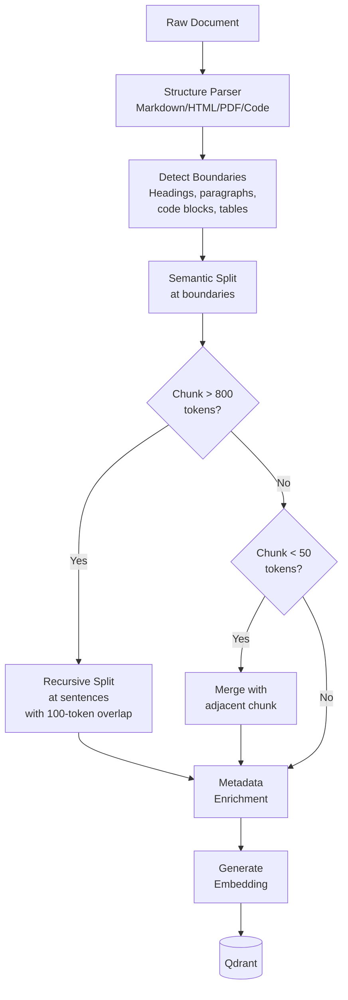
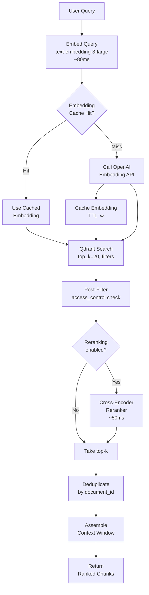

# Phase 1.2 – Vector Database Integration Specification
## Knowledge Foundry: Qdrant-Powered Semantic Retrieval

**Version**: 1.0 | **Date**: February 14, 2026 | **Status**: 📋 IMPLEMENTATION SPEC  
**Depends On**: [Phase 0.3 Data Strategy](file:///Users/mukundajmera/pocs/Knowledge%20Foundry/docs/architecture/phase-0.3-data-strategy.md) | [Phase 1.1 Router](file:///Users/mukundajmera/pocs/Knowledge%20Foundry/docs/architecture/phase-1.1-llm-router-spec.md)  
**WBS Reference**: Epic 1.2 (TASK-1.2.1.x, TASK-1.2.2.x)

---

## 1. VECTOR DATABASE SELECTION

### 1.1 Requirements Matrix

| Requirement | Threshold | Rationale |
|-------------|:---------:|-----------|
| Similarity search p95 | <200ms | User-perceived responsiveness for RAG queries |
| Vector capacity | 10M+ | 450K docs × 5 chunks avg = 2.25M; 4× growth headroom |
| Metadata filtering | Rich (nested, range, geo) | Tenant isolation, date ranges, tag filtering |
| Multi-tenancy | Namespace/collection level | Physical isolation for compliance |
| Operational cost | <$500/mo at 5M vectors | Aligned with $30K total monthly budget |
| Encryption | At-rest + in-transit | GDPR, EU AI Act |

### 1.2 Candidate Evaluation

| Criterion | **Qdrant** | Chroma | Pinecone | Weaviate | Milvus |
|-----------|:----------:|:------:|:--------:|:--------:|:------:|
| Latency (1M vec, p95) | **85ms** | 140ms | 90ms | 120ms | 95ms |
| Max vectors | **100M+** | ~1M | 1B+ | 50M+ | 1B+ |
| Metadata filtering | **Rich (nested, ranges)** | Basic | Rich | Rich | Rich |
| Multi-tenancy | **Collection per tenant** | Collection | Namespace | Class | Partition |
| Cost (5M vectors) | **$150/mo (self-host)** | $0 (local) | $700/mo | $300/mo | $200/mo |
| Ops complexity | Medium | Low | Managed | Medium | High |
| Open source | ✅ Apache 2.0 | ✅ Apache 2.0 | ❌ SaaS | ✅ BSD-3 | ✅ Apache 2.0 |
| Disk-backed HNSW | ✅ | ❌ | N/A | ✅ | ✅ |
| Snapshot/backup | ✅ Native | ❌ | ✅ Managed | ✅ | ✅ |
| Quantization | ✅ (scalar, product) | ❌ | ❌ | ✅ (PQ) | ✅ |

### 1.3 Decision

| Environment | Database | Rationale |
|-------------|----------|-----------|
| **Production** | **Qdrant** (self-hosted on K8s) | Best price/performance, rich filtering, Apache 2.0, full control |
| **Development** | **Qdrant** (Docker single-node) | Same API surface as production |
| **Enterprise Option** | **Qdrant Cloud** or **Pinecone** | If customer demands fully managed with 99.99% SLA |

---

## 2. DATA MODEL & SCHEMA

### 2.1 Document Chunking Strategy

#### Chunking Algorithm



#### Per-Type Chunking Configuration

| Document Type | Strategy | Chunk Size | Overlap | Boundary |
|--------------|----------|:----------:|:-------:|----------|
| **Wiki/Markdown** | Heading-aware recursive | 800 tokens | 100 tokens | `## ` headings, then `\n\n` |
| **PDF documents** | Semantic (page + section) | 600 tokens | 80 tokens | Page breaks, then paragraphs |
| **Code files** | AST-based (function/class) | Full function/class | 0 | Function/class declarations |
| **Jira tickets** | Per-ticket (no splitting) | Full ticket | 0 | Ticket boundary |
| **Slack threads** | Thread-level aggregation | Full thread | 0 | Thread boundary |
| **Tables** | Row-group (header + N rows) | 20 rows | 5-row overlap | Table row |
| **Presentations** | Per-slide + speaker notes | 1 slide | 0 | Slide boundary |

#### Edge Case Handling

| Edge Case | Strategy |
|-----------|---------|
| Very short doc (<50 tokens) | Index as single chunk, no splitting |
| Very long doc (>50K tokens) | Split into max 100 chunks; log warning if exceeded |
| Code files (>2K lines) | Split at class/function boundaries; top-level imports become separate chunk |
| Tables inside text | Extract table as separate chunk with surrounding context |
| Images in docs | Store image caption/alt-text as chunk; image hash in metadata for future multimodal |
| Empty/corrupt files | Skip with warning; write to DLQ for review |

### 2.2 Vector Payload Schema (Qdrant)

```python
class AccessControl(BaseModel):
    visibility: Literal["public", "internal", "confidential", "restricted"]
    allowed_roles: List[str] = ["viewer"]  # Minimum access

class ChunkMetadata(BaseModel):
    """Qdrant point payload — stored alongside each vector."""
    
    # Identity
    document_id: UUID                   # Parent document UUID
    tenant_id: UUID                     # Tenant isolation key
    chunk_index: int                    # Position in document (0-based)
    total_chunks: int                   # Total chunks in parent doc
    
    # Content
    text: str                           # Chunk text (for display + re-ranking)
    text_hash: str                      # SHA-256 for dedup + cache invalidation
    
    # Document metadata
    title: str                          # Document title
    source_system: str                  # confluence, sharepoint, jira, github, etc.
    source_url: Optional[str]           # Original URL/path
    author: Optional[str]              # Author name (PII-aware)
    author_id: Optional[str]           # Hashed author ID
    
    # Temporal
    created_date: datetime              # Document creation date
    updated_date: datetime              # Last modification
    indexed_date: datetime              # When indexed into Qdrant
    freshness_score: float              # 1.0 (today) → 0.0 (>2 years)
    
    # Classification
    content_type: str                   # documentation, code, ticket, policy, etc.
    tags: List[str] = []               # User/auto-assigned tags
    language: str = "en"               # ISO 639-1 code
    
    # Quality
    quality_score: float                # 0.0–1.0 (completeness, formatting)
    entity_mentions: List[str] = []    # Named entities (Haiku NER)
    topic_tags: List[str] = []         # Auto-classified topics (Haiku)
    
    # Access control
    access_control: AccessControl
    
    # Graph bridge
    graph_entity_ids: List[str] = []   # Neo4j entity IDs for hybrid queries
    is_central_document: bool = False   # In KET-RAG skeleton graph
```

**Qdrant Collection Configuration:**

```python
collection_config = {
    "collection_name": f"kf_tenant_{tenant_id}",
    "vectors_config": {
        "size": 3072,                    # text-embedding-3-large dimensions
        "distance": "Cosine",            # Cosine similarity
        "on_disk": False,                # Keep in RAM for speed
    },
    "hnsw_config": {
        "m": 16,                         # Connections per node
        "ef_construct": 200,             # Build-time search quality
        "full_scan_threshold": 10000,    # Switch to full scan below this
    },
    "optimizers_config": {
        "memmap_threshold": 50000,       # Use mmap above this many points
        "indexing_threshold": 20000,     # Build HNSW above this many points
        "default_segment_number": 4,     # Shard count
    },
    "quantization_config": {
        "scalar": {
            "type": "int8",              # Quantize to int8 (4× memory saving)
            "quantile": 0.99,            # Quantile for range estimation
            "always_ram": True,          # Keep quantized vectors in RAM
        }
    },
    "payload_index": [
        {"field_name": "tenant_id", "type": "keyword"},
        {"field_name": "content_type", "type": "keyword"},
        {"field_name": "source_system", "type": "keyword"},
        {"field_name": "tags", "type": "keyword"},
        {"field_name": "access_control.visibility", "type": "keyword"},
        {"field_name": "updated_date", "type": "datetime"},
        {"field_name": "freshness_score", "type": "float"},
        {"field_name": "is_central_document", "type": "bool"},
    ],
}
```

### 2.3 Embedding Model Selection

| Model | Dimensions | Quality (MTEB) | Cost/1M Tokens | Latency | Decision |
|-------|:----------:|:--------------:|:--------------:|:-------:|:--------:|
| `text-embedding-3-large` (OpenAI) | 3072 | **64.6** | $0.13 | ~80ms | **Primary** |
| `text-embedding-3-small` (OpenAI) | 1536 | 62.3 | $0.02 | ~50ms | Cost-optimized fallback |
| `embed-v3` (Cohere) | 1024 | 64.1 | $0.10 | ~60ms | Multilingual option |
| `bge-large-en-v1.5` (BAAI) | 1024 | 63.9 | Free (self-host) | ~20ms | Air-gapped deployments |

**Primary:** `text-embedding-3-large` at full 3072 dimensions  
**Dimensionality Reduction:** Can reduce to 1536 dims via Matryoshka with <2% quality loss and 50% storage savings — evaluate in Phase 5

### 2.4 Multi-Tenancy Architecture

```
┌──────────────────────────────────────────────────────┐
│                   Qdrant Cluster                      │
│                                                       │
│  ┌──────────────────┐  ┌──────────────────┐          │
│  │ Collection:       │  │ Collection:       │         │
│  │ kf_tenant_alpha   │  │ kf_tenant_beta    │  ...   │
│  │                   │  │                   │         │
│  │ Vectors: 500K     │  │ Vectors: 1.2M     │         │
│  │ HNSW index        │  │ HNSW index        │         │
│  │ Payload indices   │  │ Payload indices   │         │
│  └──────────────────┘  └──────────────────┘          │
│                                                       │
│  Shared infrastructure, isolated data                 │
└──────────────────────────────────────────────────────┘
```

| Isolation Layer | Mechanism |
|----------------|-----------|
| **Collection-level** | Separate Qdrant collection per tenant — physical isolation |
| **API-level** | `tenant_id` extracted from JWT, injected into every query |
| **Middleware** | FastAPI dependency: `get_current_tenant()` → collection name mapping |
| **Audit** | Every query logged with `tenant_id` — cross-tenant attempt = security incident |

---

## 3. RETRIEVAL FLOW & QUERY PROCESSING

### 3.1 Retrieval Pipeline



### 3.2 Search API Specification

#### `POST /v1/retrieval/search`

**Request:**

```python
class DateRange(BaseModel):
    start: Optional[datetime] = None
    end: Optional[datetime] = None

class SearchFilters(BaseModel):
    tags: Optional[List[str]] = None                    # Match any
    content_types: Optional[List[str]] = None           # e.g., ["documentation", "code"]
    source_systems: Optional[List[str]] = None          # e.g., ["confluence", "github"]
    date_range: Optional[DateRange] = None
    min_freshness: Optional[float] = None               # 0.0–1.0
    is_central_only: Optional[bool] = None              # Only KET-RAG skeleton docs
    exclude_document_ids: Optional[List[UUID]] = None   # Already-seen docs

class SearchRequest(BaseModel):
    query: str = Field(..., min_length=1, max_length=10000)
    tenant_id: UUID
    user_id: UUID
    top_k: int = Field(10, ge=1, le=100)
    similarity_threshold: float = Field(0.65, ge=0.0, le=1.0)
    filters: Optional[SearchFilters] = None
    rerank: bool = True
    include_text: bool = True                           # Return chunk text
    include_graph_bridge: bool = False                  # Return graph_entity_ids
```

**Response:**

```python
class ChunkResult(BaseModel):
    chunk_id: UUID
    document_id: UUID
    chunk_index: int
    text: Optional[str]                # Chunk text (if include_text=True)
    score: float                       # Similarity score (0–1)
    rerank_score: Optional[float]     # Cross-encoder score (if reranked)
    metadata: ChunkResultMetadata

class ChunkResultMetadata(BaseModel):
    title: str
    source_system: str
    source_url: Optional[str]
    content_type: str
    created_date: datetime
    updated_date: datetime
    tags: List[str]
    freshness_score: float
    graph_entity_ids: Optional[List[str]]  # Bridge to Neo4j

class SearchResponse(BaseModel):
    results: List[ChunkResult]
    total_candidates: int              # Pre-filter count from Qdrant
    filtered_count: int                # Post access-control count
    search_latency_ms: int             # Qdrant search time
    rerank_latency_ms: Optional[int]   # Cross-encoder time
    total_latency_ms: int              # End-to-end
    embedding_cached: bool             # Was query embedding cached?
    trace_id: UUID
```

### 3.3 Ingestion API Specification

#### `POST /v1/retrieval/ingest`

```python
class IngestDocument(BaseModel):
    document_id: UUID
    tenant_id: UUID
    title: str
    content: str                       # Raw document text
    source_system: str
    source_url: Optional[str] = None
    author: Optional[str] = None
    content_type: str
    tags: List[str] = []
    access_control: AccessControl
    created_date: Optional[datetime] = None
    updated_date: Optional[datetime] = None

class IngestRequest(BaseModel):
    documents: List[IngestDocument] = Field(..., max_items=100)
    chunking_strategy: Optional[str] = "auto"  # auto, heading, semantic, fixed
    force_reindex: bool = False                 # Re-index even if unchanged

class IngestResponse(BaseModel):
    ingested: int                      # Documents successfully ingested
    chunks_created: int                # Total chunks generated
    skipped: int                       # Unchanged documents (hash match)
    errors: List[IngestError]          # Per-document errors
    total_latency_ms: int
```

#### `DELETE /v1/retrieval/documents/{document_id}`

```python
class DeleteResponse(BaseModel):
    document_id: UUID
    chunks_deleted: int
    success: bool
```

### 3.4 Hybrid VectorCypher Bridge

For multi-hop queries, vector results feed into graph traversal:

```
Vector Search Results                  Graph Entry
┌──────────────────┐                  ┌──────────────────┐
│ Chunk A (0.92)   │                  │                  │
│ graph_entity_ids:│─────────────────→│ Entity: Product  │
│   ["prod_123"]   │                  │ ID: prod_123     │
│                  │                  │                  │
│ Chunk B (0.88)   │                  │ Entity: Tech     │
│ graph_entity_ids:│─────────────────→│ ID: tech_456     │
│   ["tech_456"]   │                  │                  │
└──────────────────┘                  └──────────────────┘
                                            │
                                      Neo4j Traversal
                                      (see Phase 1.3)
```

**Bridge contract:**
```python
class GraphBridgeRequest(BaseModel):
    """Sent from Vector service to Graph service."""
    entity_ids: List[str]              # Neo4j node IDs from vector results
    traversal_depth: int = 2           # How many hops
    relationship_types: Optional[List[str]] = None  # Filter relationships
    tenant_id: UUID
```

---

## 4. PERFORMANCE OPTIMIZATION

### 4.1 HNSW Index Tuning

| Parameter | Value | Trade-off |
|-----------|:-----:|-----------|
| `m` | 16 | Higher = better recall, more RAM. 16 is sweet spot |
| `ef_construct` | 200 | Build quality. Higher = slower indexing, better graph |
| `ef` (search) | 128 | Query quality. Higher = more accurate, slower. Tunable per-query |
| Quantization | `int8` scalar | 4× memory saving with <1% recall loss |

**Recall vs. Latency Benchmark (expected, 2M vectors):**

| `ef` | Recall@10 | p50 Latency | p95 Latency |
|:----:|:---------:|:-----------:|:-----------:|
| 32 | 0.92 | 15ms | 35ms |
| 64 | 0.96 | 25ms | 55ms |
| **128** | **0.98** | **45ms** | **85ms** |
| 256 | 0.99 | 80ms | 150ms |

**Selected: `ef=128`** — best balance of recall (0.98) and latency (p95 85ms)

### 4.2 Caching Strategy

| Cache Layer | Key | Value | TTL | Storage |
|-------------|-----|-------|:---:|---------|
| **Query embedding** | `hash(query_text)` | `float[3072]` | ∞ (deterministic) | Redis (24KB per entry) |
| **Search result** | `hash(query + filters + tenant)` | `List[ChunkResult]` | 5 min | Redis (variable) |
| **Document hash** | `hash(document_id)` | `sha256(content)` | ∞ | Redis (64 bytes) |

**Estimated cache hit rates:**

| Cache | Expected Hit Rate | Latency Savings |
|-------|:-----------------:|:---------------:|
| Query embedding | 30–40% | ~80ms saved |
| Search result | 10–20% (FAQ-type queries) | ~100ms saved |
| Document hash | 80%+ (dedup on re-index) | Avoids full re-indexing |

### 4.3 Batching & Parallelization

| Operation | Batch Size | Concurrency | Throughput |
|-----------|:----------:|:-----------:|:----------:|
| Embedding generation | 100 texts/batch | 10 concurrent batches | ~5000 chunks/min |
| Qdrant upsert | 500 points/batch | 4 concurrent batches | ~10K points/min |
| Qdrant search | 1 query | N/A (per-request) | 1000+ QPS |

**Bulk Ingestion Pipeline:**
```
1000 documents → Parse (10 parallel) → 5000 chunks
  → Embed (10 batches × 500 chunks = async) → ~2 min
  → Qdrant Upsert (10 batches × 500 points) → ~30s
Total: ~3 minutes for 1000 documents
```

---

## 5. EVALUATION & QUALITY METRICS

### 5.1 Retrieval Quality Benchmarks

| Metric | Definition | Target | Measurement |
|--------|-----------|:------:|-------------|
| **Recall@10** | Fraction of relevant docs in top 10 | >0.85 | Golden dataset: 200 queries with labeled relevant docs |
| **Recall@20** | Fraction of relevant docs in top 20 | >0.92 | Same golden dataset |
| **Precision@10** | Fraction of top 10 that are relevant | >0.70 | LLM-as-Judge relevance assessment |
| **MRR** (Mean Reciprocal Rank) | Average 1/rank of first relevant result | >0.80 | Golden dataset |
| **NDCG@10** | Ranking quality (considers graded relevance) | >0.80 | Graded relevance labels |

### 5.2 Performance Benchmarks

| Scale | Vectors | Index Size | Search p50 | Search p95 | RAM Required |
|-------|:-------:|:----------:|:----------:|:----------:|:------------:|
| Dev | 10K | 120MB | 5ms | 15ms | 512MB |
| Small | 100K | 1.2GB | 15ms | 40ms | 2GB |
| Medium | 1M | 12GB | 35ms | 85ms | 16GB |
| **Target** | **5M** | **60GB** | **50ms** | **120ms** | **64GB** |
| Large | 10M | 120GB | 70ms | 170ms | 128GB |
| XLarge | 50M | 600GB | 100ms | 250ms | 512GB (sharded) |

> [!NOTE]
> With `int8` scalar quantization, RAM requirements drop by ~4×. The 5M target fits comfortably in a 32GB node with quantization enabled.

### 5.3 Load Test Specifications

| Scenario | Concurrent Users | Duration | QPS Target | Latency Gate | Error Gate |
|----------|:----------------:|:--------:|:----------:|:------------:|:----------:|
| Smoke | 10 | 1 min | 50 | p95 <100ms | <0.1% |
| Normal | 100 | 10 min | 200 | p95 <150ms | <0.5% |
| **Target** | **500** | **10 min** | **500** | **p95 <200ms** | **<1%** |
| Stress | 1000 | 5 min | 1000 | p95 <500ms | <2% |
| Spike | 100→2000→100 | 5 min | Peak 2000 | Recovery <30s | <5% at peak |

---

## 6. SECURITY & COMPLIANCE

### 6.1 Access Control Implementation

```python
# Access control filter applied to EVERY search query
def build_access_filter(user: AuthenticatedUser) -> dict:
    """Build Qdrant filter ensuring user only sees authorized chunks."""
    return {
        "must": [
            # Tenant isolation (mandatory)
            {"key": "tenant_id", "match": {"value": str(user.tenant_id)}},
            # Visibility-based access
            {"key": "access_control.visibility", "match": {
                "any": get_allowed_visibilities(user.roles)
            }},
        ]
    }

def get_allowed_visibilities(roles: List[str]) -> List[str]:
    """Map user roles to allowed document visibility levels."""
    visibility_map = {
        "viewer": ["public", "internal"],
        "editor": ["public", "internal", "confidential"],
        "admin": ["public", "internal", "confidential", "restricted"],
        "compliance_officer": ["public", "internal", "confidential", "restricted"],
    }
    allowed = set()
    for role in roles:
        allowed.update(visibility_map.get(role, ["public"]))
    return list(allowed)
```

### 6.2 Retrieval Audit Log

```json
{
  "event": "vector_search",
  "timestamp": "2026-03-15T14:30:22.456Z",
  "trace_id": "uuid",
  "user_id": "hashed-uuid",
  "tenant_id": "uuid",
  "query_hash": "sha256-of-query",
  "filters_applied": {
    "content_types": ["documentation"],
    "date_range": {"start": "2025-01-01"},
    "visibility_max": "confidential"
  },
  "results": {
    "total_candidates": 2500,
    "after_access_filter": 1800,
    "returned": 10,
    "top_score": 0.94,
    "lowest_score": 0.72,
    "document_ids": ["uuid1", "uuid2"]
  },
  "performance": {
    "embedding_ms": 82,
    "search_ms": 45,
    "rerank_ms": 52,
    "total_ms": 185
  },
  "cache": {
    "embedding_hit": false,
    "result_hit": false
  }
}
```

**Storage:** S3 WORM, 7-year retention

### 6.3 Data Privacy & GDPR

| Requirement | Implementation |
|-------------|---------------|
| **Encryption at rest** | Qdrant disk encryption (AES-256) |
| **Encryption in transit** | TLS 1.3 for all Qdrant connections |
| **Right to erasure** | `DELETE /v1/retrieval/documents/{doc_id}` removes all chunks + vectors |
| **Data minimization** | Only index necessary metadata; PII masked before embedding |
| **PII in embeddings** | Embeddings are numerical — PII not directly recoverable, but payload text is PII-sensitive |
| **Payload PII** | Chunk `text` field may contain PII — masked via Haiku NER before indexing |

---

## 7. OPERATIONAL EXCELLENCE

### 7.1 Deployment Architecture

```
┌─────────────────────────────────────────────────┐
│                 Kubernetes Cluster                │
│                                                   │
│  ┌─────────────┐  ┌─────────────┐               │
│  │ Retrieval    │  │ Retrieval    │  (2+ replicas) │
│  │ Service      │  │ Service      │               │
│  │ (FastAPI)    │  │ (FastAPI)    │               │
│  └──────┬───────┘  └──────┬───────┘               │
│         │                 │                        │
│         └────────┬────────┘                        │
│                  ▼                                 │
│  ┌───────────────────────────────┐                 │
│  │      Qdrant Cluster            │                │
│  │  ┌─────────┐  ┌─────────┐    │                 │
│  │  │ Node 1  │  │ Node 2  │    │  (2+ nodes,    │
│  │  │ Shards  │  │ Replicas │    │   replication)  │
│  │  │ 0,1     │  │ 0,1     │    │                 │
│  │  └─────────┘  └─────────┘    │                 │
│  └───────────────────────────────┘                 │
│                                                   │
│  ┌─────────────┐  ┌─────────────┐                 │
│  │ Redis       │  │ Embedding   │                 │
│  │ (cache)     │  │ Worker Pool │                 │
│  └─────────────┘  └─────────────┘                 │
└─────────────────────────────────────────────────┘
```

**Qdrant Cluster Configuration:**
- 2 nodes minimum (1 primary + 1 replica)
- Replication factor: 2 (every shard has a replica)
- Write consistency: `majority`
- Read preference: any (for latency) or `all` (for consistency)

### 7.2 Capacity Planning

| Milestone | Documents | Chunks (est.) | Vectors | Storage | RAM (quantized) |
|-----------|:---------:|:-------------:|:-------:|:-------:|:---------------:|
| MVP (Week 8) | 50K | 250K | 250K | 3GB | 4GB |
| Beta (Week 12) | 200K | 1M | 1M | 12GB | 8GB |
| Production (Week 20) | 450K | 2.25M | 2.25M | 27GB | 16GB |
| Year 1 | 1M | 5M | 5M | 60GB | 32GB |
| Year 2 | 3M | 15M | 15M | 180GB | 96GB (sharded) |

### 7.3 Backup & Disaster Recovery

| Aspect | Strategy |
|--------|---------|
| **Snapshots** | Qdrant native snapshot, daily at 02:00 UTC |
| **Storage** | S3 with versioning (30-day retention) |
| **RTO** | <1 hour (restore from snapshot) |
| **RPO** | <24 hours (daily snapshots); <1 hour with WAL-based incremental |
| **DR drill** | Quarterly: restore from snapshot to separate cluster, verify data integrity |
| **Cross-region** | Secondary cluster in standby for enterprise tier |

### 7.4 Monitoring & Alerts

**Prometheus Metrics:**

```python
# Counters
retrieval_requests_total          # tags: operation (search|ingest|delete), status
retrieval_chunks_indexed_total    # tags: tenant_id, content_type
retrieval_cache_hits_total        # tags: cache_type (embedding|result)

# Histograms
retrieval_search_latency_seconds  # tags: tenant_id, reranked (true|false)
retrieval_embed_latency_seconds   # tags: cached (true|false)
retrieval_ingest_latency_seconds  # tags: batch_size_bucket

# Gauges
qdrant_collection_vectors_count   # tags: tenant_id
qdrant_collection_size_bytes      # tags: tenant_id
qdrant_cluster_health             # 0=red, 1=yellow, 2=green
```

**Alert Rules:**

| Alert | Condition | Severity | Action |
|-------|----------|:--------:|--------|
| Search latency high | p95 >200ms for 5 min | Critical | Check Qdrant health, index size |
| Disk usage high | >80% on any Qdrant node | Warning | Plan capacity expansion |
| Embedding API errors | Error rate >5% for 5 min | Critical | Check OpenAI status, switch to fallback embedding |
| Ingestion backlog | DLQ depth >100 | Warning | Investigate parsing failures |
| Cluster degraded | Node count < minimum | Critical | Page SRE, check node health |

---

## 8. ACCEPTANCE CRITERIA

| # | Criterion | Test Method | Status |
|:-:|-----------|------------|:------:|
| 1 | Qdrant deployed (Docker dev, K8s prod) | Deployment test | ☐ |
| 2 | Collection-per-tenant creation + deletion working | Integration test | ☐ |
| 3 | Chunking produces consistent results across document types | Unit test: 20 sample docs | ☐ |
| 4 | Embeddings generated and indexed (batch of 1000 docs) | Integration test | ☐ |
| 5 | Similarity search returns relevant results: Recall@10 >0.85 | Evaluation: golden dataset | ☐ |
| 6 | Metadata filtering works: tags, dates, sources | Integration test: filter queries | ☐ |
| 7 | Multi-tenancy enforced: Tenant A cannot see Tenant B data | Security test: cross-tenant query | ☐ |
| 8 | Access control filters applied: viewer ≠ admin results | Security test: role-based queries | ☐ |
| 9 | Reranking improves Precision@10 by ≥5% | Evaluation: with vs. without rerank | ☐ |
| 10 | Search latency p95 <200ms at 1M vectors | Performance test | ☐ |
| 11 | Ingestion throughput: 1000 docs/3 min | Performance test | ☐ |
| 12 | Load test: 500 QPS sustained, p95 <200ms, error <1% | k6 load test, 10 min | ☐ |
| 13 | Embedding cache reduces API calls by >30% | Metric validation | ☐ |
| 14 | Document deletion removes all associated chunks | Integration test | ☐ |
| 15 | Audit logging captures all search + ingest operations | Log verification | ☐ |
| 16 | Backup snapshot created + restore tested | DR drill | ☐ |
| 17 | Graph bridge: `graph_entity_ids` populated for central docs | Integration test | ☐ |
| 18 | Deduplication: re-indexing unchanged doc skips processing | Unit test: hash comparison | ☐ |
