# Phase 1.3 – Graph Database & KET-RAG Implementation Specification
## Knowledge Foundry: Neo4j-Powered Multi-Hop Reasoning

**Version**: 1.0 | **Date**: February 14, 2026 | **Status**: 📋 IMPLEMENTATION SPEC  
**Depends On**: [Phase 0.3 Data Strategy](file:///Users/mukundajmera/pocs/Knowledge%20Foundry/docs/architecture/phase-0.3-data-strategy.md) | [ADR-002 KET-RAG](file:///Users/mukundajmera/pocs/Knowledge%20Foundry/docs/ADRs/ADR-002-ket-rag-over-full-graphrag.md) | [Phase 1.2 Vector DB](file:///Users/mukundajmera/pocs/Knowledge%20Foundry/docs/architecture/phase-1.2-vector-db-spec.md)  
**WBS Reference**: Epic 1.3 (TASK-1.3.1.x – TASK-1.3.4.x)

---

## 1. GRAPH DATABASE SELECTION

### 1.1 Requirements Matrix

| Requirement | Threshold | Rationale |
|-------------|:---------:|-----------|
| 2-3 hop traversal p95 | <300ms | Hybrid queries have 500ms total budget; graph share is 300ms |
| Entity capacity | 100K+ entities | Phase 0.3 estimates ~90K entities at scale |
| Relationship capacity | 500K+ edges | ~5 rels/entity average |
| Query language | Cypher | Team familiarity, audit readability, EU AI Act explainability |
| Multi-tenancy | Property-level | Tenant isolation without per-tenant DB overhead |
| Integration | Vector bridge | `graph_entity_ids` link from Qdrant (Phase 1.2) |

### 1.2 Candidate Evaluation

| Criterion | **Neo4j** | Neptune | TigerGraph | ArangoDB | FalkorDB |
|-----------|:---------:|:-------:|:----------:|:--------:|:--------:|
| Traversal (2-hop, 50K nodes) | **8ms** | 25ms | 5ms | 30ms | 12ms |
| Traversal (3-hop, 50K nodes) | **45ms** | 120ms | 30ms | 180ms | 60ms |
| Max nodes (practical) | **100M+** | 1B+ | 1B+ | 10M+ | 50M+ |
| Query language | **Cypher** ✓ | Gremlin/SPARQL | GSQL | AQL | Cypher |
| Graph Data Science lib | **GDS (PageRank, etc.)** | Limited | Built-in | Limited | Limited |
| Full-text search | ✓ Built-in | ✓ | ✓ | ✓ | ✓ |
| Community Edition | ✓ Free | ❌ SaaS | ❌ Enterprise | ✓ Free | ✓ Free |
| K8s Operator | ✓ Official | Managed | Enterprise | Community | Community |
| Ecosystem maturity | **10+ years** | 5 years | 7 years | 8 years | 2 years |

### 1.3 Decision

| Environment | Database | Rationale |
|-------------|----------|-----------|
| **Production** | **Neo4j Community 5.x** (self-hosted K8s) | Best Cypher support, GDS library for PageRank, largest ecosystem |
| **Development** | **Neo4j** (Docker single-node) | Same API surface as production |
| **Enterprise Option** | **Neo4j AuraDB** or **Amazon Neptune** | Fully managed for customers requiring SaaS |

> [!NOTE]
> Neo4j Community Edition is sufficient for <100M nodes. If we exceed this (unlikely in Phase 1), we migrate to Neo4j Enterprise or AuraDB.

---

## 2. KNOWLEDGE GRAPH SCHEMA

### 2.1 Entity Types (Node Labels)

```mermaid
graph TD
    subgraph "Core Entities"
        DOC[📄 Document]
        CONCEPT[💡 Concept]
        PERSON[👤 Person]
        ORG[🏢 Organization]
        PRODUCT[📦 Product]
        PROCESS[⚙️ Process]
        REG[📜 Regulation]
        TECH[🔧 Technology]
    end
    
    subgraph "Supplementary Entities"
        TEAM[👥 Team]
        COMPONENT[🧩 Component]
        TICKET[🎫 Ticket]
        DECISION[📋 Decision]
        RISK[⚠️ Risk]
    end
```



#### Entity Property Specifications

```python
# Node schemas — used for validation during extraction and ingestion

class DocumentNode(BaseModel):
    """Represents a source document in the knowledge graph."""
    id: UUID
    tenant_id: UUID
    title: str
    source_system: str                # confluence, sharepoint, github, etc.
    source_url: Optional[str]
    content_type: str                 # policy, architecture, code, ticket
    content_hash: str                 # SHA-256 for change detection
    created_date: datetime
    updated_date: datetime
    author_id: Optional[str]
    is_skeleton: bool = False         # In KET-RAG skeleton set
    pagerank_score: float = 0.0       # Centrality score
    labels: List[str] = ["Document"] # Additional labels: Policy, Code, etc.

class ConceptNode(BaseModel):
    """Abstract concept extracted from documents."""
    id: UUID
    tenant_id: UUID
    name: str                         # Canonical name
    aliases: List[str] = []          # Alternative names
    description: Optional[str]
    category: str                     # technology, business, process, domain
    embedding: Optional[List[float]] # For concept similarity (768 dims)

class PersonNode(BaseModel):
    """Person entity (PII-aware)."""
    id: UUID
    tenant_id: UUID
    name_hash: str                    # Hashed for GDPR
    display_name: str                 # Can be pseudonymized
    role: Optional[str]
    team_id: Optional[str]
    expertise_areas: List[str] = []
    document_count: int = 0          # Documents authored

class OrganizationNode(BaseModel):
    """External organization (customer, supplier, partner)."""
    id: UUID
    tenant_id: UUID
    name: str
    org_type: Literal["customer", "supplier", "partner", "regulator"]
    industry: Optional[str]
    tier: Optional[Literal["platinum", "gold", "silver", "bronze"]]
    active: bool = True

class ProductNode(BaseModel):
    """Product, service, or software component."""
    id: UUID
    tenant_id: UUID
    name: str
    version: Optional[str]
    status: Literal["active", "deprecated", "planning", "eol"]
    owner_team_id: Optional[str]
    criticality: Literal["critical", "high", "medium", "low"]

class ProcessNode(BaseModel):
    """Business process or workflow."""
    id: UUID
    tenant_id: UUID
    name: str
    description: Optional[str]
    owner_id: Optional[str]
    data_category: Optional[str]     # PII, financial, public
    automation_level: Optional[str]  # manual, semi-auto, auto

class RegulationNode(BaseModel):
    """Regulation, policy, or compliance standard."""
    id: UUID
    tenant_id: UUID
    name: str
    short_name: Optional[str]        # e.g., "GDPR", "SOX"
    jurisdiction: str                 # EU, US, Global
    effective_date: Optional[datetime]
    review_date: Optional[datetime]
    status: Literal["active", "draft", "superseded"]

class TechnologyNode(BaseModel):
    """Technology, tool, or platform."""
    id: UUID
    tenant_id: UUID
    name: str
    category: str                     # database, language, framework, cloud
    version: Optional[str]
    eol_date: Optional[datetime]     # End of life
    status: Literal["supported", "deprecated", "eol", "evaluating"]

class TeamNode(BaseModel):
    """Organizational team."""
    id: UUID
    tenant_id: UUID
    name: str
    department: Optional[str]
    member_count: int = 0
    lead_id: Optional[str]

class ComponentNode(BaseModel):
    """Sub-component of a product."""
    id: UUID
    tenant_id: UUID
    name: str
    component_type: str              # library, service, module
    parent_product_id: Optional[str]

class RiskNode(BaseModel):
    """Identified risk."""
    id: UUID
    tenant_id: UUID
    title: str
    severity: Literal["critical", "high", "medium", "low"]
    likelihood: Literal["almost_certain", "likely", "possible", "unlikely", "rare"]
    mitigation_status: Literal["open", "mitigated", "accepted", "closed"]
```

### 2.2 Relationship Types (Edge Labels)

| Relationship | From | To | Key Properties | Use Case |
|-------------|------|-----|---------------|----------|
| `MENTIONS` | Document | Any entity | `confidence`, `count`, `context_snippet` | Document ↔ Entity linkage |
| `AUTHORED_BY` | Document | Person | `date`, `role` (author/reviewer/approver) | Authorship tracking |
| `DEPENDS_ON` | Product/Component | Technology/Component | `criticality`, `since_version` | Dependency mapping |
| `COMPLIES_WITH` | Product/Process | Regulation | `compliance_status`, `last_audit`, `gap_count` | Compliance tracking |
| `AFFECTS` | Regulation/Technology | Product/Process | `impact_level`, `description` | Impact analysis |
| `HAS_COMPONENT` | Product | Component | `quantity`, `criticality` | Product decomposition |
| `SUPPLIED_BY` | Component | Organization | `contract_end`, `reliability_score` | Supply chain |
| `MANAGED_BY` | Product/Process | Person/Team | `role`, `since`, `accountability` | Ownership mapping |
| `MEMBER_OF` | Person | Team | `role`, `since` | Org structure |
| `RELATED_TO` | Any | Any | `relationship_subtype`, `confidence`, `description` | Semantic catch-all |
| `MITIGATES` | Process/Product | Risk | `effectiveness`, `residual_risk` | Risk management |
| `SUPERSEDES` | Document/Regulation | Document/Regulation | `effective_date` | Version lineage |
| `CITES` | Document | Document | `citation_type`, `section` | Citation graph (for PageRank) |
| `USES` | Process | Technology | `purpose`, `criticality` | Tech-process mapping |
| `REPORTS_TO` | Person/Team | Person/Team | `reporting_type` | Org hierarchy |
| `IMPACTS` | Risk | Product/Process | `severity`, `likelihood` | Risk ↔ Asset |

### 2.3 Neo4j Constraints & Indices

```cypher
-- Uniqueness constraints
CREATE CONSTRAINT doc_unique IF NOT EXISTS FOR (d:Document) REQUIRE d.id IS UNIQUE;
CREATE CONSTRAINT concept_unique IF NOT EXISTS FOR (c:Concept) REQUIRE c.id IS UNIQUE;
CREATE CONSTRAINT person_unique IF NOT EXISTS FOR (p:Person) REQUIRE p.id IS UNIQUE;
CREATE CONSTRAINT org_unique IF NOT EXISTS FOR (o:Organization) REQUIRE o.id IS UNIQUE;
CREATE CONSTRAINT product_unique IF NOT EXISTS FOR (p:Product) REQUIRE p.id IS UNIQUE;
CREATE CONSTRAINT process_unique IF NOT EXISTS FOR (p:Process) REQUIRE p.id IS UNIQUE;
CREATE CONSTRAINT reg_unique IF NOT EXISTS FOR (r:Regulation) REQUIRE r.id IS UNIQUE;
CREATE CONSTRAINT tech_unique IF NOT EXISTS FOR (t:Technology) REQUIRE t.id IS UNIQUE;
CREATE CONSTRAINT team_unique IF NOT EXISTS FOR (t:Team) REQUIRE t.id IS UNIQUE;
CREATE CONSTRAINT component_unique IF NOT EXISTS FOR (c:Component) REQUIRE c.id IS UNIQUE;

-- Performance indices
CREATE INDEX doc_tenant IF NOT EXISTS FOR (d:Document) ON (d.tenant_id);
CREATE INDEX doc_skeleton IF NOT EXISTS FOR (d:Document) ON (d.is_skeleton);
CREATE INDEX concept_name IF NOT EXISTS FOR (c:Concept) ON (c.name);
CREATE INDEX concept_tenant IF NOT EXISTS FOR (c:Concept) ON (c.tenant_id);
CREATE INDEX person_tenant IF NOT EXISTS FOR (p:Person) ON (p.tenant_id);
CREATE INDEX product_tenant IF NOT EXISTS FOR (p:Product) ON (p.tenant_id);
CREATE INDEX product_status IF NOT EXISTS FOR (p:Product) ON (p.status);
CREATE INDEX tech_status IF NOT EXISTS FOR (t:Technology) ON (t.status);
CREATE INDEX reg_jurisdiction IF NOT EXISTS FOR (r:Regulation) ON (r.jurisdiction);

-- Full-text search index
CREATE FULLTEXT INDEX entity_search IF NOT EXISTS
  FOR (n:Document|Concept|Product|Technology|Regulation)
  ON EACH [n.name, n.title, n.description];
```

### 2.4 Schema Diagram


---

## 3. KET-RAG ARCHITECTURE (SKELETON GRAPH)

### 3.1 Skeleton Document Selection Pipeline


#### Centrality Scoring Formula

```python
class CentralityConfig(BaseModel):
    """Hybrid centrality scoring for skeleton selection."""
    
    # Weight distribution (must sum to 1.0)
    pagerank_weight: float = 0.40       # Algorithmic importance
    manual_curation_weight: float = 0.30 # Expert-designated critical docs
    recency_weight: float = 0.15        # Favor recent documents
    citation_count_weight: float = 0.15  # Raw inbound link count

def compute_centrality_score(doc: Document) -> float:
    """Compute hybrid centrality for skeleton selection."""
    score = (
        0.40 * normalize(doc.pagerank_score, max_pr) +
        0.30 * (1.0 if doc.is_manually_curated else 0.0) +
        0.15 * freshness_decay(doc.updated_date, half_life_days=365) +
        0.15 * normalize(doc.inbound_citation_count, max_citations)
    )
    return score

# Skeleton threshold: top N documents where cumulative centrality covers 80% of graph value
SKELETON_THRESHOLD = 0.35  # Documents scoring above this enter skeleton set
```

#### PageRank Execution

```cypher
-- Step 1: Project citation graph
CALL gds.graph.project(
  'citation-graph',
  'Document',
  'CITES',
  { nodeProperties: ['tenant_id', 'updated_date'] }
)

-- Step 2: Run PageRank
CALL gds.pageRank.write('citation-graph', {
  maxIterations: 40,
  dampingFactor: 0.85,
  writeProperty: 'pagerank_score'
})
YIELD nodePropertiesWritten, ranIterations, didConverge

-- Step 3: Select skeleton documents
MATCH (d:Document)
WHERE d.pagerank_score > 0.001  -- Top ~4.5% by PageRank
   OR d.is_manually_curated = true
SET d.is_skeleton = true
RETURN count(d) AS skeleton_count
```

### 3.2 Entity & Relationship Extraction

#### Extraction Pipeline


#### Entity Extraction Prompt

```markdown
<system>
You are a knowledge graph entity extractor for an enterprise knowledge management system.
Extract named entities from the document chunk below.
Return ONLY valid JSON. Do not include explanations.
</system>

<context>
Document Title: {{document_title}}
Source System: {{source_system}}
Content Type: {{content_type}}
</context>

<chunk>
{{chunk_text}}
</chunk>

<entity_types>
Extract these entity types:
- Person: { name, role, team, expertise_areas[] }
- Organization: { name, org_type (customer|supplier|partner|regulator), industry }
- Product: { name, version, status (active|deprecated|planning|eol), criticality }
- Technology: { name, category (database|language|framework|cloud|tool), version }
- Regulation: { name, short_name, jurisdiction (EU|US|Global), status }
- Process: { name, description, data_category (PII|financial|public) }
- Concept: { name, category (business|technical|domain), description }
</entity_types>

<rules>
1. Only extract entities explicitly mentioned in the chunk.
2. Do NOT infer entities not present in the text.
3. Use canonical names (e.g., "PostgreSQL" not "postgres").
4. Include confidence score (0.0-1.0) for each entity.
5. If an entity is ambiguous, set confidence < 0.7.
</rules>

<output_format>
{
  "entities": [
    {
      "type": "Technology",
      "name": "PostgreSQL",
      "properties": { "category": "database", "version": "16" },
      "confidence": 0.95,
      "source_span": "We use PostgreSQL 16 for..."
    }
  ]
}
</output_format>
```

#### Relationship Extraction Prompt

```markdown
<system>
You are a knowledge graph relationship extractor. Given a document chunk and
pre-extracted entities, identify relationships between them.
Return ONLY valid JSON. Do not include explanations.
</system>

<context>
Document Title: {{document_title}}
</context>

<chunk>
{{chunk_text}}
</chunk>

<entities>
{{extracted_entities_json}}
</entities>

<relationship_types>
- DEPENDS_ON: X requires Y to function (criticality: critical|high|medium|low)
- COMPLIES_WITH: X must adhere to regulation Y (compliance_status: compliant|partial|non_compliant)
- AFFECTS: Change in X impacts Y (impact_level: high|medium|low)
- MANAGED_BY: X is owned/managed by Y (role: owner|contributor|reviewer)
- USES: Process X uses Technology Y (purpose, criticality)
- SUPPLIED_BY: Component X is provided by Organization Y
- HAS_COMPONENT: Product X contains Component Y (criticality)
- RELATED_TO: Semantic relationship (describe subtype)
</relationship_types>

<rules>
1. Only extract relationships explicitly stated or strongly implied in the chunk.
2. Both "from" and "to" must be entities in the provided entity list.
3. Include confidence score (0.0-1.0).
4. Include a brief evidence quote from the chunk.
5. Do NOT create relationships between entities that don't interact in this chunk.
</rules>

<output_format>
{
  "relationships": [
    {
      "type": "DEPENDS_ON",
      "from": { "type": "Product", "name": "Knowledge Foundry" },
      "to": { "type": "Technology", "name": "PostgreSQL" },
      "properties": { "criticality": "high", "since_version": "1.0" },
      "confidence": 0.90,
      "evidence": "Knowledge Foundry requires PostgreSQL 16 for persistent storage"
    }
  ]
}
</output_format>
```

#### Entity Resolution Algorithm

```python
class EntityResolutionConfig(BaseModel):
    """Configuration for deduplicating extracted entities."""
    
    # Matching thresholds
    exact_match: float = 1.0               # Identical canonical names
    fuzzy_threshold: float = 0.85          # Levenshtein ratio
    embedding_threshold: float = 0.92      # Cosine similarity of name embeddings
    
    # Resolution strategy
    merge_strategy: str = "highest_confidence"  # Keep entity with highest confidence
    alias_creation: bool = True            # Store non-canonical names as aliases

def resolve_entities(new_entities: List[Entity], existing: List[Entity]) -> List[Entity]:
    """Deduplicate entities against existing graph."""
    # 1. Exact name match (case-insensitive)
    # 2. Fuzzy string match (Levenshtein > 0.85)
    # 3. Embedding similarity (cosine > 0.92)
    # 4. Same-type constraint (Person ≠ Organization even if name matches)
    # 5. Merge: keep highest confidence, union aliases
    ...
```

### 3.3 Cost Model

| Activity | Full GraphRAG (100%) | KET-RAG (4.5%) | Savings |
|----------|:--------------------:|:---------------:|:-------:|
| Documents processed | 450,000 | 20,000 | — |
| Chunks for extraction | 2,250,000 | 100,000 | — |
| Entity extraction (Sonnet) | $67,500 | **$3,000** | 96% |
| Relationship extraction (Sonnet) | $112,500 | **$5,000** | 96% |
| Entity resolution | $5,000 | **$500** | 90% |
| Expert curation (manual) | $0 | **$2,000** | — |
| **Total initial build** | **$185,000** | **$10,500** | **94%** |
| Monthly updates (500 new docs) | $2,000 | **$200** | 90% |
| Neo4j hosting (K8s) | $300/mo | $300/mo | — |

> [!IMPORTANT]
> KET-RAG saves **$174,500** on initial build vs. full GraphRAG while preserving multi-hop reasoning on the most important 4.5% of documents. All 450K documents remain searchable via Qdrant vector search.

### 3.4 Query Routing Decision Tree

```mermaid
graph TD
    Q[User Query] --> ANALYZE{Relationship<br/>keywords?}
    ANALYZE -->|"depends on, impacts,<br/>reports to, supplies"| GRAPH_LIKELY[Graph Likely]
    ANALYZE -->|No| COMPLEXITY{Complexity<br/>score?}
    
    GRAPH_LIKELY --> ENTITIES{Entity IDs<br/>known?}
    ENTITIES -->|Yes| GRAPH_ONLY[🔷 GRAPH_ONLY<br/>Direct Cypher]
    ENTITIES -->|No| HYBRID[🔶 HYBRID<br/>VectorCypher]
    
    COMPLEXITY -->|"< 0.3"| VECTOR[🟢 VECTOR_ONLY<br/>Qdrant search]
    COMPLEXITY -->|"0.3 – 0.7"| VECTOR_PLUS[🟢 VECTOR_ONLY<br/>+ keyword boost]
    COMPLEXITY -->|"> 0.7"| HYBRID
    
    subgraph "Latency Targets"
        VECTOR ---|"p95 < 150ms"| V_TARGET[" "]
        GRAPH_ONLY ---|"p95 < 300ms"| G_TARGET[" "]
        HYBRID ---|"p95 < 500ms"| H_TARGET[" "]
    end
```



---

## 4. HYBRID VECTORCYPHER IMPLEMENTATION

### 4.1 Complete Query Flow


### 4.2 Graph Service API

#### `POST /v1/graph/traverse`

```python
class TraversalRequest(BaseModel):
    entry_entity_ids: List[str]            # Neo4j node IDs from vector bridge
    tenant_id: UUID
    max_hops: int = Field(2, ge=1, le=4)
    relationship_types: Optional[List[str]] = None  # Filter: ["DEPENDS_ON", "AFFECTS"]
    entity_types: Optional[List[str]] = None        # Filter: ["Product", "Technology"]
    min_confidence: float = Field(0.5, ge=0, le=1)  # Prune low-confidence edges
    max_results: int = Field(50, ge=1, le=200)
    include_paths: bool = True                       # Return full traversal paths

class TraversalResult(BaseModel):
    entities: List[GraphEntity]
    relationships: List[GraphRelationship]
    paths: Optional[List[GraphPath]]       # Ordered traversal paths
    connected_document_ids: List[UUID]     # Documents to fetch from Qdrant
    traversal_depth_reached: int
    nodes_explored: int
    latency_ms: int
    trace_id: UUID

class GraphEntity(BaseModel):
    id: str
    type: str                              # Person, Product, Technology, etc.
    name: str
    properties: Dict[str, Any]
    centrality_score: Optional[float]

class GraphRelationship(BaseModel):
    type: str                              # DEPENDS_ON, AFFECTS, etc.
    from_entity_id: str
    to_entity_id: str
    properties: Dict[str, Any]
    confidence: float

class GraphPath(BaseModel):
    nodes: List[str]                       # Ordered node IDs
    edges: List[str]                       # Ordered relationship types
    total_confidence: float                # Product of edge confidences
```

#### `POST /v1/graph/search`

```python
class GraphSearchRequest(BaseModel):
    query: str                             # Natural language or entity name
    tenant_id: UUID
    entity_types: Optional[List[str]] = None
    limit: int = Field(10, ge=1, le=50)
    use_fulltext: bool = True              # Use Neo4j full-text index
    use_embedding: bool = False            # Use concept embeddings (slower)

class GraphSearchResponse(BaseModel):
    entities: List[GraphEntity]
    latency_ms: int
```

#### `POST /v1/graph/cypher` (Admin/Advanced)

```python
class CypherRequest(BaseModel):
    query: str                             # Parameterized Cypher query
    parameters: Dict[str, Any] = {}
    tenant_id: UUID
    read_only: bool = True                 # Enforce read-only for safety
    timeout_ms: int = Field(5000, le=30000)

class CypherResponse(BaseModel):
    records: List[Dict[str, Any]]
    columns: List[str]
    result_count: int
    latency_ms: int
```

### 4.3 Context Assembly Strategy

```python
class HybridContext(BaseModel):
    """Structured context sent to LLM after hybrid retrieval."""
    
    # Section 1: Direct vector matches
    vector_chunks: List[ContextChunk]      # Top-k from Qdrant
    
    # Section 2: Graph structure (rendered as text)
    graph_summary: str                     # Natural language summary of graph traversal
    entities: List[EntitySummary]          # Key entities found
    relationships: List[RelSummary]        # Key relationships
    
    # Section 3: Graph-discovered documents
    related_chunks: List[ContextChunk]     # Chunks from graph-connected documents
    
    # Metadata
    total_token_count: int
    retrieval_strategy: str                # "vector_only", "graph_only", "hybrid"

# Context rendering template for LLM
HYBRID_PROMPT_TEMPLATE = """
## Direct Knowledge (Vector Search)
{vector_chunks_formatted}

## Knowledge Graph Structure
The following entities and relationships are relevant to your question:

### Entities
{entities_table}

### Relationships
{relationships_list}

### Graph Summary
{graph_summary}

## Related Documents (via Knowledge Graph)
{related_chunks_formatted}

---
## Question
{user_query}

## Instructions
1. Answer using ONLY the context provided above.
2. Cite sources using [DOC-xxx] notation.
3. If multi-hop reasoning is needed, show the chain: Entity A → [RELATIONSHIP] → Entity B.
4. If the context is insufficient, say "I don't have enough information to fully answer this."
"""
```

### 4.4 Latency Budget (Hybrid Query)

| Phase | Component | Target p95 | Optimization |
|:-----:|-----------|:----------:|-------------|
| 1 | Query embedding | 80ms | Embedding cache (30%+ hit rate) |
| 2a | Qdrant vector search | 85ms | HNSW ef=128, metadata filters |
| 2b | Neo4j entity text search | 20ms | Full-text index (runs parallel with 2a) |
| 3 | Merge entry entities | 2ms | In-memory set union |
| 4 | Neo4j graph traversal (2-hop) | 80ms | Property indices, confidence pruning |
| 5 | Qdrant fetch related chunks | 40ms | Batch fetch by document_id |
| 6 | Context assembly | 10ms | Template rendering |
| | **Total retrieval** | **≈320ms** | |
| 7 | LLM generation | 300-800ms | Model-dependent |
| | **Total end-to-end** | **≈620-1120ms** | |

> [!NOTE]
> Phases 2a and 2b run in parallel (asyncio.gather), saving ~20ms. The retrieval portion (320ms) fits well within the 500ms target. LLM generation is the dominant cost.

---

## 5. DATA INGESTION & GRAPH CONSTRUCTION

### 5.1 Ingestion Pipeline


### 5.2 Incremental Update Strategy

| Event | Skeleton Doc | Peripheral Doc |
|-------|:------------|:---------------|
| **New document** | Full extraction → Neo4j + Qdrant | Qdrant only |
| **Document updated** | Re-extract entities/rels, diff-merge into Neo4j | Re-chunk, re-embed in Qdrant |
| **Document deleted** | Remove MENTIONS rels; keep entities if referenced elsewhere | Remove chunks from Qdrant |
| **Centrality re-calc** | Monthly: re-run PageRank, promote/demote docs | — |
| **Entity merge** | If 2 entities found to be same → MERGE in Neo4j | — |

#### Diff-Merge for Updated Skeleton Docs

```python
def update_skeleton_document(doc_id: UUID, new_content: str):
    """Re-extract and diff-merge graph data for an updated skeleton document."""
    
    # 1. Extract new entities and relationships
    new_entities = extract_entities(new_content)
    new_rels = extract_relationships(new_content, new_entities)
    
    # 2. Fetch existing graph data for this document
    existing = fetch_document_graph(doc_id)
    
    # 3. Diff
    added_entities = new_entities - existing.entities
    removed_entities = existing.entities - new_entities
    added_rels = new_rels - existing.relationships
    removed_rels = existing.relationships - new_rels
    
    # 4. Apply changes
    for entity in added_entities:
        neo4j.merge_entity(entity)
    for entity in removed_entities:
        if not has_other_mentions(entity):  # Don't delete if other docs reference it
            neo4j.mark_stale(entity)
    for rel in added_rels:
        neo4j.merge_relationship(rel)
    for rel in removed_rels:
        neo4j.delete_relationship(rel)
    
    # 5. Update document node
    neo4j.update_node(doc_id, content_hash=hash(new_content), updated_date=now())
```

### 5.3 Quality Assurance

| Check | Method | Threshold | Action on Fail |
|-------|--------|:---------:|---------------|
| Entity precision | Expert review of 10% sample | >85% | Refine extraction prompts |
| Entity recall | Compare against manually annotated gold set | >75% | Increase context window, add examples |
| Relationship accuracy | Expert review of 10% sample | >80% | Add more relationship examples to prompt |
| Contradiction detection | Cypher: find mutual DEPENDS_ON cycles | 0 cycles | Flag for manual resolution |
| Orphan entities | Cypher: entities with 0 relationships | <5% | Enrich or remove |
| Stale entities | Entities from deleted/superseded docs | Monthly cleanup | Archive or delete |

---

## 6. MULTI-TENANCY & SECURITY

### 6.1 Tenant Isolation

```python
# Every Cypher query gets tenant_id injected automatically
class TenantAwareNeo4jClient:
    """All queries are automatically scoped to tenant."""
    
    async def execute(self, query: str, params: dict, tenant_id: UUID) -> List[Record]:
        # Inject tenant filter into every query
        safe_query = inject_tenant_filter(query, tenant_id)
        return await self._driver.execute_query(safe_query, params)

def inject_tenant_filter(query: str, tenant_id: UUID) -> str:
    """Add WHERE clause for tenant_id to all node matches."""
    # Applied at middleware level — prevents cross-tenant access
    # Example: MATCH (n:Product) → MATCH (n:Product {tenant_id: $tenant_id})
    ...
```

| Layer | Mechanism | Bypass Protection |
|-------|-----------|-------------------|
| **Application** | FastAPI middleware injects `tenant_id` from JWT | Cannot be overridden by query params |
| **Query** | Cypher `WHERE` clause on every node match | Parameterized — no injection |
| **Audit** | Every query logged with `tenant_id` + `user_id` | Cross-tenant attempt = security alert |
| **Test** | Integration test: Tenant A query returns 0 Tenant B nodes | CI/CD gate |

### 6.2 Graph Audit Logging

```json
{
  "event": "graph_query",
  "timestamp": "2026-03-15T14:30:22.456Z",
  "trace_id": "uuid",
  "user_id": "hashed-uuid",
  "tenant_id": "uuid",
  "operation": "traverse",
  "entry_entities": ["entity-id-1", "entity-id-2"],
  "hops": 2,
  "nodes_explored": 47,
  "nodes_returned": 12,
  "relationships_returned": 18,
  "connected_documents": 5,
  "latency_ms": 78,
  "cypher_query_hash": "sha256-of-parameterized-query"
}
```

**Storage:** S3 WORM, 7-year retention (EU AI Act)

### 6.3 PII Handling in Graph

| Data | Strategy |
|------|---------|
| Person names | Hash `name` → `name_hash`; store `display_name` as pseudonym or initials |
| Email addresses | Never stored in graph; resolved via external identity service |
| Organization names | Stored as-is (not PII) |
| Document content | Not stored in graph nodes — only in Qdrant (encrypted at rest) |
| Relationship evidence | `context_snippet` field may contain PII → masked before storage |

---

## 7. OPERATIONAL EXCELLENCE

### 7.1 Deployment Architecture

```
┌──────────────────────────────────────────────────┐
│                Kubernetes Cluster                  │
│                                                    │
│  ┌──────────────┐  ┌──────────────┐              │
│  │ Graph Service │  │ Graph Service │  (2+ pods)  │
│  │ (FastAPI)     │  │ (FastAPI)     │              │
│  └──────┬────────┘  └──────┬────────┘              │
│         └────────┬─────────┘                       │
│                  ▼                                 │
│  ┌────────────────────────────┐                    │
│  │       Neo4j (StatefulSet)   │                   │
│  │  ┌─────────┐               │                   │
│  │  │ Core    │  Single-node   │                   │
│  │  │ (r/w)   │  Community Ed  │                   │
│  │  └─────────┘               │                   │
│  │  PVC: 50GB SSD             │                   │
│  │  RAM: 16GB (heap: 8GB)     │                   │
│  └────────────────────────────┘                    │
│                                                    │
│  ┌──────────────┐  ┌──────────────────┐           │
│  │ Redis Cache  │  │ Extraction Worker │ (async)  │
│  │ (graph cache)│  │ (Celery/ARQ)     │           │
│  └──────────────┘  └──────────────────┘           │
└──────────────────────────────────────────────────┘
```

**Neo4j Tuning:**
```properties
# neo4j.conf
server.memory.heap.initial_size=8g
server.memory.heap.max_size=8g
server.memory.pagecache.size=6g
db.tx_timeout=30s
dbms.security.auth_enabled=true
```

### 7.2 Capacity Planning

| Milestone | Entities | Relationships | DB Size | RAM | Traversal p95 |
|-----------|:--------:|:-------------:|:-------:|:---:|:-------------:|
| MVP (W8) | 5K | 15K | 500MB | 4GB | <30ms |
| Beta (W12) | 20K | 80K | 2GB | 8GB | <60ms |
| Production (W20) | 50K | 200K | 5GB | 16GB | <100ms |
| Year 1 | 90K | 400K | 10GB | 16GB | <150ms |
| Year 2 | 200K | 1M | 25GB | 32GB | <200ms |

### 7.3 Backup & Disaster Recovery

| Aspect | Strategy |
|--------|---------|
| **Backup** | Neo4j `neo4j-admin database dump` daily at 03:00 UTC |
| **Storage** | S3 with 30-day retention |
| **RTO** | <1 hour (restore from dump) |
| **RPO** | <24 hours (daily dumps) |
| **DR drill** | Quarterly: restore to separate instance, run validation queries |
| **Graph integrity** | Post-restore: count nodes/rels, run sample queries, compare checksums |

### 7.4 Monitoring

**Prometheus Metrics:**
```python
# Counters
graph_queries_total               # tags: operation (traverse|search|cypher), status
graph_entities_extracted_total    # tags: entity_type, source_system
graph_relationships_created_total # tags: rel_type

# Histograms
graph_traversal_latency_seconds   # tags: hops, tenant_id
graph_extraction_latency_seconds  # tags: doc_type
graph_search_latency_seconds

# Gauges
graph_total_nodes                 # tags: entity_type, tenant_id
graph_total_relationships         # tags: rel_type, tenant_id
graph_skeleton_documents_count    # tags: tenant_id
neo4j_heap_usage_bytes
neo4j_page_cache_hit_ratio
```

**Alert Rules:**

| Alert | Condition | Severity |
|-------|----------|:--------:|
| Traversal latency high | p95 >300ms for 5 min | Critical |
| Neo4j heap pressure | Heap usage >85% for 10 min | Warning |
| Page cache miss rate | Hit ratio <90% for 5 min | Warning |
| Extraction pipeline stuck | DLQ depth >50 for 30 min | Warning |
| Entity resolution failures | Error rate >10% in batch | Warning |

---

## 8. EVALUATION & QUALITY METRICS

### 8.1 Graph Quality Benchmarks

| Metric | Target | Measurement |
|--------|:------:|-------------|
| Entity precision | >85% | Expert review of 200 random entities |
| Entity recall | >75% | Compare vs. manually annotated gold set (50 docs) |
| Relationship accuracy | >80% | Expert review of 200 random relationships |
| Entity resolution accuracy | >90% | Evaluate on known-duplicate entity pairs |
| Orphan entity rate | <5% | Cypher: `MATCH (n) WHERE NOT (n)--() RETURN count(n)` |

### 8.2 Multi-Hop Retrieval Quality

| Metric | Target | Measurement |
|--------|:------:|-------------|
| 2-hop path accuracy | >80% | Golden dataset: 40 multi-hop queries with labeled paths |
| 3-hop path accuracy | >60% | Golden dataset: 20 complex queries |
| End-to-end RAGAS (multi-hop) | >0.80 | Faithfulness + relevancy on multi-hop golden set |
| Context precision (hybrid) | >0.85 | LLM-as-Judge: was graph context useful? |

---

## 9. ACCEPTANCE CRITERIA

| # | Criterion | Test Method | Status |
|:-:|-----------|------------|:------:|
| 1 | Neo4j deployed (Docker dev, K8s prod) | Deployment test | ☐ |
| 2 | All 13 entity types creatable with schema validation | Unit test | ☐ |
| 3 | All 16 relationship types creatable with properties | Unit test | ☐ |
| 4 | Constraints and indices created (10 unique, 10 property) | Schema verification | ☐ |
| 5 | PageRank computes and marks skeleton documents | Integration test: 1000 docs | ☐ |
| 6 | Entity extraction precision >85% on test corpus (50 docs) | Evaluation test | ☐ |
| 7 | Relationship extraction accuracy >80% on test corpus | Evaluation test | ☐ |
| 8 | Entity resolution deduplicates >90% of known duplicates | Unit test: prepared pairs | ☐ |
| 9 | 2-hop traversal p95 <100ms at 50K entities | Performance test | ☐ |
| 10 | 3-hop traversal p95 <300ms at 50K entities | Performance test | ☐ |
| 11 | Hybrid VectorCypher end-to-end flow works | Integration test: 10 queries | ☐ |
| 12 | Multi-hop RAGAS >0.80 on golden dataset | Evaluation pipeline | ☐ |
| 13 | Tenant A cannot see Tenant B graph data | Security test | ☐ |
| 14 | Audit logging captures all graph queries | Log verification | ☐ |
| 15 | Incremental update: new doc → entities extracted + merged | Integration test | ☐ |
| 16 | Document deletion: MENTIONS removed, shared entities preserved | Integration test | ☐ |
| 17 | Load test: 100 concurrent hybrid queries sustained | k6 load test | ☐ |
| 18 | Backup + restore tested with data integrity check | DR drill | ☐ |
