# Phase 1.4 – Configuration System & Multi-Tenancy Specification
## Knowledge Foundry: Hierarchical Config & Tenant Isolation

**Version**: 1.0 | **Date**: February 14, 2026 | **Status**: 📋 IMPLEMENTATION SPEC  
**Depends On**: [Phase 0.1 Architecture](file:///Users/mukundajmera/pocs/Knowledge%20Foundry/docs/architecture/phase-0.1-enterprise-architecture.md) | [Phase 1.1 Router](file:///Users/mukundajmera/pocs/Knowledge%20Foundry/docs/architecture/phase-1.1-llm-router-spec.md) | [Phase 1.2 Vector DB](file:///Users/mukundajmera/pocs/Knowledge%20Foundry/docs/architecture/phase-1.2-vector-db-spec.md) | [Phase 1.3 Graph DB](file:///Users/mukundajmera/pocs/Knowledge%20Foundry/docs/architecture/phase-1.3-graph-db-ket-rag-spec.md)  
**WBS Reference**: Epic 1.4

---

## 1. TENANCY MODEL

### 1.1 Tenant Hierarchy

```mermaid
graph TD
    PLATFORM["🌐 Platform<br/>Global defaults<br/>Managed by KF team"]
    PLATFORM --> TENANT_A["🏢 Tenant: Acme Corp<br/>tier: enterprise<br/>budget: $10K/mo"]
    PLATFORM --> TENANT_B["🏢 Tenant: Beta Inc<br/>tier: pro<br/>budget: $2K/mo"]
    
    TENANT_A --> WS_ENG["📁 Workspace: Engineering<br/>retrieval: hybrid<br/>model: sonnet default"]
    TENANT_A --> WS_LEG["📁 Workspace: Legal<br/>retrieval: vector_only<br/>compliance: strict"]
    
    WS_ENG --> USER_A["👤 alice@acme.com<br/>role: admin<br/>theme: dark"]
    WS_ENG --> USER_B["👤 bob@acme.com<br/>role: editor<br/>max_tokens: 8192"]
    WS_LEG --> USER_C["👤 carol@acme.com<br/>role: viewer"]
    
    TENANT_B --> WS_RES["📁 Workspace: Research<br/>model: opus forced"]
    WS_RES --> USER_D["👤 dave@beta.com<br/>role: admin"]
```



| Level | Scope | Override Allowed | Typical Settings |
|-------|-------|:----------------:|-----------------|
| **Platform** | All tenants | — (base) | Default models, global rate limits, compliance baseline |
| **Tenant** | One organization | Overrides platform | Budget, tier features, auth provider, branding |
| **Workspace** | One team/project | Overrides tenant | Retrieval strategy, model preferences, data sources |
| **User** | One individual | Overrides workspace | Theme, max_tokens, temperature, notification prefs |

### 1.2 Data Isolation Strategy

```
┌─────────────────────────────────────────────────────────────────┐
│                         ISOLATION MATRIX                         │
├──────────────┬────────────────────┬──────────────────────────────┤
│   Component  │   Isolation Model  │   Enforcement                │
├──────────────┼────────────────────┼──────────────────────────────┤
│ PostgreSQL   │ Shared DB, RLS     │ Row-Level Security policies  │
│ Qdrant       │ Collection/tenant  │ Collection name = tenant_id  │
│ Neo4j        │ Property-based     │ tenant_id on every node      │
│ Redis        │ Key-prefix         │ Prefix: kf:{tenant_id}:*     │
│ S3 Storage   │ Prefix per tenant  │ IAM + bucket policy          │
│ Audit Logs   │ Prefix per tenant  │ S3 prefix + WORM lock        │
│ LLM Router   │ Shared compute     │ tenant_id in request context │
│ API Gateway  │ Shared             │ JWT → tenant_id extraction   │
└──────────────┴────────────────────┴──────────────────────────────┘
```

### 1.3 Resource Quotas & Tier Limits

```python
class TenantTier(str, Enum):
    FREE = "free"
    PRO = "pro"
    ENTERPRISE = "enterprise"

class TierQuotas(BaseModel):
    """Resource limits per tenant tier."""
    max_documents: int
    max_storage_gb: int
    max_queries_per_hour: int
    max_workspaces: int
    max_users: int
    monthly_budget_usd: float
    max_graph_entities: int
    allowed_models: List[str]
    features: List[str]

TIER_LIMITS = {
    TenantTier.FREE: TierQuotas(
        max_documents=1000,
        max_storage_gb=5,
        max_queries_per_hour=100,
        max_workspaces=1,
        max_users=5,
        monthly_budget_usd=50,
        max_graph_entities=1000,
        allowed_models=["haiku", "sonnet"],
        features=["vector_search", "basic_ui"],
    ),
    TenantTier.PRO: TierQuotas(
        max_documents=50000,
        max_storage_gb=100,
        max_queries_per_hour=5000,
        max_workspaces=10,
        max_users=100,
        monthly_budget_usd=2000,
        max_graph_entities=50000,
        allowed_models=["haiku", "sonnet", "opus"],
        features=["vector_search", "graph_search", "hybrid", "basic_ui",
                   "advanced_analytics", "api_access"],
    ),
    TenantTier.ENTERPRISE: TierQuotas(
        max_documents=500000,
        max_storage_gb=1000,
        max_queries_per_hour=50000,
        max_workspaces=100,
        max_users=5000,
        monthly_budget_usd=10000,
        max_graph_entities=500000,
        allowed_models=["haiku", "sonnet", "opus"],
        features=["vector_search", "graph_search", "hybrid", "advanced_ui",
                   "advanced_analytics", "api_access", "sso_saml",
                   "dedicated_compute", "custom_models", "sla_99_95"],
    ),
}
```

---

## 2. CONFIGURATION SCHEMA

### 2.1 Complete Configuration Taxonomy

```python
class SecurityConfig(BaseModel):
    """Security settings — High-Risk changes require tenant admin + security review."""
    
    class AuthConfig(BaseModel):
        provider: Literal["oauth2", "saml", "ldap", "oidc"] = "oauth2"
        require_mfa: bool = True
        session_timeout_minutes: int = Field(480, ge=15, le=1440)
        allowed_domains: List[str] = []  # e.g., ["acme.com"]
    
    class AuthzConfig(BaseModel):
        rbac_enabled: bool = True
        default_role: Literal["viewer", "editor", "admin"] = "viewer"
        allow_self_registration: bool = False
    
    class InputValidationConfig(BaseModel):
        max_prompt_length_tokens: int = Field(10000, ge=100, le=100000)
        max_context_length_tokens: int = Field(50000, ge=1000, le=200000)
        injection_pattern_detection: bool = True
        pii_detection_enabled: bool = True
        custom_blocked_patterns: List[str] = []
    
    class RateLimitConfig(BaseModel):
        queries_per_minute: int = Field(60, ge=1, le=1000)
        queries_per_hour: int = Field(1000, ge=10, le=100000)
        burst_limit: int = Field(50, ge=1, le=500)
        tokens_per_minute: int = Field(100000, ge=1000, le=10000000)
    
    authentication: AuthConfig = AuthConfig()
    authorization: AuthzConfig = AuthzConfig()
    input_validation: InputValidationConfig = InputValidationConfig()
    rate_limiting: RateLimitConfig = RateLimitConfig()


class ModelConfig(BaseModel):
    """Model routing — Medium-Risk (workspace admin approval)."""
    
    class RoutingConfig(BaseModel):
        strategy: Literal["tiered_intelligence", "cost_optimized",
                           "quality_first", "fixed"] = "tiered_intelligence"
        force_model: Optional[Literal["opus", "sonnet", "haiku"]] = None
        escalation_enabled: bool = True
        max_escalations: int = Field(1, ge=0, le=3)
    
    class TierConfig(BaseModel):
        model: str
        temperature: float = Field(0.2, ge=0.0, le=2.0)
        max_tokens: int = Field(4096, ge=256, le=100000)
        top_p: float = Field(1.0, ge=0.0, le=1.0)
        system_prompt_override: Optional[str] = None
    
    routing: RoutingConfig = RoutingConfig()
    strategist: TierConfig = TierConfig(model="claude-opus-4", temperature=0.3)
    workhorse: TierConfig = TierConfig(model="claude-sonnet-4-20260514", temperature=0.2)
    sprinter: TierConfig = TierConfig(model="claude-haiku-3", temperature=0.1, max_tokens=2048)


class RetrievalConfig(BaseModel):
    """Retrieval settings — Medium-Risk."""
    
    class VectorConfig(BaseModel):
        top_k: int = Field(20, ge=1, le=100)
        similarity_threshold: float = Field(0.65, ge=0.0, le=1.0)
        rerank_enabled: bool = True
        rerank_model: str = "cohere-rerank-v3"
        embedding_model: str = "text-embedding-3-large"
    
    class GraphConfig(BaseModel):
        enabled: bool = True
        max_hops: int = Field(2, ge=1, le=4)
        min_confidence: float = Field(0.5, ge=0.0, le=1.0)
        relationship_types: Optional[List[str]] = None  # None = all types
        max_entities_returned: int = Field(50, ge=1, le=200)
    
    class ContextConfig(BaseModel):
        max_chunks: int = Field(10, ge=1, le=50)
        max_tokens: int = Field(8000, ge=500, le=100000)
        deduplication: bool = True
        include_graph_summary: bool = True
        freshness_boost: float = Field(0.1, ge=0.0, le=1.0)
    
    strategy: Literal["vector_only", "graph_only", "hybrid_vectorcypher"] = "hybrid_vectorcypher"
    vector: VectorConfig = VectorConfig()
    graph: GraphConfig = GraphConfig()
    context: ContextConfig = ContextConfig()


class EvaluationConfig(BaseModel):
    """Evaluation — High-Risk (affects quality gates)."""
    
    class RagasConfig(BaseModel):
        faithfulness_threshold: float = Field(0.95, ge=0.0, le=1.0)
        context_precision_threshold: float = Field(0.9, ge=0.0, le=1.0)
        context_recall_threshold: float = Field(0.85, ge=0.0, le=1.0)
        answer_relevancy_threshold: float = Field(0.9, ge=0.0, le=1.0)
    
    class QualityGateConfig(BaseModel):
        block_deployment_on_failure: bool = True
        require_human_review_below: float = Field(0.7, ge=0.0, le=1.0)
        min_test_coverage: float = Field(0.9, ge=0.0, le=1.0)
    
    enabled: bool = True
    ragas: RagasConfig = RagasConfig()
    quality_gates: QualityGateConfig = QualityGateConfig()


class ComplianceConfig(BaseModel):
    """Compliance — High-Risk (tenant admin + legal review)."""
    
    class EuAiActConfig(BaseModel):
        enabled: bool = True
        high_risk_system: bool = True
        automatic_logging: bool = True
        human_oversight_required: bool = True
        technical_documentation_auto_gen: bool = True
        hitl_confidence_threshold: float = Field(0.5, ge=0.0, le=1.0)
    
    class AuditConfig(BaseModel):
        enabled: bool = True
        retention_years: int = Field(7, ge=1, le=25)
        immutable_storage: bool = True
        storage_backend: Literal["s3_worm", "azure_immutable", "gcs_locked"] = "s3_worm"
    
    eu_ai_act: EuAiActConfig = EuAiActConfig()
    audit_logging: AuditConfig = AuditConfig()


class ObservabilityConfig(BaseModel):
    """Observability — Low-Risk (auto-approve)."""
    
    class TracingConfig(BaseModel):
        enabled: bool = True
        sampling_rate: float = Field(1.0, ge=0.0, le=1.0)
        export_format: Literal["otlp", "jaeger", "zipkin"] = "otlp"
    
    class MetricsConfig(BaseModel):
        enabled: bool = True
        export_interval_seconds: int = Field(60, ge=10, le=300)
        custom_metrics: List[str] = []
    
    class LoggingConfig(BaseModel):
        level: Literal["DEBUG", "INFO", "WARN", "ERROR"] = "INFO"
        structured: bool = True
        include_pii: bool = False  # Never in logs
    
    tracing: TracingConfig = TracingConfig()
    metrics: MetricsConfig = MetricsConfig()
    logging: LoggingConfig = LoggingConfig()


class AgentConfig(BaseModel):
    """Agent persona settings — Medium-Risk."""
    
    class PersonaConfig(BaseModel):
        name: str
        enabled: bool = True
        model_tier: Literal["opus", "sonnet", "haiku"] = "sonnet"
        max_iterations: int = Field(3, ge=1, le=10)
        system_prompt_override: Optional[str] = None
        tools_enabled: List[str] = []
    
    class SupervisorConfig(BaseModel):
        enabled: bool = True
        delegation_strategy: Literal["confidence_based", "task_type",
                                      "round_robin"] = "confidence_based"
        max_delegation_depth: int = Field(2, ge=1, le=5)
    
    supervisor: SupervisorConfig = SupervisorConfig()
    personas: List[PersonaConfig] = [
        PersonaConfig(name="Researcher", model_tier="sonnet", max_iterations=3,
                      tools_enabled=["vector_search", "graph_search"]),
        PersonaConfig(name="Coder", model_tier="sonnet", max_iterations=5,
                      tools_enabled=["code_execute", "file_read"]),
        PersonaConfig(name="Reviewer", model_tier="sonnet", max_iterations=2,
                      tools_enabled=["security_scan", "code_review"]),
        PersonaConfig(name="Safety", model_tier="haiku", max_iterations=1,
                      tools_enabled=["pii_scan", "injection_detect"]),
        PersonaConfig(name="Risk Agent", enabled=False, model_tier="opus",
                      max_iterations=3, tools_enabled=["graph_search", "compliance_check"]),
    ]


class UIConfig(BaseModel):
    """UI preferences — Low-Risk (auto-approve, user-level)."""
    
    class BrandingConfig(BaseModel):
        logo_url: Optional[str] = None
        company_name: Optional[str] = None
        primary_color: str = "#0066cc"
        accent_color: str = "#00cc66"
        favicon_url: Optional[str] = None
    
    class FeatureToggles(BaseModel):
        streaming: bool = True
        multi_turn: bool = True
        citations: bool = True
        feedback_widget: bool = True
        graph_visualization: bool = False
        export_to_pdf: bool = False
    
    theme: Literal["light", "dark", "auto"] = "auto"
    branding: BrandingConfig = BrandingConfig()
    features: FeatureToggles = FeatureToggles()
    default_landing_page: str = "/search"
    results_per_page: int = Field(10, ge=5, le=50)
```

### 2.2 Configuration Precedence Engine

```python
def resolve_config(
    category: str,
    user_id: Optional[UUID] = None,
    workspace_id: Optional[UUID] = None,
    tenant_id: Optional[UUID] = None,
) -> BaseModel:
    """
    Resolve effective configuration by merging layers.
    Precedence: Platform < Tenant < Workspace < User
    """
    # Load layers
    layers = [
        load_config(level="platform", category=category),             # Always present
        load_config(level="tenant", id=tenant_id, category=category) if tenant_id else {},
        load_config(level="workspace", id=workspace_id, category=category) if workspace_id else {},
        load_config(level="user", id=user_id, category=category) if user_id else {},
    ]
    
    # Deep merge: later layers override earlier
    merged = {}
    for layer in layers:
        merged = deep_merge(merged, layer)
    
    # Validate final config against schema
    schema_class = CONFIG_SCHEMAS[category]
    return schema_class(**merged)


def deep_merge(base: dict, override: dict) -> dict:
    """Recursively merge override into base. Override wins on conflicts."""
    result = base.copy()
    for key, value in override.items():
        if key in result and isinstance(result[key], dict) and isinstance(value, dict):
            result[key] = deep_merge(result[key], value)
        else:
            result[key] = value
    return result
```

**Override Restrictions:**

| Config Field | Tenant Override? | Workspace Override? | User Override? |
|-------------|:---------------:|:------------------:|:--------------:|
| `security.authentication.provider` | ✅ | ❌ | ❌ |
| `security.rate_limiting.queries_per_hour` | ✅ (↓ only) | ✅ (↓ only) | ❌ |
| `models.routing.strategy` | ✅ | ✅ | ❌ |
| `models.workhorse.temperature` | ✅ | ✅ | ✅ |
| `models.workhorse.max_tokens` | ✅ | ✅ | ✅ |
| `retrieval.strategy` | ✅ | ✅ | ❌ |
| `retrieval.vector.top_k` | ✅ | ✅ | ✅ |
| `compliance.eu_ai_act.enabled` | ❌ (platform-enforced) | ❌ | ❌ |
| `compliance.audit_logging.enabled` | ❌ (platform-enforced) | ❌ | ❌ |
| `ui.theme` | ✅ | ✅ | ✅ |
| `ui.branding.*` | ✅ | ❌ | ❌ |

> [!IMPORTANT]
> Compliance settings (`eu_ai_act`, `audit_logging`) are **platform-enforced** and cannot be overridden by tenants. This is non-negotiable for regulatory compliance.

---

## 3. CONFIGURATION API

### 3.1 Endpoints

#### `GET /v1/config/effective`

Returns the fully-resolved configuration for the requesting user.

```python
class EffectiveConfigRequest(BaseModel):
    category: Optional[str] = None         # Specific category or all
    include_source: bool = False           # Show which layer each value comes from

class ConfigSource(BaseModel):
    value: Any
    source_level: Literal["platform", "tenant", "workspace", "user"]
    source_id: Optional[UUID]

class EffectiveConfigResponse(BaseModel):
    config: Dict[str, Any]
    sources: Optional[Dict[str, ConfigSource]]    # If include_source=True
    resolved_at: datetime
    cache_hit: bool
```

#### `GET /v1/config/{level}/{level_id}/{category}`

Get raw configuration at a specific level.

#### `PUT /v1/config/{level}/{level_id}/{category}`

```python
class ConfigUpdateRequest(BaseModel):
    config: Dict[str, Any]                 # Partial update (only changed fields)
    comment: str = Field(..., min_length=1) # Required reason for change
    
class ConfigUpdateResponse(BaseModel):
    config: Dict[str, Any]                 # Updated config
    version: int                           # New version number
    validation_warnings: List[str]         # Non-blocking warnings
    approval_required: bool                # True if high-risk
    approval_id: Optional[UUID]            # If approval required
```

#### `POST /v1/config/validate`

```python
class ConfigValidateRequest(BaseModel):
    category: str
    config: Dict[str, Any]
    level: Literal["platform", "tenant", "workspace", "user"]

class ConfigValidateResponse(BaseModel):
    valid: bool
    errors: List[ValidationError]          # Blocking errors
    warnings: List[ValidationWarning]      # Non-blocking
    risk_level: Literal["low", "medium", "high"]
```

#### `POST /v1/config/{level}/{level_id}/{category}/rollback`

```python
class RollbackRequest(BaseModel):
    target_version: int
    comment: str

class RollbackResponse(BaseModel):
    config: Dict[str, Any]
    rolled_back_from: int
    rolled_back_to: int
    diff: Dict[str, Any]                   # What changed
```

### 3.2 Validation Rules

```python
class ConfigValidator:
    """Cross-field and business rule validation."""

    RULES = [
        # Dependency rules
        Rule(
            condition="evaluation.enabled == True",
            requires="observability.tracing.enabled == True",
            message="Evaluation requires tracing to be enabled",
        ),
        Rule(
            condition="compliance.eu_ai_act.enabled == True",
            requires="compliance.audit_logging.enabled == True",
            message="EU AI Act requires audit logging",
        ),
        Rule(
            condition="compliance.eu_ai_act.human_oversight_required == True",
            requires="agents.supervisor.enabled == True",
            message="HITL requires supervisor agent for escalation",
        ),
        # Consistency rules
        Rule(
            condition="models.routing.force_model != None",
            warns="models.routing.strategy will be ignored when force_model is set",
        ),
        # Safety rules
        Rule(
            condition="security.rate_limiting.queries_per_hour < 100",
            error="Rate limit too low — may cause legitimate user blocking",
        ),
        Rule(
            condition="retrieval.context.max_tokens > 50000",
            warns="High context token limit — may cause excessive LLM costs",
        ),
    ]
```

### 3.3 Change Approval Workflow


| Risk Level | Scope | Approval Required | SLA |
|:----------:|-------|:----------------:|:---:|
| **Low** | UI prefs, observability levels, display options | None (auto) | Instant |
| **Medium** | Model selection, retrieval params, agent configs | Workspace Admin | <4h |
| **High** | Security, compliance, rate limits, auth provider | Tenant Admin + Security | <24h |

---

## 4. DATABASE SCHEMA (PostgreSQL)

### 4.1 Core Tables

```sql
-- =============================================================
-- TENANT MANAGEMENT
-- =============================================================

CREATE TABLE tenants (
    id UUID PRIMARY KEY DEFAULT gen_random_uuid(),
    name VARCHAR(255) NOT NULL,
    slug VARCHAR(100) UNIQUE NOT NULL,
    tier VARCHAR(50) NOT NULL DEFAULT 'free'
        CHECK (tier IN ('free', 'pro', 'enterprise')),
    status VARCHAR(50) NOT NULL DEFAULT 'active'
        CHECK (status IN ('active', 'suspended', 'pending_deletion', 'deleted')),
    metadata JSONB DEFAULT '{}',
    created_at TIMESTAMPTZ NOT NULL DEFAULT now(),
    updated_at TIMESTAMPTZ NOT NULL DEFAULT now(),
    deleted_at TIMESTAMPTZ
);

CREATE INDEX idx_tenants_slug ON tenants(slug);
CREATE INDEX idx_tenants_status ON tenants(status);

-- =============================================================
-- WORKSPACES
-- =============================================================

CREATE TABLE workspaces (
    id UUID PRIMARY KEY DEFAULT gen_random_uuid(),
    tenant_id UUID NOT NULL REFERENCES tenants(id) ON DELETE CASCADE,
    name VARCHAR(255) NOT NULL,
    slug VARCHAR(100) NOT NULL,
    status VARCHAR(50) NOT NULL DEFAULT 'active',
    metadata JSONB DEFAULT '{}',
    created_at TIMESTAMPTZ NOT NULL DEFAULT now(),
    updated_at TIMESTAMPTZ NOT NULL DEFAULT now(),
    UNIQUE(tenant_id, slug)
);

CREATE INDEX idx_workspaces_tenant ON workspaces(tenant_id);

-- =============================================================
-- USERS
-- =============================================================

CREATE TABLE users (
    id UUID PRIMARY KEY DEFAULT gen_random_uuid(),
    tenant_id UUID NOT NULL REFERENCES tenants(id) ON DELETE CASCADE,
    workspace_id UUID REFERENCES workspaces(id) ON DELETE SET NULL,
    email VARCHAR(255) NOT NULL,
    display_name VARCHAR(255),
    role VARCHAR(50) NOT NULL DEFAULT 'viewer'
        CHECK (role IN ('viewer', 'editor', 'admin', 'tenant_admin', 'compliance_officer')),
    status VARCHAR(50) NOT NULL DEFAULT 'active'
        CHECK (status IN ('active', 'invited', 'suspended', 'deleted')),
    last_login_at TIMESTAMPTZ,
    created_at TIMESTAMPTZ NOT NULL DEFAULT now(),
    updated_at TIMESTAMPTZ NOT NULL DEFAULT now(),
    UNIQUE(tenant_id, email)
);

CREATE INDEX idx_users_tenant ON users(tenant_id);
CREATE INDEX idx_users_email ON users(email);

-- =============================================================
-- CONFIGURATION STORE (Versioned)
-- =============================================================

CREATE TABLE configurations (
    id UUID PRIMARY KEY DEFAULT gen_random_uuid(),
    -- Scope (exactly one of tenant/workspace/user set; all NULL = platform)
    tenant_id UUID REFERENCES tenants(id) ON DELETE CASCADE,
    workspace_id UUID REFERENCES workspaces(id) ON DELETE CASCADE,
    user_id UUID REFERENCES users(id) ON DELETE CASCADE,
    -- Content
    category VARCHAR(100) NOT NULL,
    config JSONB NOT NULL,
    version INT NOT NULL DEFAULT 1,
    -- Audit
    updated_by UUID REFERENCES users(id),
    comment TEXT,
    created_at TIMESTAMPTZ NOT NULL DEFAULT now(),
    updated_at TIMESTAMPTZ NOT NULL DEFAULT now(),
    -- Prevent duplicate scope+category (latest version wins)
    CONSTRAINT unique_scope_category UNIQUE (tenant_id, workspace_id, user_id, category)
);

CREATE INDEX idx_config_tenant ON configurations(tenant_id, category);
CREATE INDEX idx_config_workspace ON configurations(workspace_id, category);
CREATE INDEX idx_config_user ON configurations(user_id, category);

-- =============================================================
-- CONFIGURATION HISTORY (Immutable audit trail)
-- =============================================================

CREATE TABLE configuration_history (
    id UUID PRIMARY KEY DEFAULT gen_random_uuid(),
    configuration_id UUID NOT NULL REFERENCES configurations(id),
    version INT NOT NULL,
    config JSONB NOT NULL,
    changed_by UUID REFERENCES users(id),
    comment TEXT,
    diff JSONB,                        -- What changed from previous version
    created_at TIMESTAMPTZ NOT NULL DEFAULT now()
);

CREATE INDEX idx_config_history_config ON configuration_history(configuration_id, version);

-- =============================================================
-- APPROVAL WORKFLOW
-- =============================================================

CREATE TABLE configuration_approvals (
    id UUID PRIMARY KEY DEFAULT gen_random_uuid(),
    configuration_id UUID NOT NULL REFERENCES configurations(id),
    proposed_config JSONB NOT NULL,
    current_config JSONB NOT NULL,
    risk_level VARCHAR(50) NOT NULL
        CHECK (risk_level IN ('low', 'medium', 'high')),
    status VARCHAR(50) NOT NULL DEFAULT 'pending'
        CHECK (status IN ('pending', 'approved', 'rejected', 'expired')),
    requested_by UUID NOT NULL REFERENCES users(id),
    approved_by UUID REFERENCES users(id),
    comment TEXT,
    created_at TIMESTAMPTZ NOT NULL DEFAULT now(),
    resolved_at TIMESTAMPTZ,
    expires_at TIMESTAMPTZ NOT NULL DEFAULT (now() + INTERVAL '72 hours')
);

CREATE INDEX idx_approvals_status ON configuration_approvals(status);
CREATE INDEX idx_approvals_tenant ON configuration_approvals(
    (proposed_config->>'tenant_id')
);

-- =============================================================
-- FEATURE FLAGS
-- =============================================================

CREATE TABLE feature_flags (
    name VARCHAR(100) PRIMARY KEY,
    description TEXT,
    status VARCHAR(50) NOT NULL DEFAULT 'disabled'
        CHECK (status IN ('disabled', 'gradual_rollout', 'enabled_for_all')),
    rollout_percentage INT DEFAULT 0 CHECK (rollout_percentage BETWEEN 0 AND 100),
    allowed_tenants UUID[] DEFAULT '{}',
    allowed_users UUID[] DEFAULT '{}',
    metadata JSONB DEFAULT '{}',
    created_at TIMESTAMPTZ NOT NULL DEFAULT now(),
    updated_at TIMESTAMPTZ NOT NULL DEFAULT now()
);

-- =============================================================
-- RESOURCE QUOTAS
-- =============================================================

CREATE TABLE resource_quotas (
    id UUID PRIMARY KEY DEFAULT gen_random_uuid(),
    tenant_id UUID NOT NULL REFERENCES tenants(id) ON DELETE CASCADE,
    quota_type VARCHAR(100) NOT NULL,    -- 'documents', 'storage_gb', 'queries_hourly', etc.
    limit_value BIGINT NOT NULL,
    current_value BIGINT NOT NULL DEFAULT 0,
    alert_threshold FLOAT DEFAULT 0.8,   -- Alert at 80%
    last_reset_at TIMESTAMPTZ,
    created_at TIMESTAMPTZ NOT NULL DEFAULT now(),
    updated_at TIMESTAMPTZ NOT NULL DEFAULT now(),
    UNIQUE(tenant_id, quota_type)
);

CREATE INDEX idx_quotas_tenant ON resource_quotas(tenant_id);
```

### 4.2 Row-Level Security

```sql
-- Enable RLS on all tenant-scoped tables
ALTER TABLE workspaces ENABLE ROW LEVEL SECURITY;
ALTER TABLE users ENABLE ROW LEVEL SECURITY;
ALTER TABLE configurations ENABLE ROW LEVEL SECURITY;
ALTER TABLE resource_quotas ENABLE ROW LEVEL SECURITY;

-- Tenant isolation policy
CREATE POLICY tenant_isolation_workspaces ON workspaces
    USING (tenant_id = current_setting('app.current_tenant_id')::UUID);

CREATE POLICY tenant_isolation_users ON users
    USING (tenant_id = current_setting('app.current_tenant_id')::UUID);

CREATE POLICY tenant_isolation_config ON configurations
    USING (
        tenant_id IS NULL  -- Platform configs visible to all
        OR tenant_id = current_setting('app.current_tenant_id')::UUID
    );

CREATE POLICY tenant_isolation_quotas ON resource_quotas
    USING (tenant_id = current_setting('app.current_tenant_id')::UUID);

-- Application middleware sets tenant context on every request:
-- SET LOCAL app.current_tenant_id = '...';
-- (SET LOCAL scopes to current transaction only)
```

---

## 5. FEATURE FLAGS & PROGRESSIVE ROLLOUT

### 5.1 Feature Flag System

```python
class FeatureFlagService:
    """Deterministic feature flag evaluation with caching."""

    async def is_enabled(
        self,
        flag_name: str,
        tenant_id: UUID,
        user_id: Optional[UUID] = None,
    ) -> bool:
        flag = await self._cache.get(f"ff:{flag_name}")
        if not flag:
            flag = await self._db.get_flag(flag_name)
            await self._cache.set(f"ff:{flag_name}", flag, ttl=60)
        
        if flag.status == "disabled":
            return False
        if flag.status == "enabled_for_all":
            return True
        
        # Explicit allowlists
        if tenant_id in (flag.allowed_tenants or []):
            return True
        if user_id and user_id in (flag.allowed_users or []):
            return True
        
        # Deterministic percentage rollout (consistent per tenant)
        if flag.rollout_percentage > 0:
            hash_val = int(hashlib.sha256(
                f"{flag_name}:{tenant_id}".encode()
            ).hexdigest(), 16) % 100
            return hash_val < flag.rollout_percentage
        
        return False
```

### 5.2 Predefined Feature Flags

| Flag Name | Description | Default | Rollout Phase |
|-----------|-----------|:-------:|:---:|
| `hybrid_retrieval` | Enable VectorCypher hybrid queries | disabled | Phase 3 |
| `graph_visualization` | Show knowledge graph in UI | disabled | Phase 5 |
| `advanced_analytics` | Tenant usage analytics dashboard | disabled | Phase 4 |
| `a_b_model_testing` | Enable A/B testing for model variants | disabled | Phase 5 |
| `streaming_responses` | Stream LLM responses to UI | gradual (25%) | Phase 2 |
| `risk_agent` | Enable risk analysis persona | disabled | Phase 4 |
| `custom_personas` | Allow tenants to create custom agents | disabled | Phase 6 |
| `export_pdf` | Export answers as PDF | disabled | Phase 5 |

---

## 6. TENANT LIFECYCLE MANAGEMENT

### 6.1 Onboarding Pipeline

```mermaid
graph TD
    REQ[Tenant Registration<br/>name, tier, admin email] --> VALIDATE[Validate<br/>unique slug, tier limits]
    VALIDATE --> CREATE[Create Tenant<br/>PostgreSQL record]
    CREATE --> CONFIG[Initialize Config<br/>Copy platform defaults]
    CONFIG --> QDRANT[Provision Qdrant<br/>Create collection]
    QDRANT --> NEO4J[Provision Neo4j<br/>Create tenant label]
    NEO4J --> S3[Provision S3<br/>Create prefix]
    S3 --> REDIS[Init Redis<br/>Rate limit keys]
    REDIS --> USER[Create Admin User<br/>Send invite email]
    USER --> QUOTA[Set Quotas<br/>Per tier limits]
    QUOTA --> READY[✅ Tenant Ready]
```



### 6.2 Suspension & Deletion

| Action | Trigger | Data Impact | Recovery |
|--------|---------|-------------|:--------:|
| **Suspend** | Payment failure, ToS violation, admin action | All API calls blocked; data preserved | Reactivate via admin API |
| **Soft Delete** | Tenant requests deletion | Status → `pending_deletion`; 30-day grace | Cancel within 30 days |
| **Hard Delete** | 30 days after soft delete | **Irreversible**: Qdrant collection dropped, Neo4j nodes deleted, S3 prefix purged, PG records cascaded | ❌ None |

### 6.3 Tenant Migration (Tier Upgrade/Downgrade)

```python
async def upgrade_tenant(tenant_id: UUID, new_tier: TenantTier):
    """Upgrade a tenant to a higher tier."""
    tenant = await get_tenant(tenant_id)
    old_quotas = TIER_LIMITS[tenant.tier]
    new_quotas = TIER_LIMITS[new_tier]
    
    # Update tier
    tenant.tier = new_tier
    await save_tenant(tenant)
    
    # Expand quotas
    await update_quotas(tenant_id, new_quotas)
    
    # Enable new features via feature flags
    new_features = set(new_quotas.features) - set(old_quotas.features)
    for feature in new_features:
        await enable_feature_for_tenant(feature, tenant_id)
    
    # Audit log
    await log_event("tenant_upgrade", tenant_id=tenant_id,
                    old_tier=tenant.tier, new_tier=new_tier)
```

---

## 7. OPERATIONAL MANAGEMENT

### 7.1 Configuration Caching

| Cache Layer | Key | TTL | Invalidation |
|-------------|-----|:---:|-------------|
| Effective config | `config:{user_id}:{category}` | 5 min | On any config change in hierarchy |
| Feature flags | `ff:{flag_name}` | 60s | On flag update |
| Tier quotas | `quota:{tenant_id}` | 30s | On quota change or usage update |

### 7.2 Monitoring

```python
# Prometheus metrics
config_lookups_total           # tags: category, cache_hit
config_changes_total           # tags: category, risk_level, status (applied|rejected)
config_resolution_latency_ms   # tags: category, levels_merged
tenant_quota_usage_pct         # tags: tenant_id, quota_type
feature_flag_evaluations_total # tags: flag_name, result (true|false)
approval_pending_count         # tags: risk_level
```

**Alerts:**

| Alert | Condition | Severity |
|-------|----------|:--------:|
| Quota approaching limit | Usage >80% of any quota | Warning |
| Quota exceeded | Usage >100% | Critical |
| Config change storm | >50 changes/hour for one tenant | Warning |
| Approval backlog | Pending high-risk approval >24h | Warning |
| Config resolution slow | p95 >50ms | Warning |

### 7.3 Backup & Restore

| Asset | Backup | Cadence | Retention |
|-------|--------|:-------:|:---------:|
| Configuration DB | pg_dump | Daily | 90 days |
| Config history table | Continuous (append-only) | — | 7 years |
| Feature flags | pg_dump (same DB) | Daily | 90 days |
| Tenant metadata | pg_dump | Daily | 90 days |

---

## 8. ACCEPTANCE CRITERIA

| # | Criterion | Test Method | Status |
|:-:|-----------|------------|:------:|
| 1 | Config schema fully defined, all 8 categories validate | Unit test: valid/invalid configs | ☐ |
| 2 | Precedence (platform → tenant → workspace → user) resolves correctly | Unit test: 4-layer merge scenarios | ☐ |
| 3 | Override restrictions enforced (compliance not overridable) | Unit test: attempt restricted override | ☐ |
| 4 | API: GET/PUT/DELETE/validate/rollback endpoints functional | Integration test | ☐ |
| 5 | Validation rules fire on cross-field dependencies | Unit test: e.g., eval requires tracing | ☐ |
| 6 | PostgreSQL RLS isolates Tenant A from Tenant B | Security test: cross-tenant SELECT returns 0 | ☐ |
| 7 | Qdrant collection-per-tenant created on onboarding | Integration test: full onboarding flow | ☐ |
| 8 | Neo4j tenant_id filter enforced in all queries | Security test: cross-tenant graph query | ☐ |
| 9 | High-risk config changes blocked until approved | Integration test: approval workflow | ☐ |
| 10 | Audit trail records all config changes immutably | Integration test: verify history table | ☐ |
| 11 | Feature flags: gradual rollout, allowlists, kill switch | Unit test: deterministic hash rollout | ☐ |
| 12 | Tenant onboarding pipeline provisions all resources | Integration test: full lifecycle | ☐ |
| 13 | Tenant suspension blocks all API access | Integration test: suspended tenant 403 | ☐ |
| 14 | Tenant hard delete purges all data across all stores | Integration test: verify data gone | ☐ |
| 15 | Config caching: <10ms p95 for effective config lookup | Performance test | ☐ |
| 16 | Quota enforcement: operations blocked when quota exceeded | Integration test: exceed quota | ☐ |
| 17 | Config rollback restores exact previous version | Integration test: change → rollback → verify | ☐ |
| 18 | Config backup + restore tested | DR drill | ☐ |
