# Phase 1.5 – Observability & Telemetry Specification
## Knowledge Foundry: Full-Stack Monitoring, Cost Tracking & Quality Assurance

**Version**: 1.0 | **Date**: February 14, 2026 | **Status**: 📋 IMPLEMENTATION SPEC  
**Depends On**: [Phase 1.1 Router](file:///Users/mukundajmera/pocs/Knowledge%20Foundry/docs/architecture/phase-1.1-llm-router-spec.md) | [Phase 1.2 Vector DB](file:///Users/mukundajmera/pocs/Knowledge%20Foundry/docs/architecture/phase-1.2-vector-db-spec.md) | [Phase 1.3 Graph DB](file:///Users/mukundajmera/pocs/Knowledge%20Foundry/docs/architecture/phase-1.3-graph-db-ket-rag-spec.md) | [Phase 1.4 Config](file:///Users/mukundajmera/pocs/Knowledge%20Foundry/docs/architecture/phase-1.4-config-multitenancy-spec.md)  
**WBS Reference**: Epic 1.5

---

## 1. OBSERVABILITY ARCHITECTURE

### 1.1 Telemetry Pipeline Overview

```mermaid
graph TD
    subgraph "Application Layer"
        API[FastAPI Services]
        ROUTER[LLM Router]
        VEC[Vector Service]
        GRAPH[Graph Service]
        AGENT[Agent Orchestrator]
    end
    
    subgraph "Instrumentation"
        OTEL[OpenTelemetry SDK<br/>Python auto-instrumentation<br/>+ manual spans]
    end
    
    subgraph "Collection"
        COLLECTOR[OTel Collector<br/>Batch, Filter, Route]
    end
    
    subgraph "Storage"
        PROM[Prometheus<br/>Metrics · 90-day]
        ELASTIC[Elasticsearch<br/>Logs · 30-day hot]
        TEMPO[Grafana Tempo<br/>Traces · 30-day]
        S3[S3 WORM<br/>Audit logs · 7-year]
        LANGFUSE[Langfuse<br/>LLM traces + cost]
        PHOENIX[Arize Phoenix<br/>Drift detection]
    end
    
    subgraph "Visualization & Action"
        GRAFANA[Grafana<br/>Dashboards]
        ALERTMGR[Alertmanager<br/>Routing]
        PD[PagerDuty<br/>Critical]
        SLACK[Slack<br/>Warnings]
    end
    
    API --> OTEL
    ROUTER --> OTEL
    VEC --> OTEL
    GRAPH --> OTEL
    AGENT --> OTEL
    
    OTEL --> COLLECTOR
    COLLECTOR -->|metrics| PROM
    COLLECTOR -->|logs| ELASTIC
    COLLECTOR -->|traces| TEMPO
    COLLECTOR -->|audit| S3
    
    ROUTER -->|LLM calls| LANGFUSE
    VEC -->|embeddings| PHOENIX
    
    PROM --> GRAFANA
    ELASTIC --> GRAFANA
    TEMPO --> GRAFANA
    LANGFUSE --> GRAFANA
    
    PROM --> ALERTMGR
    ALERTMGR --> PD
    ALERTMGR --> SLACK
```



### 1.2 Technology Selection

| Pillar | Primary Tool | Rationale | Alternative |
|--------|-------------|-----------|-------------|
| **Instrumentation** | OpenTelemetry SDK (Python) | Vendor-neutral, industry standard | — |
| **Collector** | OTel Collector | Fan-out to multiple backends | — |
| **Metrics** | Prometheus + Thanos | Time-series, PromQL, long-term via Thanos | Datadog |
| **Logs** | Elasticsearch + Fluentd | Full-text search, Kibana UI | Loki |
| **Traces** | Grafana Tempo | Cost-effective, integrates with Grafana | Jaeger |
| **Dashboards** | Grafana | Unified view across all pillars | — |
| **Alerting** | Prometheus Alertmanager | Rule-based, multi-channel routing | — |
| **LLM Observability** | Langfuse | Open-source, LLM-specific traces + cost | LangSmith |
| **Drift Detection** | Arize Phoenix | Embedding drift, statistical tests | — |
| **Incident Mgmt** | PagerDuty | Escalation, on-call rotation | Opsgenie |

---

## 2. LOGGING

### 2.1 Structured Log Schema

```python
class LogEntry(BaseModel):
    """Standard structured log format — emitted as JSON."""
    
    # Core fields (always present)
    timestamp: datetime                          # ISO 8601 with timezone
    level: Literal["DEBUG", "INFO", "WARN", "ERROR", "CRITICAL"]
    service: str                                 # llm-router, vector-service, graph-service, etc.
    message: str                                 # Human-readable summary
    
    # Correlation (always present in request context)
    trace_id: Optional[str] = None               # W3C trace ID (32 hex chars)
    span_id: Optional[str] = None                # Current span (16 hex chars)
    parent_span_id: Optional[str] = None
    
    # Tenant context
    tenant_id: Optional[UUID] = None
    user_id: Optional[UUID] = None               # Hashed for PII compliance
    workspace_id: Optional[UUID] = None
    
    # Request context (for request logs)
    request_id: Optional[UUID] = None
    method: Optional[str] = None                 # GET, POST, etc.
    path: Optional[str] = None                   # /v1/retrieval/search
    status_code: Optional[int] = None
    latency_ms: Optional[int] = None
    
    # Structured metadata (varies by log category)
    metadata: Dict[str, Any] = {}
    
    # Error context
    error_type: Optional[str] = None             # Exception class name
    error_message: Optional[str] = None
    stack_trace: Optional[str] = None            # Only for ERROR/CRITICAL
    
    # Classification
    category: Literal[
        "request", "routing", "retrieval", "agent",
        "extraction", "ingestion", "security", "audit",
        "system", "error"
    ] = "system"
```

### 2.2 Log Categories & Examples

#### Request Logs

```json
{
  "timestamp": "2026-03-15T14:30:22.456Z",
  "level": "INFO",
  "service": "api-gateway",
  "message": "Request completed",
  "trace_id": "abc123def456",
  "tenant_id": "uuid",
  "user_id": "hashed-uuid",
  "method": "POST",
  "path": "/v1/retrieval/search",
  "status_code": 200,
  "latency_ms": 185,
  "category": "request"
}
```

#### Routing Logs

```json
{
  "timestamp": "2026-03-15T14:30:22.500Z",
  "level": "INFO",
  "service": "llm-router",
  "message": "Routing decision: escalated sonnet→opus",
  "trace_id": "abc123def456",
  "tenant_id": "uuid",
  "category": "routing",
  "metadata": {
    "task_type": "complex_reasoning",
    "initial_tier": "sonnet",
    "final_tier": "opus",
    "escalated": true,
    "escalation_reason": "confidence_below_threshold",
    "confidence_score": 0.42,
    "input_tokens": 3200,
    "output_tokens": 1800,
    "cost_usd": 0.075
  }
}
```

#### Agent Orchestration Logs

```json
{
  "timestamp": "2026-03-15T14:30:22.800Z",
  "level": "INFO",
  "service": "agent-orchestrator",
  "message": "Supervisor delegated to Researcher",
  "trace_id": "abc123def456",
  "tenant_id": "uuid",
  "category": "agent",
  "metadata": {
    "agent_persona": "Supervisor",
    "delegated_to": "Researcher",
    "delegation_reason": "requires_document_lookup",
    "iteration": 1,
    "max_iterations": 3,
    "tools_invoked": ["vector_search", "graph_traverse"]
  }
}
```

#### Security / Audit Logs

```json
{
  "timestamp": "2026-03-15T14:30:22.100Z",
  "level": "WARN",
  "service": "input-validator",
  "message": "Prompt injection pattern detected",
  "trace_id": "abc123def456",
  "tenant_id": "uuid",
  "user_id": "hashed-uuid",
  "category": "security",
  "metadata": {
    "pattern_matched": "ignore_previous_instructions",
    "action_taken": "blocked",
    "original_query_hash": "sha256",
    "risk_score": 0.92
  }
}
```

### 2.3 Log Storage & Retention

| Tier | Storage | Retention | Query Engine | Use Case |
|:----:|---------|:---------:|:------------:|----------|
| **Hot** | Elasticsearch | 30 days | Kibana / Grafana | Real-time debugging, search |
| **Warm** | S3 Standard | 90 days | Athena (ad-hoc) | Incident investigation |
| **Cold** | S3 WORM (Glacier) | 7 years | Athena (slow) | EU AI Act compliance audit |

**Log Volume Estimates:**

| Environment | Events/sec | Daily Volume | Monthly Storage |
|-------------|:----------:|:------------:|:---------------:|
| Dev | 10 | 500MB | 15GB |
| Staging | 100 | 5GB | 150GB |
| Production | 1000 | 50GB | 1.5TB |
| Production (compressed) | — | 10GB | 300GB |

### 2.4 PII Handling in Logs

| Field | Treatment |
|-------|-----------|
| `user_id` | SHA-256 hash of email |
| `query` | **Never logged** — only query hash |
| `response` | **Never logged** — only token count |
| `error.stack_trace` | Sanitize variable values, keep structure |
| `tenant_id` | Logged as-is (not PII) |
| `ip_address` | Last octet masked: `10.0.1.xxx` |

---

## 3. METRICS

### 3.1 Complete Metrics Catalog

#### API Gateway Metrics

```python
# Counters
api_requests_total = Counter(
    "api_requests_total",
    "Total API requests",
    labels=["method", "endpoint", "status_code", "tenant_id"]
)

api_errors_total = Counter(
    "api_errors_total",
    "Total API errors",
    labels=["endpoint", "error_type", "tenant_id"]
)

# Histograms
api_request_duration_seconds = Histogram(
    "api_request_duration_seconds",
    "API request duration",
    labels=["method", "endpoint", "tenant_id"],
    buckets=[0.01, 0.025, 0.05, 0.1, 0.25, 0.5, 1.0, 2.5, 5.0, 10.0]
)

# Gauges
api_active_connections = Gauge(
    "api_active_connections",
    "Active API connections",
    labels=["tenant_id"]
)
```

#### LLM Router Metrics

```python
# Counters
router_requests_total = Counter(
    "router_requests_total",
    "Total routing decisions",
    labels=["task_type", "initial_tier", "final_tier", "escalated", "tenant_id"]
)

router_tokens_total = Counter(
    "router_tokens_total",
    "Total tokens consumed",
    labels=["model_tier", "direction", "tenant_id"]  # direction: input|output
)

router_escalations_total = Counter(
    "router_escalations_total",
    "Total escalations",
    labels=["from_tier", "to_tier", "reason", "tenant_id"]
)

# Histograms
router_classification_duration_seconds = Histogram(
    "router_classification_duration_seconds",
    "Time to classify task",
    labels=["tenant_id"]
)

router_model_duration_seconds = Histogram(
    "router_model_duration_seconds",
    "LLM model response time",
    labels=["model_tier", "tenant_id"],
    buckets=[0.1, 0.25, 0.5, 1.0, 2.0, 5.0, 10.0, 30.0]
)

# Gauges
router_cost_usd = Gauge(
    "router_cost_usd",
    "Accumulated cost in USD",
    labels=["model_tier", "tenant_id", "period"]  # period: hourly|daily|monthly
)

router_circuit_breaker_state = Gauge(
    "router_circuit_breaker_state",
    "Circuit breaker state (0=closed, 1=half-open, 2=open)",
    labels=["model_tier"]
)
```

#### Retrieval Metrics

```python
# Histograms
retrieval_vector_duration_seconds = Histogram(
    "retrieval_vector_duration_seconds",
    "Vector search latency",
    labels=["tenant_id", "reranked", "cached"]
)

retrieval_graph_duration_seconds = Histogram(
    "retrieval_graph_duration_seconds",
    "Graph traversal latency",
    labels=["tenant_id", "hops"]
)

retrieval_hybrid_duration_seconds = Histogram(
    "retrieval_hybrid_duration_seconds",
    "End-to-end hybrid retrieval latency",
    labels=["tenant_id", "strategy"]
)

# Counters
retrieval_cache_hits_total = Counter(
    "retrieval_cache_hits_total",
    "Cache hits",
    labels=["cache_type", "tenant_id"]  # cache_type: embedding|result|graph
)

retrieval_chunks_returned_total = Counter(
    "retrieval_chunks_returned_total",
    "Total chunks returned in results",
    labels=["tenant_id", "strategy"]
)

# Gauges
qdrant_collection_vectors = Gauge(
    "qdrant_collection_vectors",
    "Vector count per collection",
    labels=["tenant_id"]
)

neo4j_total_nodes = Gauge(
    "neo4j_total_nodes",
    "Total nodes in graph",
    labels=["entity_type", "tenant_id"]
)

neo4j_total_relationships = Gauge(
    "neo4j_total_relationships",
    "Total relationships",
    labels=["rel_type", "tenant_id"]
)
```

#### Agent Orchestration Metrics

```python
# Counters
agent_tasks_total = Counter(
    "agent_tasks_total",
    "Total agent tasks",
    labels=["persona", "status", "tenant_id"]  # status: success|failure|timeout
)

agent_delegations_total = Counter(
    "agent_delegations_total",
    "Total supervisor delegations",
    labels=["from_persona", "to_persona", "tenant_id"]
)

agent_tool_invocations_total = Counter(
    "agent_tool_invocations_total",
    "Total tool invocations by agents",
    labels=["persona", "tool_name", "status", "tenant_id"]
)

# Histograms
agent_task_duration_seconds = Histogram(
    "agent_task_duration_seconds",
    "Agent task completion time",
    labels=["persona", "tenant_id"],
    buckets=[0.5, 1.0, 2.0, 5.0, 10.0, 30.0, 60.0, 120.0]
)

# Gauges
agent_active_tasks = Gauge(
    "agent_active_tasks",
    "Currently active agent tasks",
    labels=["persona"]
)
```

#### Quality & Evaluation Metrics

```python
# Gauges (updated daily by evaluation pipeline)
evaluation_ragas_faithfulness = Gauge(
    "evaluation_ragas_faithfulness",
    "Daily RAGAS faithfulness score",
    labels=["tenant_id", "dataset"]  # dataset: golden|production_sample
)

evaluation_ragas_context_precision = Gauge(
    "evaluation_ragas_context_precision",
    "Daily RAGAS context precision",
    labels=["tenant_id", "dataset"]
)

evaluation_ragas_context_recall = Gauge(
    "evaluation_ragas_context_recall",
    "Daily RAGAS context recall",
    labels=["tenant_id", "dataset"]
)

evaluation_ragas_answer_relevancy = Gauge(
    "evaluation_ragas_answer_relevancy",
    "Daily RAGAS answer relevancy",
    labels=["tenant_id", "dataset"]
)

evaluation_user_satisfaction = Gauge(
    "evaluation_user_satisfaction",
    "User satisfaction score (thumbs up ratio)",
    labels=["tenant_id"]
)

# Counters
evaluation_feedback_total = Counter(
    "evaluation_feedback_total",
    "User feedback events",
    labels=["tenant_id", "feedback_type"]  # thumbs_up|thumbs_down|comment
)

# Drift detection
evaluation_embedding_drift = Gauge(
    "evaluation_embedding_drift",
    "KL divergence of query embeddings vs. baseline",
    labels=["tenant_id"]
)
```

#### System Health Metrics

```python
# Gauges
system_cpu_usage_pct = Gauge("system_cpu_usage_pct", "CPU %", labels=["service"])
system_memory_usage_pct = Gauge("system_memory_usage_pct", "Memory %", labels=["service"])
system_disk_usage_pct = Gauge("system_disk_usage_pct", "Disk %", labels=["mount"])

db_connection_pool_active = Gauge(
    "db_connection_pool_active", "Active DB connections", labels=["database"]
)
db_connection_pool_idle = Gauge(
    "db_connection_pool_idle", "Idle DB connections", labels=["database"]
)

queue_depth = Gauge(
    "queue_depth", "Async task queue depth", labels=["queue_name"]
)
queue_dlq_depth = Gauge(
    "queue_dlq_depth", "Dead letter queue depth", labels=["queue_name"]
)
```

---

## 4. DISTRIBUTED TRACING

### 4.1 Trace Instrumentation

```python
from opentelemetry import trace
from opentelemetry.instrumentation.fastapi import FastAPIInstrumentor
from opentelemetry.instrumentation.httpx import HTTPXClientInstrumentor
from opentelemetry.instrumentation.redis import RedisInstrumentor

def setup_tracing(app: FastAPI):
    """Initialize OpenTelemetry tracing with auto + manual instrumentation."""
    
    # Auto-instrumentation
    FastAPIInstrumentor.instrument_app(app)
    HTTPXClientInstrumentor().instrument()   # LLM API calls
    RedisInstrumentor().instrument()          # Cache operations
    
    # Custom instrumentor for Qdrant (no auto-instrumentation available)
    # Custom instrumentor for Neo4j

tracer = trace.get_tracer("knowledge-foundry")
```

### 4.2 Standard Span Hierarchy

```
Trace: user_query
│
├── Span: api.request [500ms]
│   ├── attributes: method=POST, path=/v1/query, tenant_id, user_id
│   │
│   ├── Span: auth.validate_token [8ms]
│   │   └── attributes: auth_method=jwt, roles=[editor]
│   │
│   ├── Span: input.validate [5ms]
│   │   └── attributes: query_length=120, injection_check=pass
│   │
│   ├── Span: router.classify_task [12ms]
│   │   └── attributes: task_type=multi_hop_reasoning, complexity=0.8
│   │
│   ├── Span: router.select_model [2ms]
│   │   └── attributes: initial_tier=sonnet, final_tier=sonnet
│   │
│   ├── Span: retrieval.hybrid [280ms]
│   │   │
│   │   ├── Span: retrieval.embed_query [75ms]
│   │   │   └── attributes: model=text-embedding-3-large, cached=false, dims=3072
│   │   │
│   │   ├── Span: retrieval.vector_search [85ms]  ── parallel ──┐
│   │   │   └── attributes: top_k=20, results=18, threshold=0.65   │
│   │   │                                                           │
│   │   ├── Span: retrieval.graph_text_search [20ms]  ─────────────┘
│   │   │   └── attributes: entities_found=3
│   │   │
│   │   ├── Span: retrieval.graph_traverse [70ms]
│   │   │   └── attributes: hops=2, nodes_explored=47, results=12
│   │   │
│   │   ├── Span: retrieval.fetch_related [25ms]
│   │   │   └── attributes: documents=5, chunks=8
│   │   │
│   │   └── Span: retrieval.assemble_context [5ms]
│   │       └── attributes: total_chunks=15, total_tokens=6200
│   │
│   ├── Span: llm.completion [180ms]
│   │   └── attributes: model=claude-sonnet, input_tokens=6500,
│   │                    output_tokens=800, cost_usd=0.023
│   │
│   ├── Span: response.format [8ms]
│   │   └── attributes: citations=4, streaming=true
│   │
│   └── Span: audit.log [2ms]
│       └── attributes: event=query_completed, logged=true
```

### 4.3 Sampling Strategy

| Environment | Sampling Rate | Rationale |
|:-----------:|:------------:|-----------|
| Development | 100% | Full visibility for debugging |
| Staging | 100% | Catch issues before production |
| Production (normal) | 10% | Cost-effective baseline |
| Production (errors) | 100% | Always capture error traces |
| Production (slow) | 100% | Auto-capture if latency >p99 |
| Production (audit) | 100% | EU AI Act — all compliance events |

```python
class AdaptiveSampler:
    """Sample all errors and slow requests, probabilistic for normal traffic."""
    
    def should_sample(self, span_name: str, attributes: dict) -> bool:
        # Always sample errors
        if attributes.get("error"):
            return True
        # Always sample audit events
        if attributes.get("category") == "audit":
            return True
        # Always sample slow requests (>2s)
        if attributes.get("latency_ms", 0) > 2000:
            return True
        # Probabilistic for normal traffic
        return random.random() < self.base_rate  # 0.10 for production
```

### 4.4 Langfuse LLM Tracing

```python
from langfuse import Langfuse
from langfuse.decorators import observe

langfuse = Langfuse()

class LLMObserver:
    """Langfuse integration for LLM-specific observability."""
    
    @observe(as_type="generation")
    async def call_llm(
        self,
        model: str,
        messages: list,
        tenant_id: UUID,
        task_type: str,
    ) -> LLMResponse:
        # Langfuse automatically captures:
        # - Model name, provider
        # - Input/output tokens
        # - Latency
        # - Cost (calculated from token count + model pricing)
        # - Input messages (sanitized)
        # - Output response
        ...
    
    @observe(as_type="span")
    async def retrieval_step(self, query: str, strategy: str):
        # Captures retrieval context for evaluation
        ...
```

**Langfuse Dashboard Features:**

| Feature | Value |
|---------|-------|
| Per-trace cost | Exact USD per query |
| Model comparison | Latency/cost/quality across tiers |
| Prompt versioning | Track prompt changes and their impact |
| User-level analytics | Queries per user, satisfaction |
| Dataset evaluation | Run golden dataset nightly |

---

## 5. DASHBOARDS (Grafana)

### 5.1 Platform Overview Dashboard

```
┌─────────────────────────────────────────────────────────────────┐
│                    KNOWLEDGE FOUNDRY — PLATFORM OVERVIEW         │
├───────────────┬──────────────┬──────────────┬──────────────────┤
│ Total QPS     │ Error Rate   │ p95 Latency  │ Active Tenants   │
│ ████ 342      │ ████ 0.3%    │ ████ 420ms   │ ████ 47          │
├───────────────┴──────────────┴──────────────┴──────────────────┤
│                                                                 │
│  [LINE CHART] Request Rate & Error Rate (24h)                   │
│  ─────────────────────────────────────────────                   │
│                                                                 │
├────────────────────────────────┬────────────────────────────────┤
│ [LINE CHART] Latency p50/p95  │ [PIE] Model Tier Distribution  │
│ /p99 (24h)                    │   Haiku: 62%                   │
│                               │   Sonnet: 31%                  │
│                               │   Opus: 7%                     │
├────────────────────────────────┼────────────────────────────────┤
│ [GAUGE] Daily LLM Spend       │ [BAR] Top 5 Tenants by Volume  │
│ $142 / $1000 budget           │                                │
└────────────────────────────────┴────────────────────────────────┘
```

**Key Panels (PromQL):**

```yaml
panels:
  - title: "Request Rate"
    query: 'sum(rate(api_requests_total[5m]))'
    type: timeseries

  - title: "Error Rate %"
    query: |
      100 * sum(rate(api_requests_total{status_code=~"5.."}[5m]))
      / sum(rate(api_requests_total[5m]))
    type: timeseries
    thresholds: [{value: 1, color: yellow}, {value: 5, color: red}]

  - title: "p95 Latency"
    query: 'histogram_quantile(0.95, sum(rate(api_request_duration_seconds_bucket[5m])) by (le))'
    type: timeseries
    unit: seconds

  - title: "Model Tier Distribution"
    query: 'sum(rate(router_requests_total[24h])) by (final_tier)'
    type: piechart

  - title: "Daily LLM Spend"
    query: 'sum(router_cost_usd{period="daily"})'
    type: gauge
```

### 5.2 Tenant Analytics Dashboard

```yaml
# Variable: $tenant_id (dropdown selector)
panels:
  - title: "Query Volume (7d)"
    query: 'sum(rate(api_requests_total{tenant_id="$tenant_id"}[5m]))'

  - title: "Retrieval Strategy Breakdown"
    query: 'sum(rate(retrieval_hybrid_duration_seconds_count{tenant_id="$tenant_id"}[24h])) by (strategy)'

  - title: "Cost by Model Tier (30d)"
    query: 'sum(increase(router_cost_usd{tenant_id="$tenant_id", period="daily"}[30d])) by (model_tier)'
    type: stacked_bar

  - title: "RAGAS Scores (30d trend)"
    query: 'evaluation_ragas_faithfulness{tenant_id="$tenant_id"}'
    # + context_precision, context_recall, answer_relevancy on same panel

  - title: "User Satisfaction"
    query: |
      sum(evaluation_feedback_total{tenant_id="$tenant_id", feedback_type="thumbs_up"})
      / sum(evaluation_feedback_total{tenant_id="$tenant_id"})
    type: gauge
    thresholds: [{value: 0.7, color: yellow}, {value: 0.8, color: green}]

  - title: "Quota Usage"
    query: |
      (resource_quota_current / resource_quota_limit) * 100
      # by quota_type: documents, storage_gb, queries_hourly
    type: bar_gauge
```

### 5.3 Agent Performance Dashboard

```yaml
panels:
  - title: "Agent Task Success Rate"
    query: |
      sum(rate(agent_tasks_total{status="success"}[24h])) by (persona)
      / sum(rate(agent_tasks_total[24h])) by (persona) * 100
    type: bar

  - title: "Agent Task Duration (p95)"
    query: 'histogram_quantile(0.95, sum(rate(agent_task_duration_seconds_bucket[1h])) by (le, persona))'
    type: heatmap

  - title: "Delegation Flow (Sankey)"
    query: 'sum(rate(agent_delegations_total[24h])) by (from_persona, to_persona)'
    type: nodeGraph  # Grafana node graph panel

  - title: "Tool Invocation Heatmap"
    query: 'sum(rate(agent_tool_invocations_total[24h])) by (persona, tool_name)'
    type: heatmap

  - title: "Escalation Rate"
    query: |
      sum(rate(router_escalations_total[24h])) 
      / sum(rate(router_requests_total[24h])) * 100
    type: stat
```

### 5.4 System Health Dashboard

```yaml
panels:
  - title: "Service Health Grid"
    # Green/Yellow/Red status per service
    services: [api-gateway, llm-router, vector-service, graph-service, agent-orchestrator]

  - title: "CPU / Memory / Disk"
    query: 'system_cpu_usage_pct by (service)'

  - title: "DB Connection Pool"
    query: 'db_connection_pool_active / (db_connection_pool_active + db_connection_pool_idle) * 100'

  - title: "Circuit Breaker States"
    query: 'router_circuit_breaker_state by (model_tier)'
    type: state_timeline

  - title: "Queue Depths"
    query: 'queue_depth by (queue_name)'
    thresholds: [{value: 100, color: yellow}, {value: 500, color: red}]

  - title: "DLQ Alerts"
    query: 'queue_dlq_depth by (queue_name)'
```

### 5.5 Cost & ROI Dashboard

```yaml
panels:
  - title: "Monthly Platform Cost"
    subpanels:
      - "LLM API: $X"
      - "Infrastructure: $Y"
      - "Total: $X+Y"
    query: 'sum(router_cost_usd{period="monthly"})'

  - title: "Cost Savings from Tiered Routing"
    query: |
      # Hypothetical all-Opus cost vs actual
      (sum(router_tokens_total) * 0.015)  # all-opus price
      - sum(router_cost_usd{period="monthly"})
    type: stat
    suffix: "USD saved"

  - title: "Cost per Query Trend (30d)"
    query: |
      sum(rate(router_cost_usd{period="daily"}[1d]))
      / sum(rate(api_requests_total[1d]))

  - title: "Top Expensive Tenants"
    query: 'topk(10, sum(router_cost_usd{period="monthly"}) by (tenant_id))'
    type: table

  - title: "ROI Tracker"
    # Manual input: estimated value delivered
    # Calculated: (Value - Cost) / Cost * 100
    type: stat
```

---

## 6. ALERTING

### 6.1 Alert Rules (Prometheus Alertmanager)

```yaml
groups:
  # ============================================================
  # CRITICAL — PagerDuty (immediate response)
  # ============================================================
  - name: critical_alerts
    rules:
      - alert: HighErrorRate
        expr: |
          sum(rate(api_requests_total{status_code=~"5.."}[5m]))
          / sum(rate(api_requests_total[5m])) > 0.05
        for: 5m
        labels:
          severity: critical
          channel: pagerduty
        annotations:
          summary: "Error rate >5% for 5 minutes"
          runbook: "https://wiki.kf.internal/runbooks/high-error-rate"

      - alert: CircuitBreakerOpen
        expr: router_circuit_breaker_state == 2
        for: 1m
        labels:
          severity: critical
          channel: pagerduty
        annotations:
          summary: "Circuit breaker OPEN for {{ $labels.model_tier }}"
          runbook: "https://wiki.kf.internal/runbooks/circuit-breaker"

      - alert: DatabaseDown
        expr: up{job=~"postgresql|qdrant|neo4j"} == 0
        for: 1m
        labels:
          severity: critical
          channel: pagerduty
        annotations:
          summary: "{{ $labels.job }} is unreachable"

      - alert: ServiceDown
        expr: up{job=~"api-gateway|llm-router|vector-service|graph-service"} == 0
        for: 2m
        labels:
          severity: critical
          channel: pagerduty
        annotations:
          summary: "{{ $labels.job }} is down"

  # ============================================================
  # WARNING — Slack (investigate within hours)
  # ============================================================
  - name: warning_alerts
    rules:
      - alert: LatencyDegradation
        expr: |
          histogram_quantile(0.95, sum(rate(api_request_duration_seconds_bucket[5m])) by (le))
          > 2.0
        for: 10m
        labels:
          severity: warning
          channel: slack
        annotations:
          summary: "p95 latency >2s for 10 minutes"
          runbook: "https://wiki.kf.internal/runbooks/latency-spike"

      - alert: CostSpike
        expr: |
          increase(router_cost_usd{period="hourly"}[1h]) > 500
        labels:
          severity: warning
          channel: slack
        annotations:
          summary: "Hourly LLM spend exceeded $500"

      - alert: RAGASScoreDrop
        expr: |
          evaluation_ragas_faithfulness < 0.90
          or evaluation_ragas_context_precision < 0.85
        for: 1h
        labels:
          severity: warning
          channel: slack
        annotations:
          summary: "RAGAS quality score below threshold"

      - alert: EmbeddingDrift
        expr: evaluation_embedding_drift > 0.15
        for: 24h
        labels:
          severity: warning
          channel: slack
        annotations:
          summary: "Query embedding drift >0.15 detected"
          description: "Production query distribution has shifted significantly from baseline"

      - alert: TenantQuotaApproaching
        expr: |
          (resource_quota_current / resource_quota_limit) > 0.80
        labels:
          severity: warning
          channel: slack
        annotations:
          summary: "Tenant {{ $labels.tenant_id }} at >80% quota for {{ $labels.quota_type }}"

      - alert: DLQGrowing
        expr: queue_dlq_depth > 50
        for: 30m
        labels:
          severity: warning
          channel: slack
        annotations:
          summary: "Dead letter queue depth >50 for {{ $labels.queue_name }}"

      - alert: HighEscalationRate
        expr: |
          sum(rate(router_escalations_total[1h]))
          / sum(rate(router_requests_total[1h])) > 0.20
        for: 30m
        labels:
          severity: warning
          channel: slack
        annotations:
          summary: "Escalation rate >20% — router may be miscalibrated"

      - alert: DiskUsageHigh
        expr: system_disk_usage_pct > 80
        labels:
          severity: warning
          channel: slack
        annotations:
          summary: "Disk usage >80% on {{ $labels.mount }}"
```

### 6.2 Alert Routing (Alertmanager Config)

```yaml
route:
  receiver: 'slack-default'
  group_wait: 30s
  group_interval: 5m
  repeat_interval: 4h
  routes:
    - match:
        severity: critical
      receiver: 'pagerduty-critical'
      repeat_interval: 15m
    - match:
        severity: warning
      receiver: 'slack-warning'
      repeat_interval: 4h

receivers:
  - name: 'pagerduty-critical'
    pagerduty_configs:
      - service_key: '${PD_SERVICE_KEY}'
        severity: critical

  - name: 'slack-warning'
    slack_configs:
      - api_url: '${SLACK_WEBHOOK_URL}'
        channel: '#kf-alerts'
        title: '{{ .CommonAnnotations.summary }}'
        text: '{{ .CommonAnnotations.description }}'

  - name: 'slack-default'
    slack_configs:
      - api_url: '${SLACK_WEBHOOK_URL}'
        channel: '#kf-monitoring'
```

---

## 7. COST TRACKING & OPTIMIZATION

### 7.1 Per-Query Cost Attribution

```python
class QueryCostBreakdown(BaseModel):
    """Cost attribution for a single query — stored in Langfuse."""
    trace_id: UUID
    tenant_id: UUID
    user_id: UUID
    timestamp: datetime
    
    # LLM costs
    classification_cost: float         # Haiku classification
    primary_model_cost: float          # Main LLM call
    escalation_cost: float = 0.0       # If escalated
    rerank_cost: float = 0.0           # Cohere reranker
    embedding_cost: float              # OpenAI embedding
    
    # Breakdown
    total_input_tokens: int
    total_output_tokens: int
    total_cost_usd: float
    
    # Attribution
    model_used: str
    was_escalated: bool
    was_cached: bool                   # If cached, cost ≈ 0

# Pricing lookup (updated monthly)
MODEL_PRICING = {
    "claude-opus-4": {"input": 15.00, "output": 75.00},   # per 1M tokens
    "claude-sonnet-4-20250514": {"input": 3.00, "output": 15.00},
    "claude-haiku-3": {"input": 0.25, "output": 1.25},
    "text-embedding-3-large": {"input": 0.13, "output": 0.0},
    "cohere-rerank-v3": {"per_search": 0.001},
}
```

### 7.2 Cost Reporting

| Aggregation | Granularity | Use Case |
|-------------|:----------:|----------|
| Per query | Individual | Debugging expensive queries |
| Per user (daily) | User × day | Identify heavy users |
| Per tenant (daily) | Tenant × day | Billing, quota enforcement |
| Per model tier (daily) | Tier × day | Routing optimization |
| Platform (monthly) | Global | Executive reporting, ROI |

### 7.3 Cost Optimization Strategies

| Strategy | Mechanism | Expected Saving | Risk |
|----------|-----------|:---------------:|:----:|
| **Embedding cache** | Redis, ∞ TTL | 30-40% of embedding costs | None |
| **Result cache** | Redis, 5-min TTL | 10-20% of LLM costs (FAQ queries) | Stale answers |
| **Prompt compression** | Remove redundant context | 15-25% token reduction | Possible quality drop — monitor RAGAS |
| **Batch low-priority** | Queue + Haiku batch | 60% per query | Higher latency |
| **Matryoshka embedding** | Reduce 3072→1536 dims | 50% embedding storage | <2% recall loss |
| **Routing refinement** | Improve classifier accuracy | 10-15% fewer escalations | — |

---

## 8. QUALITY MONITORING

### 8.1 Continuous RAGAS Evaluation Pipeline

```mermaid
graph TD
    PROD[Production Queries<br/>Sampled 100/day] --> EVAL[RAGAS Evaluation<br/>Nightly at 02:00 UTC]
    GOLDEN[Golden Dataset<br/>200 labeled queries] --> EVAL
    
    EVAL --> STORE[Store Scores<br/>Prometheus + Langfuse]
    STORE --> DASH[Grafana Dashboard<br/>Trend chart]
    STORE --> ALERT{Score below<br/>threshold?}
    
    ALERT -->|Yes| NOTIFY[Slack Alert +<br/>PagerDuty if critical]
    ALERT -->|No| OK[✅ Quality OK]
    
    NOTIFY --> INVESTIGATE[Investigate:<br/>Which queries failed?<br/>Which context was bad?]
```



### 8.2 Semantic Drift Detection (Arize Phoenix)

```python
class DriftMonitor:
    """Monitor query embedding distribution vs. baseline."""
    
    def __init__(self):
        self.baseline_embeddings = load_golden_embeddings()  # 200 queries
        self.production_window = []                           # Rolling 7-day
    
    async def check_drift(self) -> DriftResult:
        prod_embeddings = await get_recent_query_embeddings(days=7)
        
        # KL Divergence
        kl_div = compute_kl_divergence(
            self.baseline_embeddings,
            prod_embeddings
        )
        
        # Population Stability Index
        psi = compute_psi(
            self.baseline_embeddings,
            prod_embeddings,
            buckets=10
        )
        
        return DriftResult(
            kl_divergence=kl_div,
            psi=psi,
            drifted=psi > 0.15,
            recommendation="Update golden dataset" if psi > 0.15 else "No action"
        )
```

### 8.3 User Feedback Pipeline

```python
class FeedbackEvent(BaseModel):
    """User feedback on a query response."""
    query_id: UUID
    trace_id: UUID
    tenant_id: UUID
    user_id: UUID
    feedback_type: Literal["thumbs_up", "thumbs_down"]
    comment: Optional[str] = None        # Max 500 chars
    timestamp: datetime

# Feedback aggregation (daily)
# → Queries with >3 thumbs_down in 7 days → flagged for review
# → Overall satisfaction rate per tenant → Grafana gauge
# → Low-rated queries → added to improvement backlog
```

---

## 9. OPERATIONAL RUNBOOKS

### 9.1 Runbook: Latency Spike

| Step | Action | Tool |
|:----:|--------|------|
| 1 | Check Grafana: which endpoint/tenant affected? | Platform Overview dashboard |
| 2 | View recent traces for slow requests | Tempo: filter by latency >p99 |
| 3 | Identify slow span: Vector? Graph? LLM? | Trace waterfall view |
| 4a | If Vector DB slow → check Qdrant health, HNSW index | `qdrant_collection_vectors`, pod logs |
| 4b | If Graph DB slow → check Neo4j heap, page cache | `neo4j_heap_usage`, slow query log |
| 4c | If LLM slow → check provider status, enable cache | Anthropic status page, result cache |
| 4d | If single tenant → apply rate limit | Config API: update rate_limiting |
| 5 | Monitor recovery on dashboard | Grafana |
| 6 | Post-mortem if impact >10 min | Incident template |

### 9.2 Runbook: High Error Rate

| Step | Action | Tool |
|:----:|--------|------|
| 1 | Check error distribution: which status codes? | `api_errors_total` by error_type |
| 2 | Filter logs by `level=ERROR`, last 15 min | Elasticsearch / Kibana |
| 3 | Check circuit breaker states | `router_circuit_breaker_state` |
| 4 | Check external dependencies (LLM API, Qdrant, Neo4j) | Health check endpoints |
| 5a | If dependency down → circuit breaker activates fallback | Automatic |
| 5b | If application bug → rollback last deployment | `kubectl rollout undo` |
| 5c | If DB connection exhaustion → scale pool, restart | PG: `max_connections`, pod restart |
| 6 | Monitor error rate return to baseline | Grafana |

### 9.3 Runbook: Cost Spike

| Step | Action | Tool |
|:----:|--------|------|
| 1 | Identify tenant(s) with spike | Cost Dashboard: top spenders |
| 2 | Check query volume and type | Langfuse: filter by tenant |
| 3a | If volume spike → legitimate usage or bot? | Request logs: IP analysis |
| 3b | If routing issue → excessive Opus escalations? | `router_escalations_total` by reason |
| 4a | If abuse → throttle user/tenant | Config API: rate_limiting |
| 4b | If routing bug → fix classifier, rollback | Deploy fix |
| 5 | Notify tenant if legitimate overage | Email via admin panel |

### 9.4 Runbook: RAGAS Score Drop

| Step | Action | Tool |
|:----:|--------|------|
| 1 | Which metric dropped? Faithfulness? Precision? | RAGAS dashboard |
| 2 | Compare production sample vs. golden dataset | Evaluation pipeline logs |
| 3 | Identify failing queries | Langfuse: filter by low RAGAS score |
| 4a | If faithfulness drop → LLM hallucinating → check prompt | Review system prompts |
| 4b | If precision drop → retrieval returning irrelevant chunks → check index | Qdrant queries, embedding quality |
| 4c | If drift detected → query distribution changed → update golden dataset | Arize Phoenix analysis |
| 5 | Fix root cause, re-run evaluation | CI pipeline |

---

## 10. DEPLOYMENT ARCHITECTURE

### 10.1 Observability Stack on K8s

```
┌──────────────────────────────────────────────────────────┐
│                    Kubernetes Cluster                      │
│                                                            │
│  ┌──────────────────┐                                     │
│  │ OTel Collector    │ (DaemonSet, 1 per node)            │
│  │ receives logs,    │                                     │
│  │ metrics, traces   │                                     │
│  └────────┬──────────┘                                     │
│           │                                                │
│  ┌────────┼────────────────────────────────────────┐      │
│  │        ▼            ▼              ▼            │      │
│  │  ┌──────────┐ ┌──────────┐  ┌──────────────┐   │      │
│  │  │Prometheus│ │ Elastic  │  │ Grafana Tempo │   │      │
│  │  │ (metrics)│ │ (logs)   │  │ (traces)      │   │      │
│  │  │ 90-day   │ │ 30-day   │  │ 30-day        │   │      │
│  │  └────┬─────┘ └──────────┘  └───────────────┘   │      │
│  │       │                                          │      │
│  │  ┌────▼─────────────────────────────────┐       │      │
│  │  │         Grafana (Dashboards)          │       │      │
│  │  │  + Alertmanager → PD / Slack         │       │      │
│  │  └──────────────────────────────────────┘       │      │
│  └─────────────────────────────────────────────────┘      │
│                                                            │
│  ┌──────────────┐  ┌──────────────┐                       │
│  │ Langfuse      │  │ Arize Phoenix│                       │
│  │ (LLM traces)  │  │ (drift)      │                       │
│  └──────────────┘  └──────────────┘                       │
│                                                            │
│  ┌──────────────────┐                                     │
│  │ S3 WORM (audit)   │ ← Fluentd sidecar ships logs      │
│  │ 7-year retention  │                                     │
│  └──────────────────┘                                     │
└──────────────────────────────────────────────────────────┘
```

### 10.2 Resource Estimates

| Component | Instances | CPU | Memory | Storage |
|-----------|:---------:|:---:|:------:|:-------:|
| OTel Collector | 1/node | 0.5 | 512MB | — |
| Prometheus | 2 (HA) | 2 | 8GB | 100GB SSD |
| Elasticsearch | 3 (cluster) | 4 | 16GB | 500GB SSD |
| Grafana Tempo | 2 | 1 | 4GB | 200GB SSD |
| Grafana | 2 | 0.5 | 1GB | 10GB |
| Langfuse | 2 | 1 | 2GB | 50GB (PG) |
| Arize Phoenix | 1 | 1 | 4GB | 20GB |

**Estimated monthly cost:** ~$800-1200 (self-hosted on K8s)

---

## 11. ACCEPTANCE CRITERIA

| # | Criterion | Test Method | Status |
|:-:|-----------|------------|:------:|
| 1 | Structured JSON logging from all 5 services | Log inspection: validate schema | ☐ |
| 2 | Trace ID propagated end-to-end (API → Router → Retrieval → LLM) | Trace inspection: verify span hierarchy | ☐ |
| 3 | All 50+ metrics exported to Prometheus | `curl /metrics` on each service | ☐ |
| 4 | Platform Overview dashboard operational | Visual verification | ☐ |
| 5 | Tenant Analytics dashboard with per-tenant drill-down | Visual verification | ☐ |
| 6 | Agent Performance dashboard shows delegation flow | Visual verification | ☐ |
| 7 | System Health dashboard with service status grid | Visual verification | ☐ |
| 8 | Cost & ROI dashboard with accurate spend tracking | Compare Langfuse cost vs. API billing | ☐ |
| 9 | Critical alerts fire and reach PagerDuty within 2 min | Inject test failure, verify page | ☐ |
| 10 | Warning alerts appear in Slack channel | Inject test condition, verify message | ☐ |
| 11 | Cost tracking <1% error vs. actual API billing | Reconcile monthly | ☐ |
| 12 | RAGAS evaluation runs nightly, scores in Prometheus | Cron job verification | ☐ |
| 13 | Semantic drift detection operational | Inject shifted data, verify alert | ☐ |
| 14 | User feedback captured and aggregated | Submit feedback, verify in dashboard | ☐ |
| 15 | Adaptive sampling: 100% errors, 100% audit, 10% normal | Trace count validation | ☐ |
| 16 | PII never appears in logs (query text, responses, emails) | Log audit: grep for PII patterns | ☐ |
| 17 | Audit logs shipped to S3 WORM with 7-year retention | Verify S3 object lock config | ☐ |
| 18 | Runbooks documented and accessible from alert annotations | Verify runbook_url in every alert | ☐ |
| 19 | Langfuse traces show per-query cost breakdown | Inspection for 10 sample queries | ☐ |
| 20 | All 4 runbooks tested via tabletop exercise | Team exercise documentation | ☐ |
