# Phase 2.1 – Multi-Agent Orchestration System Specification
## Knowledge Foundry: Supervisor-Pattern Orchestration with LangGraph

**Version**: 1.0 | **Date**: February 14, 2026 | **Status**: 📋 IMPLEMENTATION SPEC  
**Depends On**: [Phase 1.1 Router](file:///Users/mukundajmera/pocs/Knowledge%20Foundry/docs/architecture/phase-1.1-llm-router-spec.md) | [Phase 1.4 Config](file:///Users/mukundajmera/pocs/Knowledge%20Foundry/docs/architecture/phase-1.4-config-multitenancy-spec.md) | [Phase 1.5 Observability](file:///Users/mukundajmera/pocs/Knowledge%20Foundry/docs/architecture/phase-1.5-observability-spec.md) | [Phase 1.6 Compliance](file:///Users/mukundajmera/pocs/Knowledge%20Foundry/docs/architecture/phase-1.6-eu-ai-act-compliance-spec.md) | [ADR-001 Supervisor Pattern](file:///Users/mukundajmera/pocs/Knowledge%20Foundry/docs/ADRs/ADR-001-supervisor-pattern.md)  
**WBS Reference**: Epic 2.1

---

## 1. ARCHITECTURE OVERVIEW

### 1.1 Orchestration Patterns

```mermaid
graph TD
    subgraph "Pattern 1: Supervisor (Router) — Primary"
        USER1[User Query] --> SUP1[🎯 Supervisor<br/>Decompose → Route → Synthesize]
        SUP1 --> RES[🔍 Researcher]
        SUP1 --> COD[💻 Coder]
        SUP1 --> REV[🔎 Reviewer]
        SUP1 --> SAFE[🛡 Safety]
        RES --> SUP1
        COD --> SUP1
        REV --> SUP1
        SAFE --> SUP1
        SUP1 --> ANS1[Final Answer]
    end
```

```mermaid
graph TD
    subgraph "Pattern 2: Hierarchical — Complex Projects"
        USER2[Complex Task] --> MGR[🏗 Manager]
        MGR --> TL1[👨‍💼 Team Lead: Research]
        MGR --> TL2[👨‍💼 Team Lead: Implementation]
        TL1 --> RES2a[🔍 Researcher A]
        TL1 --> RES2b[🔍 Researcher B]
        TL2 --> COD2[💻 Coder]
        TL2 --> REV2[🔎 Reviewer]
    end
```

```mermaid
graph TD
    subgraph "Pattern 3: Utility-Aware Negotiation — Conflicting Goals"
        USER3[Strategic Decision] --> NEG[⚖️ Negotiation Protocol]
        RISK[🚨 Risk Agent<br/>Utility: Minimize Risk] --> NEG
        GROWTH[📈 Growth Agent<br/>Utility: Maximize Value] --> NEG
        COMP[⚖️ Compliance Agent<br/>Utility: Ensure Compliance] --> NEG
        NEG --> PARETO[Pareto-Optimal<br/>Recommendation]
    end
```







| Pattern | Use Case | Latency Budget | When to Use |
|---------|----------|:--------------:|-------------|
| **Supervisor** | Multi-domain QA, research tasks | <5s | Default for 90% of queries |
| **Hierarchical** | Multi-step projects, document generation | <30s | Complex tasks with 5+ sub-tasks |
| **Utility-Aware** | Strategy decisions, risk/growth trade-offs | <15s | Queries with competing objectives |

### 1.2 System Architecture

```
┌──────────────────────────────────────────────────────────────────┐
│                     MULTI-AGENT ORCHESTRATOR                      │
│                                                                    │
│  ┌──────────────────────────────────────────────────────┐         │
│  │                  LangGraph Engine                     │         │
│  │                                                       │         │
│  │  ┌──────────┐   ┌──────────┐   ┌──────────┐         │         │
│  │  │ State    │   │ Message  │   │ Checkpt  │         │         │
│  │  │ Manager  │   │ Bus      │   │ Store    │         │         │
│  │  └──────────┘   └──────────┘   └──────────┘         │         │
│  │                                                       │         │
│  │  ┌───────────────── Graph ──────────────────┐        │         │
│  │  │                                           │        │         │
│  │  │  [START] → [Supervisor] → [Router]        │        │         │
│  │  │              │                             │        │         │
│  │  │    ┌─────────┼─────────┬─────────┐        │        │         │
│  │  │    ▼         ▼         ▼         ▼        │        │         │
│  │  │ [Researcher][Coder] [Reviewer] [Safety]   │        │         │
│  │  │    │         │         │         │        │        │         │
│  │  │    └─────────┼─────────┴─────────┘        │        │         │
│  │  │              ▼                             │        │         │
│  │  │        [Synthesizer] → [END]               │        │         │
│  │  └───────────────────────────────────────────┘        │         │
│  └──────────────────────────────────────────────────────┘         │
│                                                                    │
│  ┌──────────┐  ┌──────────┐  ┌──────────┐  ┌──────────┐         │
│  │ LLM      │  │ Vector   │  │ Graph    │  │ Config   │         │
│  │ Router   │  │ Service  │  │ Service  │  │ Service  │         │
│  └──────────┘  └──────────┘  └──────────┘  └──────────┘         │
└──────────────────────────────────────────────────────────────────┘
```

---

## 2. AGENT PERSONAS

### 2.1 Supervisor Agent

```python
class SupervisorAgent(BaseModel):
    """Central orchestrator — decomposes tasks, delegates, synthesizes."""
    
    name: str = "Supervisor"
    model_tier: Literal["opus", "sonnet"] = "sonnet"
    max_iterations: int = 5
    temperature: float = 0.2
    
    # Capabilities
    capabilities: List[str] = [
        "task_decomposition",
        "agent_selection",
        "conflict_resolution",
        "answer_synthesis",
        "quality_assurance",
    ]
    
    # Permissions
    can_delegate: bool = True
    can_request_hitl: bool = True
    can_access_external: bool = False       # Must delegate to specialists
    
    # Escalation
    escalation_triggers: List[str] = [
        "worker_confidence_below_0.6",
        "contradictory_worker_outputs",
        "high_stakes_decision",
        "max_iterations_reached",
    ]

class SupervisorInput(BaseModel):
    user_query: str
    context: Optional[ConversationContext] = None
    tenant_config: TenantConfig
    available_agents: List[AgentCapability]
    deployment_context: Optional[str] = None   # "hr_screening", "financial", etc.

class SupervisorOutput(BaseModel):
    final_answer: str
    reasoning: str                              # Chain-of-thought decomposition
    sub_tasks: List[SubTaskResult]
    confidence: float = Field(ge=0.0, le=1.0)
    citations: List[Citation]
    agents_used: List[str]
    total_iterations: int
    hitl_required: bool = False
    hitl_reason: Optional[str] = None

class SubTaskResult(BaseModel):
    task_description: str
    assigned_agent: str
    agent_output: Dict[str, Any]
    confidence: float
    latency_ms: int
```

**Supervisor System Prompt:**

```
You are the Supervisor agent for Knowledge Foundry. Your role is to orchestrate
specialist agents to answer user queries with maximum accuracy and minimum cost.

## Your Workflow:
1. ANALYZE the user query — classify complexity, identify sub-tasks
2. PLAN which agents to invoke and in what order
3. DELEGATE sub-tasks to specialist agents
4. SYNTHESIZE their outputs into a coherent answer
5. VERIFY the final answer for completeness and faithfulness

## Available Agents:
{available_agents_with_capabilities}

## Rules:
- ALWAYS invoke Safety Agent on the final answer before returning
- For HIGH-RISK deployment contexts ({deployment_context}), set hitl_required=true
- If confidence drops below 0.6, escalate to HITL
- Maximum {max_iterations} iterations — do NOT loop indefinitely
- Every claim in the final answer MUST cite a source document
- If agents disagree, prefer the one with higher confidence + more source evidence
```

---

### 2.2 Researcher Agent

```python
class ResearcherAgent(BaseModel):
    name: str = "Researcher"
    model_tier: Literal["sonnet"] = "sonnet"
    max_iterations: int = 3
    temperature: float = 0.1
    
    capabilities: List[str] = [
        "vector_search",
        "graph_traversal",
        "multi_hop_reasoning",
        "source_credibility_assessment",
        "information_synthesis",
    ]
    
    tools: List[str] = [
        "vector_search",
        "graph_search",
        "graph_traverse",
        "document_fetch",
    ]
    
    # Permissions
    can_read_vector_db: bool = True
    can_read_graph_db: bool = True
    can_write: bool = False                     # Read-only

class ResearcherInput(BaseModel):
    research_question: str
    constraints: Optional[ResearchConstraints] = None
    retrieval_strategy: Literal["vector_only", "graph_only", "hybrid_vectorcypher"] = "hybrid_vectorcypher"
    tenant_id: UUID
    workspace_id: UUID

class ResearchConstraints(BaseModel):
    date_range: Optional[Tuple[datetime, datetime]] = None
    source_types: Optional[List[str]] = None     # ["wiki", "jira", "code"]
    max_sources: int = 20
    min_relevance: float = 0.65
    depth: Literal["shallow", "standard", "deep"] = "standard"

class ResearcherOutput(BaseModel):
    findings: str                                 # Synthesized summary
    sources: List[RetrievedSource]
    confidence: float = Field(ge=0.0, le=1.0)
    knowledge_gaps: List[str]                     # What was NOT found
    retrieval_metadata: RetrievalMetadata

class RetrievedSource(BaseModel):
    document_id: str
    title: str
    chunk_text: str
    relevance_score: float
    source_type: str
    last_updated: datetime
    graph_entities: List[str] = []                # Related entities from graph
```

---

### 2.3 Coder Agent

```python
class CoderAgent(BaseModel):
    name: str = "Coder"
    model_tier: Literal["sonnet"] = "sonnet"
    max_iterations: int = 5
    temperature: float = 0.1
    
    capabilities: List[str] = [
        "code_generation",
        "code_review",
        "debugging",
        "test_generation",
        "refactoring",
    ]
    
    tools: List[str] = [
        "code_execute_sandbox",        # Sandboxed execution only
        "file_read",                    # Read-only project files
        "lint_check",
        "type_check",
    ]
    
    can_execute_code: bool = False      # No direct execution
    can_use_sandbox: bool = True        # Sandboxed environment only

class CoderInput(BaseModel):
    task: str
    language: Literal["python", "javascript", "typescript", "sql", "cypher", "yaml", "shell"]
    constraints: Optional[CodeConstraints] = None
    existing_code: Optional[str] = None

class CodeConstraints(BaseModel):
    libraries_allowed: Optional[List[str]] = None
    libraries_forbidden: Optional[List[str]] = None
    performance_requirements: Optional[str] = None
    style_guide: Optional[str] = None
    security_requirements: List[str] = ["no_eval", "no_exec", "parameterized_queries"]

class CoderOutput(BaseModel):
    code: str
    explanation: str
    test_cases: List[TestCase]
    language: str
    confidence: float = Field(ge=0.0, le=1.0)
    security_notes: List[str] = []
    
class TestCase(BaseModel):
    name: str
    input_data: Any
    expected_output: Any
    test_code: str
```

---

### 2.4 Reviewer Agent

```python
class ReviewerAgent(BaseModel):
    name: str = "Reviewer"
    model_tier: Literal["sonnet"] = "sonnet"
    max_iterations: int = 2
    temperature: float = 0.1
    
    capabilities: List[str] = [
        "faithfulness_check",
        "security_review",
        "bias_detection",
        "quality_assessment",
        "completeness_check",
    ]
    
    tools: List[str] = [
        "vector_search",              # To verify claims against sources
        "security_scan",
        "bias_check",
    ]
    
    can_modify: bool = False            # Read-only — review only
    can_flag_hitl: bool = True

class ReviewerInput(BaseModel):
    content_to_review: str
    review_criteria: List[Literal[
        "correctness", "faithfulness", "security",
        "bias", "completeness", "clarity", "coherence"
    ]]
    original_task: Optional[str] = None
    source_documents: Optional[List[str]] = None  # For faithfulness check

class ReviewerOutput(BaseModel):
    review_result: Literal["APPROVED", "NEEDS_REVISION", "REJECTED"]
    issues_found: List[ReviewIssue]
    suggestions: List[str]
    confidence: float = Field(ge=0.0, le=1.0)
    requires_hitl: bool = False

class ReviewIssue(BaseModel):
    severity: Literal["info", "warning", "critical"]
    category: str                        # "faithfulness", "security", "bias", etc.
    description: str
    location: Optional[str] = None       # Which part of the content
    suggested_fix: Optional[str] = None
```

---

### 2.5 Safety Agent

```python
class SafetyAgent(BaseModel):
    """Highest priority — can veto any output."""
    name: str = "Safety"
    model_tier: Literal["haiku"] = "haiku"      # Fast, always-on
    max_iterations: int = 1
    temperature: float = 0.0                     # Deterministic
    
    capabilities: List[str] = [
        "prompt_injection_detection",
        "harmful_content_detection",
        "pii_detection",
        "jailbreak_detection",
        "output_sanitization",
    ]
    
    tools: List[str] = [
        "pii_scanner",
        "injection_detector",
        "content_classifier",
    ]
    
    can_block_output: bool = True        # Veto power
    priority: int = 0                    # Highest priority (0 = highest)
    max_latency_ms: int = 50            # Must be fast
    always_invoked: bool = True          # Runs on EVERY response

class SafetyInput(BaseModel):
    user_input: str
    system_output: str
    context: Optional[Dict[str, Any]] = None

class SafetyOutput(BaseModel):
    safe: bool
    threats_detected: List[ThreatDetection]
    action: Literal["ALLOW", "BLOCK", "REQUIRE_REVIEW", "SANITIZE"]
    sanitized_output: Optional[str] = None      # If action = SANITIZE
    confidence: float = Field(ge=0.0, le=1.0)

class ThreatDetection(BaseModel):
    threat_type: Literal[
        "prompt_injection", "jailbreak", "harmful_content",
        "pii_exposure", "system_prompt_leak", "bias",
        "misinformation", "data_exfiltration"
    ]
    severity: Literal["low", "medium", "high", "critical"]
    description: str
    evidence: str
```

---

### 2.6 Risk Agent

```python
class RiskAgent(BaseModel):
    name: str = "Risk"
    model_tier: Literal["opus"] = "opus"          # Complex reasoning
    max_iterations: int = 3
    temperature: float = 0.3
    
    capabilities: List[str] = [
        "risk_identification",
        "probability_estimation",
        "impact_analysis",
        "mitigation_generation",
        "regulatory_compliance_check",
    ]
    
    tools: List[str] = [
        "graph_search",                 # Risk relationships
        "vector_search",                # Regulatory docs
        "compliance_check",
    ]
    
    utility_function: str = "minimize_risk"       # Conservative
    can_trigger_hitl: bool = True

class RiskInput(BaseModel):
    proposed_action: str
    context: Dict[str, Any]
    risk_categories: List[Literal[
        "financial", "legal", "reputational",
        "operational", "regulatory", "technical"
    ]]

class RiskOutput(BaseModel):
    overall_risk_level: Literal["LOW", "MEDIUM", "HIGH", "CRITICAL"]
    identified_risks: List[IdentifiedRisk]
    recommended_mitigations: List[str]
    confidence: float = Field(ge=0.0, le=1.0)

class IdentifiedRisk(BaseModel):
    description: str
    category: str
    probability: Literal["rare", "unlikely", "possible", "likely", "almost_certain"]
    impact: Literal["negligible", "minor", "moderate", "major", "catastrophic"]
    risk_score: int                       # 1-25
```

---

### 2.7 Growth Agent

```python
class GrowthAgent(BaseModel):
    name: str = "Growth"
    model_tier: Literal["sonnet"] = "sonnet"
    max_iterations: int = 3
    temperature: float = 0.4                      # More creative
    
    capabilities: List[str] = [
        "opportunity_identification",
        "value_quantification",
        "growth_strategy",
        "market_analysis",
    ]
    
    tools: List[str] = [
        "vector_search",
        "graph_search",
    ]
    
    utility_function: str = "maximize_value"      # Aggressive

class GrowthInput(BaseModel):
    proposed_action: str
    context: Dict[str, Any]
    value_dimensions: List[Literal[
        "revenue", "market_share", "efficiency",
        "customer_satisfaction", "competitive_advantage"
    ]]

class GrowthOutput(BaseModel):
    overall_value_potential: Literal["LOW", "MEDIUM", "HIGH", "VERY_HIGH"]
    identified_opportunities: List[Opportunity]
    recommended_enhancements: List[str]
    confidence: float = Field(ge=0.0, le=1.0)

class Opportunity(BaseModel):
    description: str
    dimension: str
    expected_value: str                   # Quantified if possible
    time_horizon: Literal["immediate", "short_term", "medium_term", "long_term"]
```

---

### 2.8 Compliance Agent

```python
class ComplianceAgent(BaseModel):
    name: str = "Compliance"
    model_tier: Literal["sonnet"] = "sonnet"
    max_iterations: int = 2
    temperature: float = 0.1                      # Precise
    
    capabilities: List[str] = [
        "regulation_interpretation",
        "policy_matching",
        "violation_detection",
        "control_recommendation",
    ]
    
    tools: List[str] = [
        "vector_search",               # Regulatory document search
        "graph_search",                 # Regulatory entity relationships
        "compliance_check",
    ]
    
    can_veto: bool = True                # Can block non-compliant actions
    utility_function: str = "ensure_compliance"

class ComplianceInput(BaseModel):
    proposed_action: str
    applicable_regulations: List[str]     # ["GDPR", "EU_AI_ACT", "SOC2"]
    company_policies: List[str] = []

class ComplianceOutput(BaseModel):
    compliant: bool
    violations: List[ComplianceViolation]
    required_controls: List[str]
    confidence: float = Field(ge=0.0, le=1.0)

class ComplianceViolation(BaseModel):
    regulation: str
    article: Optional[str] = None
    violation_description: str
    severity: Literal["minor", "major", "critical"]
    remediation: str
```

---

### 2.9 Agent Capability Registry

```python
AGENT_REGISTRY: Dict[str, AgentCapability] = {
    "supervisor": AgentCapability(
        name="Supervisor",
        description="Orchestrates multi-agent workflows",
        model_tier="sonnet",
        input_types=["any"],
        output_types=["synthesized_answer"],
        latency_p95_ms=500,
        cost_per_call_usd=0.005,
    ),
    "researcher": AgentCapability(
        name="Researcher",
        description="Finds information from vector DB and knowledge graph",
        model_tier="sonnet",
        input_types=["research_question", "fact_check"],
        output_types=["findings", "sources"],
        latency_p95_ms=2000,
        cost_per_call_usd=0.008,
    ),
    "coder": AgentCapability(
        name="Coder",
        description="Generates, reviews, and debugs code",
        model_tier="sonnet",
        input_types=["code_generation", "code_review", "debugging"],
        output_types=["code", "test_cases"],
        latency_p95_ms=3000,
        cost_per_call_usd=0.010,
    ),
    "reviewer": AgentCapability(
        name="Reviewer",
        description="Reviews content for quality, accuracy, and safety",
        model_tier="sonnet",
        input_types=["content_review", "fact_check"],
        output_types=["review_verdict"],
        latency_p95_ms=1500,
        cost_per_call_usd=0.006,
    ),
    "safety": AgentCapability(
        name="Safety",
        description="Guards against harmful outputs and prompt injection",
        model_tier="haiku",
        input_types=["safety_check"],
        output_types=["safety_verdict"],
        latency_p95_ms=50,
        cost_per_call_usd=0.0005,
    ),
    "risk": AgentCapability(
        name="Risk",
        description="Assesses risks and downsides of proposed actions",
        model_tier="opus",
        input_types=["risk_assessment", "strategic_decision"],
        output_types=["risk_report"],
        latency_p95_ms=5000,
        cost_per_call_usd=0.025,
    ),
    "growth": AgentCapability(
        name="Growth",
        description="Identifies opportunities and maximizes value",
        model_tier="sonnet",
        input_types=["opportunity_assessment", "strategic_decision"],
        output_types=["opportunity_report"],
        latency_p95_ms=3000,
        cost_per_call_usd=0.010,
    ),
    "compliance": AgentCapability(
        name="Compliance",
        description="Ensures regulatory and policy compliance",
        model_tier="sonnet",
        input_types=["compliance_check", "regulation_query"],
        output_types=["compliance_verdict"],
        latency_p95_ms=2000,
        cost_per_call_usd=0.008,
    ),
}
```

---

## 3. LANGGRAPH IMPLEMENTATION

### 3.1 State Schema

```python
from langgraph.graph import StateGraph, MessagesState
from typing import TypedDict, Annotated
import operator

class OrchestratorState(TypedDict):
    """Shared state across all agents in the graph."""
    
    # === Input ===
    user_query: str
    tenant_id: str
    workspace_id: str
    user_id: str
    deployment_context: str                       # "general", "hr_screening", etc.
    trace_id: str
    
    # === Supervisor Planning ===
    task_plan: Annotated[List[SubTask], operator.add]     # Append-only
    current_iteration: int
    max_iterations: int
    orchestration_pattern: str                    # "supervisor", "hierarchical", "utility_aware"
    
    # === Agent Results (accumulate) ===
    messages: Annotated[List[BaseMessage], operator.add]   # LangChain message history
    agent_outputs: Annotated[Dict[str, Any], merge_dicts]  # Results keyed by agent name
    
    # === Retrieval Context ===
    retrieved_documents: List[RetrievedSource]
    graph_context: List[GraphEntity]
    assembled_context: str
    
    # === Safety ===
    safety_verdict: Optional[SafetyOutput]
    
    # === Quality ===
    review_verdict: Optional[ReviewerOutput]
    
    # === Output ===
    final_answer: Optional[str]
    confidence: float
    citations: List[Citation]
    hitl_required: bool
    hitl_reason: Optional[str]
    
    # === Metadata ===
    latency_budget_ms: int
    cost_accumulated_usd: float
    error: Optional[str]

class SubTask(BaseModel):
    id: str
    description: str
    assigned_agent: str
    status: Literal["pending", "in_progress", "completed", "failed"]
    result: Optional[Dict[str, Any]] = None
    depends_on: List[str] = []                    # Sub-task IDs
```

### 3.2 Graph Definition

```python
from langgraph.graph import StateGraph, END
from langgraph.checkpoint.sqlite import SqliteSaver

def build_supervisor_graph() -> StateGraph:
    """Build the primary Supervisor orchestration graph."""
    
    graph = StateGraph(OrchestratorState)
    
    # ── Nodes ──
    graph.add_node("supervisor_plan", supervisor_plan_node)
    graph.add_node("researcher", researcher_node)
    graph.add_node("coder", coder_node)
    graph.add_node("reviewer", reviewer_node)
    graph.add_node("risk_agent", risk_agent_node)
    graph.add_node("growth_agent", growth_agent_node)
    graph.add_node("compliance_agent", compliance_agent_node)
    graph.add_node("safety_check", safety_check_node)
    graph.add_node("synthesize", synthesize_node)
    graph.add_node("hitl_gate", hitl_gate_node)
    
    # ── Entry ──
    graph.set_entry_point("supervisor_plan")
    
    # ── Conditional Routing from Supervisor ──
    graph.add_conditional_edges(
        "supervisor_plan",
        route_to_agents,
        {
            "researcher": "researcher",
            "coder": "coder",
            "risk_growth_negotiation": "risk_agent",
            "compliance_check": "compliance_agent",
            "synthesize": "synthesize",       # Direct synthesis if simple query
            "error": END,
        }
    )
    
    # ── Agent → back to Supervisor for next step ──
    graph.add_edge("researcher", "supervisor_plan")
    graph.add_edge("coder", "supervisor_plan")
    graph.add_edge("reviewer", "supervisor_plan")
    
    # ── Utility-Aware: Risk → Growth → Compliance → Synthesize ──
    graph.add_edge("risk_agent", "growth_agent")
    graph.add_edge("growth_agent", "compliance_agent")
    graph.add_edge("compliance_agent", "supervisor_plan")
    
    # ── Synthesis → Safety → HITL Gate → END ──
    graph.add_edge("synthesize", "safety_check")
    graph.add_conditional_edges(
        "safety_check",
        safety_router,
        {
            "allow": "hitl_gate",
            "block": END,                      # Blocked by safety
            "sanitize": "hitl_gate",           # Pass sanitized version
        }
    )
    graph.add_conditional_edges(
        "hitl_gate",
        hitl_router,
        {
            "deliver": END,                    # Deliver directly
            "require_review": END,             # Queue for HITL
        }
    )
    
    return graph


# ── Routing Functions ──

def route_to_agents(state: OrchestratorState) -> str:
    """Supervisor decision: which agent to invoke next."""
    if state["current_iteration"] >= state["max_iterations"]:
        return "synthesize"
    
    plan = state["task_plan"]
    pending_tasks = [t for t in plan if t.status == "pending"]
    
    if not pending_tasks:
        return "synthesize"
    
    next_task = pending_tasks[0]
    return next_task.assigned_agent

def safety_router(state: OrchestratorState) -> str:
    verdict = state["safety_verdict"]
    if verdict.action == "BLOCK":
        return "block"
    if verdict.action == "SANITIZE":
        return "sanitize"
    return "allow"

def hitl_router(state: OrchestratorState) -> str:
    if state["hitl_required"]:
        return "require_review"
    return "deliver"
```

### 3.3 Node Implementations

```python
async def supervisor_plan_node(state: OrchestratorState) -> Dict:
    """Supervisor: analyze query, plan sub-tasks, or synthesize if done."""
    
    with tracer.start_as_current_span("supervisor.plan") as span:
        # First iteration: decompose query
        if state["current_iteration"] == 0:
            plan = await decompose_query(
                query=state["user_query"],
                available_agents=AGENT_REGISTRY,
                deployment_context=state["deployment_context"],
            )
            return {
                "task_plan": plan.sub_tasks,
                "current_iteration": 1,
            }
        
        # Subsequent iterations: check progress, decide next step
        completed = [t for t in state["task_plan"] if t.status == "completed"]
        
        # If enough data gathered, move to synthesis
        if len(completed) >= len(state["task_plan"]):
            return {"current_iteration": state["max_iterations"]}  # Force synthesis
        
        return {"current_iteration": state["current_iteration"] + 1}


async def researcher_node(state: OrchestratorState) -> Dict:
    """Researcher: execute retrieval and synthesize findings."""
    
    with tracer.start_as_current_span("agent.researcher") as span:
        pending = get_pending_task(state, "researcher")
        
        result = await researcher_agent.run(
            research_question=pending.description,
            retrieval_strategy=get_retrieval_strategy(state),
            tenant_id=state["tenant_id"],
            workspace_id=state["workspace_id"],
        )
        
        pending.status = "completed"
        pending.result = result.dict()
        
        return {
            "agent_outputs": {"researcher": result.dict()},
            "retrieved_documents": result.sources,
            "cost_accumulated_usd": state["cost_accumulated_usd"] + calculate_cost(result),
        }


async def safety_check_node(state: OrchestratorState) -> Dict:
    """Safety: always-on check before delivering any response."""
    
    with tracer.start_as_current_span("agent.safety") as span:
        verdict = await safety_agent.run(
            user_input=state["user_query"],
            system_output=state["final_answer"],
        )
        
        span.set_attribute("safety.safe", verdict.safe)
        span.set_attribute("safety.action", verdict.action)
        
        final_answer = state["final_answer"]
        if verdict.action == "SANITIZE" and verdict.sanitized_output:
            final_answer = verdict.sanitized_output
        elif verdict.action == "BLOCK":
            final_answer = "I'm unable to provide a response to this query due to safety concerns."
        
        return {
            "safety_verdict": verdict,
            "final_answer": final_answer,
        }


async def synthesize_node(state: OrchestratorState) -> Dict:
    """Synthesize all agent outputs into a coherent final answer."""
    
    with tracer.start_as_current_span("supervisor.synthesize") as span:
        result = await supervisor_synthesize(
            user_query=state["user_query"],
            agent_outputs=state["agent_outputs"],
            retrieved_documents=state["retrieved_documents"],
        )
        
        # HITL determination
        hitl_required = (
            result.confidence < 0.6
            or state["deployment_context"] in ["hr_screening", "financial_analysis", "legal_review"]
        )
        
        return {
            "final_answer": result.final_answer,
            "confidence": result.confidence,
            "citations": result.citations,
            "hitl_required": hitl_required,
            "hitl_reason": "low_confidence" if result.confidence < 0.6 else "high_risk_context",
        }
```

### 3.4 Checkpointing & Persistence

```python
from langgraph.checkpoint.postgres import PostgresSaver

# Production: PostgreSQL-backed checkpointing
checkpointer = PostgresSaver.from_conn_string(
    conn_string=settings.POSTGRES_URL,
    table_name="langgraph_checkpoints",
)

# Compile graph with checkpointing
app = build_supervisor_graph().compile(checkpointer=checkpointer)

# Invoke with thread_id for resumability
result = await app.ainvoke(
    initial_state,
    config={"configurable": {"thread_id": str(trace_id)}},
)
```

---

## 4. UTILITY-AWARE NEGOTIATION PROTOCOL

### 4.1 Nash Negotiation for Conflicting Goals

```python
class NegotiationProtocol:
    """
    When Risk Agent and Growth Agent disagree, use Nash bargaining
    to find a Pareto-optimal compromise.
    """
    
    async def negotiate(
        self,
        risk_output: RiskOutput,
        growth_output: GrowthOutput,
        compliance_output: ComplianceOutput,
    ) -> NegotiationResult:
        # Step 1: Encode utilities
        risk_utility = self._risk_score_to_utility(risk_output)
        growth_utility = self._growth_score_to_utility(growth_output)
        compliance_gate = compliance_output.compliant
        
        # Step 2: Compliance veto — non-compliant options are eliminated
        if not compliance_gate:
            return NegotiationResult(
                decision="BLOCKED_BY_COMPLIANCE",
                reasoning="Action violates: " + 
                          ", ".join(v.regulation for v in compliance_output.violations),
                compromise=None,
            )
        
        # Step 3: Nash bargaining
        if risk_utility > 0.7 and growth_utility > 0.7:
            decision = "PROCEED"
            reasoning = "Low risk AND high value — proceed"
        elif risk_utility < 0.3:
            decision = "BLOCK"
            reasoning = f"Risk too high ({risk_output.overall_risk_level})"
        elif growth_utility < 0.3:
            decision = "DEFER"
            reasoning = "Insufficient value to justify risk"
        else:
            # Compromise zone — apply mitigations and proceed cautiously
            decision = "PROCEED_WITH_MITIGATIONS"
            reasoning = (
                f"Risk: {risk_output.overall_risk_level}, "
                f"Value: {growth_output.overall_value_potential}. "
                f"Mitigations: {', '.join(risk_output.recommended_mitigations[:3])}"
            )
        
        return NegotiationResult(
            decision=decision,
            reasoning=reasoning,
            risk_summary=risk_output,
            growth_summary=growth_output,
            compliance_summary=compliance_output,
            mitigations=risk_output.recommended_mitigations if "MITIGATION" in decision else [],
        )
```

---

## 5. INTER-AGENT COMMUNICATION

### 5.1 Message Protocol

```python
class AgentMessage(BaseModel):
    """Standard message format between agents."""
    id: UUID = Field(default_factory=uuid4)
    sender: str                                   # Agent name
    receiver: str                                 # Agent name or "supervisor"
    message_type: Literal[
        "task_assignment",      # Supervisor → Agent
        "task_result",          # Agent → Supervisor
        "clarification_request",# Agent → Supervisor
        "review_request",       # Agent → Reviewer
        "safety_check",         # Any → Safety
        "escalation",           # Agent → Supervisor (HITL)
    ]
    payload: Dict[str, Any]
    trace_id: UUID
    timestamp: datetime = Field(default_factory=datetime.utcnow)
    
    # Quality metadata
    confidence: Optional[float] = None
    tokens_used: Optional[int] = None
    cost_usd: Optional[float] = None
```

### 5.2 Tool Definitions (LangChain Format)

```python
from langchain_core.tools import tool

@tool
def vector_search(
    query: str,
    tenant_id: str,
    top_k: int = 20,
    similarity_threshold: float = 0.65,
) -> List[Dict]:
    """Search the vector database for relevant document chunks.
    
    Args:
        query: The search query
        tenant_id: Tenant ID for data isolation
        top_k: Maximum results to return
        similarity_threshold: Minimum similarity score
    
    Returns:
        List of document chunks with relevance scores and metadata
    """
    ...

@tool
def graph_traverse(
    entity_name: str,
    tenant_id: str,
    max_hops: int = 2,
    relationship_types: Optional[List[str]] = None,
) -> Dict:
    """Traverse the knowledge graph starting from an entity.
    
    Args:
        entity_name: Starting entity name
        tenant_id: Tenant ID for data isolation
        max_hops: Maximum graph traversal depth
        relationship_types: Filter to specific relationship types
    
    Returns:
        Graph subgraph with nodes, relationships, and properties
    """
    ...

@tool
def code_execute_sandbox(
    code: str,
    language: str = "python",
    timeout_seconds: int = 30,
) -> Dict:
    """Execute code in an isolated sandbox environment.
    
    Args:
        code: Code to execute
        language: Programming language
        timeout_seconds: Maximum execution time
    
    Returns:
        stdout, stderr, exit_code, and execution time
    """
    ...

@tool
def compliance_check(
    action_description: str,
    regulations: List[str],
) -> Dict:
    """Check if an action complies with specified regulations.
    
    Args:
        action_description: Description of the proposed action
        regulations: List of regulation identifiers to check against
    
    Returns:
        Compliance verdict with any violations found
    """
    ...
```

---

## 6. FAILURE HANDLING & RESILIENCE

### 6.1 Failure Modes & Mitigations

| Failure Mode | Detection | Mitigation | Fallback |
|-------------|-----------|------------|----------|
| **Infinite loop** | `current_iteration >= max_iterations` | Hard limit (5 iterations) | Force synthesis with available data |
| **Context overflow** | Token count >80% of model context | Prioritize sub-tasks, summarize context | Truncate to most relevant chunks |
| **Agent timeout** | Agent response >30s | Cancel, mark task as failed | Skip agent, proceed with available data |
| **Supervisor failure** | Supervisor node throws exception | Retry once with simplified prompt | Fallback to single-agent mode (Researcher only) |
| **Contradictory outputs** | Agents disagree on facts | Supervisor uses confidence + evidence weight | Escalate to HITL |
| **All agents low confidence** | Every agent confidence <0.5 | Auto-escalate to HITL | Return "I need more information" |
| **Cost budget exceeded** | `cost_accumulated > tenant_budget_per_query` | Stop further agent calls | Synthesize with current data |
| **Safety blocks response** | Safety agent returns BLOCK | Log incident, notify user | Explain why, suggest rephrasing |

### 6.2 Fallback Hierarchy

```python
FALLBACK_CHAIN = [
    # Level 0: Full orchestration (Supervisor → multiple agents)
    {"pattern": "supervisor", "agents": ["researcher", "coder", "reviewer", "safety"]},
    
    # Level 1: Simplified (Supervisor → single agent)
    {"pattern": "supervisor_simple", "agents": ["researcher", "safety"]},
    
    # Level 2: Direct (No Supervisor, just Researcher)
    {"pattern": "direct", "agents": ["researcher"]},
    
    # Level 3: Cached/Static (Return cached answer or "service degraded")
    {"pattern": "cache_only", "agents": []},
]
```

---

## 7. OBSERVABILITY & METRICS

### 7.1 Agent-Specific Metrics

```python
# ── Per-Agent Metrics ──
agent_invocations_total = Counter(
    "agent_invocations_total",
    labels=["agent_name", "status", "tenant_id"]   # status: success|failure|timeout
)

agent_duration_seconds = Histogram(
    "agent_duration_seconds",
    labels=["agent_name", "tenant_id"],
    buckets=[0.1, 0.5, 1.0, 2.0, 5.0, 10.0, 30.0]
)

agent_confidence = Histogram(
    "agent_confidence",
    labels=["agent_name"],
    buckets=[0.1, 0.2, 0.3, 0.4, 0.5, 0.6, 0.7, 0.8, 0.9, 1.0]
)

agent_cost_usd = Counter(
    "agent_cost_usd",
    labels=["agent_name", "tenant_id"]
)

# ── Orchestration Metrics ──
orchestration_iterations_total = Histogram(
    "orchestration_iterations_total",
    labels=["pattern", "tenant_id"],
    buckets=[1, 2, 3, 4, 5]
)

orchestration_agents_used = Histogram(
    "orchestration_agents_used",
    labels=["pattern"],
    buckets=[1, 2, 3, 4, 5, 6, 7, 8]
)

orchestration_fallback_total = Counter(
    "orchestration_fallback_total",
    labels=["from_level", "to_level", "reason"]
)

safety_blocks_total = Counter(
    "safety_blocks_total",
    labels=["threat_type", "tenant_id"]
)

negotiation_outcomes_total = Counter(
    "negotiation_outcomes_total",
    labels=["decision"]    # PROCEED|BLOCK|DEFER|PROCEED_WITH_MITIGATIONS|BLOCKED_BY_COMPLIANCE
)
```

### 7.2 Tracing Integration

```
Trace: multi_agent_query
│
├── Span: supervisor.plan [120ms]
│   └── attributes: sub_tasks=3, pattern=supervisor
│
├── Span: agent.researcher [1800ms]
│   ├── Span: retrieval.vector_search [400ms]
│   ├── Span: retrieval.graph_traverse [300ms]
│   └── attributes: sources=12, confidence=0.82
│
├── Span: agent.coder [2500ms]     (parallel with researcher)
│   └── attributes: language=python, tests=3, confidence=0.90
│
├── Span: supervisor.plan [80ms]   (iteration 2: check results)
│
├── Span: agent.reviewer [1200ms]
│   └── attributes: verdict=APPROVED, issues=0
│
├── Span: supervisor.synthesize [200ms]
│   └── attributes: confidence=0.85, citations=5
│
├── Span: agent.safety [35ms]
│   └── attributes: safe=true, threats=0
│
└── Span: hitl_gate [5ms]
    └── attributes: hitl_required=false
```

---

## 8. CONFIGURATION

### 8.1 Agent Configuration (Per-Tenant/Workspace)

```python
class AgentOrchestratorConfig(BaseModel):
    """Configurable per tenant/workspace via Phase 1.4 config system."""
    
    # Orchestration
    default_pattern: Literal["supervisor", "hierarchical", "utility_aware"] = "supervisor"
    max_iterations: int = Field(5, ge=1, le=10)
    max_agents_per_query: int = Field(4, ge=1, le=8)
    
    # Agent enablement
    enabled_agents: List[str] = [
        "supervisor", "researcher", "coder", "reviewer", "safety"
    ]
    disabled_agents: List[str] = ["risk", "growth", "compliance"]  # Opt-in
    
    # Cost controls
    max_cost_per_query_usd: float = Field(0.50, ge=0.01, le=10.0)
    
    # Timeouts
    agent_timeout_seconds: int = Field(30, ge=5, le=120)
    total_timeout_seconds: int = Field(60, ge=10, le=300)
    
    # Quality
    min_confidence_for_delivery: float = Field(0.5, ge=0.0, le=1.0)
    always_review: bool = False              # Force Reviewer on every response
    
    # Safety
    safety_always_on: bool = True            # Cannot be disabled
```

---

## 9. API CONTRACT

### 9.1 Query Endpoint

```python
@router.post("/v1/query")
async def query(request: QueryRequest) -> QueryResponse:
    """Primary query endpoint — routes through multi-agent orchestrator."""
    ...

class QueryRequest(BaseModel):
    query: str = Field(..., min_length=1, max_length=10000)
    context: Optional[ConversationContext] = None
    preferences: Optional[QueryPreferences] = None

class QueryPreferences(BaseModel):
    retrieval_strategy: Optional[str] = None       # Override default
    force_model_tier: Optional[str] = None
    max_response_tokens: Optional[int] = None
    include_reasoning: bool = False                 # Show chain-of-thought
    stream: bool = True                             # Streaming response

class QueryResponse(BaseModel):
    answer: str
    confidence: float
    citations: List[Citation]
    agents_used: List[str]
    reasoning: Optional[str] = None                 # If include_reasoning=True
    hitl_queued: bool = False
    trace_id: UUID
    latency_ms: int
    cost_usd: float
    
    # Transparency (Art. 13)
    ai_disclosure: str
    confidence_explanation: str
    limitations: str
```

### 9.2 Streaming Response

```python
@router.post("/v1/query/stream")
async def query_stream(request: QueryRequest):
    """SSE streaming endpoint for real-time response delivery."""
    
    async def event_generator():
        # Phase 1: Planning
        yield ServerSentEvent(
            event="status",
            data=json.dumps({"phase": "planning", "message": "Analyzing your question..."}),
        )
        
        # Phase 2: Research
        yield ServerSentEvent(
            event="status",
            data=json.dumps({"phase": "researching", "message": "Searching knowledge base..."}),
        )
        
        # Phase 3: Answer generation (stream tokens)
        async for token in generate_answer_stream(state):
            yield ServerSentEvent(
                event="token",
                data=json.dumps({"token": token}),
            )
        
        # Phase 4: Final metadata
        yield ServerSentEvent(
            event="complete",
            data=json.dumps({
                "confidence": result.confidence,
                "citations": [c.dict() for c in result.citations],
                "agents_used": result.agents_used,
                "trace_id": str(result.trace_id),
            }),
        )
    
    return EventSourceResponse(event_generator())
```

---

## 10. ACCEPTANCE CRITERIA

| # | Criterion | Test Method | Status |
|:-:|-----------|------------|:------:|
| 1 | Supervisor decomposes multi-domain queries into correct sub-tasks | Unit test: 20 query decomposition scenarios | ☐ |
| 2 | Agent selection matches capabilities to sub-tasks accurately | Unit test: task-to-agent routing matrix | ☐ |
| 3 | Researcher retrieves relevant sources via hybrid search | Integration test: retrieval precision >0.8 | ☐ |
| 4 | Coder generates correct, tested code | Integration test: test case pass rate >90% | ☐ |
| 5 | Reviewer catches faithfulness issues in 95%+ of cases | Unit test: seeded error detection | ☐ |
| 6 | Safety Agent blocks prompt injection in 99%+ of test cases | Security test: OWASP injection suite | ☐ |
| 7 | Safety Agent latency <50ms p95 | Performance test | ☐ |
| 8 | Risk/Growth negotiation produces Pareto-optimal outcomes | Unit test: known trade-off scenarios | ☐ |
| 9 | Compliance Agent vetoes non-compliant actions | Unit test: regulatory violation scenarios | ☐ |
| 10 | LangGraph state persists across checkpoints | Integration test: resume interrupted query | ☐ |
| 11 | Max iterations enforced (no infinite loops) | Unit test: force iteration exhaustion | ☐ |
| 12 | Fallback chain activates correctly (Level 0 → 1 → 2 → 3) | Integration test: inject failures at each level | ☐ |
| 13 | Agent timeout (30s) triggers fallback | Integration test: slow agent simulation | ☐ |
| 14 | Cost budget respected: orchestration stops at budget limit | Integration test: low-budget tenant | ☐ |
| 15 | HITL triggered for high-risk deployment contexts | Integration test: HR/Financial context | ☐ |
| 16 | HITL triggered when confidence <0.6 | Integration test: ambiguous query | ☐ |
| 17 | Streaming SSE endpoint delivers progressive updates | Integration test: verify event types | ☐ |
| 18 | All agent invocations traced in OpenTelemetry spans | Trace inspection | ☐ |
| 19 | Agent metrics (invocations, latency, cost, confidence) exported | Prometheus scrape verification | ☐ |
| 20 | Tenant-scoped agent configuration works (enable/disable agents) | Integration test: per-tenant config | ☐ |
| 21 | Contradictory agent outputs detected and resolved | Unit test: inject conflicting outputs | ☐ |
| 22 | Compliance audit record includes full orchestration trace | Audit log inspection | ☐ |

---

## 11. ORCHESTRATION WORKFLOW WALKTHROUGHS

### 11.1 Supervisor Pattern — End-to-End Example

**User Query:**
> "How will the new EU regulation on AI impact our product roadmap?"

**Step 1 — Supervisor: Task Decomposition (120ms)**

```
Supervisor Chain-of-Thought:
┌─────────────────────────────────────────────────────────────┐
│ Query classification: multi-domain, strategic               │
│ Sub-tasks identified:                                       │
│   1. RESEARCH: What are the key EU AI Act requirements?     │
│   2. RISK: What are compliance risks for our products?      │
│   3. COMPLIANCE: Which features are affected?               │
│   4. GROWTH: What opportunities does this create?           │
│ Pattern: supervisor (4 agents, parallel where possible)     │
│ Estimated cost: ~$0.05                                      │
│ Estimated latency: ~3s                                      │
└─────────────────────────────────────────────────────────────┘
```

**Step 2 — Parallel Agent Delegation**

```
Supervisor delegates simultaneously:
  → Researcher: "What are the key requirements of the EU AI Act?"
  → Risk Agent: "What are the compliance risks for our products?"
  → Compliance Agent: "Which of our features are affected?"
  → Growth Agent: "What opportunities does early compliance create?"
```

**Step 3 — Workers Execute & Return Results**

| Agent | Finding | Confidence |
|-------|---------|:----------:|
| **Researcher** | EU AI Act: Art. 9-15 requirements, Aug 2026 enforcement | 0.92 |
| **Risk Agent** | HR, Financial features = High-Risk, $50-100K compliance cost | 0.85 |
| **Compliance Agent** | 3 features affected, logging + HITL gaps identified | 0.88 |
| **Growth Agent** | Early compliance = 15% market share gain, competitive moat | 0.78 |

**Step 4 — Supervisor: Conflict Resolution**

```
Risk Agent says: "High risk, recommend delaying feature launch"
Growth Agent says: "High opportunity, recommend accelerating"
→ Supervisor presents BOTH perspectives with evidence weight
→ Recommends balanced approach (limited beta with full compliance)
```

**Step 5 — Supervisor: Synthesis**

```
"The EU AI Act (effective Aug 2026) classifies your HR and financial
features as high-risk (Compliance Agent, 3 citations). This requires
enhanced logging, HITL oversight, and documentation (Researcher, 5
citations). Estimated compliance cost: $50-100K (Risk Agent).
However, early compliance positions you as a leader in responsible AI,
with potential 15% market share gain (Growth Agent).

Recommendation: Prioritize compliance for Phase 3, target
certification by July 2026."
```

**Step 6 — Reviewer: Quality Check → APPROVED**

**Step 7 — Safety Agent: Final Check → ALLOW (35ms)**

**Step 8 → User receives answer with citations, confidence 0.86, reasoning chain**

---

### 11.2 Hierarchical Pattern — Code Refactoring Project

```
Project Manager Agent (Opus)
├── Backend Lead (Sonnet)
│   ├── API Module (Haiku) ──────── Refactor REST endpoints
│   ├── Database Module (Haiku) ─── Optimize query layer
│   └── Auth Module (Haiku) ─────── Migrate to OAuth 2.1
├── Frontend Lead (Sonnet)
│   ├── UI Components (Haiku) ───── Update component library
│   └── State Management (Haiku) ── Migrate to Zustand
└── Testing Lead (Sonnet)
    ├── Unit Test (Haiku) ────────── Generate test coverage
    └── Integration Test (Haiku) ── End-to-end test suite
```

**Flow:** Project Manager → decompose → Leads → decompose → ICs → execute →
Results roll up: ICs → Leads → Project Manager → Final deliverable

**Benefits:** Manages complexity (each layer handles subset), parallelizable
(agents at same level work concurrently), clear accountability

---

### 11.3 Utility-Aware Negotiation — Step-by-Step

**Scenario:** Feature prioritization with Risk vs Growth conflict

**Round 1: Utility Declaration**
```
Risk Agent:   U_risk   = −1 × (compliance_risk + operational_risk)
Growth Agent: U_growth = +1 × (revenue_potential + market_share_gain)
```

**Round 2: Initial Proposals**
```
Risk proposes:   "Delay feature 3 months, invest in compliance"
                  U_risk=HIGH, U_growth=LOW

Growth proposes: "Launch with MVP compliance, iterate"
                  U_risk=LOW,  U_growth=HIGH
```

**Round 3: Bargaining**
```
Risk:   "Limited beta (10% users) with full compliance, expand after 1 month?"
         U_risk=MEDIUM-HIGH, U_growth=MEDIUM-HIGH

Growth: "Accepted. Can we prioritize high-value features for beta?"

Risk:   "Yes, if high-risk features have HITL."
```

**Round 4: Pareto Optimal Agreement**
```
✅ Limited beta + full compliance + HITL for high-risk + 1-month expansion
   Both agents improve vs initial positions
   No other solution makes one better without hurting the other
```

**Round 5: Supervisor Ratification**
→ Validates constraints → Presents to CTO for final approval

---

## 12. ADVANCED STATE MANAGEMENT

### 12.1 Checkpoint Strategy

```python
class CheckpointConfig(BaseModel):
    """Define when and how to save LangGraph checkpoints."""
    
    checkpoint_events: List[str] = [
        "supervisor_plan_complete",     # After task decomposition
        "agent_task_complete",          # After each agent finishes
        "synthesis_complete",           # After answer synthesis
        "safety_check_complete",        # After safety validation
    ]
    
    storage_backend: Literal["postgres", "sqlite", "redis"] = "postgres"
    max_checkpoints_per_thread: int = 50
    checkpoint_ttl_hours: int = 24       # Auto-cleanup after 24h
    
    # Recovery
    recovery_strategy: Literal["resume_from_last", "restart"] = "resume_from_last"
    max_recovery_attempts: int = 2
    recovery_timeout_seconds: int = 5    # Target: <1s deserialization
```

### 12.2 Context Window Management

| Strategy | Description | When Used |
|----------|-------------|-----------|
| **Hierarchical Summarization** | After N turns, compress old messages into summary | Conversations >10 turns |
| **Selective Context** | Include only relevant prior context per agent | Multi-agent routing |
| **External Memory** | Store full history in DB, retrieve via semantic search | Long sessions |
| **Context Pruning** | Drop low-relevance data (internal reasoning, debug info) | Approaching context limit |

```python
class ContextManager:
    """Manages context window budget across multi-agent orchestration."""
    
    MAX_CONTEXT_TOKENS = 180_000          # Opus context budget
    
    async def prepare_context(
        self,
        agent_name: str,
        state: OrchestratorState,
    ) -> str:
        budget = self.MAX_CONTEXT_TOKENS
        
        # 1. Always include: user query + tenant config (small, ~500 tokens)
        context = [state["user_query"], str(state["tenant_config"])]
        budget -= estimate_tokens(context)
        
        # 2. Selective: only relevant prior agent outputs
        relevant_outputs = self._select_relevant(agent_name, state["agent_outputs"])
        context.append(format_outputs(relevant_outputs))
        budget -= estimate_tokens(relevant_outputs)
        
        # 3. If budget tight: summarize conversation history
        if budget < 20_000:
            history = await self._summarize_history(state["messages"])
        else:
            history = state["messages"][-20:]   # Last 20 messages
        
        context.append(format_messages(history))
        
        # 4. Prune if still over budget
        return self._prune_to_budget(context, budget)
```

---

## 13. PLUGIN ARCHITECTURE FRAMEWORK

### 13.1 Plugin Contract Schema

```json
{
  "plugin_id": "UUID",
  "name": "string",
  "description": "string",
  "version": "string (semver)",
  "provider": "string",
  "category": "search | data | communication | execution | integration | evaluation | governance",
  "risk_level": "LOW | MEDIUM | HIGH",
  "capabilities": {
    "input_schema": "JSON Schema",
    "output_schema": "JSON Schema",
    "max_execution_time_ms": "integer",
    "rate_limit": "integer (calls/min)"
  },
  "permissions_required": ["read:documents", "write:database", "network:external"],
  "compliance": {
    "gdpr_compliant": true,
    "data_retention_days": 30,
    "pii_handling": "NONE | REDACT | ENCRYPT"
  }
}
```

### 13.2 Plugin Lifecycle


| State | Available? | Description |
|-------|:----------:|-------------|
| **Draft** | ❌ | Under development |
| **Submitted** | ❌ | Awaiting security + legal review |
| **Approved** | ✅ | Active and available |
| **Deprecated** | ⚠️ | Works but not recommended |
| **Disabled** | ❌ | Temporarily unavailable |
| **Retired** | ❌ | Permanently removed |

### 13.3 Plugin Invocation Security

```
Agent wants to call plugin
        │
        ▼
┌── Supervisor Permission Check ──┐
│ 1. Is plugin approved?          │
│ 2. Does agent have permissions? │
│ 3. Within tenant policy?        │
│ 4. Within rate limit?           │
│ 5. HITL needed? (high-risk)     │
└─────────────┬───────────────────┘
              │ All checks pass
              ▼
┌── Plugin Execution ─────────────┐
│ • Sandboxed if risk=HIGH        │
│ • Timeout enforced              │
│ • Input validated               │
└─────────────┬───────────────────┘
              │
              ▼
┌── Post-Execution ───────────────┐
│ • Safety Agent scans result     │
│ • Audit log written             │
│ • Cost attributed to tenant     │
└─────────────────────────────────┘
```

### 13.4 Plugin Versioning

- **Semantic versioning** (major.minor.patch)
- Breaking changes → new major version
- Agents specify `min_compatible_version`
- Rolling deprecation: 90-day notice before retirement

---

## 14. MESSAGE BUS ARCHITECTURE

### 14.1 Redis Streams Topics

```python
MESSAGE_TOPICS = {
    "agents.supervisor.inbox":   "Tasks delegated TO supervisor",
    "agents.researcher.inbox":   "Research requests",
    "agents.coder.inbox":        "Code tasks",
    "agents.reviewer.inbox":     "Review requests",
    "agents.safety.inbox":       "Safety checks (high priority)",
    "agents.risk.inbox":         "Risk assessments",
    "agents.growth.inbox":       "Growth analysis requests",
    "agents.compliance.inbox":   "Compliance checks",
    "agents.broadcast":          "All agents listen (system events)",
    "plugins.invocations":       "Plugin call requests",
    "plugins.results":           "Plugin call results",
}
```

### 14.2 Synchronous vs Asynchronous Execution

| Mode | User Experience | Use Case | Timeout |
|------|----------------|----------|:-------:|
| **Synchronous** | User waits, streaming SSE | Interactive QA, search | 60s |
| **Asynchronous** | Immediate ack, result via notification/webhook | Reports, analysis, batch | 5min |

```python
class QueryMode(str, Enum):
    SYNC = "sync"       # User waits, real-time streaming
    ASYNC = "async"     # Fire-and-forget, deliver result via callback

@router.post("/v1/query/async")
async def query_async(request: AsyncQueryRequest) -> AsyncQueryResponse:
    """Submit a long-running query for background processing."""
    job_id = await enqueue_query(request)
    return AsyncQueryResponse(
        job_id=job_id,
        status="queued",
        estimated_completion_seconds=30,
        callback_url=request.callback_url,
    )
```

---

## 15. AGENT DEBUGGING & REPLAY

### 15.1 Debug Mode

```python
class DebugConfig(BaseModel):
    """Enable verbose logging for development/troubleshooting."""
    enabled: bool = False
    include_reasoning: bool = True       # Agent chain-of-thought
    include_raw_prompts: bool = False    # Full prompts sent to LLM
    include_token_counts: bool = True
    include_timing: bool = True
    replay_enabled: bool = False         # Store for replay

class DebugOutput(BaseModel):
    """Returned when debug mode is enabled."""
    supervisor: Dict[str, Any]           # Decomposition reasoning
    agent_traces: Dict[str, AgentDebug]  # Per-agent debug info
    state_snapshots: List[Dict]          # State at each checkpoint
    total_tokens: int
    total_cost_usd: float
    total_latency_ms: int

class AgentDebug(BaseModel):
    agent_name: str
    prompt_sent: Optional[str] = None    # If include_raw_prompts
    reasoning: str                       # Chain-of-thought
    tools_called: List[str]
    confidence: float
    tokens_used: int
    latency_ms: int
```

### 15.2 Replay Mode

```python
async def replay_query(trace_id: UUID) -> QueryResponse:
    """
    Re-execute a previous query with same agents & prompts.
    Useful for debugging, regression testing, and RAGAS evaluation.
    """
    # Load original state from checkpoint store
    original = await load_checkpoint(trace_id)
    
    # Re-run with debug enabled
    result = await app.ainvoke(
        original.initial_state,
        config={
            "configurable": {
                "thread_id": f"replay-{trace_id}",
                "debug": True,
            },
        },
    )
    
    return result
```

---

## 16. EXPANDED ACCEPTANCE CRITERIA

| # | Criterion | Test Method | Status |
|:-:|-----------|------------|:------:|
| 23 | Supervisor workflow walkthrough matches E2E test results | Scenario test: "EU AI Act impact" query | ☐ |
| 24 | Hierarchical pattern delegates correctly through 3 levels | Integration test: code refactoring scenario | ☐ |
| 25 | Utility-Aware negotiation converges to Pareto-optimal in ≤3 rounds | Unit test: known trade-off scenarios | ☐ |
| 26 | Checkpoints save/restore within 1s | Performance test | ☐ |
| 27 | Context manager keeps context within 80% of model limit | Unit test: large conversation simulation | ☐ |
| 28 | Plugin lifecycle state transitions follow FSM | Unit test: all valid/invalid transitions | ☐ |
| 29 | Plugin invocation respects rate limits and permissions | Integration test: permission denied scenario | ☐ |
| 30 | Async query returns job_id and delivers result via callback | Integration test: webhook delivery | ☐ |
| 31 | Debug mode returns full reasoning chain without impacting production | Integration test: debug toggle | ☐ |
| 32 | Replay mode reproduces identical agent outputs for same input | Regression test: deterministic replay | ☐ |
| 33 | Multi-agent overhead <20% vs single-agent for equivalent queries | Performance benchmark | ☐ |
| 34 | RAGAS scores for multi-agent ≥ single-agent baseline | Quality benchmark | ☐ |
