# Phase 2.2 – Plugin Catalog & Prioritization Specification
## Knowledge Foundry: Prioritized Plugin Ecosystem for Multi-Agent Orchestration

**Version**: 1.0 | **Date**: February 14, 2026 | **Status**: 📋 IMPLEMENTATION SPEC  
**Depends on**: Phase 2.1 (Multi-Agent Orchestration), Phase 1.5 (Observability), Phase 1.6 (EU AI Act Compliance)

---

## 1. PLUGIN CATEGORIES

```mermaid
graph LR
    subgraph "Plugin Categories"
        SR["🔍 Search & Retrieval"]
        DA["📊 Data & Analytics"]
        CM["📧 Communication"]
        EX["⚙️ Execution"]
        IN["🔗 Integration"]
        EV["📈 Evaluation"]
        GV["🛡 Governance"]
    end

    SR --> |"vector_search, graph_traversal, web_search"| Researcher
    DA --> |"database_query, cost_calculator"| Supervisor
    CM --> |"email, notification, ticket"| Supervisor
    EX --> |"code_sandbox"| Coder
    EV --> |"ragas_evaluator, sentiment"| Reviewer
    GV --> |"compliance_checker, safety_scanner"| Compliance
```



| Category | Description | Risk Profile | Primary Agent |
|----------|-------------|:------------:|---------------|
| **Search & Retrieval** | Find information from vector DB, graph, and web | LOW–MEDIUM | Researcher |
| **Data & Analytics** | Query databases, generate reports, track costs | MEDIUM–HIGH | Supervisor, Researcher |
| **Communication** | Send emails, notifications, create tickets | MEDIUM | Supervisor |
| **Execution** | Run code and scripts in sandboxed environment | HIGH | Coder |
| **Integration** | Connect to external systems (CRM, ERP, etc.) | MEDIUM–HIGH | Supervisor |
| **Evaluation** | Quality checks, RAGAS scoring, sentiment analysis | LOW | Reviewer |
| **Governance** | Compliance checks, safety scans, approvals, audit | HIGH–CRITICAL | Compliance, Safety |

---

## 2. CORE PLUGINS (MVP — Phase 2)

### PLUGIN 2.1: Vector Search

**Category**: Search & Retrieval  
**Business Value**: 🔴 CRITICAL — Core retrieval capability for answering user queries  
**Risk Level**: LOW (read-only, no external calls)  
**Agents Using**: Researcher (primary)

**Description**: Semantic search over document corpus using vector embeddings (Qdrant). Performs cosine similarity search, supports tenant-scoped filters, metadata filtering, and date ranges.

**Input Schema:**
```json
{
  "query": "string",
  "top_k": "integer (default: 10, max: 100)",
  "similarity_threshold": "float (default: 0.65, range: 0.0-1.0)",
  "filters": {
    "tenant_id": "UUID (required — RLS enforced)",
    "workspace_id": "UUID (optional)",
    "tags": ["array of strings"],
    "source_types": ["wiki", "jira", "confluence", "code", "pdf"],
    "date_range": {
      "start": "ISO8601",
      "end": "ISO8601"
    }
  }
}
```

**Output Schema:**
```json
{
  "results": [
    {
      "document_id": "UUID",
      "chunk_id": "UUID",
      "text": "string",
      "score": "float (0-1)",
      "metadata": {
        "source": "string",
        "title": "string",
        "author": "string",
        "created_at": "ISO8601",
        "tags": ["array"]
      }
    }
  ],
  "total_results": "integer",
  "search_latency_ms": "integer"
}
```

**Permissions Required**: `read:documents`  
**Rate Limit**: 500 calls/min per tenant  
**Max Execution Time**: 500ms

| Metric | Target |
|--------|:------:|
| Context Precision | >0.9 |
| Latency (p95) | <200ms |
| Recall@10 | >0.85 |

---

### PLUGIN 2.2: Graph Traversal

**Category**: Search & Retrieval  
**Business Value**: 🔴 HIGH — Enable multi-hop reasoning for complex queries  
**Risk Level**: LOW (read-only, tenant-scoped)  
**Agents Using**: Researcher

**Description**: Traverse Neo4j knowledge graph to find relationships between entities. Supports multi-hop queries via Cypher, relationship type filtering, and path scoring for KET-RAG integration.

**Input Schema:**
```json
{
  "entry_node_ids": ["UUID array"],
  "relationship_types": ["array of strings (optional, e.g. RELATES_TO, DEPENDS_ON)"],
  "max_hops": "integer (default: 3, max: 5)",
  "tenant_id": "UUID (required)",
  "return_format": "paths | subgraph | flat (default: paths)"
}
```

**Output Schema:**
```json
{
  "traversal_paths": [
    {
      "path": [
        {"node": {"id": "UUID", "label": "string", "properties": {...}},
         "relationship": {"type": "string", "properties": {...}}}
      ],
      "path_score": "float (0-1)"
    }
  ],
  "related_entities": [
    {"id": "UUID", "label": "string", "relevance": "float"}
  ],
  "related_document_ids": ["array of UUIDs"],
  "total_nodes_visited": "integer",
  "traversal_latency_ms": "integer"
}
```

**Permissions Required**: `read:graph`  
**Rate Limit**: 200 calls/min per tenant  
**Max Execution Time**: 1000ms

| Metric | Target |
|--------|:------:|
| Multi-hop Accuracy | >80% |
| Latency (p95) | <500ms |
| Path Relevance | >0.75 |

---

### PLUGIN 2.3: Web Search

**Category**: Search & Retrieval  
**Business Value**: 🟡 MEDIUM — Access up-to-date information beyond knowledge base  
**Risk Level**: MEDIUM (external network call, potential scraping issues)  
**Agents Using**: Researcher (when internal knowledge is insufficient)

**Description**: Search the public web for current information. Used as a fallback when internal knowledge base doesn't contain relevant content. Results are cached to minimize external API costs.

**Input Schema:**
```json
{
  "query": "string (max 500 chars)",
  "max_results": "integer (default: 5, max: 20)",
  "date_filter": "past_day | past_week | past_month | past_year | none",
  "domains_whitelist": ["optional array of trusted domains"],
  "safe_search": "boolean (default: true)"
}
```

**Output Schema:**
```json
{
  "results": [
    {
      "title": "string",
      "url": "string",
      "snippet": "string (max 500 chars)",
      "date": "ISO8601",
      "domain": "string",
      "relevance_score": "float (0-1)"
    }
  ],
  "search_engine": "string",
  "cached": "boolean",
  "search_latency_ms": "integer"
}
```

**Permissions Required**: `network:external`, `read:documents`  
**Rate Limit**: 100 searches/hour per tenant  
**Max Execution Time**: 5000ms  
**Cache TTL**: 1 hour (configurable per tenant)

| Metric | Target |
|--------|:------:|
| Result Relevance | >0.7 |
| Latency (p95) | <2s |
| Cache Hit Rate | >40% |

**Security Controls:**
- Domain whitelist/blacklist per tenant
- Content sanitization on scraped text
- PII scanning on results before returning
- No user credentials forwarded to external sites

---

### PLUGIN 2.4: RAGAS Evaluator

**Category**: Evaluation  
**Business Value**: 🔴 HIGH — Automated quality assurance for AI outputs  
**Risk Level**: LOW (computation only, no external calls)  
**Agents Using**: Reviewer (quality checks)

**Description**: Run RAGAS evaluation suite on generated answers to measure faithfulness, context precision, context recall, and answer relevancy against retrieved contexts.

**Input Schema:**
```json
{
  "question": "string",
  "answer": "string",
  "retrieved_contexts": ["array of strings"],
  "ground_truth": "string (optional — used for recall calculation)",
  "evaluation_metrics": ["faithfulness", "context_precision", "context_recall", "answer_relevancy"],
  "thresholds": {
    "faithfulness": "float (default: 0.95)",
    "context_precision": "float (default: 0.9)",
    "context_recall": "float (default: 0.8)",
    "answer_relevancy": "float (default: 0.8)"
  }
}
```

**Output Schema:**
```json
{
  "ragas_scores": {
    "faithfulness": "float (0-1)",
    "context_precision": "float (0-1)",
    "context_recall": "float (0-1)",
    "answer_relevancy": "float (0-1)"
  },
  "composite_score": "float (weighted average)",
  "passed": "boolean (all scores above thresholds)",
  "issues": [
    {
      "metric": "faithfulness",
      "score": 0.72,
      "threshold": 0.95,
      "explanation": "Answer claims X, but no supporting context found"
    }
  ],
  "evaluation_latency_ms": "integer"
}
```

**Permissions Required**: `read:evaluations`  
**Rate Limit**: 100 calls/min per tenant  
**Max Execution Time**: 2000ms

| Metric | Target |
|--------|:------:|
| Evaluation Latency | <500ms |
| False Positive Rate | <3% |
| Metric Correlation (vs human judges) | >0.85 |

---

### PLUGIN 2.5: Compliance Checker

**Category**: Governance  
**Business Value**: 🔴 HIGH — Ensure outputs don't violate regulations or policies  
**Risk Level**: HIGH (blocking capability, impacts business)  
**Agents Using**: Compliance Agent

**Description**: Check content against regulatory frameworks (GDPR, EU AI Act, SOC2) and company-specific policies. Can veto responses that violate compliance rules.

**Input Schema:**
```json
{
  "content": "string (content to check)",
  "content_type": "response | document | code",
  "regulations": ["GDPR", "EU_AI_ACT", "SOC2", "HIPAA", "SOX"],
  "company_policies": ["array of policy IDs"],
  "tenant_id": "UUID",
  "deployment_context": "string (e.g. hr_screening, financial_analysis)"
}
```

**Output Schema:**
```json
{
  "compliant": "boolean",
  "risk_level": "LOW | MEDIUM | HIGH | CRITICAL",
  "violations": [
    {
      "regulation": "GDPR",
      "article": "Article 17 (Right to Erasure)",
      "severity": "HIGH",
      "description": "Content contains user data without consent",
      "required_action": "Remove PII or obtain consent",
      "auto_fixable": "boolean"
    }
  ],
  "warnings": [
    {
      "regulation": "EU_AI_ACT",
      "description": "Output for high-risk context — HITL recommended",
      "recommendation": "Flag for human review"
    }
  ],
  "required_actions": ["array of remediation steps"],
  "compliance_score": "float (0-1)",
  "check_latency_ms": "integer"
}
```

**Permissions Required**: `read:policies`, `read:regulations`, `write:audit_log`  
**Rate Limit**: 200 calls/min per tenant  
**Max Execution Time**: 3000ms

| Metric | Target |
|--------|:------:|
| Violation Detection Rate | >95% |
| False Positive Rate | <5% |
| Latency (p95) | <1s |
| Regulation Coverage | GDPR, EU AI Act, SOC2 |

**Compliance Integration:**
- Immutable audit log for every check (Art. 12 — EU AI Act)
- Retention: 7 years (WORM storage via S3)
- Hash chain verification for log integrity

---

### PLUGIN 2.6: Safety Scanner

**Category**: Governance  
**Business Value**: 🔴 CRITICAL — Prevent harmful outputs, prompt injection, PII leaks  
**Risk Level**: CRITICAL (safety gatekeeper — always-on)  
**Agents Using**: Safety Agent (runs on EVERY output)

**Description**: Scan user inputs and system outputs for safety threats including prompt injection, PII leakage, harmful content, and jailbreak attempts. Uses Haiku model for speed.

**Input Schema:**
```json
{
  "user_input": "string (optional — incoming query)",
  "system_output": "string (generated response to scan)",
  "scan_types": ["prompt_injection", "pii_leak", "harmful_content", "jailbreak", "system_prompt_leak"],
  "pii_types": ["email", "phone", "ssn", "credit_card", "address", "name"],
  "sensitivity_level": "standard | strict (default: standard)"
}
```

**Output Schema:**
```json
{
  "safe": "boolean",
  "threats": [
    {
      "type": "PROMPT_INJECTION | PII_LEAK | HARMFUL_CONTENT | JAILBREAK | SYSTEM_PROMPT_LEAK",
      "severity": "CRITICAL | HIGH | MEDIUM | LOW",
      "description": "string",
      "evidence": "string (portion of text triggering detection)",
      "confidence": "float (0-1)"
    }
  ],
  "action": "ALLOW | BLOCK | SANITIZE | REQUIRE_REVIEW",
  "sanitized_output": "string (if action=SANITIZE — PII redacted version)",
  "scan_latency_ms": "integer"
}
```

**Permissions Required**: `read:safety_rules`, `write:audit_log`  
**Rate Limit**: Unlimited (critical path — no throttling)  
**Max Execution Time**: 100ms (hard limit — fast path)

| Metric | Target |
|--------|:------:|
| Threat Detection Rate | >98% |
| Prompt Injection Detection | >99% |
| PII Detection Recall | >95% |
| Latency (p95) | <50ms |
| False Positive Rate | <2% |

**Non-Negotiable**: If Safety Scanner fails or times out, **ALL outputs are BLOCKED**. Safety is never bypassed.

---

### PLUGIN 2.7: Cost Calculator

**Category**: Data & Analytics  
**Business Value**: 🔴 HIGH — Real-time cost tracking and budget enforcement  
**Risk Level**: MEDIUM (impacts business operations)  
**Agents Using**: LLM Router, Supervisor (cost-aware routing)

**Description**: Calculate cost of LLM queries in real-time and enforce tenant budgets. Prevents budget overruns by blocking requests when limits are reached.

**Input Schema:**
```json
{
  "model": "opus | sonnet | haiku",
  "input_tokens": "integer",
  "output_tokens": "integer",
  "tenant_id": "UUID",
  "operation": "calculate | enforce | report"
}
```

**Output Schema:**
```json
{
  "cost_usd": "float",
  "tenant_monthly_spend": "float",
  "budget_limit_usd": "float",
  "budget_remaining_usd": "float",
  "within_budget": "boolean",
  "projected_monthly_cost": "float",
  "cost_breakdown": {
    "input_cost": "float",
    "output_cost": "float",
    "total": "float"
  },
  "alert": "string (if approaching limit, e.g. '80% of budget consumed')"
}
```

**Permissions Required**: `read:billing`, `write:billing`  
**Rate Limit**: 1000 calls/min per tenant (high throughput)  
**Max Execution Time**: 50ms (inline with every LLM call)

| Metric | Target |
|--------|:------:|
| Cost Calculation Accuracy | <1% error |
| Latency (p95) | <10ms |
| Budget Enforcement Reliability | 100% |

**Pricing Table (per 1M tokens):**

| Model | Input | Output |
|-------|------:|-------:|
| Opus | $15.00 | $75.00 |
| Sonnet | $3.00 | $15.00 |
| Haiku | $0.25 | $1.25 |

---

## 3. ADVANCED PLUGINS (Phase 2+)

### PLUGIN 3.1: Code Execution Sandbox

**Category**: Execution  
**Business Value**: 🟡 MEDIUM — Execute user-generated code safely  
**Risk Level**: HIGH (code execution is inherently risky)  
**Agents Using**: Coder (for testing generated code)  
**Phase**: P2

**Description**: Run Python/JavaScript code in an isolated sandbox environment (Docker/Firecracker). Zero network access, strict resource limits.

**Input Schema:**
```json
{
  "code": "string",
  "language": "python | javascript | typescript",
  "timeout_ms": "integer (default: 10000, max: 30000)",
  "allowed_imports": ["array of whitelisted module names"],
  "resource_limits": {
    "max_memory_mb": "integer (default: 256)",
    "max_cpu_seconds": "integer (default: 10)",
    "max_disk_mb": "integer (default: 50)"
  }
}
```

**Output Schema:**
```json
{
  "stdout": "string",
  "stderr": "string",
  "return_value": "any (JSON-serializable)",
  "execution_time_ms": "integer",
  "exit_code": "integer",
  "error": "string (if failed)",
  "resource_usage": {
    "memory_mb": "float",
    "cpu_seconds": "float"
  }
}
```

**Security Controls:**
- Isolated container (Docker/Firecracker micro-VM)
- **No network access** — completely air-gapped
- Resource limits enforced at kernel level (cgroups)
- Whitelist of allowed libraries (numpy, pandas, math — NO os, subprocess, socket)
- Filesystem: read-only except /tmp
- Container destroyed after execution

| Metric | Target |
|--------|:------:|
| Sandbox Escape Rate | **0** (zero tolerance) |
| Execution Latency (p95) | <5s |
| Container Startup | <500ms |

---

### PLUGIN 3.2: Database Query

**Category**: Data & Analytics  
**Business Value**: 🔴 HIGH — Answer questions using structured data  
**Risk Level**: HIGH (data access, SQL injection risk)  
**Agents Using**: Researcher (structured data queries)  
**Phase**: P1

**Input Schema:**
```json
{
  "query": "string (SQL)",
  "database": "string (tenant-specific connection identifier)",
  "read_only": "boolean (default: true)",
  "max_rows": "integer (default: 100, max: 1000)",
  "timeout_seconds": "integer (default: 30)"
}
```

**Output Schema:**
```json
{
  "results": "array of objects (rows)",
  "columns": ["array of column names"],
  "row_count": "integer",
  "truncated": "boolean (if max_rows hit)",
  "execution_time_ms": "integer"
}
```

**Security Controls:**
- **Read-only mode enforced by default** (connection-level READ ONLY)
- SQL validation: parameterized queries only, reject DDL (DROP, ALTER, CREATE)
- Row-Level Security (RLS) — users see only their tenant data
- Query timeout: max 30s
- Result size limit: max 1000 rows
- Audit logging: every query logged with user, tenant, SQL hash

| Metric | Target |
|--------|:------:|
| SQL Injection Incidents | **0** |
| Query Latency (p95) | <2s |
| RLS Bypass Rate | **0** |

---

### PLUGIN 3.3: Email / Notification

**Category**: Communication  
**Business Value**: 🟡 MEDIUM — Communicate results to users asynchronously  
**Risk Level**: MEDIUM (could be used for spam)  
**Agents Using**: Supervisor (async task completion)  
**Phase**: P2

**Input Schema:**
```json
{
  "channel": "email | push | in_app",
  "recipient": "string (email or user_id)",
  "subject": "string (max 200 chars)",
  "body": "string (max 10000 chars, supports markdown)",
  "priority": "LOW | NORMAL | HIGH",
  "template_id": "string (optional — predefined template)"
}
```

**Output Schema:**
```json
{
  "sent": "boolean",
  "message_id": "UUID",
  "channel": "email | push | in_app",
  "delivery_status": "SENT | QUEUED | FAILED",
  "error": "string (if failed)"
}
```

**Security Controls:**
- Rate limiting: 10 emails/hour per user, 100/hour per tenant
- Content filtering: reject spam, phishing patterns
- Recipient validation: only verified internal users or approved external domains
- No attachments (reduces malware risk)

| Metric | Target |
|--------|:------:|
| Delivery Rate | >99% |
| Spam Complaints | 0 |
| Latency (queue to send) | <5s |

---

### PLUGIN 3.4: Ticket Creation (Jira / ServiceNow)

**Category**: Integration  
**Business Value**: 🟡 MEDIUM — Automate workflow initiation and escalation  
**Risk Level**: MEDIUM (writes to external system)  
**Agents Using**: Supervisor, Risk Agent (for escalation)  
**Phase**: P2

**Input Schema:**
```json
{
  "system": "jira | servicenow | linear | asana",
  "project": "string (project key)",
  "title": "string (max 200 chars)",
  "description": "string (supports markdown)",
  "priority": "P0 | P1 | P2 | P3",
  "labels": ["array of strings"],
  "assignee": "string (user identifier, optional)",
  "custom_fields": "dict (optional — system-specific fields)"
}
```

**Output Schema:**
```json
{
  "ticket_id": "string",
  "ticket_url": "string (deep link)",
  "created": "boolean",
  "system": "string",
  "error": "string (if failed)"
}
```

**Security Controls:**
- OAuth 2.0 integration per tenant (no shared credentials)
- Rate limiting: 50 tickets/hour per tenant
- Content review: Safety scanner checks title + description before creation
- Field validation: prevent injection in custom fields

| Metric | Target |
|--------|:------:|
| Creation Success Rate | >95% |
| API Latency (p95) | <3s |
| Field Mapping Accuracy | >99% |

---

### PLUGIN 3.5: Sentiment Analysis

**Category**: Evaluation  
**Business Value**: 🟢 LOW — Understand user satisfaction and emotional tone  
**Risk Level**: LOW (computation only)  
**Agents Using**: Reviewer (detect user frustration)  
**Phase**: P3

**Input Schema:**
```json
{
  "text": "string (max 5000 chars)",
  "language": "string (default: en)",
  "granularity": "document | sentence"
}
```

**Output Schema:**
```json
{
  "sentiment": "POSITIVE | NEUTRAL | NEGATIVE",
  "confidence": "float (0-1)",
  "emotions": {
    "joy": "float (0-1)",
    "sadness": "float (0-1)",
    "anger": "float (0-1)",
    "fear": "float (0-1)",
    "surprise": "float (0-1)"
  },
  "sentence_sentiments": [
    {"text": "string", "sentiment": "string", "confidence": "float"}
  ]
}
```

| Metric | Target |
|--------|:------:|
| Sentiment Accuracy | >85% |
| Latency (p95) | <200ms |
| Emotion Detection F1 | >0.75 |

---

## 4. PLUGIN PRIORITIZATION MATRIX


| Plugin | Business Value | Technical Complexity | Risk Level | Priority | Phase |
|--------|:-------------:|:-------------------:|:----------:|:--------:|:-----:|
| **Vector Search** | 🔴 CRITICAL | Low | Low | **P0** | MVP |
| **Graph Traversal** | 🔴 HIGH | Medium | Low | **P0** | MVP |
| **RAGAS Evaluator** | 🔴 HIGH | Low | Low | **P0** | MVP |
| **Safety Scanner** | 🔴 CRITICAL | Medium | Critical | **P0** | MVP |
| **Compliance Checker** | 🔴 HIGH | Medium | High | **P0** | MVP |
| **Cost Calculator** | 🔴 HIGH | Low | Medium | **P0** | MVP |
| **Web Search** | 🟡 MEDIUM | Low | Medium | **P1** | Phase 2+ |
| **Database Query** | 🔴 HIGH | Medium | High | **P1** | Phase 2+ |
| **Code Sandbox** | 🟡 MEDIUM | High | High | **P2** | Phase 2+ |
| **Email/Notification** | 🟡 MEDIUM | Low | Medium | **P2** | Phase 2+ |
| **Ticket Creation** | 🟡 MEDIUM | Medium | Medium | **P2** | Phase 2+ |
| **Sentiment Analysis** | 🟢 LOW | Low | Low | **P3** | Phase 3+ |

**MVP Plugin Set (6 plugins):** Vector Search, Graph Traversal, RAGAS Evaluator, Safety Scanner, Compliance Checker, Cost Calculator

---

## 5. PLUGIN DEVELOPMENT WORKFLOW

### 5.1 Development Lifecycle


| Step | Owner | Duration | Artifacts |
|------|-------|:--------:|-----------|
| 1. **Specification** | Developer | 1-2 days | Plugin manifest (JSON schema), I/O schemas |
| 2. **Security Review** | Security Team | 1-2 days | Risk classification, threat model, control requirements |
| 3. **Implementation** | Developer | 3-5 days | Plugin code, input validation, error handling |
| 4. **Testing** | Developer + QA | 2-3 days | Unit tests, integration tests, adversarial tests |
| 5. **Documentation** | Developer | 1 day | API docs, usage examples, error codes |
| 6. **Registration** | Developer | <1 hour | Submit manifest to plugin catalog |
| 7. **Approval** | Security + Legal | 1-3 days | LOW=auto-approve, MEDIUM=security review, HIGH=security+legal |
| 8. **Deployment** | DevOps | <1 hour | Plugin available in catalog, agents can discover/invoke |
| 9. **Monitoring** | SRE | Ongoing | Usage metrics, error rates, latency, cost |

### 5.2 Approval Matrix

| Risk Level | Approval Required | Auto-Approve? | SLA |
|:----------:|-------------------|:-------------:|:---:|
| LOW | Schema validation only | ✅ Yes | <1 hour |
| MEDIUM | Security team review | ❌ No | 1-2 days |
| HIGH | Security + Legal review | ❌ No | 2-5 days |
| CRITICAL | Security + Legal + CTO | ❌ No | 5-10 days |

---

## 6. PLUGIN SECURITY GUIDELINES

### 6.1 Security Best Practices

```python
class PluginSecurityChecklist(BaseModel):
    """Mandatory security checks for all plugins."""
    
    # Input Validation
    input_schema_defined: bool                # JSON Schema for all inputs
    input_length_limits: bool                 # Prevent buffer overflow
    input_type_coercion: bool                 # Strict type checking
    injection_prevention: bool                # SQL, command, code injection
    
    # Output Handling
    output_schema_defined: bool               # JSON Schema for all outputs
    output_size_limits: bool                  # Prevent memory exhaustion
    pii_scanning_on_output: bool              # Scan before returning
    error_messages_sanitized: bool            # No stack traces in prod
    
    # Access Control
    least_privilege_permissions: bool          # Only permissions needed
    tenant_isolation_enforced: bool           # RLS / data scoping
    rate_limiting_configured: bool            # Per-tenant/user limits
    
    # Operational
    timeout_configured: bool                  # Hard execution timeout
    retry_policy_defined: bool                # Exponential backoff
    circuit_breaker_enabled: bool             # Fail fast on repeated failures
    audit_logging_enabled: bool               # Every invocation logged
    
    # Compliance
    gdpr_compliant: bool                      # Data handling
    pii_handling_documented: bool             # NONE / REDACT / ENCRYPT
    data_retention_policy: bool               # How long data is kept
```

### 6.2 Plugin Sandboxing Tiers

| Tier | Sandbox Level | Plugins | Description |
|:----:|:------------:|---------|-------------|
| **T1** | None (in-process) | Vector Search, RAGAS, Cost Calculator | Read-only, no side effects |
| **T2** | Process isolation | Compliance Checker, Safety Scanner | Sensitive logic, separate process |
| **T3** | Container isolation | Code Sandbox, Database Query | External I/O, full Docker isolation |
| **T4** | Micro-VM (Firecracker) | Code Sandbox (strict mode) | Untrusted code, kernel-level isolation |

---

## 7. PLUGIN OBSERVABILITY

### 7.1 Per-Plugin Metrics

```python
# ── Plugin Metrics (attached to Phase 1.5 observability) ──

plugin_invocations_total = Counter(
    "plugin_invocations_total",
    labels=["plugin_name", "agent_name", "status", "tenant_id"]
)

plugin_duration_seconds = Histogram(
    "plugin_duration_seconds",
    labels=["plugin_name", "tenant_id"],
    buckets=[0.01, 0.05, 0.1, 0.2, 0.5, 1.0, 2.0, 5.0, 10.0, 30.0]
)

plugin_errors_total = Counter(
    "plugin_errors_total",
    labels=["plugin_name", "error_type", "tenant_id"]
)

plugin_rate_limit_hits = Counter(
    "plugin_rate_limit_hits",
    labels=["plugin_name", "tenant_id"]
)

# ── Safety-Specific ──
safety_threats_detected_total = Counter(
    "safety_threats_detected_total",
    labels=["threat_type", "severity", "tenant_id"]
)

safety_actions_total = Counter(
    "safety_actions_total",
    labels=["action", "tenant_id"]    # ALLOW|BLOCK|SANITIZE|REQUIRE_REVIEW
)
```

### 7.2 Plugin Health Dashboard

| Panel | Source | Alert Threshold |
|-------|--------|:---------------:|
| Plugin Invocations (rate) | `plugin_invocations_total` | N/A |
| Plugin Error Rate | `plugin_errors_total / plugin_invocations_total` | >5% |
| Plugin Latency (p95) | `plugin_duration_seconds` | >2× SLA target |
| Safety Block Rate | `safety_actions_total{action=BLOCK}` | >10% (anomaly) |
| Rate Limit Rejections | `plugin_rate_limit_hits` | >50/min per tenant |
| Compliance Violations | `compliance_violations_total` | Any CRITICAL severity |

---

## 8. PLUGIN CONFIGURATION (Per-Tenant)

```python
class PluginCatalogConfig(BaseModel):
    """Configurable per tenant via Phase 1.4 config system."""
    
    # Plugin enablement
    enabled_plugins: List[str] = [
        "vector_search", "graph_traversal", "ragas_evaluator",
        "safety_scanner", "compliance_checker", "cost_calculator",
    ]
    
    # Web Search
    web_search_enabled: bool = False          # Opt-in (external calls)
    web_search_domains_whitelist: List[str] = []
    web_search_rate_limit_per_hour: int = 100
    
    # Code Sandbox
    code_sandbox_enabled: bool = False        # Opt-in (high risk)
    code_sandbox_allowed_languages: List[str] = ["python"]
    code_sandbox_max_timeout_ms: int = 10000
    
    # Database Query
    database_query_enabled: bool = False      # Opt-in (data access)
    database_query_read_only: bool = True     # Enforced by default
    database_query_max_rows: int = 100
    
    # Communication
    email_enabled: bool = False               # Opt-in
    email_rate_limit_per_hour: int = 10
    
    # Ticket Creation
    ticket_creation_enabled: bool = False     # Opt-in
    ticket_systems: List[str] = []            # ["jira", "servicenow"]
    
    # Safety (cannot be disabled)
    safety_scanner_always_on: bool = True     # NON-CONFIGURABLE
```

---

## 9. ACCEPTANCE CRITERIA

| # | Criterion | Test Method | Status |
|:-:|-----------|------------|:------:|
| 1 | Vector Search returns relevant results with precision >0.9 | Integration test: 50 benchmark queries | ☐ |
| 2 | Graph Traversal finds multi-hop paths accurately (>80%) | Integration test: 20 multi-hop scenarios | ☐ |
| 3 | Web Search respects rate limits and domain whitelists | Integration test: rate limit + blacklist | ☐ |
| 4 | RAGAS Evaluator scores correlate with human judges (>0.85) | Evaluation test: 100 annotated Q&A pairs | ☐ |
| 5 | Compliance Checker detects violations with >95% recall | Unit test: 50 violation scenarios per regulation | ☐ |
| 6 | Safety Scanner detects threats with >98% recall | Security test: OWASP LLM injection suite | ☐ |
| 7 | Safety Scanner latency <50ms p95 | Performance test | ☐ |
| 8 | Safety Scanner BLOCKS output on failure (never bypassed) | Chaos test: kill safety process during scan | ☐ |
| 9 | Cost Calculator accuracy <1% error | Unit test: 1000 pricing calculations | ☐ |
| 10 | Cost budget enforcement blocks requests at limit | Integration test: exhaust tenant budget | ☐ |
| 11 | Code Sandbox prevents network access | Security test: attempt outbound connection | ☐ |
| 12 | Code Sandbox escape rate = 0 | Penetration test: adversarial code samples | ☐ |
| 13 | Database Query enforces read-only + RLS | Security test: attempt DELETE + cross-tenant | ☐ |
| 14 | Plugin registration validates manifest schema | Unit test: malformed manifests rejected | ☐ |
| 15 | Plugin approval workflow follows risk-based matrix | Integration test: LOW=auto, HIGH=manual | ☐ |
| 16 | Every plugin invocation logged with audit trail | Audit log inspection | ☐ |
| 17 | Plugin rate limiting enforced per tenant | Load test: exceed rate limit | ☐ |
| 18 | Plugin health dashboard shows all panels | Visual verification | ☐ |
| 19 | At least 6 core plugins implemented and approved | Catalog inspection | ☐ |
| 20 | Agents successfully discover and invoke plugins | E2E test: Researcher uses vector_search | ☐ |
