# Phase 4.1 – Comprehensive Testing Strategy & Test Suite Design
## Knowledge Foundry: Multi-Layer Testing for Enterprise AI Quality Assurance

**Version**: 1.0 | **Date**: February 14, 2026 | **Status**: 📋 IMPLEMENTATION SPEC  
**Depends on**: Phase 1 (Core Platform), Phase 2 (Multi-Agent & Plugins), Phase 3 (Security & Compliance)

---

## 1. TESTING PYRAMID

```
                        ▲
                       /E2E\              (~5% of tests, slowest, most realistic)
                      /─────\
                     /Integration\        (~15% of tests, medium speed)
                    /─────────────\
                   /     Unit      \       (~80% of tests, fast, focused)
                  /─────────────────\
```

**Test Distribution:**

| Category | % | Speed | Focus |
|----------|:-:|:-----:|-------|
| **Unit Tests** | 80% | Fast (<1s each) | Individual component logic |
| **Integration Tests** | 15% | Medium (<30s each) | Component interactions |
| **End-to-End Tests** | 5% | Slow (<2min each) | Full user workflows |

**Additional Test Categories (Cross-cutting):**

| Category | Cadence | Purpose |
|----------|---------|---------|
| **Evaluation Tests** | Every PR + nightly | RAGAS, DeepEval, quality metrics |
| **Load/Performance Tests** | Weekly + pre-release | Throughput, latency under load |
| **Security Tests** | Every commit + weekly | OWASP 2026, penetration testing |
| **Compliance Tests** | Every deploy | EU AI Act requirements validation |

---

## 2. UNIT TESTING STRATEGY

### 2.1 Core Components to Unit Test

**LLM Router (6 tests):**

```python
class TestLLMRouter:
    def test_task_classification_code_generation(self):
        """
        GIVEN: A code generation query
        WHEN:  Router classifies the task
        THEN:  Should classify as 'code_generation' with confidence >0.8
        """

    def test_routing_simple_query_to_haiku(self):
        """
        GIVEN: A simple classification query
        WHEN:  Router determines model tier
        THEN:  Should route to Haiku (sprinter) for cost efficiency
        """

    def test_routing_complex_architecture_to_opus(self):
        """
        GIVEN: An architecture design query
        WHEN:  Router determines model tier
        THEN:  Should route to Opus (strategist) for quality
        """

    def test_escalation_on_low_confidence(self):
        """
        GIVEN: Haiku returns confidence <0.6
        WHEN:  Router evaluates response
        THEN:  Should escalate to Sonnet automatically
        """

    def test_circuit_breaker_opens_after_failures(self):
        """
        GIVEN: Model fails 5 times in 1 minute
        WHEN:  Circuit breaker evaluates state
        THEN:  Should open circuit and block requests
        """

    def test_cost_tracking_accurate(self):
        """
        GIVEN: A query with known token count
        WHEN:  Router calculates cost
        THEN:  Cost should be within 1% of expected (tokens × price)
        """
```

**Vector Search (3 tests):**

```python
class TestVectorSearch:
    def test_semantic_similarity_retrieval(self):
        """
        GIVEN: A query about "EU regulations"
        WHEN:  Vector search retrieves documents
        THEN:  Top results should include EU regulation docs
               AND similarity scores >0.7
        """

    def test_metadata_filtering_tenant_isolation(self):
        """
        GIVEN: Tenant A queries with tenant_id filter
        WHEN:  Vector search executes
        THEN:  Results ONLY contain Tenant A documents (zero leakage)
        """

    def test_chunking_preserves_context(self):
        """
        GIVEN: A long document with multi-paragraph sections
        WHEN:  Document is chunked
        THEN:  Each chunk preserves semantic coherence
               AND chunk metadata tracks document structure
        """
```

**Graph Traversal — KET-RAG (3 tests):**

```python
class TestGraphTraversal:
    def test_multi_hop_query_finds_path(self):
        """
        GIVEN: Multi-hop query requiring 3 hops (A → B → C)
        WHEN:  Graph traversal executes
        THEN:  Returns correct path with all intermediate relationships
        """

    def test_tenant_isolation_in_graph(self):
        """
        GIVEN: Tenant A entity nodes in graph
        WHEN:  Tenant B queries graph
        THEN:  Should NOT return any Tenant A entities (zero leakage)
        """

    def test_max_hop_limit_enforced(self):
        """
        GIVEN: Graph traversal with max_hops=3
        WHEN:  Traversal executes
        THEN:  Does not traverse beyond 3 hops (performance protection)
        """
```

**Agent Orchestration (3 tests):**

```python
class TestSupervisorAgent:
    def test_task_decomposition_multi_domain_query(self):
        """
        GIVEN: Query requiring research + risk assessment + compliance
        WHEN:  Supervisor decomposes task
        THEN:  Creates 3 sub-tasks assigned to correct agents
        """

    def test_conflict_resolution_contradictory_agents(self):
        """
        GIVEN: Risk Agent says "delay" AND Growth Agent says "accelerate"
        WHEN:  Supervisor synthesizes
        THEN:  Presents both perspectives with balanced recommendation
        """

    def test_circular_delegation_prevention(self):
        """
        GIVEN: Agent A delegates to B, B tries to delegate back to A
        WHEN:  Supervisor detects cycle
        THEN:  Breaks cycle and escalates (no infinite loops)
        """
```

**Safety Scanner (3 tests):**

```python
class TestSafetyScanner:
    def test_prompt_injection_detection(self):
        """
        GIVEN: Input containing "Ignore all previous instructions"
        WHEN:  Safety scanner analyzes input
        THEN:  Detects injection, blocks or sanitizes (>95% detection rate)
        """

    def test_pii_detection_email(self):
        """
        GIVEN: Output containing "john@example.com"
        WHEN:  Safety scanner scans output
        THEN:  Detects PII (email), redacts or alerts
        """

    def test_harmful_content_blocking(self):
        """
        GIVEN: Output containing violent or hateful content
        WHEN:  Safety scanner evaluates
        THEN:  Classifies as harmful and blocks output
        """
```

### 2.2 Unit Test Coverage Targets

| Scope | Target | Rationale |
|-------|:------:|-----------|
| **Overall Code Coverage** | >90% | Industry best practice |
| **Critical Paths** (security, compliance, safety) | 100% | Zero tolerance for gaps |
| **Business Logic** | >95% | Core value delivery |
| **Utility Functions** | >85% | Lower risk, diminishing returns |

**Mutation Testing:**
- Tool: mutmut (Python)
- Goal: >80% mutation score (tests catch 80%+ of introduced bugs)
- Run: weekly (compute-intensive)

---

## 3. INTEGRATION TESTING STRATEGY

### 3.1 Component Integration Tests

**Router + LLM API (2 tests):**

```python
class TestRouterLLMIntegration:
    def test_end_to_end_query_routing(self):
        """
        GIVEN: Real query requiring Sonnet
        WHEN:  Router routes and calls Anthropic API
        THEN:  Receives valid response, tracks tokens and cost correctly
        """

    def test_fallback_on_rate_limit(self):
        """
        GIVEN: Primary model hits rate limit (429)
        WHEN:  Router detects error
        THEN:  Falls back to alternative model or queue
        """
```

**RAG Pipeline (2 tests):**

```python
class TestRAGPipeline:
    def test_vector_search_to_llm_synthesis(self):
        """
        GIVEN: User query
        WHEN:  Vector search retrieves docs → LLM synthesizes
        THEN:  Answer cites retrieved sources, RAGAS faithfulness >0.9
        """

    def test_hybrid_vectorcypher_flow(self):
        """
        GIVEN: Complex multi-hop query
        WHEN:  Vector search → Graph traversal → LLM synthesis
        THEN:  Demonstrates multi-hop reasoning, cites both sources
        """
```

**Multi-Agent Workflow (2 tests):**

```python
class TestMultiAgentWorkflow:
    def test_supervisor_delegates_to_three_agents(self):
        """
        GIVEN: Query requiring Researcher + Risk + Compliance
        WHEN:  Supervisor orchestrates workflow
        THEN:  All 3 execute, coherent synthesis, completes <10s
        """

    def test_hitl_approval_workflow(self):
        """
        GIVEN: High-stakes query triggering HITL
        WHEN:  Agent generates answer → submits for review
        THEN:  Queues for human review, not returned until approved
        """
```

**Database Integration (2 tests):**

```python
class TestDatabaseIntegration:
    def test_postgres_connection_pool(self):
        """
        GIVEN: 100 concurrent queries
        WHEN:  System uses connection pool
        THEN:  Handles load without exhaustion, <50ms query latency
        """

    def test_vector_db_index_rebuild(self):
        """
        GIVEN: 1000 new documents indexed
        WHEN:  Index rebuild completes
        THEN:  New docs searchable, existing docs still retrievable
        """
```

### 3.2 Integration Test Environment

| Component | Test Infrastructure |
|-----------|-------------------|
| PostgreSQL | Separate instance with test data |
| Qdrant | Instance with synthetic corpus |
| Neo4j | Instance with sample knowledge graph |
| LLM API | High-fidelity mock (optional: real API with budget cap) |

**Test Data Management:**
- **Fixtures**: Predefined test data (documents, users, tenants)
- **Factories**: Generate test data on-demand
- **Teardown**: Clean up after each test (full isolation)

---

## 4. END-TO-END (E2E) TESTING

### 4.1 User Journey Tests

**Journey 1 — New User Asks Question:**

```python
class TestUserJourneySimpleQuery:
    def test_user_authentication_to_answer(self):
        """
        Full stack: Auth → Router → Retrieval → LLM → Response → Logging
        
        GIVEN: New user signs up and logs in
        WHEN:  User asks "What is our security policy?"
        THEN:  Authenticates, retrieves policy docs, returns answer
               with citations, displays <2s, logs query (EU AI Act)
        """
```

**Journey 2 — Complex Multi-Agent Query:**

```python
class TestUserJourneyComplexQuery:
    def test_multi_agent_eu_ai_act_impact_analysis(self):
        """
        GIVEN: Authenticated HR user
        WHEN:  Asks "How will EU AI Act impact our HR screening?"
        THEN:  Supervisor delegates to Researcher + Compliance + Risk,
               synthesizes comprehensive answer, completes <15s,
               RAGAS >0.85
        """
```

**Journey 3 — HITL Approval Workflow:**

```python
class TestUserJourneyHITL:
    def test_high_stakes_query_requires_human_approval(self):
        """
        GIVEN: User asks about employee termination (high-stakes)
        WHEN:  AI generates answer with confidence 0.65 (low)
        THEN:  Triggers HITL workflow, notifies designated reviewer,
               reviewer approves/edits/rejects, final answer logged
               with reviewer_id
        """
```

### 4.2 E2E Test Execution

| Aspect | Configuration |
|--------|--------------|
| **Test Runner** | Playwright (UI) + API clients (backend) |
| **Infrastructure** | Docker Compose for full stack |
| **Full Suite** | ~30-60 min (nightly) |
| **Critical Path** | ~5 min (pre-merge) |

---

## 5. EVALUATION TESTING (RAGAS & QUALITY METRICS)

### 5.1 RAGAS Test Suite

```python
class TestRAGASEvaluation:
    def test_faithfulness_on_golden_dataset(self):
        """
        GIVEN: Golden dataset with 100 Q&A pairs
        WHEN:  System answers each question
        THEN:  Avg faithfulness >0.95, no single answer <0.8
        """
        golden_data = load_golden_dataset("datasets/golden_qa.json")
        results = []
        for item in golden_data:
            response = query_system(item["question"])
            score = evaluate_ragas(
                question=item["question"],
                answer=response.text,
                contexts=response.retrieved_contexts,
                ground_truth=item["ideal_answer"],
            )
            results.append(score)

        avg = mean([r.faithfulness for r in results])
        assert avg > 0.95, f"Faithfulness {avg} below threshold"
        assert min(r.faithfulness for r in results) > 0.8

    def test_context_precision_on_golden_dataset(self):
        """
        GIVEN: Golden dataset
        WHEN:  System retrieves context
        THEN:  Context precision >0.9 (90%+ retrieved chunks relevant)
        """

    def test_context_recall_on_golden_dataset(self):
        """
        GIVEN: Golden dataset with labeled relevant sources
        WHEN:  System retrieves context
        THEN:  Context recall >0.85 (finds 85%+ of relevant info)
        """
```

### 5.2 Regression Testing

```python
class TestRegression:
    def test_no_performance_degradation_after_update(self):
        """
        GIVEN: Baseline RAGAS scores from previous version
        WHEN:  New version deployed
        THEN:  Scores should not decrease by >2%
        """
        baseline = load_baseline_metrics("v1.2.2")
        current = run_evaluation_suite()
        for metric in ["faithfulness", "precision", "recall"]:
            assert current[metric] >= baseline[metric] * 0.98, \
                f"Regression: {metric} dropped {baseline[metric]} → {current[metric]}"
```

### 5.3 Semantic Drift Detection

```python
class TestSemanticDrift:
    def test_query_distribution_similarity(self):
        """
        GIVEN: Production query embeddings from last month
        WHEN:  Compare to golden dataset distribution
        THEN:  KL divergence <0.15 (low drift)
        """
        training = load_embeddings("golden_dataset")
        production = load_embeddings("production_last_30_days")
        drift = calculate_kl_divergence(training, production)
        assert drift < 0.15, f"Semantic drift detected: {drift}"
```

---

## 6. LOAD & PERFORMANCE TESTING

### 6.1 Load Test Scenarios

**Scenario 1 — Sustained Load:**

```yaml
scenario: sustained_load
duration: 10_minutes
users: 100
ramp_up: 1_minute
queries_per_user: 60       # 1 query per 10 seconds

acceptance_criteria:
  p50_latency_ms: < 200
  p95_latency_ms: < 500
  p99_latency_ms: < 1000
  error_rate: < 1%
  throughput_qps: > 90
```

**Scenario 2 — Spike Load:**

```yaml
scenario: spike_load
description: "Sudden traffic spike (company-wide announcement)"
baseline_users: 50
spike_users: 500
spike_duration: 2_minutes
spike_start_time: 5_minutes

acceptance_criteria:
  p95_latency_during_spike_ms: < 1000
  error_rate_during_spike: < 5%
  recovery_time_seconds: < 60
```

**Scenario 3 — Endurance Test:**

```yaml
scenario: endurance
description: "Detect memory leaks and resource exhaustion"
duration: 24_hours
users: 50
queries_per_user: continuous

acceptance_criteria:
  memory_growth_rate: < 1MB/hour
  no_crashes: true
  latency_degradation: < 10%      # hour 24 vs hour 1
```

### 6.2 Performance Benchmarks

```python
class TestPerformanceBenchmarks:
    def test_simple_query_latency(self):
        """1000 simple queries → p95 < 200ms"""

    def test_complex_query_latency(self):
        """100 multi-hop queries → p95 < 500ms"""

    def test_multi_agent_orchestration_overhead(self):
        """3-agent query → orchestration overhead < 10% of total time"""

    def test_cost_per_query(self):
        """1000 random queries → avg cost < $0.10"""
```

### 6.3 Stress Testing

```python
class TestStressConditions:
    def test_max_concurrent_users(self):
        """Increasing users (100→500→1000→2000) → find breaking point,
           verify graceful degradation (not crash)"""

    def test_large_document_indexing(self):
        """10,000 docs × 1MB → no OOM, searchable within 1 hour"""

    def test_database_connection_saturation(self):
        """100 concurrent queries against pool=50 → queues gracefully,
           no connection errors"""
```

---

## 7. SECURITY TESTING

### 7.1 OWASP 2026 Test Suite

```python
class TestOWASP2026:
    def test_llm01_prompt_injection_defense(self):
        """100 injection patterns → >95% detected and blocked,
           no system prompts leaked"""
        injection_patterns = load_injection_dataset("owasp_llm01.json")
        detected = sum(
            1 for p in injection_patterns
            if (r := query_system(p)).blocked or not contains_system_info(r.text)
        )
        assert detected / len(injection_patterns) > 0.95

    def test_llm06_sensitive_info_disclosure_prevention(self):
        """Queries extracting PII/API keys/config → no leakage"""

    def test_llm08_excessive_agency_control(self):
        """Agent high-risk action without approval → blocked or HITL required"""
```

### 7.2 Penetration Testing

**Manual Pentest Checklist:**

| # | Test | Status |
|:-:|------|:------:|
| 1 | Authentication bypass | ☐ |
| 2 | Privilege escalation (user → admin) | ☐ |
| 3 | Cross-tenant data access | ☐ |
| 4 | SQL injection (if DB queries exposed) | ☐ |
| 5 | Command injection (code sandbox) | ☐ |
| 6 | Prompt injection (novel techniques) | ☐ |
| 7 | API rate limit bypass | ☐ |
| 8 | Session hijacking | ☐ |
| 9 | Credential stuffing | ☐ |
| 10 | System prompt extraction | ☐ |
| 11 | Knowledge base poisoning (write access) | ☐ |

**Automated Pentest (Garak):**

```bash
garak --model_type rest_api \
      --model_name knowledge_foundry \
      --endpoint https://api.knowledge-foundry.test/v1/query \
      --probes all \
      --output pentest_report.json
```

---

## 8. COMPLIANCE TESTING

### 8.1 EU AI Act Compliance Tests

```python
class TestEUAIActCompliance:
    def test_technical_documentation_exists_and_current(self):
        """Documentation exists AND updated within last deployment"""

    def test_automatic_logging_100_percent_coverage(self):
        """1000 queries → 100% have log entries with required fields
           (input, output, model, trace_id, timestamp)"""

    def test_hitl_workflow_enforced_for_high_stakes(self):
        """HR termination query → triggers HITL, blocks until approved"""

    def test_log_retention_policy_7_years(self):
        """S3 WORM config → 7 year retention, immutable"""
```

---

## 9. TEST AUTOMATION & CI/CD INTEGRATION

### 9.1 CI/CD Pipeline

```yaml
# .github/workflows/test_pipeline.yml
name: Test Pipeline
on: [push, pull_request]

jobs:
  unit_tests:
    runs-on: ubuntu-latest
    steps:
      - uses: actions/checkout@v3
      - name: Run unit tests
        run: pytest tests/unit/ --cov=src --cov-report=xml --cov-fail-under=90
      - uses: codecov/codecov-action@v3

  integration_tests:
    runs-on: ubuntu-latest
    needs: unit_tests
    services:
      postgres: { image: "postgres:15" }
      qdrant:   { image: "qdrant/qdrant:latest" }
      neo4j:    { image: "neo4j:5" }
    steps:
      - run: pytest tests/integration/ --timeout=300

  security_tests:
    runs-on: ubuntu-latest
    needs: unit_tests
    steps:
      - run: bandit -r src/
      - run: safety check
      - run: pytest tests/security/

  ragas_evaluation:
    runs-on: ubuntu-latest
    needs: integration_tests
    steps:
      - run: pytest tests/evaluation/test_ragas.py
      - run: |
          python scripts/check_ragas_thresholds.py \
            --faithfulness 0.95 --precision 0.90 --recall 0.85

  e2e_tests:
    runs-on: ubuntu-latest
    needs: [integration_tests, security_tests]
    if: github.event_name == 'pull_request'
    steps:
      - run: docker-compose -f docker-compose.test.yml up -d
      - run: pytest tests/e2e/ --timeout=600

  compliance_checks:
    runs-on: ubuntu-latest
    steps:
      - run: python scripts/compliance_checks.py

  deployment_gate:
    runs-on: ubuntu-latest
    needs: [unit_tests, integration_tests, security_tests, ragas_evaluation, compliance_checks]
    if: github.ref == 'refs/heads/main'
    steps:
      - run: echo "✓ Ready for deployment"
```



```mermaid
graph LR
    UC["Unit Tests<br/>(<1 min)"] --> IT["Integration Tests<br/>(~5 min)"]
    UC --> ST["Security Tests<br/>(~3 min)"]
    IT --> RE["RAGAS Eval<br/>(~10 min)"]
    IT --> E2E["E2E Tests<br/>(~30 min, PR only)"]
    ST --> E2E
    CC["Compliance Checks"] --> DG["🚀 Deployment Gate"]
    UC --> DG
    IT --> DG
    ST --> DG
    RE --> DG
```

### 9.2 Test Reporting

| Report | Audience | Cadence |
|--------|----------|---------|
| Test Results (pass/fail, trends) | Engineering | Every PR |
| Coverage (%, trend) | Engineering | Every PR |
| Performance (latency benchmarks) | Engineering + CTO | Weekly |
| Quality (RAGAS scores, trends) | Engineering + CTO | Weekly |
| Security (vulnerabilities, status) | Security Team | Weekly |
| Compliance (check status) | Governance Officer | Every deploy |

**Notifications:**
- **On Failure**: Slack → #engineering channel
- **Weekly**: Email summary → CTO
- **On Release**: Comprehensive report with all test results

---

## 10. ACCEPTANCE CRITERIA

| # | Criterion | Test Method | Status |
|:-:|-----------|------------|:------:|
| 1 | Unit test coverage >90% | `pytest --cov-fail-under=90` | ☐ |
| 2 | Critical paths (security, compliance) 100% covered | Coverage report inspection | ☐ |
| 3 | Integration tests cover all critical paths (8 tests) | Test inventory audit | ☐ |
| 4 | E2E tests cover top 3 user journeys | Test inventory audit | ☐ |
| 5 | RAGAS Faithfulness >0.95 on golden dataset | `test_ragas.py` | ☐ |
| 6 | RAGAS Context Precision >0.90 on golden dataset | `test_ragas.py` | ☐ |
| 7 | RAGAS Context Recall >0.85 on golden dataset | `test_ragas.py` | ☐ |
| 8 | No regression: RAGAS scores ≥98% of baseline | Regression test | ☐ |
| 9 | Semantic drift KL divergence <0.15 | Drift test | ☐ |
| 10 | Load test: 100 concurrent users, p95 <500ms, error <1% | Sustained load test | ☐ |
| 11 | Spike test: 500 users, recovery <60s | Spike load test | ☐ |
| 12 | Endurance test: 24h, memory growth <1MB/h, no crashes | Endurance test | ☐ |
| 13 | OWASP 2026 checklist 100% passed | Security test suite | ☐ |
| 14 | Pentest: no critical vulnerabilities | Garak + manual pentest | ☐ |
| 15 | EU AI Act compliance tests all pass | Compliance test suite | ☐ |
| 16 | CI/CD pipeline: all tests automated, run on every PR | Pipeline verification | ☐ |
| 17 | Pre-merge execution time <30 min | Pipeline timing | ☐ |
| 18 | Full suite execution time <2 hours | Pipeline timing | ☐ |
| 19 | Flaky test rate <5% | Test stability monitoring | ☐ |
| 20 | Golden dataset: 500+ Q&A pairs, version-controlled | Dataset audit | ☐ |
