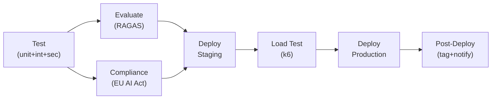

# Phase 6.1 – MLOps Pipeline & Model Lifecycle Management
## Knowledge Foundry: Continuous Deployment, Monitoring & Improvement of AI Capabilities

**Version**: 1.0 | **Date**: February 14, 2026 | **Status**: 📋 IMPLEMENTATION SPEC  
**Depends on**: Phase 1 (Core Platform), Phase 4.1 (Testing), Phase 5.1 (Performance)

---

## 1. MLOPS ARCHITECTURE OVERVIEW

### 1.1 MLOps Pipeline

```
[Data Sources] → [Data Pipeline] → [Evaluation] → [Model Registry] → [Deployment] → [Monitoring] → [Feedback Loop]
                       ↑                                                                      │
                       └──────────────────────────────────────────────────────────────────────────┘
```

| Component | Purpose |
|-----------|---------|
| **Data Pipeline** | Ingest, validate, version data |
| **Evaluation Pipeline** | RAGAS, benchmarks, regression tests |
| **Model Registry** | MLflow — versioned configs with metadata |
| **Deployment Pipeline** | CI/CD with quality gates |
| **Monitoring** | Performance, drift, cost tracking |
| **Feedback Loop** | User feedback → Golden dataset → Re-optimize |

### 1.2 Knowledge Foundry Context

> [!IMPORTANT]
> Knowledge Foundry uses **foundation models (Anthropic Claude)**, not custom-trained models. MLOps adapts to focus on:
> - **Prompt Engineering**: Version-controlled prompts, A/B testing
> - **RAG Pipeline**: Document indexing, retrieval optimization
> - **Configuration Management**: Model selection, routing logic, system prompts
> - **Agent Orchestration**: Multi-agent workflow optimization

---

## 2. DATA PIPELINE

### 2.1 Document Ingestion (9-step workflow)

```python
class DocumentIngestionPipeline:
    def ingest_document(self, document_file, metadata):
        # 1. Validation
        validated = self.validate_document(document_file)

        # 2. Text extraction
        text = self.extract_text(validated)

        # 3. Quality checks (length, language, encoding, readability, duplicates, PII)
        quality = self.check_quality(text)
        if quality.score < 0.7:
            log_warning(f"Low quality: {quality}")

        # 4. Semantic chunking
        chunks = self.chunk_document(text, strategy="semantic", chunk_size=512)

        # 5. Batch embeddings
        embeddings = self.generate_embeddings_batch([c.text for c in chunks])

        # 6. Entity/relationship extraction → Graph DB (skeleton docs)
        if self.is_skeleton_document(document_file, metadata):
            entities = self.extract_entities(chunks)
            relationships = self.extract_relationships(chunks, entities)
            self.store_in_graph(entities, relationships, metadata["tenant_id"])

        # 7. Store in Vector DB
        self.store_in_vector_db(chunks, embeddings, metadata)

        # 8. Store metadata
        self.store_document_metadata(document_file, metadata, quality)

        # 9. Audit log (EU AI Act)
        self.log_ingestion_event(document_file, metadata, quality)
```

**Data Quality Checks (6 dimensions):**

| Check | Threshold | Purpose |
|-------|:---------:|---------|
| Length | >100 chars | Not too short |
| Language | en/es/fr/de | Supported languages |
| Encoding | UTF-8 | Valid encoding |
| Readability | Flesch >30 | Comprehensible |
| Duplicates | Unique hash | No redundancy |
| PII | No excessive PII | Privacy compliance |

### 2.2 Data Versioning (DVC)

```yaml
stages:
  prepare_golden_dataset:
    cmd: python scripts/prepare_golden_dataset.py
    deps: [data/raw/golden_qa.json, scripts/prepare_golden_dataset.py]
    outs: [data/processed/golden_dataset.json]
    metrics: [data/processed/dataset_stats.json]

  index_documents:
    cmd: python scripts/index_documents.py
    deps: [data/processed/documents/, models/embedding_config.yaml]
    outs: [data/vector_db/snapshot/]
```

**Benefits**: Reproducibility, lineage tracking, team collaboration

### 2.3 Data Drift Detection

```python
class DataDriftMonitor:
    def detect_drift(self, production_queries, reference_dataset):
        prod_emb = self.embed_texts(production_queries)
        ref_emb = self.embed_texts(reference_dataset)

        kl = self.calculate_kl_divergence(prod_emb, ref_emb)
        psi = self.calculate_psi(prod_emb, ref_emb)

        if kl > 0.15 or psi > 0.2:
            self.alert_team({"kl": kl, "psi": psi,
                "recommendation": "Review golden dataset, update retrieval"})

        return DriftReport(kl=kl, psi=psi, drift_detected=(kl > 0.15 or psi > 0.2))
```

---

## 3. MODEL REGISTRY & VERSIONING

### 3.1 MLflow Experiment Tracking

```python
with mlflow.start_run(run_name="prompt_optimization_v3"):
    mlflow.log_param("prompt_template", prompt_template)
    mlflow.log_param("temperature", 0.2)
    mlflow.log_param("max_tokens", 4096)

    ragas = evaluate_on_golden_dataset(prompt_template)
    mlflow.log_metric("ragas_faithfulness", ragas["faithfulness"])
    mlflow.log_metric("ragas_precision", ragas["context_precision"])
    mlflow.log_metric("cost_per_query", calculate_avg_cost(prompt_template))

    mlflow.log_artifact("prompts/system_prompt.txt")
    mlflow.log_dict({"prompt_template": prompt_template, "config": model_config},
                    "model_config.json")
```

### 3.2 Version Stages

```
knowledge_foundry_config/
├── v1.0.0  (Production)
│   ├── prompt_templates/
│   ├── routing_config.yaml
│   ├── retrieval_config.yaml
│   └── evaluation_results.json
├── v1.1.0  (Staging)
└── v1.2.0  (Development)
```

| Stage | Description |
|-------|-------------|
| None | Experimental |
| Staging | Passed tests, ready for validation |
| Production | Currently deployed |
| Archived | Old versions, retained for rollback |

### 3.3 Configuration as Models

```python
class ConfigurationModel:
    """Treat configuration as a versionable, testable 'model'."""
    def __init__(self, version):
        self.prompt_templates = self.load_prompts(version)
        self.routing_config = self.load_routing_config(version)
        self.retrieval_config = self.load_retrieval_config(version)
        self.agent_config = self.load_agent_config(version)

    def evaluate(self, golden_dataset):
        results = [evaluate_ragas(item["question"],
                                   self.query(item["question"]),
                                   item["ground_truth"])
                   for item in golden_dataset]
        return aggregate_results(results)

    def promote_to_production(self):
        client = mlflow.tracking.MlflowClient()
        client.transition_model_version_stage(
            name="knowledge_foundry_config",
            version=self.version, stage="Production")
```

---

## 4. DEPLOYMENT PIPELINE

### 4.1 CI/CD Workflow (GitHub Actions)

```yaml
# .github/workflows/deploy.yml
name: Deploy Pipeline
on:
  push:
    branches: [main]

jobs:
  test:           # Unit + integration + security (bandit, safety)
  evaluate:       # DVC pull → RAGAS eval → threshold check
    needs: test
  compliance:     # EU AI Act checks + auto tech docs
    needs: test
  deploy_staging: # kubectl apply + smoke tests
    needs: [evaluate, compliance]
  load_test:      # k6 sustained load → validate results
    needs: deploy_staging
  deploy_production:  # Manual approval → blue-green → 10-min monitor
    needs: load_test
  post_deployment:    # Git tag + MLflow promote + Slack notify
    needs: deploy_production
```



### 4.2 Deployment Strategies

**Blue-Green:**
```
┌─────────────────┐
│  Load Balancer  │
└────────┬────────┘
    ┌────┴─────┐
┌───▼──┐   ┌───▼──┐
│ Blue │   │Green │
│(v1.2)│   │(v1.3)│
└──────┘   └──────┘
Switch: instant, rollback-friendly
```

**Canary:**

| Time | Stable | Canary |
|:----:|:------:|:------:|
| T+0 | 95% | 5% |
| T+1h | 80% | 20% |
| T+4h | 0% | 100% |

**Feature Flags:**
```python
if feature_flag_enabled("hybrid_vectorcypher", tenant_id):
    retrieval_strategy = "hybrid_vectorcypher"
else:
    retrieval_strategy = "vector_only"
```

### 4.3 Automated Rollback

```python
class DeploymentMonitor:
    def monitor_deployment(self, new_version, duration=600):
        while elapsed < duration:
            metrics = self.get_current_metrics(new_version)

            if metrics["error_rate"] > 0.05:
                return self.trigger_rollback(new_version, "High error rate")
            if metrics["latency_p95"] > 1000:
                return self.trigger_rollback(new_version, "High latency")
            if metrics["ragas_faithfulness"] < 0.90:
                return self.trigger_rollback(new_version, "Quality regression")

            time.sleep(60)
        return True   # Stable

    def trigger_rollback(self, version, reason):
        kubectl_switch_version(get_previous_version())
        alert_pagerduty(f"ROLLBACK: {reason}")
        create_incident(version, reason)
```

---

## 5. MONITORING & OBSERVABILITY

### 5.1 Health Checks

```python
@app.get("/health")
def health_check():
    checks = {
        "api": check_api_responsive(),
        "database": check_database_connection(),
        "vector_db": check_vector_db_connection(),
        "graph_db": check_graph_db_connection(),
        "llm_api": check_llm_api_availability(),
        "cache": check_cache_connection(),
    }
    return {
        "status": "healthy" if all(checks.values()) else "degraded",
        "checks": checks,
        "version": get_app_version(),
    }
```

**K8s Probes:**

```yaml
livenessProbe:
  httpGet: { path: /health, port: 8000 }
  initialDelaySeconds: 30
  periodSeconds: 10
  failureThreshold: 3

readinessProbe:
  httpGet: { path: /ready, port: 8000 }
  initialDelaySeconds: 10
  periodSeconds: 5
```

### 5.2 Grafana Dashboard (5 panels)

| Panel | Key Metrics |
|-------|------------|
| **System Health** | Uptime 99.97%, error rate 0.03%, active users |
| **Performance** | p50/p95/p99 latency, QPS, cache hit rate 43% |
| **Quality** | RAGAS faithfulness 0.96, precision 0.92, recall 0.88 |
| **Cost** | $0.07/query, daily $2,341, monthly projection |
| **Alerts** | Active alerts, recent resolved |

### 5.3 Anomaly Detection

```python
class AnomalyDetector:
    def detect(self, metric_name, current_value):
        historical = self.load_historical_data(metric_name, days=7)
        z_score = (current_value - historical.mean()) / historical.std()
        if abs(z_score) > 3:
            self.alert_anomaly(metric_name, current_value,
                severity="HIGH" if abs(z_score) > 4 else "MEDIUM")
```

---

## 6. CONTINUOUS IMPROVEMENT LOOP

### 6.1 Feedback Collection

**Explicit** (`POST /v1/feedback`): Rating (thumbs/stars) + comment → negative feedback queued for human review  
**Implicit**: Query reformulation, citation clicks, session abandonment, dwell time → inferred satisfaction score

### 6.2 Golden Dataset Expansion

```python
class GoldenDatasetManager:
    def add_from_production(self, threshold=0.9):
        """Monthly: find high-quality production Q&A → add to golden dataset."""
        candidates = db.queries.find({
            "ragas_faithfulness": {"$gt": 0.95},
            "satisfaction_score": {"$gt": threshold},
            "human_reviewed": True,
            "added_to_golden": False,
        }).limit(100)

        for q in candidates:
            self.golden_dataset.append({
                "question": q["question"],
                "ideal_answer": q["answer"],
                "contexts": q["retrieved_contexts"],
            })
            db.queries.update_one({"_id": q["id"]}, {"$set": {"added_to_golden": True}})

        # Version with DVC
        subprocess.run(["dvc", "add", "data/processed/golden_dataset.json"])
        subprocess.run(["git", "commit", "-m", f"Add {len(candidates)} to golden dataset"])
```

### 6.3 Automated Re-optimization (Monthly)

1. Update golden dataset from production
2. Re-evaluate current configuration
3. Test prompt variants → find improvements
4. If >1% faithfulness gain → deploy to staging + notify team
5. Review retrieval strategy if recall <0.85

---

## 7. DISASTER RECOVERY & BUSINESS CONTINUITY

### 7.1 Backup Strategy

| Component | Frequency | Retention | Storage |
|-----------|:---------:|:---------:|---------|
| PostgreSQL | Daily | 30 days | S3 |
| Qdrant (snapshots) | Daily + on-update | 30 days | S3 |
| Neo4j | Daily | 30 days | S3 |
| MLflow Registry | On-change | Indefinite | Git + S3 |
| Audit Logs | Hourly | 7 years | S3 WORM |

**Monthly Backup Testing:**
- Provision test environment → restore all backups → smoke tests → verify data integrity → teardown

### 7.2 Recovery Objectives

| Metric | Target |
|--------|:------:|
| **RTO** (Recovery Time) | 4 hours |
| **RPO** (Recovery Point) | 24 hours |

### 7.3 DR Scenarios

| Scenario | Recovery Time | Procedure |
|----------|:------------:|-----------|
| **Regional Outage** | 2-4h | DNS failover → restore from backup in secondary region |
| **Data Corruption** | 1-2h | Isolate tenants → restore from last good backup → replay transactions |
| **Complete Failure** | 4-6h | IaC (Terraform) → restore all DBs → restore configs → full test suite → gradual traffic |

---

## 8. ACCEPTANCE CRITERIA

| # | Criterion | Test Method | Status |
|:-:|-----------|------------|:------:|
| 1 | CI/CD deploys automatically on merge to main | Pipeline execution | ☐ |
| 2 | Quality gates block deploy if RAGAS <thresholds | Failing eval → no deploy | ☐ |
| 3 | Blue-green deployment tested (zero-downtime) | Deployment drill | ☐ |
| 4 | Automated rollback on error rate >5% | Chaos test | ☐ |
| 5 | Grafana dashboards operational (5 panels) | Dashboard audit | ☐ |
| 6 | Backups automated (daily DB, hourly logs) | Backup schedule verification | ☐ |
| 7 | Backup restore tested (monthly drill) | DR test report | ☐ |
| 8 | DR plan documented and tabletop-tested | DR exercise log | ☐ |
| 9 | MLflow tracks all experiments and versions | Registry inspection | ☐ |
| 10 | Golden dataset expanded monthly from production | Dataset version history | ☐ |
